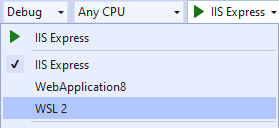
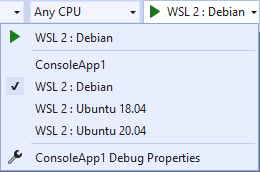
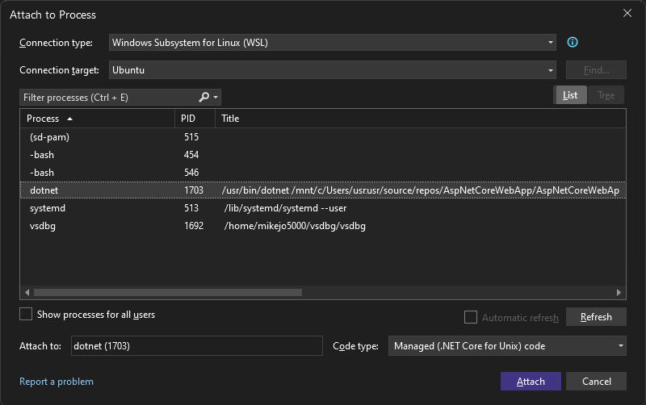
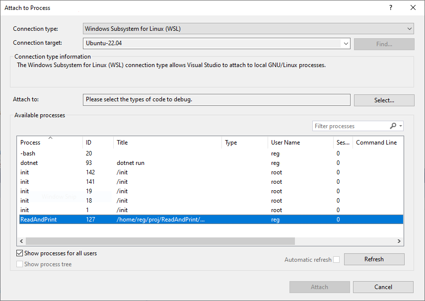

# Debug .NET Apps in WSL with Visual Studio

You can easily run and debug your .NET Core and .NET 5+ apps in Linux without leaving Visual Studio using Windows Subsystem for Linux (WSL). If you are a cross-platform developer, you can use this method as a simple way to test more of your target environments.

For a Windows .NET user targeting Linux, WSL lives in a sweet spot between production realism and productivity. In Visual Studio, you can already debug in a remote Linux environment using the [remote debugger](../debugger/remote-debugging-dotnet-core-linux-with-ssh.md), or with containers using the [Container Tools](../containers/overview.md). When production realism is your main concern, you should use one of those options. When an easy and fast inner-loop is more important, WSL is a great option.

You don't have to choose just one method! You can have a launch profile for Docker and WSL in the same project and pick whichever is appropriate for a particular run. And once your app is deployed, you can always use the remote debugger to attach to it if there's an issue. To debug a Linux Docker container running in WSL, see [Attach to a process running on a Docker container](../debugger/attach-to-process-running-in-docker-container.md).

> [!NOTE]
> Starting in Visual Studio 2019 version 16.11, the WSL 2 debug target was renamed to WSL.

## Prerequisites

- Visual Studio 2019 v16.9 or later versions with the .NET Debugging with WSL optional component.

  To check for the WSL component, choose **Tools** > **Get Tools and Features**. In the Visual Studio Installer, make sure the component is installed by choosing **Individual components** tab, and typing **WSL** as the search term.

  In some versions of Visual Studio, the optional component is included by default with some of the .NET workloads.

- Install [WSL](/windows/wsl/about).

- Install the [distribution](https://aka.ms/wslstore) of your choice.

## Start debugging with WSL

1. After you've installed the required components, open an ASP.NET Core web app or .NET Core console app in Visual Studio You'll see a new Launch Profile named WSL:

   

1. Select this profile to add it to your *launchSettings.json*.

   Some of the key attributes in the file are shown in the following example.

    ::: moniker range=">=vs-2022"

    > [!NOTE]
    > Starting in Visual Studio 2022 Preview 3, the command name in the Launch Profile changed from WSL2 to WSL.

    ```json
    "WSL": {
        "commandName": "WSL",
        "launchBrowser": true,
        "launchUrl": "https://localhost:5001",
        "environmentVariables": {
            "ASPNETCORE_URLS": "https://localhost:5001;http://localhost:5000",
            "ASPNETCORE_ENVIRONMENT": "Development"
        },
        "distributionName": ""
    }
    ```

    ::: moniker-end
    ::: moniker range="vs-2019"

    ```json
    "WSL": {
        "commandName": "WSL2",
        "launchBrowser": true,
        "launchUrl": "https://localhost:5001",
        "environmentVariables": {
            "ASPNETCORE_URLS": "https://localhost:5001;http://localhost:5000",
            "ASPNETCORE_ENVIRONMENT": "Development"
        },
        "distributionName": ""
    }
    ```

    ::: moniker-end

   Once you select the new profile, the extension checks that your WSL distribution is configured to run .NET apps, and helps you install any missing dependencies. Once you've installed these dependencies, you are ready to debug in WSL.

1. Start debugging as normal, and your app will run in your default WSL distribution.

   An easy way to verify that you're running in Linux is to check the value of `Environment.OSVersion`.

> [!NOTE]
> Only Ubuntu and Debian have been tested and are supported. Other distributions supported by .NET should work but require manually installing the [.NET Runtime](https://aka.ms/wsldotnet) and [Curl](https://curl.haxx.se/).

## Choose a specific distribution

By default, the WSL 2 launch profile uses the default distribution as set in *wsl.exe*. If you want your launch profile to target a specific distribution, regardless of that default, you can modify your launch profile. For example, if you're debugging a web app and want to test it on Ubuntu 20.04, your launch profile would look like:

::: moniker range=">=vs-2022"

```json
"WSL": {
    "commandName": "WSL",
    "launchBrowser": true,
    "launchUrl": "https://localhost:5001",
    "environmentVariables": {
        "ASPNETCORE_URLS": "https://localhost:5001;http://localhost:5000",
        "ASPNETCORE_ENVIRONMENT": "Development"
    },
    "distributionName": "Ubuntu-20.04"
}
```

::: moniker-end
::: moniker range="vs-2019"

```json
"WSL": {
    "commandName": "WSL2",
    "launchBrowser": true,
    "launchUrl": "https://localhost:5001",
    "environmentVariables": {
        "ASPNETCORE_URLS": "https://localhost:5001;http://localhost:5000",
        "ASPNETCORE_ENVIRONMENT": "Development"
    },
    "distributionName": "Ubuntu-20.04"
}
```

::: moniker-end

## Target multiple distributions

Going one step further, if you are working on an application that needs to run in multiple distributions and you want a quick way to test on each of them, you can have multiple launch profiles. For instance, if you need to test your console app on Debian, Ubuntu 18.04, and Ubuntu 20.04, you could use the following launch profiles:

::: moniker range=">=vs-2022"

```json
"WSL : Debian": {
    "commandName": "WSL",
    "distributionName": "Debian"
},
"WSL : Ubuntu 18.04": {
    "commandName": "WSL",
    "distributionName": "Ubuntu-18.04"
},
"WSL : Ubuntu 20.04": {
    "commandName": "WSL",
    "distributionName": "Ubuntu-20.04"
}
```

::: moniker-end
::: moniker range="vs-2019"

```json
"WSL : Debian": {
    "commandName": "WSL2",
    "distributionName": "Debian"
},
"WSL : Ubuntu 18.04": {
    "commandName": "WSL2",
    "distributionName": "Ubuntu-18.04"
},
"WSL : Ubuntu 20.04": {
    "commandName": "WSL2",
    "distributionName": "Ubuntu-20.04"
}
```

::: moniker-end

With these launch profiles, you can easily switch back and forth between your target distributions, all without leaving the comfort of Visual Studio.



## Attach to a running WSL process

In addition to debugging from app startup using F5, you can debug by attaching to a running WSL process using the attach to process feature.

1. With the app running, choose **Debug** > **Attach to Process**.

1. For the **Connection type**, choose **Windows Subsystem for Linux (WSL)**, and then choose the Linux distribution for the **Connection target**.

1. Choose **Attach**.

   ::: moniker range=">=vs-2022"
   
   ::: moniker-end
   ::: moniker range="vs-2019"
   
   ::: moniker-end

## WSL settings in the launch profile

The following table shows the settings that are supported in the launch profile.

|Name|Default|Purpose|Supports Tokens?|
|-|-|-|-|
|executablePath|dotnet|The executable to run|Yes|
|commandLineArgs|The value of the MSBuild property TargetPath mapped to the WSL environment|Command line arguments passed to executablePath|Yes|
|workingDirectory|For console apps: {*OutDir*}</br>For web apps: {*ProjectDir*}|The working directory in which to start debugging|Yes|
|environmentVariables||Key Value pairs of environment variables to set for the debugged process.|Yes|
|setupScriptPath||Script to be run before debugging. Useful for running scripts like ~/.bash_profile.|Yes|
|distributionName||Name of the WSL distribution to use.|No|
|launchBrowser|false|Whether or not to launch a browser|No|
|launchUrl||URL to launch if launchBrowser is true|No|

Supported tokens:

{*ProjectDir*} - The path to the project directory

{*OutDir*} - The value of the MSBuild property `OutDir`

> [!NOTE]
> All paths are for WSL not Windows.

## Pass a command line argument

Use the `commandLineArgs` setting to pass a command line argument to WSL in the launch profile.

In the following example, you pass two arguments to a DLL project named ConsoleApp.

```json
"WSL": {
  "commandName": "WSL",
  "commandLineArgs": "\"{OutDir}/ConsoleApp.dll\" arg1 arg2"
}
```

## Console apps

For a console app running in WSL, the standard input stream (stdin) is redirected and there isn't a way to provide input. When debugging a console app that requires input, start the app directly from WSL using `dotnet run` and specify the path to the DLL on Windows. This provides access to stdin because the app runs in the Linux console. To debug, use the instructions described in the section [Attach to a running WSL process](#attach-to-a-running-wsl-process).