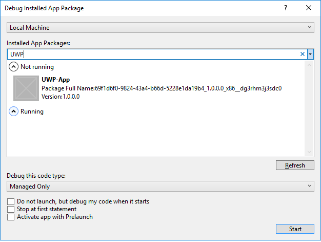
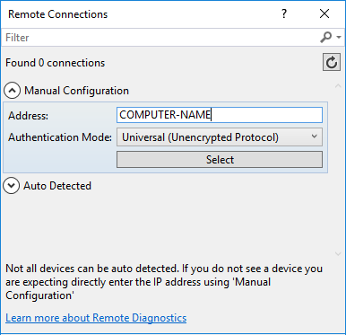

# Debug an installed UWP app package in Visual Studio

Visual Studio can debug installed Universal Windows Platform (UWP) app packages on Windows 10 and newer computers and Xbox, HoloLens, and IoT devices.

> [!NOTE]
> Visual Studio debugging for installed UWP apps is not supported on phones.

For more information about debugging UWP apps, see the blog posts on [debugging installed app packages](https://devblogs.microsoft.com/devops/updates-for-debugging-installed-app-packages-in-visual-studio-2015-update-2/) and [building Universal Windows Apps (UWP)](https://devblogs.microsoft.com/visualstudio/universal-windows-apps-targeting-windows-10-anniversary-sdk/).

## Debug an installed UWP app on a local machine

1. In Visual Studio, select **Debug** > **Other Debug Targets** > **Debug Installed App Package**.

1. In the **Debug Installed App Package** dialog, under **Connection Type**, select **Local Machine**.

1. Under **Installed App Packages**, select the app you want to debug, or type its name in the search box. Non-running installed app packages appear under **Not running**, and running apps are under **Running**.

   

1. If necessary, change the code type under **Debug this code type**, and select other options.
   - Select **Do not launch, but debug my code when it starts** to start debugging when the app starts. Starting debugging when the app launches is an effective way to debug control paths from [different launch methods](/windows/uwp/xbox-apps/automate-launching-uwp-apps), such as protocol activation with custom parameters.

1. Select **Start**, or if the app is running, select **Attach**.

> [!NOTE]
> You can also attach to any running UWP or other app process by selecting **Debug** > **Attach to Process** in Visual Studio. You don't need the original Visual Studio project to attach to a running process, but loading the app's symbols will help significantly when debugging a process that you don't have the original code for. See [Specify symbol and source files in the debugger](specify-symbol-dot-pdb-and-source-files-in-the-visual-studio-debugger.md).

##  Debug an installed UWP app on a remote computer or device

The first time Visual Studio debugs an installed UWP app on a Windows 10 or newer device or a remote post-Creator's Update Windows 10 computer, it installs the remote debugging tools on the target device.

1. [Enable developer mode](/windows/uwp/get-started/enable-your-device-for-development) on the Visual Studio computer and the remote device or computer.

1. If you are connecting to a remote computer running pre-Creator's Update Windows 10, [manually install and start the remote debugger](../debugger/remote-debugging.md) on the remote computer.

1. On the Visual Studio computer, select **Debug** > **Other Debug Targets** > **Debug Installed App Package**.

1. In the **Debug Installed App Package** dialog, under **Connection Type**, select **Remote Machine** or **Device**.

   If you select **Device**, your computer must be physically connected to a Windows 10 or newer device.

   For a remote machine, if the computer address doesn't appear next to **Address**, select **Change**.

   1. In the **Remote Connection** dialog box, next to **Address**, type the name or IP address of the computer you want to connect to.

      

      If the debugger can't connect to a remote computer using the computer name, use the IP address instead. Use the IP address for Xbox, HoloLens, or IoT devices.
   1. Select an authentication option next to **Authentication Mode**.

      For most apps, keep the default value, **Universal (Unencrypted Protocol)**.
   1. Select **Select**.

1. Under **Installed App Packages**, select the app you want to debug, or type its name in the search box. Non-running installed app packages appear under **Not running**, and running apps are under **Running**.

1. If necessary, change the code type under **Debug this code type**, and select other options.
   - Select **Do not launch, but debug my code when it starts** to start debugging when the app starts. Starting debugging when the app launches is an effective way to debug control paths from [different launch methods](/windows/uwp/xbox-apps/automate-launching-uwp-apps), such as protocol activation with custom parameters.

1. Select **Start**, or if the app is running, select **Attach**.

When you start debugging an installed app package on a connected Xbox, HoloLens, or IoT device for the first time, Visual Studio installs the correct version of the remote debugger for your target device. Installing the remote debugger might take some time, and the message **Starting remote debugger** displays while it is happening.

> [!NOTE]
> Currently, Xbox or HoloLens devices restart the app with the debugger attached if it was already running.

For more information on remote deployment of UWP apps, see [Deploy and debug UWP apps](/windows/uwp/debug-test-perf/deploying-and-debugging-uwp-apps#advanced-remote-deployment-options) and [Debug UWP apps on remote machines](run-windows-store-apps-on-a-remote-machine.md).

## Related content

- [Debugging in Visual Studio](../debugger/index.yml)
- [First look at the debugger](../debugger/debugger-feature-tour.md)
- [Remote debugging](../debugger/remote-debugging.md)
- [Configure the Windows Firewall for remote debugging](../debugger/configure-the-windows-firewall-for-remote-debugging.md)
- [Remote debugger port assignments](../debugger/remote-debugger-port-assignments.md)
- [Remote debugging errors and troubleshooting](../debugger/remote-debugging-errors-and-troubleshooting.md)
