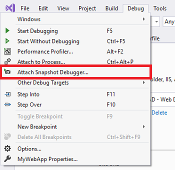
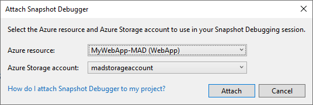
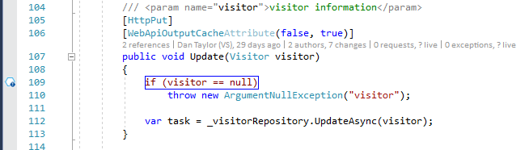
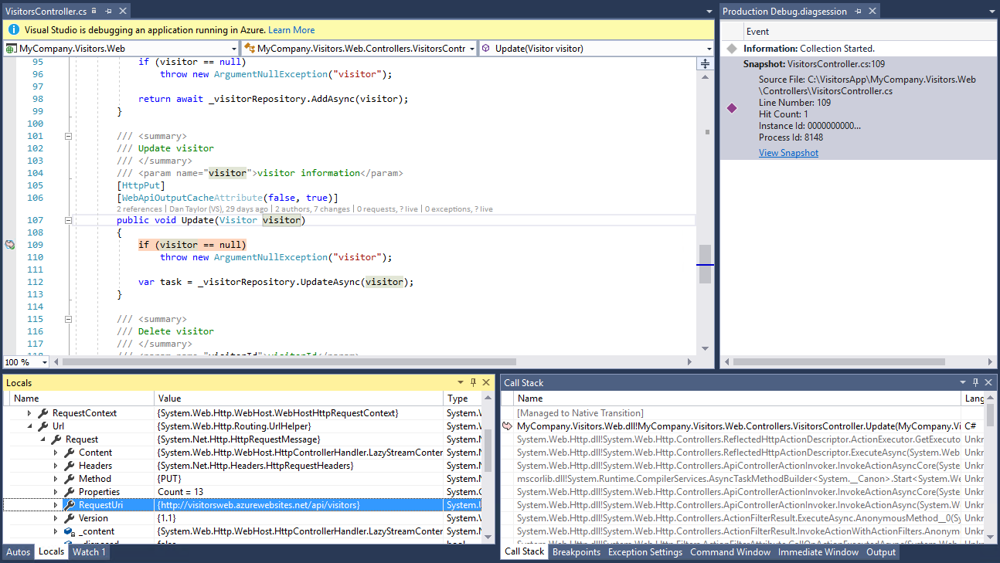
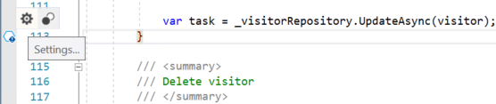
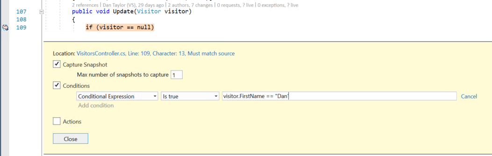
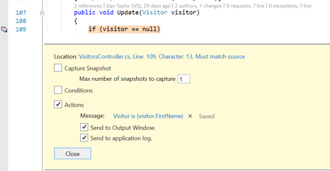
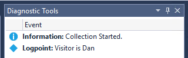

# Debug live ASP.NET Azure apps using the Snapshot Debugger

The Snapshot Debugger takes a snapshot of your in-production apps when code that you're interested in executes. To instruct the debugger to take a snapshot, you set snappoints and logpoints in your code. The debugger lets you see exactly what went wrong, without impacting traffic of your production application. The Snapshot Debugger can help you dramatically reduce the time it takes to resolve issues that occur in production environments.

Snappoints and logpoints are similar to breakpoints, but unlike breakpoints, snappoints don't halt the application when hit. Typically, capturing a snapshot at a snappoint takes 10-20 milliseconds.

In this tutorial, you will:

> [!div class="checklist"]
> * Start the Snapshot Debugger
> * Set a snappoint and view a snapshot
> * Set a logpoint

## Prerequisites

* Snapshot Debugger is only available starting in Visual Studio 2017 Enterprise version 15.5 or higher with the **Azure development workload**. (Under the **Individual components** tab, you find it under **Debugging and testing** > **Snapshot debugger**.)

   ::: moniker range=">=vs-2019"
   If it's not already installed, install [Visual Studio 2019](https://visualstudio.microsoft.com/downloads). If you're updating from a previous Visual Studio installation, run the Visual Studio Installer and check the Snapshot Debugger component in the **ASP.NET and web development workload**.
   ::: moniker-end
   ::: moniker range="<=vs-2017"
   If it's not already installed, install [Visual Studio 2017 Enterprise version 15.5](https://visualstudio.microsoft.com/vs/older-downloads/?utm_medium=microsoft&utm_source=docs.microsoft.com&utm_campaign=vs+2017+download) or later. If you're updating from a previous Visual Studio 2017 installation, run the Visual Studio Installer and check the Snapshot Debugger component in the **ASP.NET and web development workload**.
   ::: moniker-end

* Basic or higher Azure App Service plan.

* Snapshot collection is available for the following web apps running in Azure App Service:
  * ASP.NET applications running on .NET Framework 4.6.1 or later.
  * ASP.NET Core applications running on .NET Core 2.0 or later on Windows.

## Open your project and start the Snapshot Debugger

1. Open the project you would like to snapshot debug.

   > [!IMPORTANT]
   > To snapshot debug, you need to open the *same version of source code* that is published to your Azure App Service.

::: moniker range="<=vs-2017"

2. In the Cloud Explorer (**View > Cloud Explorer**), right-click the Azure App Service your project is deployed to and select **Attach Snapshot Debugger**.

   

::: moniker-end

::: moniker range=">=vs-2019"

2. Choose **Debug > Attach Snapshot Debugger...**. Select the Azure App Service your project is deployed to and an Azure storage account, and then click **Attach**. Snapshot Debugger also supports [Azure Kubernetes Service](debug-live-azure-kubernetes.md) and [Azure Virtual Machines (VM) & Virtual Machine Scale Sets](debug-live-azure-virtual-machines.md).

   

   

::: moniker-end

   > [!IMPORTANT]
   > The first time you select **Attach Snapshot Debugger**, you're prompted to install the Snapshot Debugger site extension on your Azure App Service. This installation requires a restart of your Azure App Service.

   ::: moniker range="<=vs-2017"
   > [!NOTE]
   > The Application Insights site extension also supports Snapshot Debugging. If you come across a "site extension out of date" error message, see [troubleshooting tips and known issues for snapshot debugging](../debugger/debug-live-azure-apps-troubleshooting.md) for upgrading details.
   ::: moniker-end
   ::: moniker range=">=vs-2019"
   > [!NOTE]
   > (Visual Studio 2019 version 16.2 and above) Snapshot Debugger has enabled Azure cloud support. Make sure that both the Azure resource and Azure Storage account you select are from the same cloud. Please contact your Azure administrator if you have questions about your enterprise's [Azure compliance](https://azure.microsoft.com/overview/trusted-cloud/) configurations.
   ::: moniker-end

   Visual Studio is now in snapshot debugging mode.
   

   The **Modules** window shows you when all the modules have loaded for the Azure App Service (choose **Debug > Windows > Modules** to open this window).

   

## Set a snappoint

1. In the code editor, click the left gutter next to a line of code you're interested in to set a snappoint. Make sure it's code that you know will execute.

   

2. Click **Start Collection** to turn on the snappoint.

   

   > [!TIP]
   > You can't step when viewing a snapshot, but you can place multiple snappoints in your code to follow execution at different lines of code. If you have multiple snappoints in your code, the Snapshot Debugger makes sure that the corresponding snapshots are from the same end-user session. The Snapshot Debugger does this even if there are many users hitting your app.

## Take a snapshot

Once a snappoint is set, you can either manually generate a snapshot by going to the browser view of your web site and running the line of code marked or wait for your users to generate one from their usage of the site.

## Inspect snapshot data

1. When the snappoint is hit, a snapshot appears in the Diagnostic Tools window. To open this window, choose **Debug > Windows > Show Diagnostic Tools**.

   

1. Double-click the snappoint to open the snapshot in the code editor.

   

   From this view, you can hover over variables to view DataTips, use the **Locals**, **Watches**, and **Call Stack** windows, and also evaluate expressions.

   The website itself is still live and end users aren't affected. Only one snapshot is captured per snappoint by default: after a snapshot is captured the snappoint turns off. If you want to capture another snapshot at the snappoint, you can turn the snappoint back on by clicking **Update Collection**.

You can also add more snappoints to your app and turn them on with the **Update Collection** button.

**Need help?** See the [Troubleshooting and known issues](../debugger/debug-live-azure-apps-troubleshooting.md) and [FAQ for snapshot debugging](../debugger/debug-live-azure-apps-faq.md) pages.

## Set a conditional snappoint

If it's difficult to recreate a particular state in your app, consider using a conditional snappoint. Conditional snappoints help you control when to take a snapshot such as when a variable contains a particular value that you want to inspect. You can set conditions using expressions, filters, or hit counts.

#### To create a conditional snappoint

1. Right-click a snappoint icon (the hollow ball) and choose **Settings**.

   

1. In the snappoint settings window, type an expression.

   

   In the preceding illustration, the snapshot is only taken for the snappoint when `visitor.FirstName == "Dan"`.

## Set a logpoint

In addition to taking a snapshot when a snappoint is hit, you can also configure a snappoint to log a message (that is, create a logpoint). You can set logpoints without having to redeploy your app. Logpoints are executed virtually and cause no impact or side effects to your running application.

#### To create a logpoint

1. Right-click a snappoint icon (the blue hexagon) and choose **Settings**.

1. In the snappoint settings window, select **Actions**.

   

1. In the **Message** field, you can enter the new log message you want to log. You can also evaluate variables in your log message by placing them inside curly braces.

   If you choose **Send to Output Window**, when the logpoint is hit, the message appears in the Diagnostic Tools window.

   

   If you choose **Send to application log**, when the logpoint is hit, the message appears anywhere that you can see messages from `System.Diagnostics.Trace` (or `ILogger` in .NET Core), such as [App Insights](/azure/application-insights/app-insights-asp-net-trace-logs).

## Next steps

In this tutorial, you've learned how to use the Snapshot Debugger for App Services. You may want to read more details about this feature.

> [!div class="nextstepaction"]
> [FAQ for snapshot debugging](../debugger/debug-live-azure-apps-faq.md)