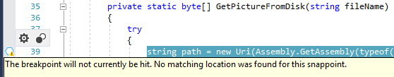
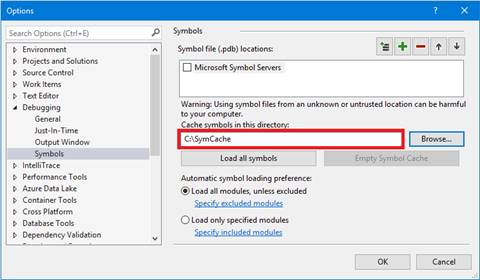
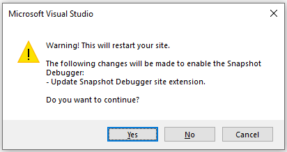
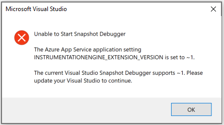

# Troubleshooting and known issues for snapshot debugging in Visual Studio

If the steps described in this article do not resolve your issue, search for the problem on [Developer Community](https://developercommunity.visualstudio.com/spaces/8/index.html) or report a new issue by choosing **Help** > **Send Feedback** > **Report a Problem** in Visual Studio.

## Issue: "Attach Snapshot Debugger" encounters an HTTP status code error

If you see the following error in the **Output** window during the attempt to attach, it may be a known issue listed below. Try the proposed solutions, and if the issue continues to persist contact the preceding alias.

`[TIMESTAMP] Error --- Unable to Start Snapshot Debugger - Attach Snapshot Debugger failed: System.Net.WebException: The remote server returned an error: (###) XXXXXX`

### (401) Unauthorized

This error indicates that the REST call issued by Visual Studio to Azure uses an invalid credential. A known bug with the Azure Active Directory Easy OAuth module may produce this error.

Take these steps:

* Make sure that your Visual Studio personalization account has permissions to the Azure subscription and resource that you are attaching to. A quick way to determine this is to check whether the resource is available in the dialog box from **Debug** > **Attach Snapshot Debugger...** > **Azure Resource** > **Select Existing**, or in  Cloud Explorer.
* If this error continues to persist, use one of the feedback channels described in the beginning of this article.

### (403) Forbidden

This error indicates that permission is denied. This can be caused by many different issues.

Take these steps:

* Verify that your Visual Studio account has a valid Azure subscription with the necessary Role-Based Access Control (RBAC) permissions for the resource. For AppService, check if you have permissions to [query](/rest/api/appservice/appserviceplans/get) the App Service Plan hosting your app.
* Verify the timestamp of your client machine is correct and up-to-date. Servers with timestamps off by more than 15 minutes of the request timestamp usually produce this error.
* If this error continues to persist, use one of the feedback channels described in the beginning of this article.

### (404) Not Found

This error indicates that the website couldn't be found on the server.

Take these steps:

* Verify that you have a website deployed and running on the App Service resource that you're attaching to.
* Verify that the site is available at https://\<resource\>.azurewebsites.net
* Verify that your properly running custom web application does not return a status code of 404 when accessed at https://\<resource\>.azurewebsites.net
* If this error continues to persist, use one of the feedback channels described in the beginning of this article.

### (406) Not Acceptable

This error indicates the server is unable to respond to the type set in the Accept header of the request.

Take these steps:

* Verify that your site is available at https://\<resource\>.azurewebsites.net
* Verify that your site has not migrated to new instances. Snapshot Debugger uses the notion of ARRAffinity for routing requests to specific instances which can produce this error intermittently.
* If this error continues to persist, use one of the feedback channels described in the beginning of this article.

### (409) Conflict

This error indicates that the request conflicts with the current server state.

This is a known issue that occurs when a user attempts to attach Snapshot Debugger against an AppService that has enabled ApplicationInsights. ApplicationInsights sets the AppSettings with a different casing than Visual Studio, causing this issue.

::: moniker range=">= vs-2019"
We have resolved this in Visual Studio 2019.
::: moniker-end

Take these steps:

::: moniker range="vs-2017"

* Verify in the Azure portal that the AppSettings for SnapshotDebugger (SNAPSHOTDEBUGGER_EXTENSION_VERSION) and InstrumentationEngine (INSTRUMENTATIONENGINE_EXTENSION_VERSION) are uppercase. If not, update the settings manually, which forces a site restart.
::: moniker-end
* If this error continues to persist, use one of the feedback channels described in the beginning of this article.

### (500) Internal Server Error

This error indicates that the site is completely down or the server cannot handle the request. Snapshot Debugger only functions on running applications. [Application Insights Snapshot Debugger](/azure/azure-monitor/app/snapshot-debugger) provides snapshotting on exceptions and may be the best tool for your needs.

### (502) Bad Gateway

This error indicates a server-side networking issue and may be temporary.

Take these steps:

* Try waiting a few minutes before attaching the Snapshot Debugger again.
* If this error continues to persist, use one of the feedback channels described in the beginning of this article.

## Issue: Snappoint does not turn on

If you see a warning icon  with your snappoint instead of the regular snappoint icon, then the snappoint is not turned on.

Take these steps:

1. Make sure you have the same version of source code that was used to build and deploy your app. Make sure you are loading the correct symbols for your deployment. To do this, view the **Modules** window while Snapshot Debugging and verify the Symbol File column shows a .pdb file loaded for the module you are debugging. The Snapshot Debugger will try to automatically download and use symbols for your deployment.

## Issue: Symbols do not load when I open a Snapshot

If you see following window, symbols did not load.

Take these steps:

- Click the **Change Symbol Settings…** link on this page. In the **Debugging > Symbol** settings, add a symbol cache directory. Restart snapshot debugging after the symbol path has been set.

   The symbols, or .pdb files, available in your project must match your App Service deployment. Most deployments (deployment through Visual Studio, CI/CD with Azure Pipelines or Kudu, etc.) will publish your symbol files along to your App Service. Setting the symbol cache directory enables Visual Studio to use these symbols.

   

- Alternatively, if your organization uses a symbol server or drops symbols in a different path, use the symbol settings to load the correct symbols for your deployment.

## Issue: I cannot see the "Attach Snapshot Debugger" option in the Cloud Explorer

Take these steps:

- Make sure the Snapshot Debugger component is installed. Open the Visual Studio Installer, and check the **Snapshot Debugger** component in the Azure workload.
::: moniker range="< vs-2019"
- Make sure your app is supported. Currently, only ASP.NET (4.6.1+) and ASP.NET Core (2.0+) apps deployed to Azure App Services are supported.
::: moniker-end
::: moniker range=">= vs-2019"
- Make sure your app is supported:
  - Azure App Services - ASP.NET applications running on .NET Framework 4.6.1 or later.
  - Azure App Services - ASP.NET Core applications running on .NET Core 2.0 or later on Windows.
  - Azure Virtual Machines (and virtual machine scale set) - ASP.NET applications running on .NET Framework 4.6.1 or later.
  - Azure Virtual Machines (and virtual machine scale set) - ASP.NET Core applications running on .NET Core 2.0 or later on Windows.
  - Azure Kubernetes Services - ASP.NET Core applications running on .NET Core 2.2 or later on Debian 9.
  - Azure Kubernetes Services - ASP.NET Core applications running on .NET Core 2.2 or later on Alpine 3.8.
  - Azure Kubernetes Services - ASP.NET Core applications running on .NET Core 2.2 or later on Ubuntu 18.04.
::: moniker-end

## Issue: I only see Throttled Snapshots in the Diagnostic Tools

Take these steps:

- Snapshots take up little memory but do have a commit charge. If the Snapshot Debugger detects your server is under heavy memory load, it will not take snapshots. You can delete already captured snapshots by stopping the Snapshot Debugger session and trying again.

::: moniker range=">= vs-2019"
## Issue: Snapshot debugging with multiple versions of the Visual Studio gives me errors

Visual Studio 2019 requires a newer version of the Snapshot Debugger site extension on your Azure App Service.  This version is not compatible with the older version of the Snapshot Debugger site extension used by Visual Studio 2017.  You will get the following error if you try to attach the Snapshot Debugger in Visual Studio 2019 to an Azure App Service which has been previously debugged by the Snapshot Debugger in Visual Studio 2017:

Conversely, if you use Visual Studio 2017 to attach the Snapshot Debugger to an Azure App Service which has been previously debugged by the Snapshot Debugger in Visual Studio 2019, you'll get the following error:

To fix this, delete the following App settings in the Azure portal and attach the Snapshot Debugger again:

- INSTRUMENTATIONENGINE_EXTENSION_VERSION
- SNAPSHOTDEBUGGER_EXTENSION_VERSION
::: moniker-end

## Issue: I am having problems Snapshot Debugging and I need to enable more logging

### Enable Agent Logs

To  enable and disable agent logging open Visual Studio navigate to *Tools>Options>Snapshot Debugger>Enable agent logging*. Note if *Delete old agent logs on session start* is also enabled, each successful Visual Studio attach will delete previous Agent logs.

Agent logs can be found in the following locations:

- App Services:
  - Navigate to your App Service's Kudu site (that is, yourappservice.**scm**.azurewebsites.net) and navigate to Debug Console.
  - Agent logs are stored in the following directory:  D:\home\LogFiles\SiteExtensions\DiagnosticsAgentLogs\
- VM/VMSS:
  - Sign in to your VM, agent logs are stored as follows:  C:\WindowsAzure\Logs\Plugins\Microsoft.Azure.Diagnostics.IaaSDiagnostics\<Version>\SnapshotDebuggerAgent_*.txt
- AKS
  - Navigate to the following directory: /tmp/diag/AgentLogs/*

### Enable Profiler/Instrumentation Logs

Instrumentation logs can be found in the following locations:

- App Services:
  - Error logging is automatically sent to D:\Home\LogFiles\eventlog.xml, events are marked with `<Provider Name="Instrumentation Engine" />` or "Production Breakpoints"
- VM/VMSS:
  - Sign in to your VM and open Event Viewer.
  - Open the following view: *Windows Logs>Application*.
  - *Filter Current Log* by *Event Source* using either *Production Breakpoints* or *Instrumentation Engine*.
- AKS
  - Instrumentation engine logging at /tmp/diag/log.txt (set MicrosoftInstrumentationEngine_FileLogPath in DockerFile)
  - ProductionBreakpoint logging at /tmp/diag/shLog.txt

## Known Issues

- Snapshot debugging with multiple Visual Studio clients against the same App Service is not currently supported.
- Roslyn IL optimizations are not fully supported in ASP.NET Core projects. For some ASP.NET Core projects, you may not be able to see some variables or use some variables in conditional statements.
- Special variables, such as *$FUNCTION* or *$CALLER*, cannot be evaluated in conditional statements or logpoints for ASP.NET Core projects.
- Snapshot debugging does not work on App Services that have [Local Caching](/azure/app-service/app-service-local-cache) turned on.
- Snapshot debugging API Apps is not currently supported.

## Site Extension Upgrade

Snapshot Debugging and Application Insights depend on an ICorProfiler, which loads into the site process and causes file locking issues during upgrade. We recommend this process to ensure there is no down-time to your production site.

- Create a [Deployment Slot](/azure/app-service/web-sites-staged-publishing) within your App Service and deploy your site to the Slot.
- Swap the Slot with production from Cloud Explorer in Visual Studio or from the Azure portal.
- Stop the Slot site. This will take a few seconds to kill off the site w3wp.exe process from all instances.
- Upgrade the Slot site extension from the Kudu site or the Azure portal (*App Service Blade > Development Tools > Extensions > Update*).
- Start the Slot site. We recommend visiting the site to warm it up again.
- Swap the Slot with production.

## See also

- [Debugging in Visual Studio](../debugger/index.yml)
- [Debug live ASP.NET apps using the Snapshot Debugger](../debugger/debug-live-azure-applications.md)
- [Debug live ASP.NET Azure Virtual Machines\Virtual Machines Scale Sets using the Snapshot Debugger](../debugger/debug-live-azure-virtual-machines.md)
- [Debug live ASP.NET Azure Kubernetes using the Snapshot Debugger](../debugger/debug-live-azure-kubernetes.md)
- [FAQ for snapshot debugging](../debugger/debug-live-azure-apps-faq.md)
