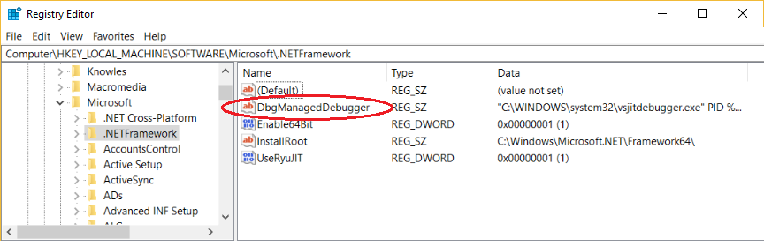

# Debug using the Just-In-Time Debugger in Visual Studio
> [!TIP]
> If you just want to know how to prevent the Just-in-Time debugger dialog box from appearing, see [this article](../debugger/just-in-time-debugging-in-visual-studio.md).

Just-In-Time debugging launches Visual Studio automatically when an error or crash occurs in an app that is running outside Visual Studio. Just-In-Time debugging lets you test your app when Visual Studio is not running, and begin debugging with Visual Studio when a problem occurs.

Just-In-Time debugging works for Windows desktop apps. It does not work for Universal Windows Apps, or for managed code that is hosted in a native application, such as Visualizers.

##  <a name="BKMK_Enabling"></a> Enable or disable Just-In-Time debugging in Visual Studio

You can configure Just-In-Time debugging from the Visual Studio **Tools** > **Options** (or **Debug** > **Options**) dialog box.

#### To enable or disable Just-In-Time debugging in Visual Studio

1. Open Visual Studio as an Administrator (right-click and choose **Run as administrator**).

   Enabling or disabling Just-In-Time debugging sets a registry key, and administrator privileges may be required to change that key.

1.On the **Tools** or **Debug** menu, select **Options** > **Debugging** > **Just-In-Time**.

   

1. In the **Enable Just-In-Time debugging for these types of code** box, select the types of programs you want Just-In-Time debugging to debug: **Managed**, **Native**, or **Script**.
   
1. Select **OK**.

If you enable the Just-in-Time debugger, but it doesn't appear when an app crashes or errors, see [Just-In-Time debugging errors](#jit_errors).

##  <a name="BKMK_Enabling"></a> Enable or disable Just-In-Time debugging from the Windows registry

Just-In-Time debugging may still be enabled even if Visual Studio is no longer installed on your computer. If Visual Studio is not installed, you can disable Just-In-Time debugging by editing the Windows registry.

#### To disable Just-In-Time debugging by editing the registry

1.  From the Windows **Start** menu, run `regedit.exe`.

2.  In the **Registry Editor** window, locate and delete the following registry entries:

    -   **HKEY_LOCAL_MACHINE\SOFTWARE\Microsoft\Windows NT\CurrentVersion\AeDebug\Debugger**

    -   **HKEY_LOCAL_MACHINE\SOFTWARE\Microsoft\\.NETFramework\DbgManagedDebugger**

    

3.  If your computer is running a 64-bit operating system, delete the following registry entries also:

    -   **HKEY_LOCAL_MACHINE\SOFTWARE\Wow6432Node\Microsoft\Windows NT\CurrentVersion\AeDebug\Debugger**

    -   **HKEY_LOCAL_MACHINE\SOFTWARE\Wow6432Node\Microsoft\\.NETFramework\DbgManagedDebugger**

    Make sure not to accidentally delete or change any other registry keys.

5.  Close the **Registry Editor** window.

#### To enable Just-In-Time debugging of a Windows Form

1.  By default, Windows Forms applications have a top-level exception handler that allows the program to continue to run if it can recover. For example, if your Windows Forms application throws an unhandled exception, you will see a dialog like the following:

     

     To enable Just-In-Time debugging of a Windows Forms application, you must perform the following additional steps:

2.  Set the `jitDebugging` value to `true` in the `system.windows.form` section of the machine.config or *\<application name>*.exe.config file:

    ```xml
    <configuration>
        <system.windows.forms jitDebugging="true" />
    </configuration>
    ```

3.  In a C++ Windows Form application, you must also set `DebuggableAttribute` in a .config file or in your code. If you compile with [/Zi](/cpp/build/reference/z7-zi-zi-debug-information-format) and without [/Og](/cpp/build/reference/og-global-optimizations), the compiler sets this attribute for you. If you want to debug a non-optimized release build, however, you must set this yourself. You can do this by adding the following line to your the AssemblyInfo.cpp file of your application:

    ```cpp
    [assembly:System::Diagnostics::DebuggableAttribute(true, true)];
    ```

     For more information, see <xref:System.Diagnostics.DebuggableAttribute>.

## <a name="BKMK_Using_JIT">Use Just-In-Time Debugging
 This section shows what happens when an executable throws an exception.

 You must have Visual Studio installed to follow these steps. If you don't have Visual Studio, you can download the free [Visual Studio Community Edition](https://visualstudio.microsoft.com/thank-you-downloading-visual-studio/?sku=Community&rel=15).

 Make sure that Just-In-Time debugging is [enabled](#BKMK_Enabling).

 For the purposes of this section, we'll make a C# console app in Visual Studio that throws a [NullReferenceException](/dotnet/api/system.nullreferenceexception).

 In Visual Studio, create a C# console app (**File > New > Project > Visual C# > Console Application**) named **ThrowsNullException**. For more information about creating projects in Visual Studio, see [Walkthrough: Create a Simple Application](../ide/walkthrough-create-a-simple-application-with-visual-csharp-or-visual-basic.md).

 When the project opens in Visual Studio, open the Program.cs file. Replace the Main() method with the following code, which prints a line to the console and then throws a NullReferenceException:

```csharp
static void Main(string[] args)
{
    Console.WriteLine("we will now throw a NullReferenceException");
    throw new NullReferenceException("this is the exception thrown by the console app");
}
```

> [!IMPORTANT]
>  In order for this procedure to work in a [release configuration](../debugger/how-to-set-debug-and-release-configurations.md), you need to turn off [Just My Code](../debugger/just-my-code.md). In Visual Studio, click **Tools > Options**. In the **Options** dialog, select **Debugging**. Remove the check from **Enable Just My Code**.

 Build the solution (in Visual Studio, choose **Build > Rebuild Solution**). You can choose either the Debug or the Release configuration (choose **Debug** for the full debugging experience). For more information about build configurations, see [Understanding Build Configurations](../ide/understanding-build-configurations.md).

 The build process creates an executable ThrowsNullException.exe. You can find it under the folder where you created the C# project: **...\ThrowsNullException\ThrowsNullException\bin\Debug** or **...\ThrowsNullException\ThrowsNullException\bin\Release**.

 Double-click the ThrowsNullException.exe. You should see a command window like this:

 

 After a few seconds, an error window appears:

 

 Do not click **Cancel**! After a few seconds, you should see two buttons, **Debug** and **Close program**. Click **Debug**.

> [!CAUTION]
>  If your application contains untrusted code, a dialog box with a security warning appears. This dialog box enables you to decide whether or not to proceed with debugging. Before you continue with debugging, decide whether you trust the code. Did you write the code yourself? Do you trust the coder? If the application is running on a remote machine, do you recognize the name of the process? Even if the application is running locally, that does not necessarily mean it can be trusted. Consider the possibility of malicious code running on your computer. If you decide that the code you are about to debug is trustworthy, click **Debug**. Otherwise, click **Don't Debug**.

 The **Visual Studio Just-In-Time Debugger** window appears:

 

 Under **Possible Debuggers**, you should see that the **New instance of Microsoft Visual Studio <available version>** line is selected. If it isn't selected already, select it now.

 At the bottom of the window, under **Do you want to debug using the selected debugger?**, click **Yes**.

 The ThrowsNullException project opens in a new instance of Visual Studio, with execution stopped at the line that throws the exception:

 

 You can start debugging at this point. If this were a real application, you would need to find out why the code is throwing the exception.

## <a name="jit_errors"></a> Just-In-Time debugging errors
 If you don't see the dialog when the program crashes and need to enable the feature, this might due to Windows Error Reporting settings on your computer. Make sure to add a **Disabled** value to the following registry keys and set the value to 1:

* HKLM\Software\Microsoft\Windows\Windows Error Reporting
* HKLM\Software\WOW6432Node\Microsoft\Windows\Windows Error Reporting
 
For more information about these settings, see [.WER Settings](https://docs.microsoft.com/windows/desktop/wer/wer-settings).

In addition, you might see the following error messages that are associated with Just-In-Time debugging.

- **Unable to attach to the crashing process. The specified program is not a Windows or MS-DOS program.**

    This error occurs when you try to attach to a process running as another user.

    To work around this problem, start Visual Studio, open the **Attach to Process** dialog box from the **Debug** menu, and find the process you want to debug in the **Available Processes** list. If you do not know the name of the process, look at the **Visual Studio Just-In-Time Debugger** dialog and note the process ID. Select the process in the **Available Processes** list and click **Attach**. In the **Visual Studio Just-In-Time Debugger** dialog, click **No** to dismiss the dialog box.

- **Debugger could not be started because no user is logged on.**

    This error occurs when Just-In-Time debugging tries to start Visual Studio on a machine where there is no user logged onto the console. Because no user is logged on, there is no user session to display the Just-In-Time debugging dialog box.

    To fix this problem, log onto the machine.

- **Class not registered.**

    This error indicates that the debugger tried to create a COM class that is not registered, probably due to an installation problem.

    To fix this problem, use the setup disk to reinstall or repair your Visual Studio installation.

## See Also
 [Debugger Security](../debugger/debugger-security.md)
 [Debugger Basics](../debugger/getting-started-with-the-debugger.md)
 [Just-In-Time, Debugging, Options Dialog Box](../debugger/just-in-time-debugging-options-dialog-box.md)
 [Security Warning: Attaching to a process owned by an untrusted user can be dangerous. If the following information looks suspicious or you are unsure, do not attach to this process](../debugger/security-warning-attaching-to-a-process-owned-by-an-untrusted-user.md)
