# Debug your app with GitHub Copilot in Visual Studio

In this article, you'll learn how to debug more efficiently using GitHub Copilot. Copilot can provide code fixes along with in-depth analysis and explanations of how code works. It helps with proposed fixes to bugs, and explains things such as exceptions. Copilot understands call stacks, frames, variable names, and values. As a result, you can interact with the debugger-aware AI to ask detailed questions related to your code and to debugging issues in general.

In addition, Copilot provides more precise help for some targeted scenarios, such as Exceptions, and all those described in [AI-enhanced scenarios for debugging](#ai-enhanced-scenarios). In most of these scenarios, look for the **Ask Copilot**  button. In these scenarios, Copilot already knows the context for your questions.

For more information on GitHub Copilot Completions in Visual Studio, see [About GitHub Copilot Completions in Visual Studio](../ide/visual-studio-github-copilot-extension.md).

## Prerequisites

To get started, you need:
+ Visual Studio 2022 [version 17.8](/visualstudio/releases/2022/release-history) or later
+ [Sign in to Visual Studio using a GitHub account](../ide/work-with-github-accounts.md) with [Copilot access](https://docs.github.com/en/copilot/about-github-copilot/what-is-github-copilot#getting-access-to-copilot) <br/>
  <sup>**</sup> You can use [GitHub Copilot for Free](../ide/copilot-free-plan.md). Sign up and leverage AI to code faster and more efficiently.

   > [!NOTE]
   > If you experience authentication issues after installing the extension, see [Troubleshooting authentication issues with GitHub Copilot Chat](https://docs.github.com/en/copilot/troubleshooting-github-copilot/troubleshooting-authentication-issues-with-github-copilot-chat).

## AI-enhanced scenarios

Copilot understands call stacks, frames, variable names, and values. As a result, you can interact with the debugger-aware AI to ask detailed questions related to your code and to debugging issues in general.

In addition, Copilot provides more precise help for some targeted scenarios, such as those described in the following table.

|Feature or scenario|Link|
|-|-|
|Exceptions|See [Debug an exception with Copilot](#debug-an-exception-with-copilot) in this article. Help with exceptions includes help with deadlock detection errors.|
|Variables|See [Get AI assistance](../debugger/autos-and-locals-windows.md#get-ai-assistance).|
|LINQ query analysis|Hover over LINQ queries while debugging in the code editor to see return value. Select the **Analyze with Copilot** button for AI assistance. See [View return values of LINQ queries](../debugger/autos-and-locals-windows.md#view-return-values-of-linq-queries).|
|Data tips|See [Get AI assistance with Data tips](../debugger/view-data-values-in-data-tips-in-the-code-editor.md#get-ai-assistance).|
|Conditional breakpoints and tracepoints|See [Get suggestions with conditional breakpoints and tracepoints](#get-suggestions-with-conditional-breakpoints-and-tracepoints) in this article.|
|Quick Actions (light bulb)|See [Get AI assistance with Quick Actions](../ide/quick-actions.md#get-ai-assistance).|
|IEnumerable tabular visualizer|See [Get AI assistance](../debugger/view-data-in-tabular-visualizer.md#get-ai-assistance).|
|Inline return values|See [View return values of method calls](../debugger/autos-and-locals-windows.md#view-inline-return-values-of-method-calls-in-the-code-editor).|
|Multithreaded debugging|See [Get AI assistance with Threads view](../debugger/using-the-parallel-stacks-window.md#get-ai-assistance).|

In most of these scenarios, you get targeted assistance by using the **Ask Copilot**  or **Analyze with Copilot** button. Copilot already knows the context for your questions. For example, it knows the current call stack, the code line you're asking about, and the name of the exception (if one occurred), so you don't need to provide context yourself in chat. Copilot also provides suggestions for the use of conditional breakpoints and tracepoints.

## Debug using Copilot

The following simple example shows how to get AI assistance using the inline Chat view.

> [!NOTE]
> You can also get help using the separate Chat window by selecting **View > GitHub Copilot Chat**. For more information, see [What is the GitHub Copilot Chat extension for Visual Studio?](../ide/visual-studio-github-copilot-chat.md).

### Start a debugging session

1. In Visual Studio, create a new C# Console app.

   On the start window, choose **Create a new project**. Type **console** in the search box, select **C#** as the language, and then choose **Console App** for .NET. Choose **Next**. Type a project name like **ConsoleApp_Copilot** and select **Next**.

   Choose either the recommended target framework or .NET 8, and then choose **Create**.

   If you don't see the **Console App** project template for .NET, go to **Tools** > **Get Tools and Features**, which opens the Visual Studio Installer. Choose the **.NET desktop development** workload, then choose **Modify**.

   Visual Studio creates the console project, which appears in **Solution Explorer** in the right pane.

1. Replace the code in *Program.cs* with the following code:

    ```csharp
    using System;
    using System.Collections.Generic;
    
    public class Example
    {
        public static void Main(string[] args)
        {
            int value = Int32.Parse(args[0]);
            List<String> names = null;
            if (value > 0)
                names = new List<String>();
    
            names.Add("Major Major Major");
        }
    }
    ```

1. Right-click the following statement and choose **Breakpoint** > **Insert Breakpoint**.

   ```csharp
   int value = Int32.Parse(args[0]);
   ```

1. Press **F5** or select **Start Debugging** from the **Debug** menu.

   The app pauses at the breakpoint. The Autos window shows that the args variable has a value of `string[0]`.

   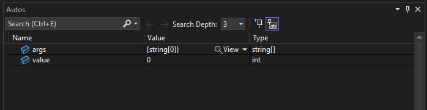

1. Right-click in the code and choose **Ask Copilot** to open the inline Chat view.

   > [!TIP]
   > Alternatively, you can right-click a variable in the Autos or Locals window, or in a data tip, and choose **Ask Copilot**. This provides Copilot with the variable name and context, so you don't need to provide context yourself in the chat.

1. Type the following question in the inline Chat view:

   ```
   Why does the args variable have a value of string[0]?
   ```

   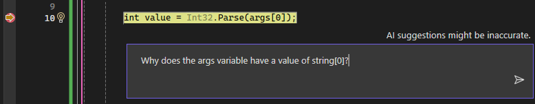

   When you press **Enter**, Copilot provides an answer based on its understanding of your code. (You might get a different response than what is shown here.)

   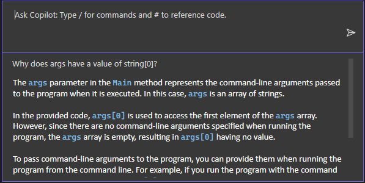

   If Copilot has a suggested fix for your code, it shows you. If not, you can ask Copilot for a code suggestion.

   > [!TIP]
   > In the inline Chat, use the "#" symbol and select from the drop-down list to hand off specific information to Copilot while you reference it in your question. For example, if you select a portion of code, and then type #, you can choose that selection from the **#** drop-down list. You can also use the "#" symbol to reference IDE features that appear in the drop-down list, such as the Locals window.

1. In this example, scroll to the end of the Copilot answer and select the follow-up question at the end of the inline Chat window, "How can I handle the case when no arguments are passed to the program?"

   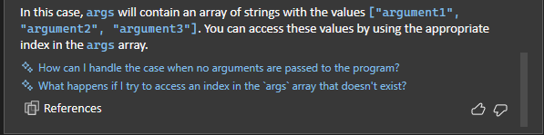

   Copilot shows a suggested fix to your code.

   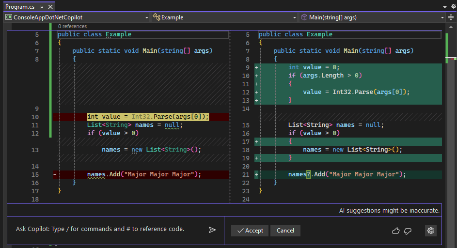

   If you want to apply the code fix, choose **Accept**.

1. Choose **Cancel** so we can continue learning other features of Copilot in the next section.

## Debug an exception with Copilot

The following simple example shows how to get AI assistance when you encounter an exception and how to quickly update your code based on AI-suggested fixes.

### Start a debugging session

- While paused in the debugger using the same sample app, press **F11** or **Debug** > **Step Into** to execute the current statement.

   An `IndexOutOfRangeException` occurs and the app pauses, showing the exception.

   To get AI assistance for the exception, continue to the next section.

### Ask for AI assistance

1. With the application paused on the exception, select the **Ask Copilot** button.

   [ 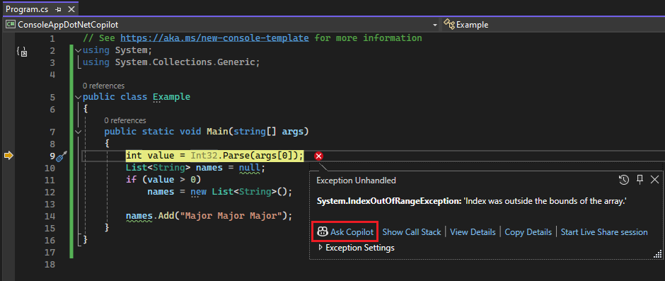 ](../debugger/media/vs-2022/debug-with-copilot-exception.png#lightbox)

   If it's not already open, the Copilot Chat window appears and provides an assessment of the error and why it occurred. In this example, Copilot identifies a suggested code fix, a button to copy code, and a **Preview** button for the code fix.

   If you have questions about the exception, ask them in the Ask Copilot text box.

1. Select the **Preview** button.

   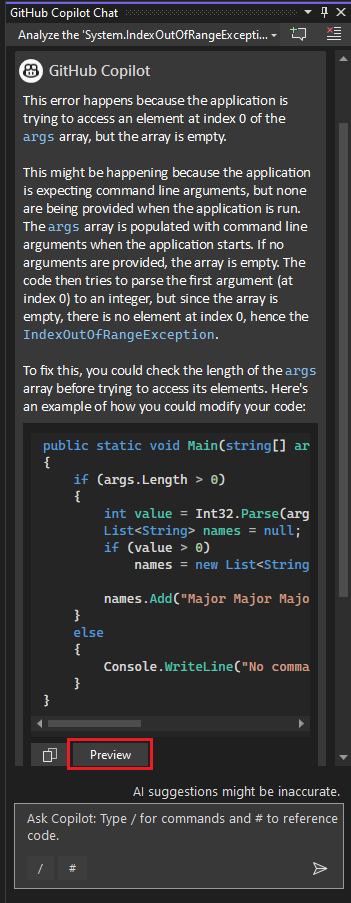

   Visual Studio shows a code preview with the suggested fix.

1. Review the suggested fix and choose **Accept** to apply the code suggestion.

   [ 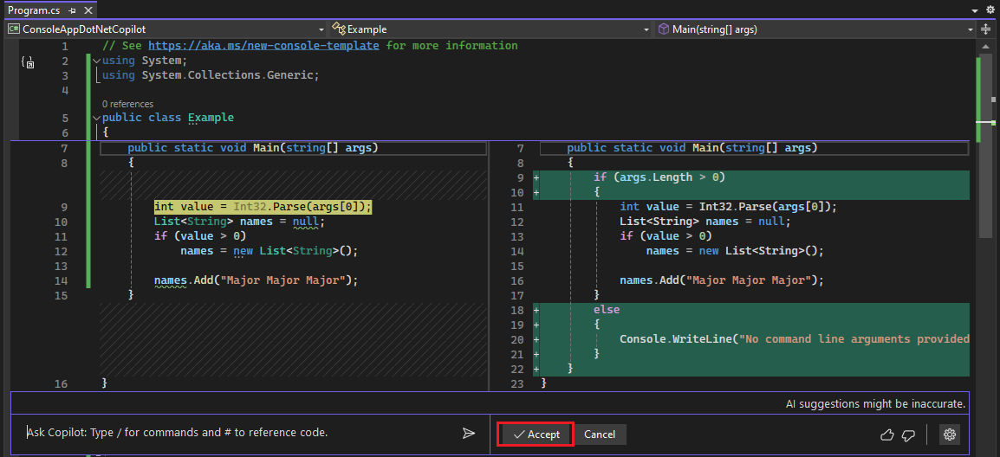 ](../debugger/media/vs-2022/debug-with-copilot-code-preview.png#lightbox)

1. Restart the debugger.

   This time, no exception occurs. It has been fixed!

## Get suggestions with conditional breakpoints and tracepoints

Copilot gives you suggestions for [conditional breakpoints](../debugger/using-breakpoints.md#breakpoint-conditions) and [tracepoints](../debugger/using-tracepoints.md) that are specific to your code.

In this example, we show AI suggestions for a conditional breakpoint. For tracepoints, the AI assistance works in the same way.

1. Remove the current breakpoint by clicking it or right-click and choose **Delete Breakpoint**.

1. Replace the following line of code:

   ```csharp
   names.Add("Major Major Major");
   ```

   with this:

   ```csharp
   // names.Add("Major Major Major");
   foreach (var item in args)
   {
      names.Add("Name: " + item);
   }
   ```

1. To the left of the `names.Add("Name: " + item)` statement, right-click in the gutter and choose **Insert Conditional Breakpoint**.

1. Select the expression field and Copilot starts working on suggestions.

   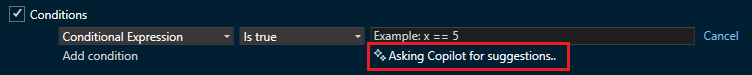

1. When the suggestions appear, choose one such as `item == "John"`. Edit the suggestion so the name is `Fred`.

   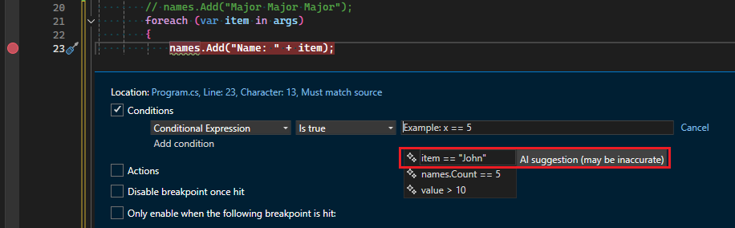

1. To test the conditional expression:

   1. Right-click the **ConsoleApp_Copilot** project in Solution Explorer and choose **Properties**.
   
   1. Select **Debug** > **General** > **Open debug launch profiles UI**.
   
   1. In the **Command-line arguments** field, enter `5 Fred Joe`, on three separate lines.

      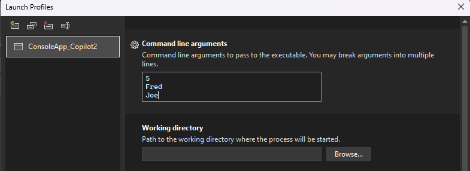

   1. Restart the debugger.
   
   When the debugger pauses at the breakpoint, check the value of `item` and verify that the current value is `Fred`.