# Overview of the Visual Studio debugger

This topic introduces the debugger tools provided by Visual Studio. In the Visual Studio context, when you *debug your app*, it usually means that you are running the application with the debugger attached (that is, in debugger mode). When you do this, the debugger provides many ways to see what your code is doing while it runs. You can step through your code and look at the values stored in variables, you can set watches on variables to see when values change, you can examine the execution path of your code, et al. If this is the first time that you've tried to debug code, you may want to read [Debugging for absolute beginners](../debugger/debugging-absolute-beginners.md) before going through this topic. If you are trying to perform a specific task and need to know what feature to use, see [Debugger feature finder](../debugger/find-your-debugging-task.yml). To try AI-assisted debugging, see [Debug with Copilot](../debugger/debug-with-copilot.md).

The features described here are applicable to C#, C++, Visual Basic, JavaScript, and other languages supported by Visual Studio (except where noted).

## Set a breakpoint and start the debugger

Breakpoints are a useful feature when you know the line of code or the section of code that you want to examine in detail at runtime. For more information on the different types of breakpoints, such as conditional breakpoints and function breakpoints, see [Using breakpoints](../debugger/using-breakpoints.md).

To debug, you need to start your app with the debugger attached to the app process. To do this:

- Press **F5** (**Debug > Start Debugging**), which is the most common method.

However, right now you may not have set any breakpoints to examine your app code, so we will do that first and then start debugging. Breakpoints are the most basic and essential feature of reliable debugging. A breakpoint indicates where Visual Studio should suspend your running code so you can take a look at the values of variables, or the behavior of memory, or whether or not a branch of code is getting run.

If you have a file open in the code editor, you can set a breakpoint by clicking in the margin to the left of a line of code.

::: moniker range=">= vs-2022"
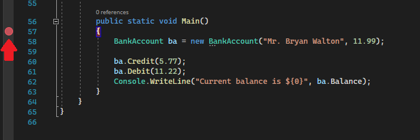
::: moniker-end
::: moniker range="<= vs-2019"

::: moniker-end

Press **F5** (**Debug > Start Debugging**) or the **Start Debugging** button  in the Debug Toolbar, and the debugger runs to the first breakpoint that it encounters. If the app is not yet running, F5 starts the debugger and stops at the first breakpoint.

::: moniker range=">= vs-2022"
## Live code editing

Visual Studio 2022 supports live code editing while debugging. For detailed information, see:

- [Write and debug running code](hot-reload.md)
- [Write and debug running XAML code with XAML Hot Reload](../xaml-tools/xaml-hot-reload.md)
- [Edit and Continue](../debugger/edit-and-continue.md)

::: moniker-end

##  Navigate code in the debugger using step commands

We provide the keyboard shortcuts for most commands because they make navigation of your app code quicker. (Equivalent commands such as menu commands are shown in parentheses.) For more details on using the step commands, see [Navigate code in the debugger](../debugger/navigating-through-code-with-the-debugger.md).

To start your app with the debugger attached, press **F11** (**Debug > Step Into**). F11 is the **Step Into** command and advances the app execution one statement at a time. When you start the app with F11, the debugger breaks on the first statement that gets executed.

::: moniker range=">= vs-2022"
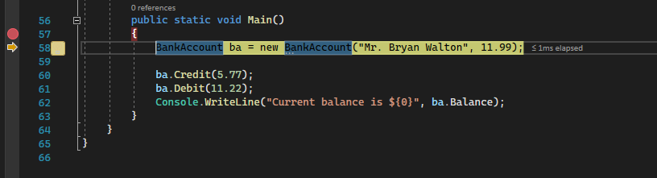
::: moniker-end
::: moniker range="<= vs-2019"
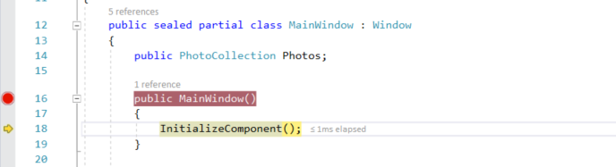
::: moniker-end

The yellow arrow represents the statement on which the debugger paused, which also suspends app execution at the same point (this statement has not yet executed).

F11 is a good way to examine the execution flow in the most detail. (To move faster through code, we show you some other options as well.) By default, the debugger skips over non-user code (if you want more details, see [Just My Code](../debugger/just-my-code.md)).

>[!NOTE]
> In managed code, you will see a dialog box asking if you want to be notified when you automatically step over properties and operators (default behavior). If you want to change the setting later, disable **Step over properties and operators** setting in the **Tools > Options** menu under **Debugging**.

## Step over code to skip functions

When you are on a line of code that is a function or method call, you can press **F10** (**Debug > Step Over**) instead of F11.

F10 advances the debugger without stepping into functions or methods in your app code (the code still executes). By pressing F10, you can skip over code that you're not interested in. This way, you can quickly get to code that you are more interested in. For more details on using the step commands, see [Navigate code in the debugger](../debugger/navigating-through-code-with-the-debugger.md).

## Advance the debugger out of the current function

Sometimes, you might want to continue your debugging session but advance the debugger all the way through the current function.

Press **Shift + F11** (or **Debug > Step Out**).

This command resumes app execution (and advances the debugger) until the current function returns.

## Run to a point in your code quickly using the mouse

Using the **Run to Click** button is similar to setting a temporary breakpoint. This command is also handy for getting around quickly within a visible region of app code. You can use **Run to Click** in any open file. For more details on this feature and similar navigation features, see [Run to a specific location in your code](../debugger/navigating-through-code-with-the-debugger.md#run-to-a-specific-location-or-function).

While in the debugger, hover over a line of code until the **Run to Click** (Run execution to here) button  appears on the left.

::: moniker range=">= vs-2022"
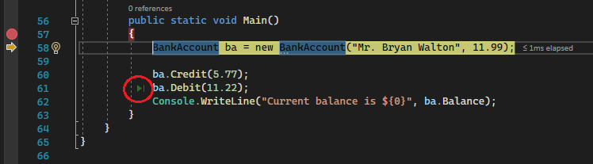
::: moniker-end
::: moniker range="<= vs-2019"
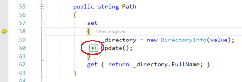
::: moniker-end

> [!NOTE]
> The **Run to Click** (Run execution to here) button is available starting in Visual Studio 2017.

Click the **Run to Click** (Run execution to here) button. The debugger advances to the line of code where you clicked.

## Run to cursor

When you are editing code (rather than paused in the debugger), right-click a line of code in your app and choose **Run to Cursor** (or press **Ctrl** + **F10**). This command starts debugging and sets a temporary breakpoint on the current line of code. For more details on this feature and similar navigation features, see [Run to a specific location in your code](../debugger/navigating-through-code-with-the-debugger.md#run-to-a-specific-location-or-function).

::: moniker range=">= vs-2022"
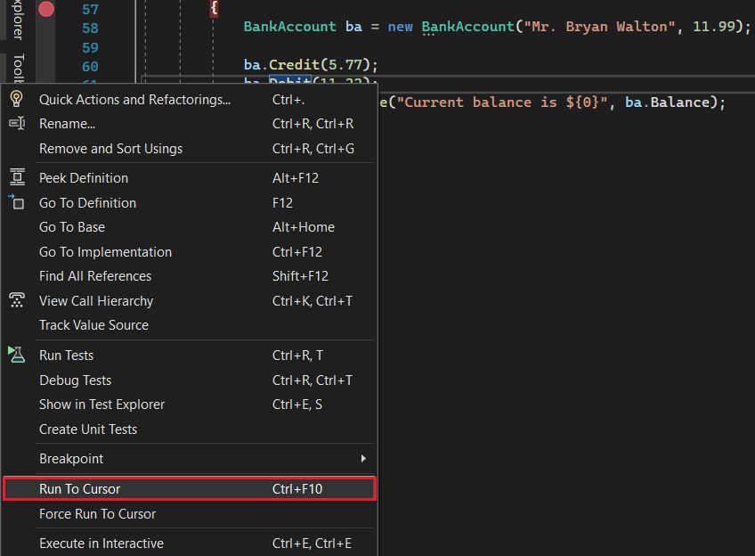
::: moniker-end
::: moniker range="<= vs-2019"
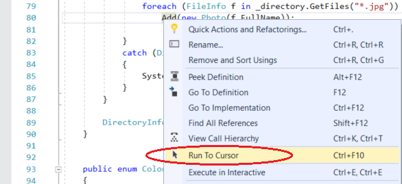
::: moniker-end

If you have set breakpoints, the debugger pauses on the first breakpoint that it hits.

Press **F5** until you reach the line of code where you selected **Run to Cursor**.

This command is useful when you are editing code and want to quickly set a temporary breakpoint and start the debugger at the same time.

> [!NOTE]
> You can use **Run to Cursor** in the **Call Stack** window while you are debugging.

## Restart your app quickly

Click the **Restart**  button in the Debug Toolbar (or press **Ctrl + Shift + F5**).

When you press **Restart**, it saves time versus stopping the app and restarting the debugger. The debugger pauses at the first breakpoint that is hit by executing code.

If you do want to stop the debugger and get back into the code editor, you can press the red stop  button instead of **Restart**.

::: moniker range="<= vs-2019"
## Edit your code and continue debugging (C#, VB, C++, XAML)

In most languages supported by Visual Studio, you can edit your code in the middle of a debugging session and continue debugging. To use this feature, click into your code with your cursor while paused in the debugger, make edits, and press **F5**, **F10**, or **F11** to continue debugging. For more information on using this feature and on feature limitations, see [Edit and Continue](../debugger/edit-and-continue.md).

To modify XAML code during a debugging session, see [Write and debug running XAML code with XAML Hot Reload](../xaml-tools/xaml-hot-reload.md).
::: moniker-end

## Inspect variables with data tips

Now that you know your way around a little, you have a good opportunity to start inspecting your app state (variables) with the debugger. Features that allow you to inspect variables are some of the most useful features of the debugger, and there are different ways to do it. Often, when you try to debug an issue, you are attempting to find out whether variables are storing the values that you expect them to have in a particular app state. For detailed information on using data tips, see [View data values in data tips](../debugger/view-data-values-in-data-tips-in-the-code-editor.md).

While paused in the debugger, hover over an object with the mouse and you see its value, or its default property value.

::: moniker range=">= vs-2022"

::: moniker-end
::: moniker range="<= vs-2019"

::: moniker-end

If the variable has properties, you can expand the object to see all its properties.

Often, when debugging, you want a quick way to check property values on objects, and the data tips are a good way to do it.

## Inspect variables with the Autos and Locals windows

In the **Autos** window, you see variables along with their current value and their type. The **Autos** window shows all variables used on the current line or the preceding line (In C++, the window shows variables in the preceding three lines of code. Check documentation for language-specific behavior). For more information on using these windows, see [Inspect variables in the Autos and Locals windows](../debugger/autos-and-locals-windows.md).

While debugging, look at the **Autos** window at the bottom of the code editor.

::: moniker range=">= vs-2022"
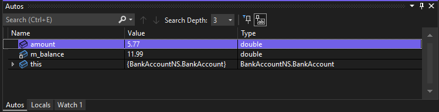
::: moniker-end
::: moniker range="<= vs-2019"
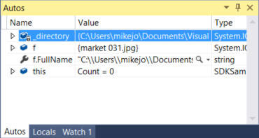
::: moniker-end

> [!NOTE]
> In JavaScript, the **Locals** window is supported but not the **Autos** window.

Next, look at the **Locals** window. The **Locals** window shows you the variables that are currently in scope.

::: moniker range=">= vs-2022"
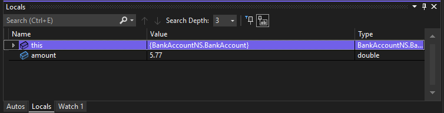
::: moniker-end
::: moniker range="<= vs-2019"
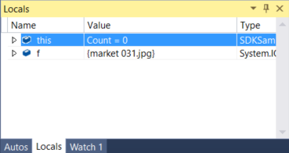
::: moniker-end

In this example, the `this` object and the object `f` are in scope. For more info, see [Inspect Variables in the Autos and Locals Windows](../debugger/autos-and-locals-windows.md).

## Set a watch

You can use a **Watch** window to specify a variable (or an expression) that you want to keep an eye on. For detailed information, see [Set a Watch using the Watch and QuickWatch Windows](../debugger/watch-and-quickwatch-windows.md).

While debugging, right-click an object and choose **Add Watch**.

::: moniker range=">= vs-2022"

::: moniker-end
::: moniker range="<= vs-2019"

::: moniker-end

In this example, you have a watch set on the object, and you can see its value change as you move through the debugger. Unlike the other variable windows, the **Watch** windows always show the variables that you are watching (they're grayed out when out of scope).

## Examine the call stack

The **Call Stack** window shows the order in which methods and functions are getting called. The top line shows the current function. The second line shows the function or property it was called from, and so on. The call stack is a good way to examine and understand the execution flow of an app. For detailed information, see [How to: Examine the Call Stack](../debugger/how-to-use-the-call-stack-window.md).

> [!NOTE]
> The **Call Stack** window is similar to the Debug perspective in some IDEs like Eclipse.

Click the **Call Stack** window while you are debugging, which is by default open in the lower right pane.

::: moniker range=">= vs-2022"
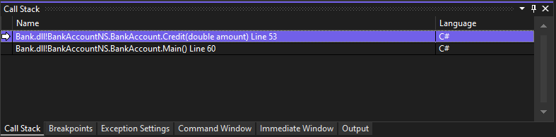
::: moniker-end
::: moniker range="<= vs-2019"
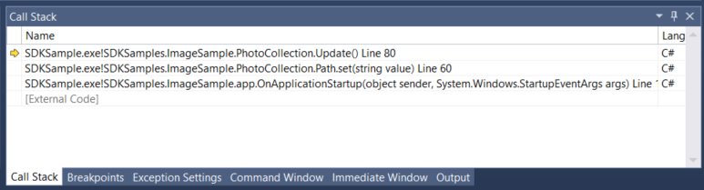
::: moniker-end

You can double-click a line of code to go look at that source code and that also changes the current scope being inspected by the debugger. This does not advance the debugger.

You can also use right-click menus from the **Call Stack** window to do other things. For example, you can insert breakpoints into specific functions, restart your app using **Run to Cursor**, and to go examine source code.

##  Inspect an exception

When your app throws an exception, the debugger takes you to the line of code that threw the exception. For detailed information, see [Inspect an exception using the Exception Helper](../debugger/exception-helper.md).

::: moniker range=">= vs-2022"
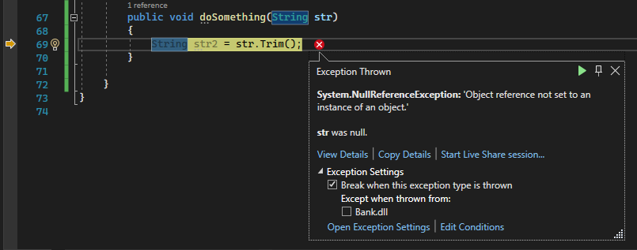

In this example, the **Exception Helper** shows you a `System.NullReferenceException` exception and an error message that says that the object reference is not set to an instance of the object. And, it tells us that the string value was null when you tried to call the `Trim` method.
::: moniker-end
::: moniker range="<= vs-2019"
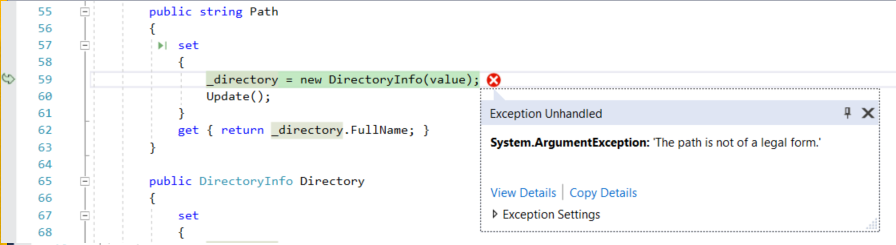

In this example, the **Exception Helper** shows you a `System.Argument` exception and an error message that says that the path is not a legal form. So, we know the error occurred on a method or function argument.

In this example, the `DirectoryInfo` call gave the error on the empty string stored in the `value` variable.
::: moniker-end

The Exception Helper is a great feature that can help you debug errors. You can also do things like view error details and add a watch from the Exception Helper. Or, if needed, you can change conditions for throwing the particular exception. For more information on how to handle exceptions in your code, see [Debugging techniques and tools](../debugger/write-better-code-with-visual-studio.md).

Expand the **Exception Settings** node to see more options on how to handle this exception type, but you don't need to change anything for this tour!

::: moniker range=">= vs-2022"
> [!TIP]
> If you have [Copilot](../ide/visual-studio-github-copilot-extension.md), you can get AI assistance while you're debugging exceptions. Just look for the **Ask Copilot**  button. For more information, see [Debug with Copilot](../debugger/debug-with-copilot.md).
::: moniker-end

::: moniker range=">= vs-2022"
## Get AI assistance

If you have [Copilot](../ide/visual-studio-github-copilot-extension.md), you can get AI assistance while you're debugging. For more information, see [Debug with Copilot](../debugger/debug-with-copilot.md). While debugging, you can also look for the **Ask Copilot**  button. In these scenarios, Copilot already knows the context for your questions, so you don't need to provide context yourself in Copilot chat. 
::: moniker-end

## Configure debugging

You can configure your project to build as a [Debug or Release configuration](../debugger/how-to-set-debug-and-release-configurations.md), configure project properties for debugging, or configure [general settings](../debugger/how-to-specify-debugger-settings.md) for debugging. In addition, you can configure the debugger to display custom information using features such as [DebuggerDisplay](using-the-debuggerdisplay-attribute.md) attribute or, for C/C++, the [NatVis framework](create-custom-views-of-native-objects.md).

Debugging properties are specific to each project type. For example, you can specify an argument to pass to the application when you start it. You can access the project-specific properties by right-clicking the project in Solution Explorer and selecting **Properties**. Debugging properties typically appear in the **Build** or **Debug** tab, depending on the particular project type.

::: moniker range=">= vs-2022"
Starting in Visual Studio 2022, the **Debug** tab for .NET projects provides a link to the debug launch profiles UI, where you can set debug-related properties.

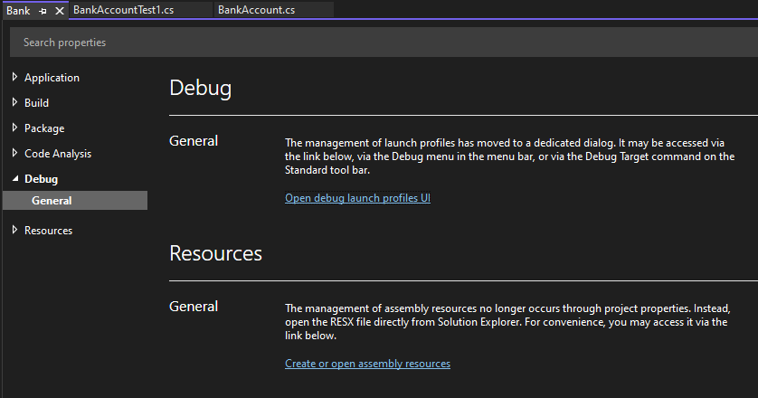
::: moniker-end
::: moniker range="<= vs-2019"
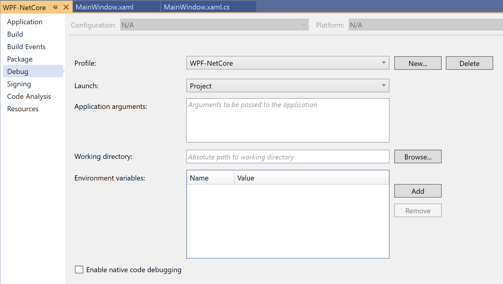
::: moniker-end

## Debug live ASP.NET apps in Azure App Service

To debug in Azure App Service, see [Debug Azure apps](../debugger/debug-azure-apps.md).

For Visual Studio Enterprise (only), the **Snapshot Debugger** takes a snapshot of your in-production apps when code that you are interested in executes. To instruct the debugger to take a snapshot, you set snappoints and logpoints in your code. The debugger lets you see exactly what went wrong, without impacting traffic of your production application. The Snapshot Debugger can help you dramatically reduce the time it takes to resolve issues that occur in production environments.

::: moniker range="<= vs-2019"
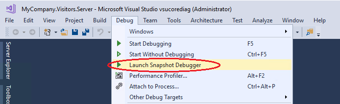
::: moniker-end

Snapshot collection is available for ASP.NET applications running in Azure App Service. ASP.NET applications must be running on .NET Framework 4.6.1 or later, and ASP.NET Core applications must be running on .NET Core 2.0 or later on Windows.

For more information, see [Debug live ASP.NET apps using the Snapshot Debugger](../debugger/debug-live-azure-applications.md).

## View snapshots with IntelliTrace step-back (Visual Studio Enterprise)

**IntelliTrace step-back** automatically takes a snapshot of your application at every breakpoint and debugger step event. The recorded snapshots enable you to go back to previous breakpoints or steps and view the state of the application as it was in the past. IntelliTrace step-back can save you time when you want to see the previous application state but don't want to restart debugging or recreate the desired app state.

You can navigate and view snapshots by using the **Step Backward** and **Step Forward** buttons in the Debug toolbar. These buttons navigate the events that appear in the **Events** tab in the **Diagnostic Tools** window.

::: moniker range="<= vs-2019"
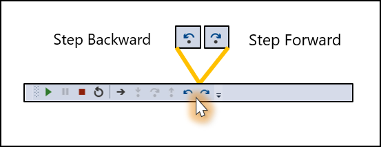
::: moniker-end

For more information, see the [Inspect previous app states using IntelliTrace](../debugger/view-historical-application-state.md) page.

## Debug performance issues

If your app runs too slowly or uses too much memory, you may need to test your app with the profiling tools early on. For more information about profiling tools such as the CPU Usage tool and the Memory Analyzer, see [First look at the profiling tools](../profiling/profiling-feature-tour.md).

## Related content

In this tutorial, you've had a quick look at many debugger features. You may want a more in-depth look at one of these features, such as breakpoints.

> [!div class="nextstepaction"]
> [Learn to use breakpoints](../debugger/using-breakpoints.md)
