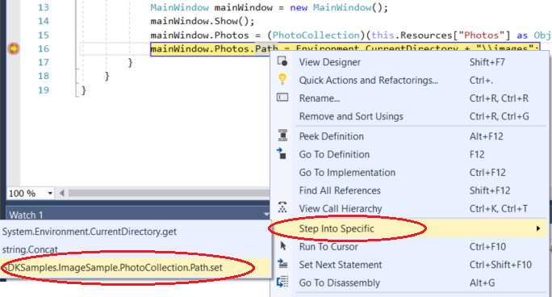
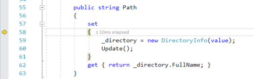

# Feature Tour of the Visual Studio Debugger

This topic introduces the features of the Visual Studio debugger. If you want to follow along by opening your own app in Visual Studio, you can do that, or you can follow along with a sample app using the [Beginner's Guide](../debugger/getting-started-with-the-debugger.md).

The features described here are applicable to C#, C++, Visual Basic, JavaScript, and other languages supported by Visual Studio (except where noted).

## Set a breakpoint and start the debugger

To debug, you need to start your app with the debugger attached to the app process. F5 (**Debug > Start Debugging**) is the most common way to do that. However, right now you may not have set any breakpoints to examine your app code, so we will do that first and then start debugging.

If you have a file open in the code editor, you can set a breakpoint by clicking in the margin to the left of a line of code.

Press F5 (**Debug > Start Debugging**) and the debugger runs to the first breakpoint that it encounters. If the app is not yet running, F5 starts the debugger and stops at the first breakpoint.

Breakpoints are a useful feature when you know the line of code or the section of code that you want to examine in detail.

## Navigate code in the debugger using step commands

We provide the keyboard shortcuts for most commands because they make navigation of your app code quicker. (Equivalent commands such as menu commands are shown in parentheses.)

To start your app with the debugger attached, press F11 (**Debug > Step Into**). F11 is the **Step Into** command and advances the app execution one statement at a time. When you start the app with F11, the debugger breaks on the first statement that gets executed.

The yellow arrow represents the statement on which the debugger paused, which also suspends app execution at the same point (this statement has not yet executed).

F11 is a good way to examine the execution flow in the most detail. (To move faster through code, we show you some other options as well.) By default, the debugger skips over non-user code (if you want more details, see [Just My Code](../debugger/just-my-code.md)).

>[!NOTE]
> In managed code, you will see a dialog box asking if you want to be notified when you automatically step over properties and operators (default behavior). If you want to change the setting later, disable **Step over properties and operators** setting in the **Tools > Options** menu under **Debugging**.

## Step over code to skip functions

When you are on a line of code that is a function or method call, you can press F10 (**Debug > Step Over**) instead of F11.

F10 advances the debugger without stepping into functions or methods in your app code (the code still executes). By pressing F10, you can skip over code that you're not interested in. This way, you can quickly get to code that you are more interested in.

## Step into a property

As mentioned earlier, by default the debugger skips over managed properties and fields, but the **Step Into Specific** command allows you to override this behavior.

Right-click on a property or field and choose **Step Into Specific**, then choose one of the available options.

In this example, **Step Into Specific** gets us to the code for `Path.set`.

## Run to a point in your code quickly using the mouse

While in the debugger, hover over a line of code until the **Run to Click** (Run execution to here) button  appears on the left.

>  [!NOTE] 
> The **Run to Click** (Run execution to here) button is new in [!include[vs_dev15](../misc/includes/vs_dev15_md.md)].

Click the **Run to Click** (Run execution to here) button. The debugger advances to the line of code where you clicked.

Using this button is similar to setting a temporary breakpoint. This command is also handy for getting around quickly within a visible region of app code. You can use **Run to Click** in any open file.

## Advance the debugger out of the current function

Sometimes, you might want to continue your debugging session but advance the debugger all the way through the current function.

Press Shift + F11 (or **Debug > Step Out**).

This command resumes app execution (and advances the debugger) until the current function returns.

## Run to cursor

Stop the debugger by pressing the **Stop Debugging** red button  or Shift + F5.

Right-click a line of code in your app and choose **Run to Cursor**. This command starts debugging and sets a temporary breakpoint on the current line of code.

If you have set breakpoints, the debugger pauses on the first breakpoint that it hits.

Press F5 until you reach the line of code where you selected **Run to Cursor**.

This command is useful when you are editing code and want to quickly set a temporary breakpoint and start the debugger.

> [!NOTE]
> You can use **Run to Cursor** in the **Call Stack** window while you are debugging.

## Restart your app quickly

Click the **Restart**  button in the Debug Toolbar (**Ctrl + Shift +F5**).

When you press **Restart**, it saves time versus stopping the app and restarting the debugger. The debugger pauses at the first breakpoint that is hit by executing code.

If you do want to stop the debugger and get back into the code editor, you can press the red stop  button instead of **Restart**.

## Inspect variables with data tips

Now that you know your way around a little, you have a good opportunity to start inspecting your app state (variables) with the debugger. Features that allow you to inspect variables are some of the most useful features of the debugger, and there are different ways to do it. Often, when you try to debug an issue, you are attempting to find out whether variables are storing the values that you expect them to have in a particular app state.

While paused in the debugger, hover over an object with the mouse and you see its default property value (in this example, the file name `market 031.jpg` is the default property value).

Expand the object to see all its properties (such as the `FullPath` property in this example).

Often, when debugging, you want a quick way to check property values on objects, and the data tips are a good way to do it.

> [!TIP]
> In most supported languages, you can edit code in the middle of a debugging session. For more info, see [Edit and Continue](../debugger/edit-and-continue.md).

## Inspect variables with the Autos and Locals windows

While debugging, look at the **Autos** window at the bottom of the code editor.

In the **Autos** window, you see variables along with their current value and their type. The **Autos** window shows all variables used on the current line or the preceding line (In C++, the window shows variables in the preceding three lines of code. Check documentation for language-specific behavior).

> [!NOTE]
> In JavaScript, the **Locals** window is supported but not the **Autos** window.

Next, look at the **Locals** window. The **Locals** window shows you the variables that are currently in scope.

In this example, the `this` object and the object `f` are in scope. For more info, see [Inspect Variables in the Autos and Locals Windows](../debugger/autos-and-locals-windows.md).

## Set a watch

You can use a **Watch** window to specify a variable (or an expression) that you want to keep an eye on.

While debugging, right-click an object and choose **Add Watch**.

In this example, you have a watch set on the `File` object, and you can see its value change as you move through the debugger. Unlike the other variable windows, the **Watch** windows always show the variables that you are watching (they're grayed out when out of scope).

For more info, see [Set a Watch using the Watch and QuickWatch Windows](../debugger/watch-and-quickwatch-windows.md)

## Examine the call stack

Click the **Call Stack** window while you are debugging, which is by default open in the lower right pane.

The **Call Stack** window shows the order in which methods and functions are getting called. The top line shows the current function (the `Update` method in this example). The second line shows that `Update` was called from the `Path.set` property, and so on. The call stack is a good way to examine and understand the execution flow of an app.

> [!NOTE]
> The **Call Stack** window is similar to the Debug perspective in some IDEs like Eclipse.

You can double-click a line of code to go look at that source code and that also changes the current scope being inspected by the debugger. This does not advance the debugger.

You can also use right-click menus from the **Call Stack** window to do other things. For example, you can insert breakpoints into specific functions, restart your app using **Run to Cursor**, and to go examine source code. See [How to: Examine the Call Stack](../debugger/how-to-use-the-call-stack-window.md).

## Examine an exception

When your app throws an exception, the debugger takes you to the line of code that threw the exception.
     

In this example, the **Exception Helper** shows you a `System.Argument` exception and an error message that says that the path is not a legal form. So, we know the error occurred on a method or function argument.

In this example, the `DirectoryInfo` call gave the error on the empty string stored in the `value` variable.

The Exception Helper is a great feature that can help you debug errors. You can also do things like view error details and add a watch from the Exception Helper. Or, if needed, you can change conditions for throwing the particular exception.

>  [!NOTE] 
> The Exception Helper replaces the Exception Assistant in [!include[vs_dev15](../misc/includes/vs_dev15_md.md)].

Expand the **Exception Settings** node to see more options on how to handle this exception type, but you don't need to change anything for this tour!

## Debug live ASP.NET apps in Azure App Service

the **Snapshot Debugger** takes a snapshot of your in-production apps when code that you are interested in executes. To instruct the debugger to take a snapshot, you set snappoints and logpoints in your code. The debugger lets you see exactly what went wrong, without impacting traffic of your production application. The Snapshot Debugger can help you dramatically reduce the time it takes to resolve issues that occur in production environments.

Snapshot collection is available for ASP.NET applications running in Azure App Service. ASP.NET applications must be running on .NET Framework 4.6.1 or later, and ASP.NET Core applications must be running on .NET Core 2.0 or later on Windows.

For more information, see [Debug live ASP.NET apps using the Snapshot Debugger](../debugger/debug-live-azure-applications.md).

## View snapshots with IntelliTrace step-back (Visual Studio Enterprise)

**IntelliTrace step-back** automatically takes a snapshot of your application at every breakpoint and debugger step event. The recorded snapshots enable you to go back to previous breakpoints or steps and view the state of the application as it was in the past. IntelliTrace step-back can save you time when you want to see the previous application state but don't want to restart debugging or recreate the desired app state.

You can navigate and view snapshots by using the **Step Backward** and **Step Forward** buttons in the Debug toolbar. These buttons navigate the events that appear in the **Events** tab in the **Diagnostic Tools** window.

  

For more information, see the [View snapshots using IntelliTrace step-back](../debugger/how-to-use-intellitrace-step-back.md) page.

## More features to look at

-   [Debugger Tips and Tricks](../debugger/debugger-tips-and-tricks.md) Learn how to increase your productivity with the debugger.

-   [Edit and Continue](../debugger/edit-and-continue.md) For a subset of languages (C#, C++, Visual Basic), the Edit and Continue feature allows you to edit code in the middle of a debugging session.

-   [Debug Multithreaded Applications](../debugger/debug-multithreaded-applications-in-visual-studio.md) Describes how to debug multithreaded applications. 

-   [Remote Debugging](../debugger/remote-debugging.md) Describes how to debug apps running on other machines or devices. 
  
-   [IntelliTrace](../debugger/intellitrace.md) Describes the IntelliTrace feature in Visual Studio Enterprise. You can use it to record and trace your code's execution history.

-   [Network Usage](../profiling/network-usage.md) Describes a profiling tool that you can use to debug web services and other network resources in Universal Windows Apps (UWP). Use the tool to examine payloads.

-   [Debug Interface Access SDK](../debugger/debug-interface-access/debug-interface-access-sdk.md) Describes the Microsoft Debug Interface Access Software Development Kit (DIA SDK). The DIA SDK provides access to debug information stored in program database (.pdb) files generated by Microsoft postcompiler tools.  

## See Also  
 [Debugging in Visual Studio](../debugger/index.md)
