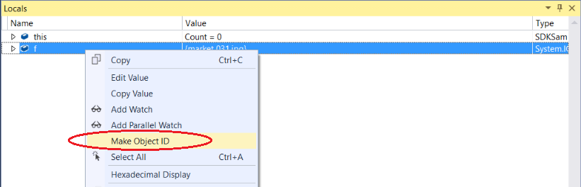
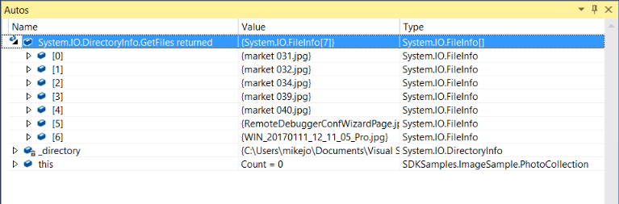
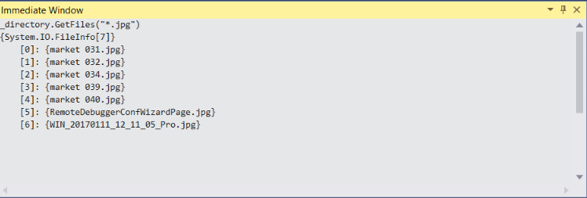
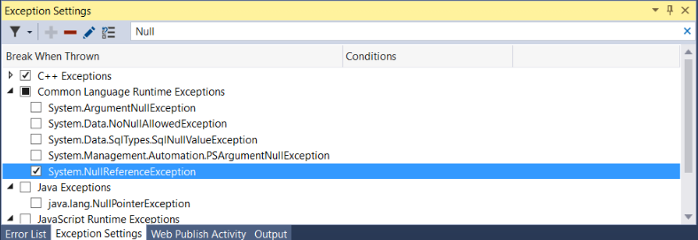
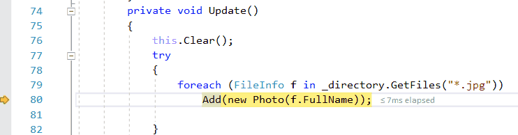
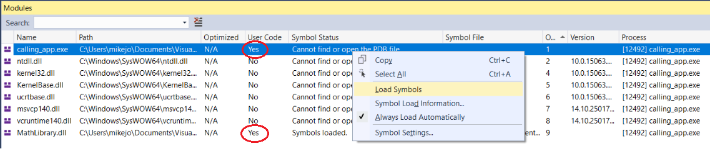

# Learn productivity tips and tricks for the debugger in Visual Studio

Read this topic to learn a few productivity tips and tricks for the Visual Studio debugger. For a look at the basic features of the debugger, see [First look at the debugger](../debugger/debugger-feature-tour.md). In this topic, we cover some areas that are not included in the feature tour.

## Keyboard shortcuts

For a list of the most common keyboard shortcuts related to debugging, see the [Debug](../ide/default-keyboard-shortcuts-in-visual-studio.md#bkmk_debug-popular-shortcuts) section in Keyboard shortcuts.

## Pin data tips

If you frequently hover over data tips while debugging, you may want to pin the data tip for the variable to give yourself quick access. The variable stays pinned even after restarting. To pin the data tip, click the pin icon while hovering over it. You can pin multiple variables.

::: moniker range=">= vs-2022"
You can also customize data tips in several other ways, such as keeping a data tip expanded (a *sticky data tip*), or making a data tip transparent. For more information, see [View data values in DataTips in the code editor](../debugger/view-data-values-in-data-tips-in-the-code-editor.md).
::: moniker-end

## Edit your code and continue debugging (C#, VB, C++)

In most languages supported by Visual Studio, you can edit your code in the middle of a debugging session and continue debugging. To use this feature, click into your code with your cursor while paused in the debugger, make edits, and press **F5**, **F10**, or **F11** to continue debugging.

For more information on using the feature and on feature limitations, see [Edit and Continue](/visualstudio/debugger/how-to-enable-and-disable-edit-and-continue).

## Edit XAML code and continue debugging

To modify XAML code during a debugging session, see [Write and debug running XAML code with XAML Hot Reload](../xaml-tools/xaml-hot-reload.md).

## Debug issues that are hard to reproduce

If it is difficult or time-consuming to recreate a particular state in your app, consider whether the use of a conditional breakpoint can help. You can use [conditional breakpoints](../debugger/using-breakpoints.md#BKMK_Specify_a_breakpoint_condition_using_a_code_expression) and filter breakpoints to avoid breaking into your app code until the app enters a desired state (such as a state in which a variable is storing bad data). You can set conditions using expressions, filters, hit counts, and so on.

#### To create a conditional breakpoint

1. Right-click a breakpoint icon (the red sphere) and choose **Conditions**.

2. In the **Breakpoint Settings** window, type an expression.

    

3. If you are interested in another type of condition, select **Filter** instead of **Conditional expression** in the **Breakpoint Settings** dialog box, and then follow the filter tips.

## Configure the data to show in the debugger

For C#, Visual Basic, and C++ (C++/CLI code only), you can tell the debugger what information to show using the [DebuggerDisplay](../debugger/using-the-debuggerdisplay-attribute.md) attribute. For C++ code, you can do the same using [Natvis visualizations](create-custom-views-of-native-objects.md).

## Attach to the same application repeatedly

When you are using the [attach to process](attach-to-running-processes-with-the-visual-studio-debugger.md#BKMK_reattach) feature, you can quickly reattach to a process that you were previously attached to by choosing **Debug** > **Reattach to Process** (**Shift**+**Alt**+**P**). When you choose this command, the debugger will immediately try to attach to the last process you attached to by first attempting to match the previous process ID and if that fails, by matching to the previous process name. If no matches are found, or if several processes have the same name, the **Attach to Process** dialog box will open so you can select the correct process.

## Track an out-of-scope object (C#, Visual Basic)

It's easy to view variables using debugger windows like the **Watch** window. However, when a variable goes out of scope in the **Watch** window, you may notice that it is grayed out. In some app scenarios, the value of a variable may change even when the variable is out of scope, and you might want to watch it closely (for example, a variable may get garbage collected). You can track the variable by creating an Object ID for it in the **Watch** window.

#### To create an object ID

1. Set a breakpoint near a variable that you want to track.

2. Start the debugger (**F5**) and stop at the breakpoint.

3. Find the variable in the **Locals** window (**Debug > Windows > Locals**), right-click the variable, and select **Make Object ID**.

    

4. You should see a **$** plus a number in the **Locals** window. This variable is the object ID.

5. Right-click the object ID variable and choose **Add Watch**.

For more information, see [Create an Object ID](../debugger/watch-and-quickwatch-windows.md#bkmk_objectIds).

## View return values for functions

To view return values for your functions, look at the functions that appear in the **Autos** window while you are stepping through your code. To see the return value for a function, make sure that the function you are interested in has already executed (press **F10** once if you are currently stopped on the function call). If the window is closed, use **Debug > Windows > Autos** to open the **Autos** window.

In addition, you can enter functions in the **Immediate** window to view return values. (Open it using **Debug > Windows > Immediate**.)

You can also use [pseudovariables](../debugger/pseudovariables.md) in the **Watch** and **Immediate** window, such as `$ReturnValue`.

## Inspect strings in a visualizer

When working with strings, it can be helpful to view the entire formatted string. To view a plain text, XML, HTML, or JSON string, click the magnifying glass icon  while hovering over a variable containing a string value.

A string visualizer may help you find out whether a string is malformed, depending on the string type. For example, a blank **Value** field indicates the string is not recognized by the visualizer type. For more information, see [String Visualizer Dialog Box](../debugger/string-visualizer-dialog-box.md).

For a few other types such as DataSet and DataTable objects that appear in the debugger windows, you can also open a built-in visualizer.

## Analyze memory usage

You can take and compare snapshots of the heap, optimize memory usage, and find a memory leak using memory usage tools. For more information, see [Choose a memory analysis tool](../profiling/analyze-memory-usage.md).

## Create a dump file

A *dump file* is a snapshot that shows the process that was executing and modules that were loaded for an app at a point in time. A dump with heap information also includes a snapshot of the app's memory at that point. Dumps are mostly used to debug issues from machines that developers don't have access to.

If you need to save a dump file, select select **Debug > Save Dump As**.

To analyze a dump file, choose **File > Open** in Visual Studio. To start debugging using the dump file, select **Debug with Managed Only**, **Debug with Native Only**, **Debug with Mixed**, or **Debug with Managed Memory**.

For more information, see [Dump files](using-dump-files.md).

## Break into code on handled exceptions

The debugger breaks into your code on unhandled exceptions. However, handled exceptions (such as exceptions that occur within a `try/catch` block) can also be a source of bugs and you may want to investigate when they occur. You can configure the debugger to break into code for handled exceptions as well by configuring options in the **Exception Settings** dialog box. Open this dialog box by choosing **Debug > Windows > Exception Settings**.

The **Exception Settings** dialog box allows you to tell the debugger to break into code on specific exceptions. In the illustration below, the debugger breaks into your code whenever a `System.NullReferenceException` occurs. For more information, see [Managing exceptions](../debugger/managing-exceptions-with-the-debugger.md).

## Change the execution flow

With the debugger paused on a line of code, use the mouse to grab the yellow arrow pointer on the left. Move the yellow arrow pointer to a different point in the code execution path. Then you use F5 or a step command to continue running the app.

By changing the execution flow, you can do things like test different code execution paths or rerun code without restarting the debugger. For more information, see [Move the execution pointer](../debugger/move-the-execution-pointer-with-the-debugger.md).

> [!WARNING]
> Often you need to be careful with this feature, and you see a warning in the tooltip. You may see other warnings, too. Moving the pointer cannot revert your app to an earlier application state.

## Debug deadlocks and race conditions

If you need to debug the kinds of issues that are common to multithreaded apps, it often helps to view the location of threads while debugging. You can do this easily using the **Show Threads in Source** button.

To show threads in your source code:

1. While debugging, click the **Show Threads in Source** button  in the **Debug** toolbar.

2. Look at the gutter on the left side of the window. On this line, you see a *thread marker* icon   that resembles two cloth threads. The thread marker indicates that a thread is stopped at this location.

    Notice that a thread marker may be partially concealed by a breakpoint.

3. Hover the pointer over the thread marker. A DataTip appears. The DataTip tells you the name and thread ID number for each stopped thread.

    You can also view the location of threads in the [Parallel Stacks window](../debugger/get-started-debugging-multithreaded-apps.md).

##  Get more familiar with how the debugger attaches to your app (C#, C++, Visual Basic, F#)

To attach to your running app, the debugger loads symbol (.pdb) files generated for the exact same build of the app you are trying to debug. In some scenarios, a little knowledge of symbol files can be helpful. You can examine how Visual Studio loads symbol files using the **Modules** window.

Open the **Modules** window while debugging by selecting **Debug > Windows > Modules**. The **Modules** window can tell you what modules the debugger is treating as user code, or [*My Code*](../debugger/just-my-code.md), and the symbol loading status for the module. In most scenarios, the debugger automatically finds symbol files for user code, but if you want to step into (or debug) .NET code, system code, or third-party library code, extra steps are required to obtain the correct symbol files.

You can load symbol information directly from the **Modules** window by right-clicking and choosing **Load Symbols**.

Sometimes, app developers ship apps without the matching symbol files (to reduce the footprint), but keep a copy of the matching symbol files for the build so that they can debug a released version later.

To find out how the debugger classifies code as user code, see [Just My Code](../debugger/just-my-code.md). To find out more about symbol files, see [Specify symbol (.pdb) and source files in the Visual Studio debugger](specify-symbol-dot-pdb-and-source-files-in-the-visual-studio-debugger.md).

## Learn more

For additional tips and tricks and more detailed information, see these blog posts:

- [7 lesser known hacks for debugging in Visual Studio](https://devblogs.microsoft.com/visualstudio/7-lesser-known-hacks-for-debugging-in-visual-studio/)
- [7 hidden gems in Visual Studio](https://devblogs.microsoft.com/visualstudio/7-hidden-gems-in-visual-studio-2017/)

## Related content

[Keyboard Shortcuts](../ide/productivity-shortcuts.md)
