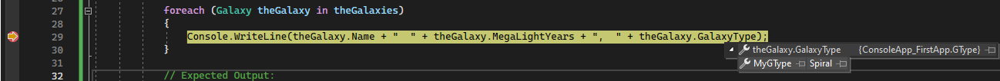
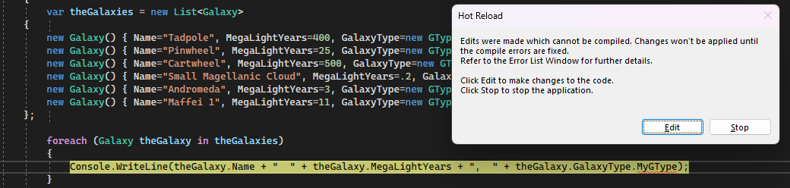
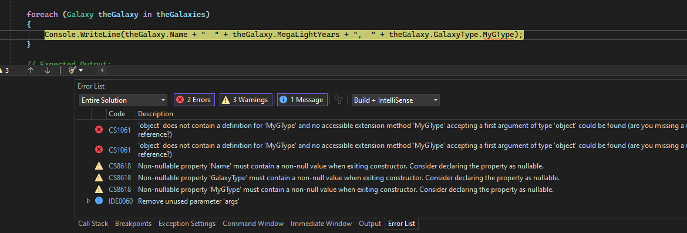
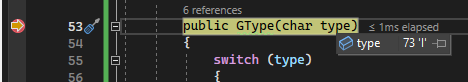
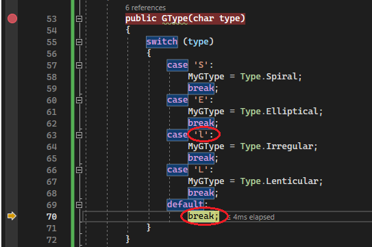

# How to debug for absolute beginners

Without fail, the code we write as software developers doesn’t always do what we expected it to do. Sometimes it does something completely different! When this happens, the next task is to figure out why, and although we might be tempted to just keep staring at our code for hours, it’s much easier and efficient to use a debugging tool, or debugger.

A debugger, unfortunately, isn’t something that can magically reveal all the problems or “bugs” in our code. *Debugging* means to run your code step by step in a debugging tool like Visual Studio, to find the exact point where you made a programming mistake. You then understand what corrections you need to make in your code, and debugging tools often allow you to make temporary changes so you can continue running the program.

Using a debugger effectively is also a skill that takes time and practice to learn but is ultimately a fundamental task for every software developer. In this article, then, we introduce the core principles of debugging and provide tips to get you started.

## Clarify the problem by asking yourself the right questions

It helps to clarify the problem that you ran into before you try to fix it. We expect that you already ran into a problem in your code, otherwise you wouldn't be here trying to figure out how to debug it! So, before you start debugging, make sure you've identified the problem you're trying to solve:

* What did you expect your code to do?

* What happened instead?

    If you ran into an error (exception) while running your app, that can be a good thing! An exception is an unexpected event encountered when running code, typically an error of some kind. A debugging tool can take you to the exact place in your code where the exception occurred and can help you investigate possible fixes.

    If something else happened, what is the symptom of the problem? Do you already suspect where this problem occurred in your code? For example, if your code displays some text, but the text is incorrect, you know that either your data is bad or the code that set the display text has some kind of bug. By stepping through the code in a debugger, you can examine each and every change to your variables to discover exactly when and how incorrect values are assigned.

## Examine your assumptions

Before you investigate a bug or an error, think of the assumptions that made you expect a certain result. Hidden or unknown assumptions can get in the way of identifying a problem even when you are looking right at the cause of the problem in a debugger. You may have a long list of possible assumptions! Here are a few questions to ask yourself to challenge your assumptions.

* Are you using the right API (that is, the right object, function, method, or property)? An API that you're using might not do what you think it does. (After you examine the API call in the debugger, fixing it may require a trip to the documentation to help identify the correct API.)

* Are you using an API correctly? Maybe you used the right API but didn't use it in the right way.

* Does your code contain any typos? Some typos, like a simple misspelling of a variable name, can be difficult to see, especially when working with languages that don’t require variables to be declared before they’re used.

* Did you make a change to your code and assume it is unrelated to the problem that you're seeing?

* Did you expect an object or variable to contain a certain value (or a certain type of value) that's different from what really happened?

* Do you know the intent of the code? It is often more difficult to debug someone else's code. If it's not your code, it's possible you might need to spend time learning exactly what the code does before you can debug it effectively.

    > [!TIP]
    > When writing code, start small, and start with code that works! (Good sample code is helpful here.) Sometimes, it is easier to fix a large or complicated set of code by starting with a small piece of code that demonstrates the core task you are trying to achieve. Then, you can modify or add code incrementally, testing at each point for errors.

By questioning your assumptions, you may reduce the time it takes to find a problem in your code. You may also reduce the time it takes to fix a problem.

## Step through your code in debugging mode to find where the problem occurred

When you normally run an app, you see errors and incorrect results only after the code has run. A program might also terminate unexpectedly without telling you why.

Running an app within a debugger, also called *debugging mode*, means that the debugger actively monitors everything that’s happening as the program runs. It also allows you to pause the app at any point to examine its state, and to then step through your code line by line to watch every detail as it happens.

In Visual Studio, you enter debugging mode by using **F5** (or the **Debug** > **Start Debugging** menu command or the **Start Debugging** button  in the Debug Toolbar). If any exceptions occur, Visual Studio’s Exception Helper takes you to the exact point where the exception occurred and provides other helpful information. For more information on how to handle exceptions in your code, see [Debugging techniques and tools](../debugger/write-better-code-with-visual-studio.md).

If you didn't get an exception, you probably have a good idea where to look for the problem in your code. This is where you use *breakpoints* with the debugger to give yourself a chance to examine your code more carefully. Breakpoints are the most basic and essential feature of reliable debugging. A breakpoint indicates where Visual Studio should pause your running code so you can take a look at the values of variables, or the behavior of memory, or the sequence in which code runs.

In Visual Studio, you can quickly set a breakpoint by clicking in the left margin next to a line of code. Or place the cursor on a line and press **F9**.

To help illustrate these concepts, we take you through some example code that already has several bugs. We are using C#, but the debugging features apply to Visual Basic, C++, JavaScript, Python, and other supported languages.

### Create a sample app (with some bugs)

Next, we will create an application that has a few bugs.

1. You must have Visual Studio installed and either the **.NET desktop development** workload or the **.NET Core cross platform development** workload installed, depending on which app type you want to create.

    If you haven't already installed Visual Studio, go to the [Visual Studio downloads](https://visualstudio.microsoft.com/downloads/) page to install it for free.

    If you need to install the workload but already have Visual Studio, click **Tools** > **Get Tools and Features**. The Visual Studio Installer launches. Choose the **.NET desktop development** (or **.NET Core cross platform development**) workload, then choose **Modify**.

1. Open Visual Studio.

    ::: moniker range=">=vs-2019"
    On the start window, choose **Create a new project**. Type **console** in the search box and then choose **Console App (.NET Framework)** or **Console App (.NET Core)**. Choose **Next**. Type a project name like **ConsoleApp-FirstApp** and click **Create**.
    ::: moniker-end
    ::: moniker range="vs-2017"
    From the top menu bar, choose **File** > **New** > **Project**. In the left pane of the **New project** dialog box, under **Visual C#**, choose **Console App**, and then in the middle pane choose either **Console App (.NET Framework)** or **Console App (.NET Core)**. Type a name like **ConsoleApp-FirstApp** and click **OK**.
    ::: moniker-end

    If you don't see the **Console App (.NET Framework)** or **Console App (.NET Core)** project template, go to **Tools** > **Get Tools and Features**, which opens the Visual Studio Installer. Choose the **.NET desktop development** workload or the **.NET Core cross platform development** workload, then choose **Modify**.

    Visual Studio creates the console project, which appears in Solution Explorer in the right pane.

1. In *Program.cs*, replace all the default code with the following code:

    ```csharp
    using System;
    using System.Collections.Generic;

    namespace ConsoleApp_FirstApp
    {
        class Program
        {
            static void Main(string[] args)
            {
                Console.WriteLine("Welcome to Galaxy News!");
                IterateThroughList();
                Console.ReadKey();
            }

            private static void IterateThroughList()
            {
                var theGalaxies = new List<Galaxy>
            {
                new Galaxy() { Name="Tadpole", MegaLightYears=400, GalaxyType=new GType('S')},
                new Galaxy() { Name="Pinwheel", MegaLightYears=25, GalaxyType=new GType('S')},
                new Galaxy() { Name="Cartwheel", MegaLightYears=500, GalaxyType=new GType('L')},
                new Galaxy() { Name="Small Magellanic Cloud", MegaLightYears=.2, GalaxyType=new GType('I')},
                new Galaxy() { Name="Andromeda", MegaLightYears=3, GalaxyType=new GType('S')},
                new Galaxy() { Name="Maffei 1", MegaLightYears=11, GalaxyType=new GType('E')}
            };

                foreach (Galaxy theGalaxy in theGalaxies)
                {
                    Console.WriteLine(theGalaxy.Name + "  " + theGalaxy.MegaLightYears + ",  " + theGalaxy.GalaxyType);
                }

                // Expected Output:
                //  Tadpole  400,  Spiral
                //  Pinwheel  25,  Spiral
                //  Cartwheel, 500,  Lenticular
                //  Small Magellanic Cloud .2,  Irregular
                //  Andromeda  3,  Spiral
                //  Maffei 1,  11,  Elliptical
            }
        }

        public class Galaxy
        {
            public string Name { get; set; }

            public double MegaLightYears { get; set; }
            public object GalaxyType { get; set; }

        }

        public class GType
        {
            public GType(char type)
            {
                switch(type)
                {
                    case 'S':
                        MyGType = Type.Spiral;
                        break;
                    case 'E':
                        MyGType = Type.Elliptical;
                        break;
                    case 'l':
                        MyGType = Type.Irregular;
                        break;
                    case 'L':
                        MyGType = Type.Lenticular;
                        break;
                    default:
                        break;
                }
            }
            public object MyGType { get; set; }
            private enum Type { Spiral, Elliptical, Irregular, Lenticular}
        }
    }
    ```

    Our intent for this code is to display the galaxy name, the distance to the galaxy, and the galaxy type all in a list. To debug, it is important to understand the intent of the code. Here is the format for one line from the list that we want to show in the output:

    *galaxy name*, *distance*, *galaxy type*.

### Run the app

1. Press **F5** or the **Start Debugging** button  in the Debug Toolbar, located above the code editor.

    The app starts and there are no exceptions shown to us by the debugger. However, the output you see in the console window is not what you expect. Here is the expected output:

    ```
    Tadpole  400,  Spiral
    Pinwheel  25,  Spiral
    Cartwheel, 500,  Lenticular
    Small Magellanic Cloud .2,  Irregular
    Andromeda  3,  Spiral
    Maffei 1,  Elliptical
    ```

    But, we see this instead:

    ```
    Tadpole  400,  ConsoleApp_FirstApp.GType
    Pinwheel  25,  ConsoleApp_FirstApp.GType
    Cartwheel, 500,  ConsoleApp_FirstApp.GType
    Small Magellanic Cloud .2,  ConsoleApp_FirstApp.GType
    Andromeda  3,  ConsoleApp_FirstApp.GType
    Maffei 1, 11,  ConsoleApp_FirstApp.GType
    ```

    Looking at the output and at our code, we know that `GType` is the name of the class that stores the galaxy type. We are trying to show the actual galaxy type (such as "Spiral"), not the class name!

### Debug the app

1. With the app still running, set a breakpoint by clicking in the left margin next to the `Console.WriteLine` method call in this line of code.

    ```csharp
    foreach (Galaxy theGalaxy in theGalaxies)
    {
        Console.WriteLine(theGalaxy.Name + "  " + theGalaxy.MegaLightYears + ",  " + theGalaxy.GalaxyType);
    }
    ```

    When you set the breakpoint, a red dot appears in the left margin.

    Because we see a problem in the output, we will start debugging by looking at the preceding code that sets the output in the debugger.

1. Click the **Restart**  button in the Debug Toolbar (**Ctrl** + **Shift** + **F5**).

    The app pauses at the breakpoint that you set. The yellow highlighting indicates where the debugger is paused (the yellow line of code has not yet executed).

1. Hover over the `GalaxyType` variable on the right, and then, to the left of the wrench icon, expand `theGalaxy.GalaxyType`. You see that `GalaxyType` contains a property `MyGType`, and the property value is set to `Spiral`.

    

    "Spiral" is actually the correct value you were expecting to print to the console! So it is a good start that you can access this value in this code while running the app. In this scenario, we are using the incorrect API. We will see if we can fix this while running code in the debugger.

1. In the same code, while still debugging, put your cursor at the end of `theGalaxy.GalaxyType` and change it to `theGalaxy.GalaxyType.MyGType`. Although you can make this change, the code editor shows you an error indicating it can't compile this code.

    

1. Click **Edit** in the **Edit and Continue** message box. You see an error message now in the **Error List** window. The error indicates that the `'object'` doesn't contain a definition for `MyGType`.

    

    Even though we set each galaxy with an object of type `GType` (which has the `MyGType` property), the debugger does not recognize the `theGalaxy` object as an object of type `GType`. What's going on? You want to look through any code that sets the galaxy type. When you do this, you see that the `GType` class definitely has a property of `MyGType`, but something isn't right. The error message about `object` turns out to be the clue; to the language interpreter, the type appears to be an object of type `object` instead of an object of type `GType`.

1. Looking through your code related to setting the galaxy type, you find the `GalaxyType` property of the `Galaxy` class is specified as `object` instead of `GType`.

    ```csharp
    public object GalaxyType { get; set; }
    ```

1. Change the preceding code to this:

    ```csharp
    public GType GalaxyType { get; set; }
    ```

1. Click the **Restart**  button in the Debug Toolbar (**Ctrl** + **Shift** + **F5**) to recompile code and restart.

    Now, when the debugger pauses on `Console.WriteLine`, you can hover over `theGalaxy.GalaxyType.MyGType`, and see that the value is properly set.

1. Remove the breakpoint by clicking on the breakpoint circle in the left margin (or right-click and choose **Breakpoint** > **Delete Breakpoint**), and then press **F5** to continue.

    The app runs and displays output. It looks pretty good now, but you do notice one thing; you expected the Small Magellanic Cloud galaxy to show up as a Irregular galaxy in the console output, but it shows no galaxy type at all.

    ```
    Tadpole  400,  Spiral
    Pinwheel  25,  Spiral
    Cartwheel, 500,  Lenticular
    Small Magellanic Cloud .2,
    Andromeda  3,  Spiral
    Maffei 1,  Elliptical
    ```

1. Set a breakpoint on this line of code.

    ```csharp
    public GType(char type)
    ```

    This code is where the galaxy type is set, so we want to take a closer look at it.

1. Click the **Restart**  button in the Debug Toolbar (**Ctrl** + **Shift** + **F5**) to restart.

    The debugger pauses on the line of code where you set the breakpoint.

1. Hover over the `type` variable. You see a value of `S` (following the character code). You are interested in a value of `I`, since you know that is an Irregular galaxy type.

1. Press **F5** and hover over the `type` variable again. Repeat this step until you see a value of `I` in the `type` variable.

    

1. Now, press **F11** (**Debug** > **Step Into** or the **Step Into** button in the Debug Toolbar).

    **F11** advances the debugger (and executes code) one statement at a time. **F10** (**Step Over**) is a similar command, and both are extremely useful when learning how to use the debugger.

1. Press **F11** until you stop on line of code in the `switch` statement for a value of 'I'. Here, you see a clear problem resulting from a typo. You expected the code to advance to where it sets `MyGType` as an Irregular galaxy type, but the debugger instead skips this code completely and pauses on the `default` section of the `switch` statement.

    

    Looking at the code, you see a typo in the `case 'l'` statement. It should be `case 'I'`.

1. Click in the code for `case 'l'` and replace it with `case 'I'`.

1. Remove your breakpoint, and then click the **Restart** button to restart the app.

    The bugs are fixed now and you see the Output you expect!

    Press any key to finish the app.

## Summary

When you see a problem, use the debugger and [step commands](../debugger/navigating-through-code-with-the-debugger.md) such as **F10** and **F11** to find the region of code with the problem.

> [!NOTE]
> If it is difficult to identify the region of code where the problem occurs, set a breakpoint in code that runs before the problem occurs, and then use step commands until you see the problem manifest. You can also use [tracepoints](../debugger/using-breakpoints.md#BKMK_Print_to_the_Output_window_with_tracepoints) to log messages to the **Output** window. By looking at logged messages (and noticing which messages were not yet logged!), you can often isolate the region of code with the problem. You may have to repeat this process several times to narrow it down.

When you find the region of code with the problem, use the debugger to investigate. To find the cause of a problem, inspect the problem code while running your app in the debugger:

* [Inspect variables](../debugger/view-data-values-in-data-tips-in-the-code-editor.md) and check whether they contain the type of values that they should contain. If you find a bad value, find out where the bad value was set (to find where the value was set, you might need to either restart the debugger, look at the [call stack](../debugger/how-to-use-the-call-stack-window.md), or both).

* Check whether your application is executing the code that you expect. (For example, in the sample application, we expected the code for the switch statement to set the galaxy type to Irregular, but the app skipped the code due to the typo.)

> [!TIP]
> You use a debugger to help you find bugs. A debugging tool can find bugs *for you* only if it knows the intent of your code. A tool can only know the intent of your code if you, the developer, express that intent. Writing [unit tests](../test/improve-code-quality.md) is how you do that.

## Next steps

In this article, you've learned a few general debugging concepts. Next, you can start learning more about the debugger.

> [!div class="nextstepaction"]
> [First look at the debugger](../debugger/debugger-feature-tour.md)
