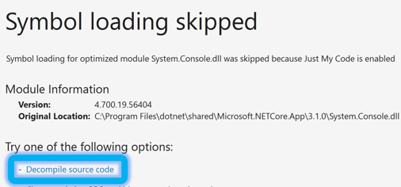
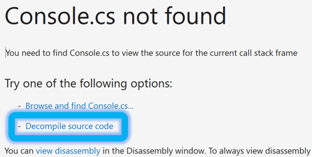
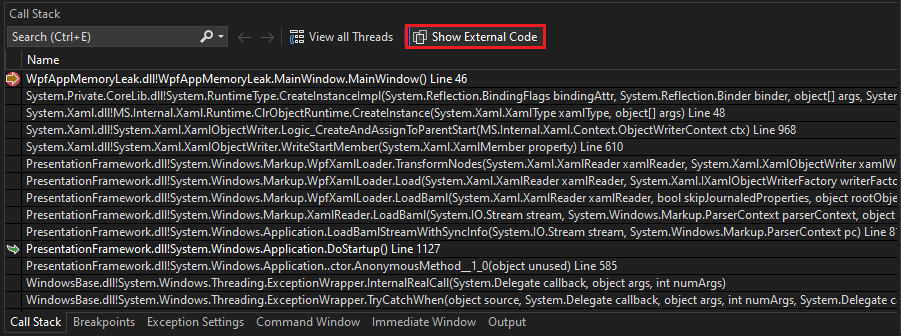
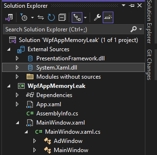
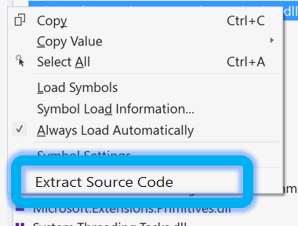
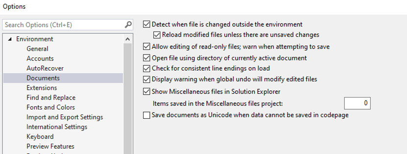
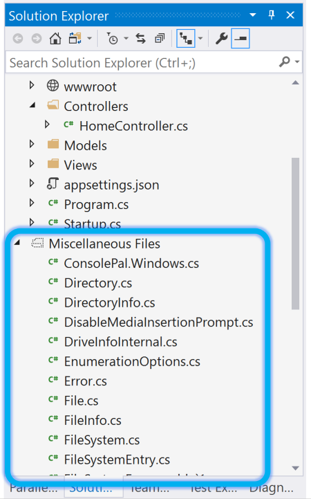

# Generate source code from .NET assemblies while debugging

When you debug a .NET application, you might find that you want to view source code that you don't have. For example, breaking on an exception or using the call stack to navigate to a source location.

> [!NOTE]
> * Source code generation (decompilation) is only available for .NET applications and is based on the open source [ILSpy](https://github.com/icsharpcode/ILSpy) project.
> * Decompilation is only available in Visual Studio 2019 16.5 and later.
> * Applying the [SuppressIldasmAttribute](/dotnet/api/system.runtime.compilerservices.suppressildasmattribute) attribute to an assembly or module prevents Visual Studio from attempting decompilation. Although the attribute is obsolete in .NET 6 and later, Visual Studio honors the attribute.

## Generate source code

When you're debugging and no source code is available, Visual Studio shows the **Source Not Found** document, or if you don’t have symbols for the assembly, the **No Symbols Loaded** document. Both documents have a **Decompile source code** option that generates C# code for the current location. The generated C# code can then be used just like any other source code. You can view the code, inspect variables,  set breakpoints, and so on.

### No symbols loaded

The following illustration shows the **No Symbols Loaded** message.

### Source not found

The following illustration shows the **Source Not Found** message.

::: moniker range=">= vs-2022"

## Autodecompile code

Starting in Visual Studio 2022 version 17.7, the Visual Studio Debugger supports autodecompilation of external .NET code. You can autodecompile when stepping into external code or when using the Call Stack window.

If you step into code that has been implemented externally, the debugger automatically decompiles it and displays the current point of execution. If you want to step into external code, disable [Just My Code](../debugger/just-my-code.md).

You can decompile from the Call Stack window without disabling Just My Code.

To autodecompile from the Call Stack window:

1. While debugging with the Call Stack window open, select **Show External Code**.

1. In the Call Stack window, double-click any stack frame. The debugger decompiles the code, and then navigates directly to the current point of execution.

   

   All of the decompiled code is also shown under the External Sources node in Solution Explorer, make it easy to browse through the external files if needed.

   

   You can debug the decompiled code and set breakpoints.

::: moniker-end

To disable the automatic decompilation of external code:

:::moniker range="visualstudio"

1. Open the **Tools** > **Options** pane and expand the **All Settings** > **Debugging** > **General** section.

1. In the right pane, clear the **Automatically decompile to source when needed (managed only)** checkbox.

:::moniker-end
:::moniker range="<=vs-2022"

1. Open the **Tools** > **Options** dialog and expand the **Debugging** > **General** section.

1. In the right pane, clear the **Automatically decompile to source when needed (managed only)** checkbox.

1. Select **OK**.

:::moniker-end

## Generate and embed sources for an assembly

In addition to generating source code for a specific location, you can generate all the source code for a given .NET assembly. To do this task, go to the **Modules** window and from the context menu of a .NET assembly, and then select the **Decompile Source to Symbol File** command. Visual Studio generates a symbol file for the assembly and then embeds the source into the symbol file. In a later step, you can [extract](#extract-and-view-the-embedded-source-code) the embedded source code.

## Extract and view the embedded source code

You can extract source files that are embedded in a symbol file using the **Extract Source Code** command in the context menu of the **Modules** window.

The extracted source files are added to the solution as [miscellaneous files](../ide/reference/miscellaneous-files.md). The miscellaneous files feature is off by default in Visual Studio. If the feature isn't enabled, you can't open the extracted source code.

:::moniker range="visualstudio"

You can enable the feature from the **Tools** > **Options** menu. 

1. Open the **Tools** > **Options** pane and expand the **All Settings** > **Environment** > **Documents** section. 

1. In the right pane, select or clear the **Show Miscellaneous files in Solution Explorer** checkbox. 

   If you select the option, you can specify the number of **Items saved in the Miscellaneous files project**.

   :::image type="content" source="media/visualstudio/decompilation-tools-options-misc-files.png" border="false" alt-text="Screenshot that shows how to configure the Show Miscellaneous files in Solution Explorer option in Visual Studio.":::

1. To apply your changes, restart Visual Studio.

:::moniker-end
:::moniker range="<=vs-2022"

1. Open the **Tools** > **Options** dialog and expand the **Environment** > **Documents** section.

1. In the right pane, select or clear the **Show Miscellaneous files in Solution Explorer** checkbox. 

   If you select the option, you can specify the number of **Items saved in the Miscellaneous files project**.

   

:::moniker-end

Extracted source files appear in the miscellaneous files in **Solution Explorer**.

## SourceLink

For .NET libraries or for NuGet packages enabled for SourceLink, you can also step into source code, set breakpoints, and use all the debugger’s features. For more information, see [Enable debugging and diagnostics with Source Link](../debugger/how-to-improve-diagnostics-debugging-with-sourcelink.md) and [Improving debug-time productivity with SourceLink](https://devblogs.microsoft.com/dotnet/improving-debug-time-productivity-with-source-link/).

## Known limitations

::: moniker range="<= vs-2019"
### Requires break mode

Generating source code using decompilation is only possible when the debugger is in break mode and the application is paused. For example, Visual Studio enters break mode when it hits a breakpoint or an exception. You can easily trigger Visual Studio to break the next time your code runs by using the **Break All** command ().
::: moniker-end

### Decompilation limitations

Generating source code from the intermediate format (IL) that is used in .NET assemblies has some inherent limitations. As such, the generated source code doesn't look like the original source code. Most of the differences are in places where the information in the original source code isn't needed at runtime. For example, information such as whitespace, comments, and the names of local variables aren't needed at runtime. We recommend that you use the generated source to understand how the program is executing and not as a replacement for the original source code.

### Debug optimized or release assemblies

When debugging code decompiled from an assembly that was compiled by using compiler optimizations, you might come across the following issues:
- Breakpoints might not always bind to the matching sourcing location.
- Stepping might not always step to the correct location.
- Local variables might not have accurate names.
- Some variables might not be available for evaluation.

More details can be found in the GitHub issue: [ICSharpCode.Decompiler integration into VS Debugger](https://github.com/icsharpcode/ILSpy/issues/1901).

### Decompilation reliability

A relatively small percentage of decompilation attempts can result in failure. This behavior is due to a sequence point null-reference error in ILSpy.  We have mitigated the failure by catching these issues and gracefully failing the decompilation attempt.

More details can be found in the GitHub issue: [ICSharpCode.Decompiler integration into VS Debugger](https://github.com/icsharpcode/ILSpy/issues/1901).

### Limitations with async code

The results from decompiling modules with async/await code patterns can be incomplete or fail entirely. The ILSpy implementation of async/await and yield state-machines is only partially implemented. 

More details can be found in the GitHub issue: [PDB Generator Status](https://github.com/icsharpcode/ILSpy/issues/1422).

### Just My Code

The [Just My Code (JMC)](./just-my-code.md) setting allows Visual Studio to step over system, framework, library, and other nonuser calls. During a debugging session, the **Modules** window shows which code modules the debugger is treating as My Code (user code).

Decompilation of optimized or release modules produces nonuser code. If the debugger breaks in your decompiled nonuser code, for example, the **No Source** window appears. You can disable the **Just My Code** feature from the **Tools** > **Options** or **Debug** > **Options** menu.

:::moniker range="visualstudio"

Open the **Tools** > **Options** pane and expand the **All Settings** > **Debugging** > **General** section. Clear the **Enable Just My Code** checkbox.

:::moniker-end
:::moniker range="<=vs-2022"
      
Open the **Tools** > **Options** dialog and expand the **Debugging** > **General** section. Clear the **Enable Just My Code** checkbox.
      
:::moniker-end

### Extracted sources

Source code extracted from an assembly has the following limitations:
- The name and location of the generated files isn't configurable.
- The files are temporary and deleted by Visual Studio.
- The files are placed in a single folder and any folder hierarchy that the original sources had isn't used.
- The file name for each file contains a checksum hash of the file.

### Generated code is C# only
Decompilation only generates source code files in C#. There isn't an option to generate files in any other language.
