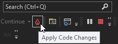

# Write and debug running code with .NET Hot Reload in Visual Studio

With .NET Hot Reload, you can make changes to your code while your app is running. You can use .NET Hot Reload to incrementally build and test code with the benefit of the running app's data context, authentication state, and other real-world complexity that's hard to simulate during design-time.

.NET Hot Reload for C# is available starting in Visual Studio 2022.

.NET Hot Reload is especially helpful in these scenarios:

- Fixing problems found in your code after the app was started in debug mode (with or without the debugger attached, depending on the scenario). Release mode is not supported.

- Modifying your app while the application is running, without the need to manually pause or hit a breakpoint.

.NET Hot Reload works with Edit and Continue and other debugger features, including breakpoints and data inspection. It also works with XAML Hot Reload and, for ASP.NET and .NET MAUI Blazor apps, CSS Hot Reload.

## Update running code with .NET Hot Reload

1. Open a project based on a supported application type. For more information, see [Application support](#application-support).

1. Make sure that **Enable native code debugging** is disabled in the debugger settings or the debug launch profile.

1. Start the app with the debugger attached using either **F5** or, if supported for your application, **Ctrl+F5**.

1. Open a C# code file with some code that can be re-executed through the running apps user interface (for example, code-behind for a button or a ViewModel’s command) or something that is being triggered at an interval through a timer and change the code.

1. Apply the code changes using the **Hot Reload** button, or press **ALT+F10**. 

   

## Requirements

Visual Studio 2022 and .NET 6 provide the best experience for .NET Hot Reload. Starting in Visual Studio 2019 version 16.11, some application types support .NET Hot Reload with the debugger attached.

Supported runtimes include CoreCLR, .NET Framework 4.6 and later versions, and Mono if targeting .NET 6 (for Blazor WASM or .NET MAUI).

- For F5 scenarios (debugger attached), supported frameworks include .NET Core, .NET 5 and later versions, and .NET Framework 4.6 and later versions.

- For Ctrl+F5 scenarios (no debugger attached), .NET 6 is a minimum requirement.

## Application support

The following table shows which application types support .NET Hot Reload with the debugger attached (F5) and without the debugger attached (Ctrl+F5), and whether .NET 6 is required for minimum support (that is, F5). Also shown is the minimum version of Visual Studio that supports the feature.

|Application type|.NET 6 required (F5)|F5|Ctrl+F5|
|-|-|-|-|
|ASP.NET code behind|No|16.11|17.0 Preview 2|
|ASP.NET Razor (Blazor Server and ASP.NET Core|Yes|17.0 Preview 4|17.0 Preview 2|
|ASP.NET Razor (Blazor WASM)|Yes|No|17.0 Preview 3|
|XAML WPF|No|16.11|17.0 Preview 2|
|XAML WinUI3|No|16.11|No|
|WinForms|No|16,11|17.0 Preview 2|
|Console|No|16.11|17.0 Preview 2|
|XAML .NET MAUI WinUI|Yes|16.11|No|
|XAML .NET MAUI Android|Yes|TBD|No|
|XAML .NET MAUI iOS|Yes|TBD|No|
|XAML + Blazor .NET MAUI WinUI|Yes|TBD|No|
|XAML + Blazor .NET MAUI Android|Yes|TBD|No|
|XAML + Blazor .NET MAUI iOS|Yes|TBD|No|

The types of edits you can make with hot reload are determined by the runtime, not by the method you used to start the application (F5 or Ctrl+F5).

## Supported code changes (Core CLR, .NET Framework)

For Core CLR and .NET Framework, the changes supported in [Edit and Continue](../debugger/supported-code-changes-csharp.md) are supported in .NET Hot Reload.

## Supported code changes (Mono)

For Mono, method body replacement is supported with limitations:

- Editing the body of an existing method. The following is supported:

  - Rename local variables and add, remove, or modify statements
  - Edit existing lambdas defined in the method body
  - Edit existing await and yield expressions

- Edit existing getters/setters for a property
  
- Not supported:

  - Add new classes, fields, events, properties, methods 
  - Add new lambdas or local functions 
  - Add new await or yield expressions  
  - Rename parameters 
  - Add, remove, or modify custom attributes 
  - Change a property from `{get;set}` to get-only or `{get;init}` or adding an implementation to an existing property 
  - Anything not supported by C# [Edit and Continue](../debugger/supported-code-changes-csharp.md) (modifying base types, generics, etc) 

## Limitations when used with XAML Hot Reload

TBD

## Configure .NET Hot Reload

You can configure .NET Hot Reload by selecting **Settings** from the **Hot Reload** drop-down button.

Or, open **Tools** > **Options** > **Debugging** > .NET/C++ Hot Reload

The settings for hot reload include:

- **Enable Hot Reload and Edit and Continue when debugging**. Enables hot reload when starting with the debugger attached (F5).

- **Enable Hot Reload when starting without debugging**. Enables hot reload when starting without the debugger attached (Ctrl+F5).

- **Apply Hot Reload on File Save**. Applies code changes when you save the file.

## Error messages

## See also

* [Edit and Continue (Visual C#)](../debugger/edit-and-continue-visual-csharp.md)
