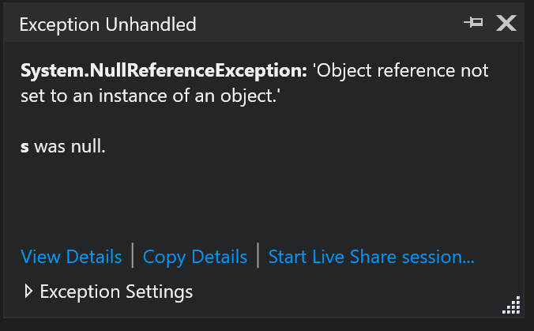
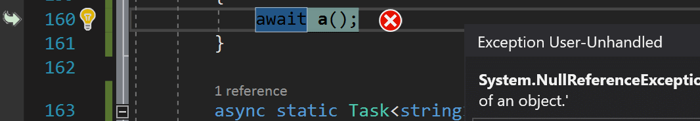
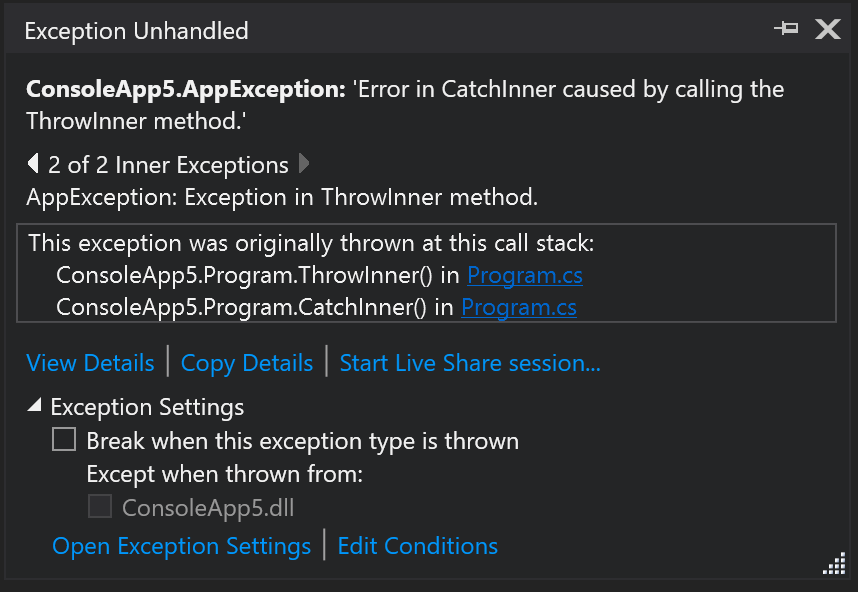
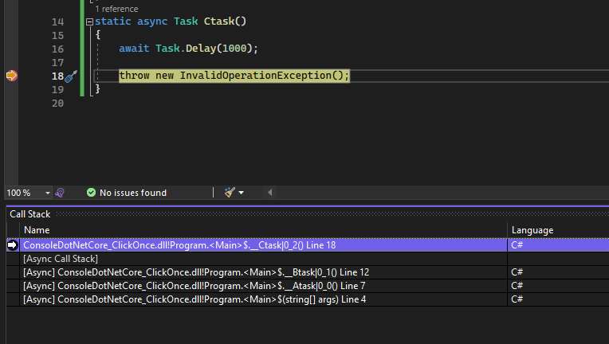

# Inspect an exception using the Exception Helper 

 [!INCLUDE [Visual Studio](~/includes/applies-to-version/vs-windows-only.md)]

Dealing with exceptions is a common problem, no matter your technology or level of expertise. It can be a frustrating experience figuring out why exceptions are causing problems in your code. When you're debugging an exception in Visual Studio, we want to lessen that frustration by providing you with relevant exception information to help you debug your issue faster.

## Pause on the exception

When the debugger breaks on an exception, an exception error icon appears to the right of that line of code. A non-modal Exception helper will appear near the exception icon.

## Inspect exception info

You can instantly read the exception type and exception message in the Exception Helper, and whether the exception was thrown or unhandled. You can inspect and view properties of the Exception object by clicking the **View Details** link.

## Analyze null references

Starting in Visual Studio 2017, for both .NET and C/C++ code, when you hit a `NullReferenceException` or an `AccessViolation`, you see null analysis information in the Exception Helper. The analysis is displayed as text beneath the exception message. In the illustration below, the information is shown as "**s** was null.".

> [!NOTE]
> Null reference analysis in managed code requires .NET version 4.6.2. Null analysis is currently not supported for Universal Windows Platform (UWP) and any other .NET Core applications. It is only available while debugging code that does not have any Just-In-Time (JIT) code optimizations.

## Configure exception settings

You can configure the debugger to break when an exception of the current type is thrown from the **Exception Settings** section of the Exception Helper. If the debugger is paused at a thrown exception, then you can use the checkbox to disable breaking on that exception type when thrown in the future. If you don't want to break on this particular exception when thrown in this particular module, tick the checkbox by the module name under **Except when thrown from:** in the **Exception Settings** window. 

## Inspect inner exceptions

If the exception has any inner exceptions ([InnerException](/dotnet/api/system.exception.innerexception), you can view them in the Exception Helper. If there are multiple exceptions present, you can navigate between them using the left and right arrows shown above the call stack.

## Inspect rethrown exceptions

In cases where an exception has been `thrown` the Exception Helper shows the call stack from the first time the exception was thrown. If the exception was thrown multiple times, only the call stack from the original exception is shown.

::: moniker range=">= vs-2022"

## View the call stack

Starting in Visual Studio 2022 version 17.3, you can view exception stack frames inside the Call Stack window. For async exceptions, this adds the ability to quickly load symbols or locate sources and go directly to the site of the exception. Exception stack frames inside the Call Stack window provide standard call stack features such as automatic navigation, quickly switching back and forth between frames, symbol load, and decompile options to get back to the source code where the exception was thrown.

::: moniker-end

## Share a debug session with Live Share

From the Exception Helper, you can start a [Live Share](/visualstudio/liveshare/) session using the link **Start Live Share session...**. Anyone who joins the Live Share session can see the Exception Helper along with any other debug information.