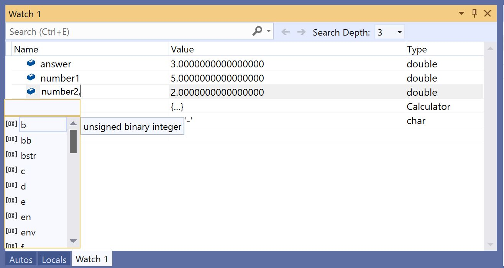

# Format specifiers for C++ in the Visual Studio debugger

You can change the format in which a value is displayed in the **Watch**, **Autos**, and **Locals** windows by using format specifiers.

You can also use format specifiers in the **Immediate** window, the **Command** window, in [tracepoints](../debugger/using-breakpoints.md#BKMK_Print_to_the_Output_window_with_tracepoints), and even in source windows. If you pause on an expression in those windows, the result appears in a [DataTip](../debugger/view-data-values-in-data-tips-in-the-code-editor.md). The DataTip display reflects the format specifier.

> [!NOTE]
> When the Visual Studio native debugger changed to a new debugging engine, some new format specifiers were added and some old ones were removed. The  older debugger is still used when you do interop (mixed native and managed) debugging with C++/CLI.

## Set format specifiers

We'll use the following example code:

```cpp
int main() {
    int my_var1 = 0x0065;
    int my_var2 = 0x0066;
    int my_var3 = 0x0067;
}
```

Add the `my_var1` variable to the **Watch** window while debugging, **Debug** > **Windows** > **Watch** > **Watch 1**. Next, right-click the variable and select **Hexadecimal Display**. Now the **Watch** window shows the value 0x0065. To see this value expressed as a character rather than an integer, first right-click and deselect **Hexadecimal Display**. Then add the character format specifier **, c** in the **Name** column after the variable name. The **Value** column now shows **101 'e'**.


::: moniker range=">= vs-2019" 
You can view and select from a list of available format specifiers by appending a comma (,) to the value in the **Watch** window. 



::: moniker-end

## <a name="BKMK_Visual_Studio_2012_format_specifiers"></a> Format specifiers

The following tables describe the format specifiers that you can use in Visual Studio. Specifiers in bold are only supported for the new debugger, and not for interop debugging with C++/CLI.

::: moniker range=">= vs-2019" 

|Specifier|Format|Original Watch Value|Value Displayed|
|---------------|------------|--------------------------|---------------------|
|d|decimal integer|0x00000066|102|
|o|unsigned octal integer|0x00000066|000000000146|
|x<br /><br /> **h**|hexadecimal integer|102|0xcccccccc|
|X<br /><br /> **H**|hexadecimal integer|102|0xCCCCCCCC|
|xb<br /><br /> **hb**|hexadecimal integer (without leading 0x)|102|cccccccc|
|Xb<br /><br /> **Hb**|hexadecimal integer (without leading 0x)|102|CCCCCCCC|
|b|unsigned binary integer|25|0b00000000000000000000000000011001|
|bb|unsigned binary integer(without leading 0b)|25|00000000000000000000000000011001|
|e|scientific notation|25000000|2.500000e+07|
|g|shorter of scientific or floating point|25000000|2.5e+07|
|c|single character|0x0065|101 'e'|
|s|const char* string (with quotation marks)|\<location> "hello world"|"hello world"|
|**sb**|const char* string (no quotation marks)|\<location> "hello world"|hello world|
|s8|UTF-8 string|\<location> "This is a UTF-8 coffee cup ☕"|"This is a UTF-8 coffee cup ☕"|
|**s8b**|UTF-8 string (no quotation marks)|\<location> "hello world"|hello world|
|su|Unicode (UTF-16 encoding) string (with quotation marks)|\<location> L"hello world"|L"hello world"<br /><br /> u"hello world"|
|sub|Unicode (UTF-16 encoding) string (no quotation marks)|\<location> L"hello world"|hello world|
|bstr|BSTR binary string (with quotation marks)|\<location> L"hello world"|L"hello world"|
|env|Environment block (double-null terminated string)|\<location> L"=::=::\\\\"|L"=::=::\\\\\\0=C:=C:\\\\windows\\\\system32\\0ALLUSERSPROFILE=...|
|**s32**|UTF-32 string (with quotation marks)|\<location> U"hello world"|U"hello world"|
|**s32b**|UTF-32 string (no quotation marks)|\<location> U"hello world"|hello world|
|**en**|enum|Saturday(6)|Saturday|
|**hv**|Pointer type - indicates that the pointer value being inspected is the result of the heap allocation of an array, for example, `new int[3]`.|\<location>{\<first member>}|\<location>{\<first member>, \<second member>, ...}|
|**na**|Suppresses the memory address of a pointer to an object.|\<location>, {member=value...}|{member=value...}|
|**nd**|Displays only the base class information, ignoring derived classes|`(Shape*) square` includes base class and derived class information|Displays only base class information|
|hr|HRESULT or Win32 error code. This specifier is no longer needed for HRESULTs as the debugger decodes them automatically.|S_OK|S_OK|
|wc|Window class flag|0x0010|WC_DEFAULTCHAR|
|wm|Windows message numbers|16|WM_CLOSE|
|nr|Suppress "Raw View" item|
|nvo|Show "Raw View" item for numeric values only|
|!|raw format, ignoring any data type views customizations|\<customized representation>|4|
|handle|Displays information about win32 handle|0x000000000000009c| Displays useful information about handle such as thread ID, etc. |

::: moniker-end

> [!NOTE]
> When the **hv** format specifier is present, the debugger attempts to determine the length of the buffer and display that number of elements. Because it is not always possible for the debugger to find the exact buffer size of an array, you should use a size specifier `(pBuffer,[bufferSize])` whenever possible. The **hv** format specifier is useful when the buffer size is not readily available.

### <a name="BKMK_Size_specifiers_for_pointers_as_arrays_in_Visual_Studio_2012"></a> Size specifiers for pointers as arrays

If you have a pointer to an object you want to view as an array, you can use an integer or an expression to specify the number of array elements.

|Specifier|Format|Original Watch Value|Value Displayed|
|---------------|------------|---------------------------|---------------------|
|n|Decimal or **hexadecimal** integer|pBuffer,[32]<br /><br /> pBuffer,**[0x20]**|Displays `pBuffer` as a 32 element array.|
|**[exp]**|A valid C++ expression that evaluates to an integer.|pBuffer,[bufferSize]|Displays pBuffer as an array of `bufferSize` elements.|
|**expand(n)**|A valid C++ expression that evaluates to an integer|pBuffer, expand(2)|Displays the third element of  `pBuffer`|

## <a name="BKMK_Format_specifiers_for_interop_debugging_and_C___edit_and_continue"></a> Format specifiers for interop debugging with C++/CLI

::: moniker range=">= vs-2022" 

| Specifier | Format | Original Watch Value | Value Displayed |
|--|--|--|--|
| o | unsigned octal integer | 0xF065 | 0170145 |
| x<br /><br />X | Hexadecimal integer | 61541 | 0x0000f065 |
| c | single character | \<location> | 101 'e' |
| s | const char* (with quotation marks) | \<location> | "hello world" |
| su | const wchar_t*<br /><br /> const char16_t\* (with quotation marks) | \<location> | L"hello world" |
| sub | const wchar_t*<br /><br /> const char16_t\* | \<location> | hello world |
| s8 | const char* (with quotation marks) | \<location> | "hello world" |
| hr | HRESULT or Win32 error code.<br/>This specifier is no longer needed for HRESULTs as the debugger decodes them automatically. | S_OK | S_OK |
| wc | Window class flag | 0x00000040, | WC_DEFAULTCHAR |
| wm | Windows message numbers | 0x0010 | WM_CLOSE |
| ! | raw format, ignoring any data type view customizations | \<customized representation> | 4 |

The d, e, f, g, h, i, l, m, ma, mb, md, mq, mu, mw, and u specifiers for native and C++/CLI code required the legacy debugger, which isn't supported in Visual Studio 2022 or later versions.

::: moniker-end

::: moniker range="<vs-2022" 

Specifiers in **bold** are supported only for debugging native and C++/CLI code. These specifiers require the legacy debugger, specified using [Managed Compatibility Mode](../debugger/general-debugging-options-dialog-box.md).

|Specifier|Format|Original Watch Value|Value Displayed|
|---------------|------------|--------------------------|---------------------|
|**d**<br /><br />**i**|signed decimal integer|0xF000F065|-268373915|
|**u**|unsigned decimal integer|0x0065|101|
|o|unsigned octal integer|0xF065|0170145|
|x<br /><br />X|Hexadecimal integer|61541|0x0000f065|
|**l**<br /><br />**h**|long or short prefix for: d, i, u, o, x, X|00406042|0x0c22|
|**f**|signed floating point|(3./2.), f|1.500000|
|**e**|signed scientific notation|(3.0/2.0)|1.500000e+000|
|**g**|signed floating point or signed scientific notation,<br/> whichever is shorter|(3.0/2.0)|1.5|
|c|single character|\<location>|101 'e'|
|s|const char* (with quotation marks)|\<location>|"hello world"|
|su|const wchar_t*<br /><br /> const char16_t\* (with quotation marks)|\<location>|L"hello world"|
|sub|const wchar_t*<br /><br /> const char16_t\*|\<location>|hello world|
|s8|const char* (with quotation marks)|\<location>|"hello world"|
|hr|HRESULT or Win32 error code.<br/>This specifier is no longer needed for HRESULTs as the debugger decodes them automatically.|S_OK|S_OK|
|wc|Window class flag|0x00000040,|WC_DEFAULTCHAR|
|wm|Windows message numbers|0x0010|WM_CLOSE|
|!|raw format, ignoring any data type view customizations|\<customized representation>|4|

### <a name="BKMK_Format_specifiers_memory_locations_in_interop_debugging_and_C___edit_and_continue"></a> Format specifiers for memory locations in interop debugging with C++/CLI

The following table describes formatting symbols used for memory locations. You can use a memory location specifier with any value or expression that evaluates to a location.

Specifiers in **bold** are supported only for debugging native and C++/CLI code. This requires the legacy debugger, specified using [Managed Compatibility Mode](../debugger/general-debugging-options-dialog-box.md).

|Symbol|Format|Original Watch Value|Value Displayed|
|------------|------------|--------------------------|---------------------|
|**ma**|64 ASCII characters|0x0012ffac|0x0012ffac .4...0...".0W&.......1W&.0.:W..1...."..1.JO&.1.2.."..1...0y....1|
|**m**|16 bytes in hexadecimal, followed by 16 ASCII characters|0x0012ffac|0x0012ffac B3 34 CB 00 84 30 94 80 FF 22 8A 30 57 26 00 00 .4...0...".0W&..|
|**mb**|16 bytes in hexadecimal, followed by 16 ASCII characters|0x0012ffac|0x0012ffac B3 34 CB 00 84 30 94 80 FF 22 8A 30 57 26 00 00 .4...0...".0W&..|
|**mw**|8 words|0x0012ffac|0x0012ffac 34B3 00CB 3084 8094 22FF 308A 2657 0000|
|**md**|4 doublewords|0x0012ffac|0x0012ffac 00CB34B3 80943084 308A22FF 00002657|
|**mq**|2 quadwords|0x0012ffac|0x0012ffac 7ffdf00000000000 5f441a790012fdd4|
|**mu**|2-byte characters (Unicode)|0x0012ffac|0x0012ffac 8478 77f4 ffff ffff 0000 0000 0000 0000|

::: moniker-end

### <a name="BKMK_Size_specifier_for_pointers_as_arrays_in_interop_debugging_and_C___edit_and_continue"></a> Size specifier for pointers as arrays in interop debugging with C++/CLI

If you have a pointer to an object you want to view as an array, you can use an integer to specify the number of array elements.

|Specifier|Format|Expression|Value Displayed|
|---------------|------------|----------------|---------------------|
|n|Decimal integer|pBuffer[32]|Displays `pBuffer` as a 32-element array.|
