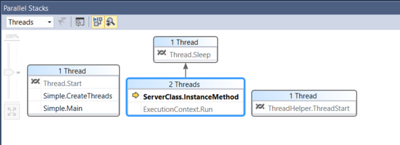
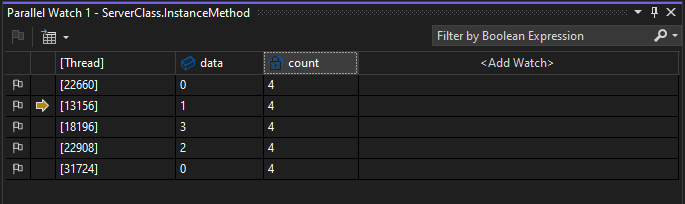

# Get started debugging multithreaded applications (C#, Visual Basic, C++)

Visual Studio provides several tools and user interface elements to help you debug multithreaded applications. This tutorial shows how to use thread markers, the **Parallel Stacks** window, the **Parallel Watch** window, conditional breakpoints, and filter breakpoints. Completing this tutorial will familiarize you with Visual Studio features for debugging multithreaded applications.

These two topics provide additional information on using other multithreaded debugging tools:

- To use the **Debug Location** toolbar and the **Threads** window, see [Walkthrough: Debug a multithreaded application](../debugger/how-to-use-the-threads-window.md).

- For a sample that uses <xref:System.Threading.Tasks.Task> (managed code) and the concurrency runtime (C++), see [Walkthrough: Debug a parallel application](../debugger/walkthrough-debugging-a-parallel-application.md). For general debugging tips that apply to most multithreaded application types, read both that topic and this one.

You'll first need a multithreaded application project. An example follows.

## Create a multithreaded app project

1. Open Visual Studio and create a new project.

   ::: moniker range=">=vs-2019"

   If the start window is not open, choose **File** > **Start Window**.

   On the start window, choose **Create a new project**.

   On the **Create a new project** window, enter or type *console* in the search box. Next, choose **C#**, **C++**, or **Visual Basic** from the Language list, and then choose **Windows** from the Platform list. 

   After you apply the language and platform filters, choose the **Console App** template for .NET Core or C++, and then choose **Next**.

   > [!NOTE]
   > If you don't see the correct template, go to **Tools** > **Get Tools and Features...**, which opens the Visual Studio Installer. Choose the **.NET Core cross-platform development** or **Desktop development with C++** workload, then choose **Modify**.

   In the **Configure your new project** window, type or enter *MyThreadWalkthroughApp* in the **Project name** box. Then, choose either **Next** or **Create**, whichever option is available.

   For a .NET Core project, choose either the recommended target framework or .NET 6, and then choose **Create**.

   ::: moniker-end
   ::: moniker range="vs-2017"
   From the top menu bar, choose **File** > **New** > **Project**. In the left pane of the **New project** dialog box, choose the following:

   - For a C# app, under **Visual C#**, choose **Windows Desktop**, and then in the middle pane choose **Console App (.NET Framework)**.
   - For a Visual Basic app, under **Visual Basic**, choose **Windows Desktop**, and then in the middle pane choose **Console App (.NET Framework)**.
   - For a C++ app, under **Visual C++**, choose **Windows Desktop**,, and then choose **Windows Console Application**.

   If you don't see the **Console App (.NET Framework)** for, for C++, the **Console App** project template, go to **Tools** > **Get Tools and Features...**, which opens the Visual Studio Installer. Choose the **.NET desktop development** or **Desktop development with C++** workload, then choose **Modify**.

   Then, type a name like *MyThreadWalkthroughApp* and click **OK**.

   Select **OK**.
   ::: moniker-end

   A new console project appears. After the project has been created, a source file appears. Depending on the language you have chosen, the source file might be called *Program.cs*, *MyThreadWalkthroughApp.cpp*, or *Module1.vb*.

1. Delete the code that appears in the source file and replace it with the appropriate example code listing below.

    ```csharp
    using System;
    using System.Threading;

    public class ServerClass
    {

        static int count = 0;
        // The method that will be called when the thread is started.
        public void InstanceMethod()
        {
            Console.WriteLine(
                "ServerClass.InstanceMethod is running on another thread.");

            int data = count++;
            // Pause for a moment to provide a delay to make
            // threads more apparent.
            Thread.Sleep(3000);
            Console.WriteLine(
                "The instance method called by the worker thread has ended. " + data);
        }
    }

    public class Simple
    {
        public static void Main()
        {
            for (int i = 0; i < 10; i++)
            {
                CreateThreads();
            }
        }
        public static void CreateThreads()
        {
            ServerClass serverObject = new ServerClass();

            Thread InstanceCaller = new Thread(new ThreadStart(serverObject.InstanceMethod));
            // Start the thread.
            InstanceCaller.Start();

            Console.WriteLine("The Main() thread calls this after "
                + "starting the new InstanceCaller thread.");

        }
    }
    ```

    ```C++
    // #include "pch.h" // Use with pre-compiled header
    #include <thread>
    #include <iostream>
    #include <vector>
    #include <string>

    int count = 0;

    void doSomeWork() {

        std::cout << "The doSomeWork function is running on another thread." << std::endl;
        int data = count++;
        // Pause for a moment to provide a delay to make
        // threads more apparent.
        std::this_thread::sleep_for(std::chrono::seconds(3));
        std::string str = std::to_string(data);
        std::cout << "The function called by the worker thread has ended. " + str<< std::endl;
    }

    int main() {
        std::vector<std::thread> threads;

        for (int i = 0; i < 10; ++i) {

            threads.push_back(std::thread(doSomeWork));
            std::cout << "The Main() thread calls this after starting the new thread" << std::endl;
    }

    for (auto& thread : threads) {
        thread.join();
    }

    return 0;
    }
    ```

    ```VB
    Imports System.Threading

    Public Class ServerClass
        ' The method that will be called when the thread is started.
        Public count = 0
        Public Sub InstanceMethod()
            Console.WriteLine(
                    "ServerClass.InstanceMethod is running on another thread.")

            Dim data = count + 1
            ' Pause for a moment to provide a delay to make
            ' threads more apparent.
            Thread.Sleep(3000)
            Console.WriteLine(
                    "The instance method called by the worker thread has ended. " + data)
        End Sub

    End Class

    Public Class Simple

        Public Shared Sub Main()

            Dim ts As New ThreadStarter
            For index = 1 To 10
                ts.CreateThreads()
            Next

        End Sub

    End Class
    Public Class ThreadStarter
        Public Sub CreateThreads()
            Dim serverObject As New ServerClass()

            ' Create the thread object, passing in the
            ' serverObject.InstanceMethod method using a
            ' ThreadStart delegate.
            Dim InstanceCaller As New Thread(AddressOf serverObject.InstanceMethod)

            ' Start the thread.
            InstanceCaller.Start()

            Console.WriteLine("The Main() thread calls this after " _
                        + "starting the new InstanceCaller thread.")

        End Sub
    End Class
    ```

1. On the **File** menu, select **Save All**.

1. (Visual Basic only) In Solution Explorer (right pane), right-click the project node, choose **Properties**. Under the **Application** tab, change the **Startup object** to **Simple**.

## Debug the multithreaded app

1. In the source code editor, look for one of the following code snippets:

    ```csharp
    Thread.Sleep(3000);
    Console.WriteLine();
    ```

    ```C++
    std::this_thread::sleep_for(std::chrono::seconds(3));
    std::cout << "The function called by the worker thread has ended." << std::endl;
    ```

    ```VB
    Thread.Sleep(3000)
    Console.WriteLine()
    ```

1. Left-click in the left gutter of the `Thread.Sleep` or `std::this_thread::sleep_for` statement to insert a new breakpoint.

    In the gutter, a red circle indicates that a breakpoint is set at this location.

2. On the **Debug** menu, select **Start Debugging** (**F5**).

    Visual Studio builds the solution, the app starts to run with the debugger attached, and then the app stops at the breakpoint.

3. In the source code editor, locate the line that contains the breakpoint.

### <a name="ShowThreadsInSource"></a>Discover the thread marker  

1. In the Debug Toolbar, select the **Show Threads in Source** button .

2. Press **F11** once to advance the debugger one line of code.

3. Look at the gutter on the left side of the window. On this line, you will see a *thread marker* icon   that resembles two twisted threads. The thread marker indicates that a thread is stopped at this location.

    A thread marker may be partially concealed by a breakpoint.

4. Hover the pointer over the thread marker. A DataTip appears telling you the name and thread ID number for each stopped thread. In this case, the name is probably `<noname>`.

5. Select the thread marker to see the available options on the shortcut menu.

### <a name="ParallelStacks"></a>View the thread locations

In the **Parallel Stacks** window, you can switch between a Threads view and (for task-based programming) Tasks view, and you can view call stack information for each thread. In this app, we can use the Threads view.

1. Open the **Parallel Stacks** window by choosing **Debug** > **Windows** > **Parallel Stacks**. You should see something similar to the following. The exact information will differ depending on the current location of each thread, your hardware, and your programming language.

    

    In this example, from left to right we see this information for managed code:

    - The Main thread (left side) has stopped on `Thread.Start`, where the stop point is indicated by the thread marker icon .
    - Two threads have entered the `ServerClass.InstanceMethod`, one of which is the current thread (yellow arrow), while the other thread has stopped in `Thread.Sleep`.
    - A new thread (on the right) is also starting but is stopped on `ThreadHelper.ThreadStart`.

2. Right-click entries in the **Parallel Stacks** window to see the available options on the shortcut menu.

    You can take various actions from these right-click menus, but for this tutorial we will show more of these details in the **Parallel Watch** window (next sections).

    > [!NOTE]
    > To see a list view with information on each thread, use the **Threads** window instead. See [Walkthrough: Debug a Multithreaded Application](../debugger/how-to-use-the-threads-window.md).

### Set a watch on a variable

1. Open the **Parallel Watch** window by selecting **Debug** > **Windows** > **Parallel Watch** > **Parallel Watch 1**.

2. Select the cell where you see the `<Add Watch>` text (or the empty header cell in the 4th column) and enter `data`.

    The values for the data variable for each thread appear in the window.

3. Select the cell where you see the `<Add Watch>` text (or the empty header cell in the 5th column) and enter `count`.

    The values for the `count` variable for each thread appear in the window. If you don't see this much information yet, try pressing **F11** a few times to advance the execution of the threads in the debugger.

    

4. Right-click on one of the rows in the window to see the available options.

### Flag and unflag threads
You can flag threads to keep track of important threads and ignore the other threads.

1. In the **Parallel Watch** window, hold down the **Shift** key and select multiple rows.

2. Right-click and select **Flag**.

    All the selected threads are flagged. Now, you can filter to show only flagged threads.

3. In the **Parallel Watch** window, select the **Show Only Flagged Threads** button .

    Only the flagged threads appear in the list.

    > [!TIP]
    > After you have flagged some threads, you can right-click a line of code in the code editor and choose **Run Flagged Threads to Cursor**. Make sure to choose code that all flagged threads will reach. Visual Studio will pause threads on the selected line of code, making it easier to control the order of execution by [freezing and thawing threads](#bkmk_freeze).

4. Select the **Show Only Flagged Threads** button again to toggle back to **Show All Threads** mode.

5. To unflag threads, right-click one or more flagged threads in the **Parallel Watch** window and select **Unflag**.

### <a name="bkmk_freeze"></a> Freeze and thaw thread execution

> [!TIP]
> You can freeze and thaw (suspend and resume) threads to control the order in which threads perform work. This can help you resolve concurrency issues such as deadlocks and race conditions.

1. In the **Parallel Watch** window, with all the rows selected, right-click and select **Freeze**.

    In the second column, a pause icon appears for each row. The pause icon indicates that the thread is frozen.

2. Deselect all other rows by selecting one row only.

3. Right-click a row and select **Thaw**.

    The pause icon goes away on this row, indicating that the thread is no longer frozen.

4. Switch to the code editor and press **F11**. Only the unfrozen thread runs.

    The app may also instantiate some new threads. Any new threads are unflagged and are not frozen.

### <a name="bkmk_follow_a_thread"></a> Follow a single thread with conditional breakpoints

It can be helpful to follow the execution of a single thread in the debugger. One way to do that is by freezing threads that you are not interested in. In some scenarios you may need to follow a single thread without freezing other threads, for example to reproduce a particular bug. To follow a thread without freezing other threads, you must avoid breaking into code except on the thread that you are interested in. You can do this by setting a [conditional breakpoint](../debugger/using-breakpoints.md#BKMK_Specify_a_breakpoint_condition_using_a_code_expression).

You can set breakpoints on different conditions, such as the thread name or the thread ID. It may be helpful is to set the condition on data that you know is unique to each thread. This is a common debugging scenario, in which you are more interested in some particular data value than in any particular thread.

1. Right-click the breakpoint you previously created and select **Conditions**.

2. In the **Breakpoint Settings** window, enter `data == 5` for the conditional expression.

    

    > [!TIP]
    > If you are more interested in a specific thread, then use a thread name or thread ID for the condition. To do this in the **Breakpoint Settings** window, select **Filter** instead of **Conditional expression**, and follow the filter tips. You may want to name your threads in your app code, as threads IDs change when you restart the debugger.

3. Close the **Breakpoint Settings** window.

4. Select the Restart  button to restart your debugging session.

    You'll break into code on the thread where the data variable's value is 5. In the **Parallel Watch** window, look for the yellow arrow indicating the current debugger context.

5. Now, you can step over code (**F10**) and step into code (**F11**) and follow the execution of the single thread.

    So long as the breakpoint condition is unique to the thread, and the debugger doesn't hit any other breakpoints on other threads (you may need to disable them), you can step over code and step into code without switching to other threads.

    > [!NOTE]
    > When you advance the debugger, all threads will run. However, the debugger won't break into code on other threads unless one of the other threads hits a breakpoint.

## See also

- [Debug multithreaded applications](../debugger/debug-multithreaded-applications-in-visual-studio.md)
- [How to: Switch to another thread while debugging](../debugger/how-to-switch-to-another-thread-while-debugging.md)
- [How to: Use the Parallel Stack window](../debugger/using-the-parallel-stacks-window.md)
- [How to: Use the Parallel Watch window](../debugger/how-to-use-the-parallel-watch-window.md)