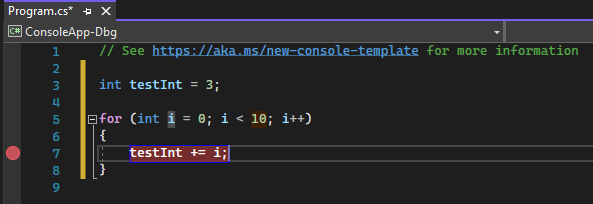
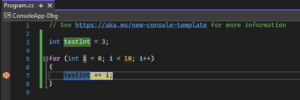
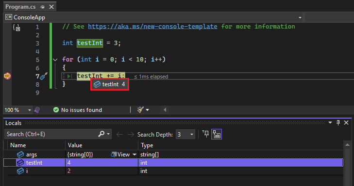
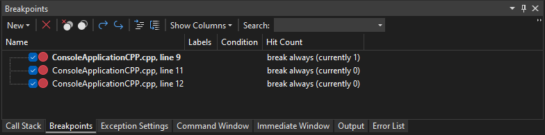
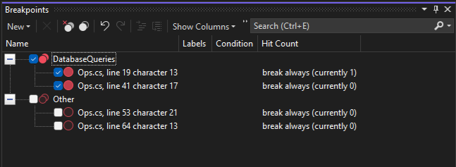

# Get started with breakpoints in the Visual Studio debugger

Breakpoints are one of the most important debugging techniques in your developer's toolbox. You set breakpoints wherever you want to pause debugger execution. For example, you may want to see the state of code variables or look at the call stack at a certain breakpoint.

## <a name="BKMK_Overview"></a> Set breakpoints in source code

You can set a breakpoint on any line of executable code. For example, take a look at this simple C# code that creates a simple loop.

```csharp
int testInt = 3;

for (int i = 0; i < 10; i++)
{
    testInt += i;
}
```

You could set a breakpoint on the line of code with the variable assignment (`int testInt = 3`), the `for` loop, or any code inside the `for` loop. You can't set a breakpoint on method signatures, declarations for a namespace or class, or variable declarations if there's no assignment and no getter/setter.

To set a breakpoint in source code:

- Click in the far left margin next to a line of code. You can also select the line and press **F9**, select **Debug** > **Toggle Breakpoint**, or right-click and select **Breakpoint** > **Insert breakpoint**. The breakpoint appears as a red dot in the left margin.

For most languages (including C#), Visual Studio automatically highlights breakpoint and current execution lines. For some languages, such as C++, which isn't highlighted by default, you can turn on highlighting of breakpoint and current lines by selecting **Tools** (or **Debug**) > **Options** > **Debugging** >  **Highlight entire source line for breakpoints and current statement (C++ only)**.

::: moniker range=">= vs-2022"

::: moniker-end
::: moniker range="<= vs-2019"

::: moniker-end

To debug, press **F5** or select **Debug** > **Start Debugging**.

When you debug, execution pauses at the breakpoint, before the code on that line is executed. The breakpoint symbol shows a yellow arrow.

::: moniker range=">= vs-2022"
At the breakpoint in the following example, the value of `testInt` is still 3. So, the value hasn't changed since the variable was initialized (set to a value of 3) because the statement in yellow hasn't yet executed.


::: moniker-end

::: moniker range="<= vs-2019"
At the breakpoint in the following example, the value of `testInt` is still 1. So, the value hasn't changed since the variable was initialized (set to a value of 1) because the statement in yellow hasn't yet executed.


::: moniker-end

When the debugger stops at the breakpoint, you can look at the current state of the app, including [variable values](../debugger/debugger-feature-tour.md#inspect-variables-with-data-tips) and the [call stack](../debugger/how-to-use-the-call-stack-window.md).

::: moniker range=">= vs-2022"
For example, in the following illustration, you can see the value of `testInt` in a data tip and in the **Locals** window.


::: moniker-end

Here are a few general instructions for working with breakpoints.

- The breakpoint is a toggle. You can click it, press **F9**, or use **Debug** > **Toggle Breakpoint** to delete or reinsert it.

- To disable a breakpoint without deleting it, hover over or right-click it, and select **Disable breakpoint**. Disabled breakpoints appear as empty dots in the left margin or the **Breakpoints** window. To re-enable a breakpoint, hover over or right-click it, and select **Enable breakpoint**.

- Set conditions and actions, add and edit labels, or export a breakpoint by right-clicking it and selecting the appropriate command, or hovering over it and selecting the **Settings** icon.

## Types of breakpoints

Visual Studio supports different types of breakpoints to support different debugging scenarios, such as conditional breakpoints that only activate based on specified criteria. For more information, see [Use the right type of breakpoint](../debugger/using-breakpoints.md).

## <a name="BKMK_Specify_advanced_properties_of_a_breakpoint_"></a> Manage breakpoints in the Breakpoints window

 You can use the **Breakpoints** window to see and manage all the breakpoints in your solution. This centralized location is especially helpful in a large solution, or for complex debugging scenarios where breakpoints are critical.

In the **Breakpoints** window, you can search, sort, filter, enable/disable, or delete breakpoints. You can also set conditions and actions, or add a new function or data breakpoint.

To open the **Breakpoints** window, select **Debug** > **Windows** > **Breakpoints**, or press **Ctrl**+**Alt**+**B**.

::: moniker range=">= vs-2022"

::: moniker-end
::: moniker range="<= vs-2019"

::: moniker-end

To select the columns to display in the **Breakpoints** window, select **Show Columns**. Select a column header to sort the breakpoints list by that column.

### <a name="BKMK_Set_a_breakpoint_at_a_function_return_in_the_Call_Stack_window"></a> Breakpoint labels

You can use labels to sort and filter the list of breakpoints in the **Breakpoints** window.

1. To add a label to a breakpoint, right-click the breakpoint in the source code or the **Breakpoints** window, and then select **Edit labels**. Add a new label or choose an existing one, and then select **OK**.
2. Sort the breakpoint list in the **Breakpoints** window by selecting the **Labels**, **Conditions**, or other column headers. You can select the columns to display by selecting **Show Columns** in the toolbar.

::: moniker range=">= vs-2022"
### Breakpoint groups

For complex debugging scenarios, you may want to create breakpoint groups to organize your breakpoints. This allows you to quickly enable and disable logical groupings of breakpoints, based upon the current scenario that you're trying to debug.

You can create breakpoints in the **Breakpoints** window by selecting **New > Breakpoint Group**, and providing a name for the group. To add a breakpoint to a group, right-click the breakpoint and choose **Add to Breakpoint Group** > **\<group name\>**. Or, drag-and-drop your breakpoints into the desired group.



To set a default breakpoint group, right-click a group and select **Set as default Breakpoint Group**. When you set a default breakpoint group, newly created breakpoints are automatically added to the group.

::: moniker-end

### Export and import breakpoints

To save or share the state and location of your breakpoints, you can export or import them.

::: moniker range=">= vs-2022"
Starting in Visual Studio 2022 version 17.12 Preview 3, breakpoint groups are also included with the exported and imported breakpoints.
::: moniker-end

- To export a single breakpoint to an XML file, right-click the breakpoint in the source code or **Breakpoints** window, and select **Export** or **Export selected**. Select an export location, and then select **Save**. The default location is the solution folder.
- To export several breakpoints, in the **Breakpoints** window, select the boxes next to the breakpoints, or enter search criteria in the **Search** field. Select the **Export all breakpoints matching the current search criteria** icon, and save the file.
- To export all breakpoints, deselect all boxes and leave the **Search** field blank. Select the **Export all breakpoints matching the current search criteria** icon, and save the file.
- To import breakpoints, in the **Breakpoints** window, select the **Import breakpoints from a file** icon, navigate to the XML file location, and select **Open**.

## <a name="BKMK_Set_a_breakpoint_from_debugger_windows"></a> Set breakpoints from debugger windows

You can also set breakpoints from the **Call Stack** and **Disassembly** debugger windows.

### Set a breakpoint in the Call Stack window

 To break at the instruction or line that a calling function returns to, you can set a breakpoint in the **Call Stack** window.

**To set a breakpoint in the Call Stack window:**

1. To open the **Call Stack** window, you must be paused during debugging. Select **Debug** > **Windows** > **Call Stack**, or press **Ctrl**+**Alt**+**C**.

2. In the **Call Stack** window, right-click the calling function and select **Breakpoint** > **Insert Breakpoint**, or press **F9**.

   A breakpoint symbol appears next to the function call name in the left margin of the call stack.

The call stack breakpoint appears in the **Breakpoints** window as an address, with a memory location that corresponds to the next executable instruction in the function.

The debugger breaks at the instruction.

For more information about the call stack, see [How to: Use the Call Stack window](../debugger/how-to-use-the-call-stack-window.md).

To visually trace breakpoints during code execution, see [Map methods on the call stack while debugging](../debugger/map-methods-on-the-call-stack-while-debugging-in-visual-studio.md).

### Set a breakpoint in the Disassembly window

1. To open the **Disassembly** window, you must be paused during debugging. Select **Debug** > **Windows** > **Disassembly**, or press **Ctrl**+**Alt**+**D**.

2. In the **Disassembly** window, click in the left margin of the instruction you want to break at. You can also select it and press **F9**, or right-click and select **Breakpoint** > **Insert Breakpoint**.

## Related content

- [What is debugging?](../debugger/what-is-debugging.md)
- [Write better C# code using Visual Studio](../debugger/write-better-code-with-visual-studio.md)
- [First look at debugging](../debugger/debugger-feature-tour.md)
- [Troubleshoot breakpoints in the Visual Studio debugger](/troubleshoot/developer/visualstudio/debuggers/troubleshooting-breakpoints)
