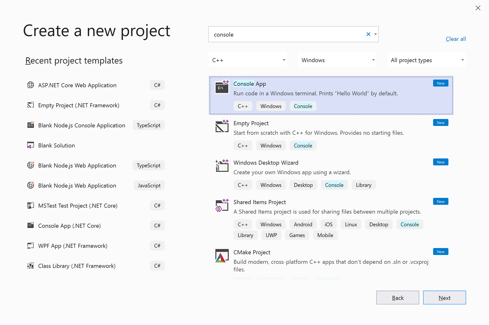
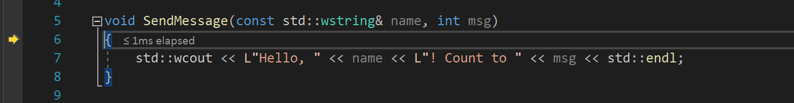
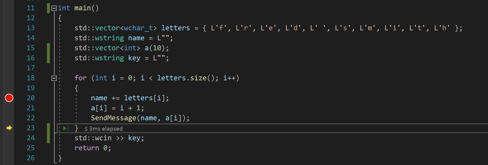
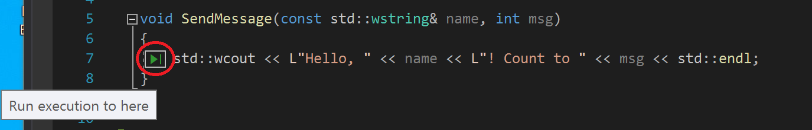
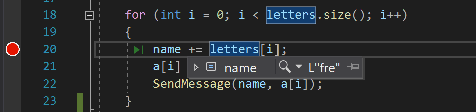
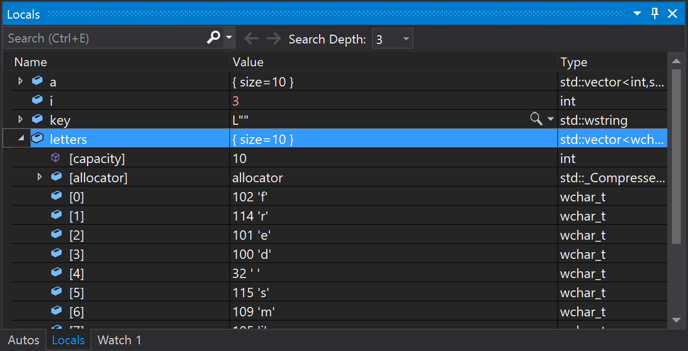
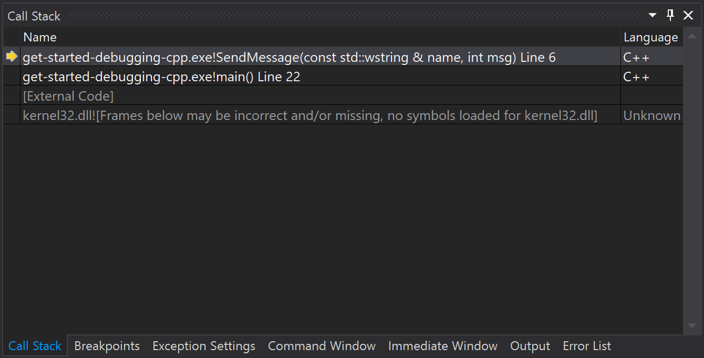

# Tutorial: Learn to debug C++ code using Visual Studio

This article introduces the features of the Visual Studio debugger in a step-by-step walkthrough. If you want a higher-level view of the debugger features, see [First look at the debugger](../debugger/debugger-feature-tour.md). When you *debug your app*, it usually means that you are running your application with the debugger attached. When you do this, the debugger provides many ways to see what your code is doing while it runs. You can step through your code and look at the values stored in variables, you can set watches on variables to see when values change, you can examine the execution path of your code, see whether a branch of code is running, and so on. If this is the first time that you've tried to debug code, you may want to read [Debugging for absolute beginners](../debugger/debugging-absolute-beginners.md) before going through this article.

Although the demo app is C++, most of the features are applicable to C#, Visual Basic, F#, Python, JavaScript, and other languages supported by Visual Studio (F# does not support Edit-and-continue. F# and JavaScript do not support the **Autos** window). The screenshots are in C++.

In this tutorial, you will:

> [!div class="checklist"]
> * Start the debugger and hit breakpoints.
> * Learn commands to step through code in the debugger
> * Inspect variables in data tips and debugger windows
> * Examine the call stack

## Prerequisites

::: moniker range=">=vs-2019"

You must have Visual Studio 2019 installed and the **Desktop development with C++** workload.

::: moniker-end
::: moniker range="vs-2017"

You must have Visual Studio 2017 installed and the **Desktop development with C++** workload.

::: moniker-end

::: moniker range="vs-2017"

If you haven't already installed Visual Studio, go to the [Visual Studio downloads](https://visualstudio.microsoft.com/vs/older-downloads/?utm_medium=microsoft&utm_source=docs.microsoft.com&utm_campaign=vs+2017+download) page to install it for free.

::: moniker-end

::: moniker range=">=vs-2019"

If you haven't already installed Visual Studio, go to the [Visual Studio downloads](https://visualstudio.microsoft.com/downloads) page to install it for free.

::: moniker-end

::: moniker range="vs-2022"

If you haven't already installed Visual Studio 2022, go to the [Visual Studio 2022 downloads](https://visualstudio.microsoft.com/downloads) page to install it for free.

::: moniker-end

If you need to install the workload but already have Visual Studio, go to **Tools** > **Get Tools and Features...**, which opens the Visual Studio Installer. The Visual Studio Installer launches. Choose the **Desktop development with C++** workload, then choose **Modify**.

## Create a project

First, you'll create a C++ console application project. The project type comes with all the template files you'll need, before you've even added anything!

::: moniker range="vs-2017"

1. Open Visual Studio 2017.

2. From the top menu bar, choose **File** > **New** > **Project**.

3. In the **New Project** dialog box in the left pane, expand **Visual C++** and then choose **Windows Desktop**. In the middle pane, choose **Windows Console Application**. Then name the project *get-started-debugging*.

     If you don't see the **Console App** project template, choose the **Open Visual Studio Installer** link in the left pane of the **New Project** dialog box. The Visual Studio Installer launches. Choose the **.NET Core cross-platform development** workload, and then choose **Modify**.

4. Click **OK**.

   Visual Studio opens your new project.

::: moniker-end

::: moniker range=">=vs-2019"

1. Open Visual Studio 2019.

   If the start window is not open, choose **File** > **Start Window**.

1. On the start window, choose **Create a new project**.

1. On the **Create a new project** window, enter or type *console* in the search box. Next, choose **C++** from the Language list, and then choose **Windows** from the Platform list. 

   After you apply the language and platform filters, choose the **Console App** template, and then choose **Next**.

   

   > [!NOTE]
   > If you do not see the **Console App** template, you can install it from the **Create a new project** window. In the **Not finding what you're looking for?** message, choose the **Install more tools and features** link. Then, in the Visual Studio Installer, choose the **Desktop development with C++** workload.

1. In the **Configure your new project** window, type or enter *get-started-debugging* in the **Project name** box. Then, choose **Create**.

   Visual Studio opens your new project.

::: moniker-end

## Create the application

1. In *get-started-debugging.cpp*, replace all of the default code with the following code instead:

    ```cpp
    #include <string>
    #include <vector>
    #include <iostream>

    void SendMessage(const std::wstring& name, int msg)
    {
        std::wcout << L"Hello, " << name << L"! Count to " << msg << std::endl;
    }

    int main()
    {
        std::vector<wchar_t> letters = { L'f', L'r', L'e', L'd', L' ', L's', L'm', L'i', L't', L'h' };
        std::wstring name = L"";
        std::vector<int> a(10);
        std::wstring key = L"";

        for (int i = 0; i < letters.size(); i++)
        {
            name += letters[i];
            a[i] = i + 1;
            SendMessage(name, a[i]);
        }
        std::wcin >> key;
        return 0;
    }
    ```

## Start the debugger!

1. Press **F5** (**Debug > Start Debugging**) or the **Start Debugging** button  in the Debug Toolbar.

     **F5** starts the app with the debugger attached to the app process, but right now we haven't done anything special to examine the code. So the app just loads and you see the console output.

    ```cmd
    Hello, f! Count to 1
    Hello, fr! Count to 2
    Hello, fre! Count to 3
    Hello, fred! Count to 4
    Hello, fred ! Count to 5
    Hello, fred s! Count to 6
    Hello, fred sm! Count to 7
    Hello, fred smi! Count to 8
    Hello, fred smit! Count to 9
    Hello, fred smith! Count to 10
    ```

     In this tutorial, we'll take a closer look at this app using the debugger and get a look at the debugger features.

2. Stop the debugger by pressing the red stop  button (**Shift** + **F5**).

3. In the console window, press a key and **Enter** to close the console window.

## Set a breakpoint and start the debugger

1. In the `for` loop of the `main` function, set a breakpoint by clicking the left margin of the following line of code:

    `name += letters[i];`

    A red circle  appears where you set the breakpoint.

    Breakpoints are one of the most basic and essential features of reliable debugging. A breakpoint indicates where Visual Studio should suspend your running code so you can take a look at the values of variables, or the behavior of memory, or whether or not a branch of code is getting run.

2. Press **F5** or the **Start Debugging** button , the app starts, and the debugger runs to the line of code where you set the breakpoint.

    

    The yellow arrow represents the statement on which the debugger paused, which also suspends app execution at the same point (this statement has not yet executed).

     If the app is not yet running, **F5** starts the debugger and stops at the first breakpoint. Otherwise, **F5** continues running the app to the next breakpoint.

    Breakpoints are a useful feature when you know the line of code or the section of code that you want to examine in detail. For information on the different types of breakpoints you can set, such as conditional breakpoints, see [Using breakpoints](../debugger/using-breakpoints.md).

## Navigate code in the debugger using step commands

Mostly, we use the keyboard shortcuts here, because it's a good way to get fast at executing your app in the debugger (equivalent commands such as menu commands are shown in parentheses).

1. While paused in the `for` loop in the `main` method, press **F11** (or choose **Debug > Step Into**) twice to to advance to the `SendMessage` method call.

     After pressing **F11** twice, you should be at this line of code:

     `SendMessage(name, a[i]);`

1. Press **F11** one more time to step into the `SendMessage` method.

     The yellow pointer advances into the `SendMessage` method.

     

     F11 is the **Step Into** command and advances the app execution one statement at a time. F11 is a good way to examine the execution flow in the most detail. (To move faster through code, we show you some other options also.) By default, the debugger skips over non-user code (if you want more details, see [Just My Code](../debugger/just-my-code.md)).

     Let's say that you are done examining the `SendMessage` method, and you want to get out of the method but stay in the debugger. You can do this using the **Step Out** command.

1. Press **Shift** + **F11** (or **Debug > Step Out**).

     This command resumes app execution (and advances the debugger) until the current method or function returns.

     You should be back in the `for` loop in the `main` method, paused at the `SendMessage` method call.

1. Press **F11** several times until you get back to the `SendMessage` method call again.

1. While paused at the method call, press **F10** (or choose **Debug > Step Over**) once.

     

     Notice this time that the debugger does not step into the `SendMessage` method. **F10** advances the debugger without stepping into functions or methods in your app code (the code still executes). By pressing **F10** on the `SendMessage` method call (instead of **F11**), we skipped over the implementation code for `SendMessage` (which maybe we're not interested in right now). For more information on different ways to move through your code, see [Navigate code in the debugger](../debugger/navigating-through-code-with-the-debugger.md).

## Navigate code using Run to Click

1. Press **F5** to advance to the breakpoint.

1. In the code editor, scroll down and hover over the `std::wcout` function in the `SendMessage` method until the green **Run to Click** button  appears on the left. The tooltip for the button shows "Run execution to here".

     

   > [!NOTE]
   > The **Run to Click** button is new in [!include[vs_dev15](../misc/includes/vs_dev15_md.md)]. (If you don't see the green arrow button, use **F11** in this example instead to advance the debugger to the right place.)

2. Click the **Run to Click** button .

    The debugger advances to the `std::wcout` function.

    Using this button is similar to setting a temporary breakpoint. **Run to Click** is handy for getting around quickly within a visible region of app code (you can click in any open file).

## Restart your app quickly

Click the **Restart**  button in the Debug Toolbar (**Ctrl** + **Shift** + **F5**).

When you press **Restart**, it saves time versus stopping the app and restarting the debugger. The debugger pauses at the first breakpoint that is hit by executing code.

The debugger stops again at the breakpoint you previously set inside the `for` loop.

## Inspect variables with data tips

Features that allow you to inspect variables are one of the most useful features of the debugger, and there are different ways to do it. Often, when you try to debug an issue, you are attempting to find out whether variables are storing the values that you expect them to have at a particular time.

1. While paused on the `name += letters[i]` statement, hover over the `letters` variable and you see it's default value, `size={10}`.

1. Expand the `letters` variable to see its properties, which include all the elements that the variable contains.

1. Next, hover over the `name` variable, and you see its current value, an empty string.

1. Press **F5** (or **Debug** > **Continue**) a few times to iterate several times through the `for` loop, pausing again at the breakpoint, and hovering over the `name` variable each time to check its value.

     

     The value of the variable changes with each iteration of the `for` loop, showing values of `f`, then `fr`, then `fre`, and so on.

     Often, when debugging, you want a quick way to check property values on variables, to see whether they are storing the values that you expect them to store, and the data tips are a good way to do it.

## Inspect variables with the Autos and Locals windows

1. Look at the **Autos** window at the bottom of the code editor.

    If it is closed, open it while paused in the debugger by choosing **Debug** > **Windows** > **Autos**.

    In the **Autos** window, you see variables and their current value. The **Autos** window shows all variables used on the current line or the preceding line (Check documentation for language-specific behavior).

1. Next, look at the **Locals** window, in a tab next to the **Autos** window.

1. Expand the `letters` variable to show the elements that it contains.

     

    The **Locals** window shows you the variables that are in the current [scope](https://www.wikipedia.org/wiki/Scope_(computer_science)), that is, the current execution context.

## Set a watch

1. In the main code editor window, right-click the `name` variable and choose **Add Watch**.

    The **Watch** window opens at the bottom of the code editor. You can use a **Watch** window to specify a variable (or an expression) that you want to keep an eye on.

    Now, you have a watch set on the `name` variable, and you can see its value change as you move through the debugger. Unlike the other variable windows, the **Watch** window always shows the variables that you are watching (they're grayed out when out of scope).

## Examine the call stack

1. While paused in the `for` loop, click the **Call Stack** window, which is by default open in the lower right pane.

    If it is closed, open it while paused in the debugger by choosing **Debug** > **Windows** > **Call Stack**.

2. Click **F11** a few times until you see the debugger pause in the `SendMessage` method. Look at the **Call Stack** window.

    

    The **Call Stack** window shows the order in which methods and functions are getting called. The top line shows the current function (the `SendMessage` method in this app). The second line shows that `SendMessage` was called from the `main` method, and so on.

   > [!NOTE]
   > The **Call Stack** window is similar to the Debug perspective in some IDEs like Eclipse.

    The call stack is a good way to examine and understand the execution flow of an app.

    You can double-click a line of code to go look at that source code and that also changes the current scope being inspected by the debugger. This action does not advance the debugger.

    You can also use right-click menus from the **Call Stack** window to do other things. For example, you can insert breakpoints into specified functions, advance the debugger using **Run to Cursor**, and go examine source code. For more information, see [How to: Examine the Call Stack](../debugger/how-to-use-the-call-stack-window.md).

## Change the execution flow

1. Press **F11** twice to run the `std::wcout` function.

1. With the debugger paused in the `SendMessage` method call, use the mouse to grab the yellow arrow (the execution pointer) on the left and move the yellow arrow up one line, back to `std::wcout`.

1. Press **F11**.

    The debugger reruns the `std::wcout` function (you see this in the console window output).

    By changing the execution flow, you can do things like test different code execution paths or rerun code without restarting the debugger.

    > [!WARNING]
    > Often you need to be careful with this feature, and you see a warning in the tooltip. You may see other warnings, too. Moving the pointer cannot revert your application to an earlier app state.

1. Press **F5** to continue running the app.

    Congratulations on completing this tutorial!

## Next steps

In this tutorial, you've learned how to start the debugger, step through code, and inspect variables. You may want to get a high-level look at debugger features along with links to more information.

> [!div class="nextstepaction"]
> [First look at the debugger](../debugger/debugger-feature-tour.md)

