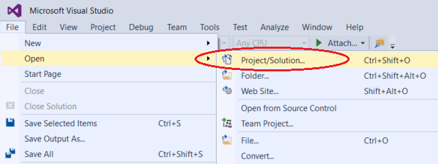
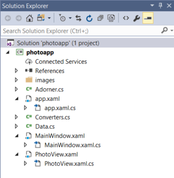
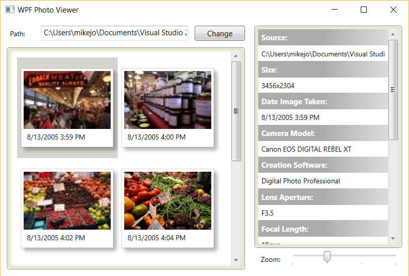
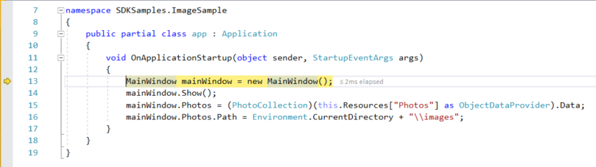
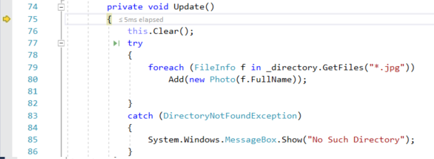

# Start the Visual Studio debugger and navigate code

This topic introduces the features of the Visual Studio debugger in a step-by-step walkthrough. If you want a higher-level view of the debugger features, see [Debugger Feature Tour](../debugger/debugger-feature-tour.md).

You can either read along to see the features of the debugger or you can download the complete sample used in the feature tour and follow the steps yourself. To download the sample and follow along, go to [Photo Viewer Demo](https://code.msdn.microsoft.com/windowsdesktop/WPF-Photo-Viewer-Demo-be75662a).

|         |         |
|---------|---------|
|  | [Watch a video](#video) on debugging that shows similar steps. |

Although the demo app is C#, the features are applicable to C++, Visual Basic, JavaScript, and other languages supported by Visual Studio (except where noted).

## Start the debugger!

1. To follow along these steps in Visual Studio, download the sample [on this page](https://code.msdn.microsoft.com/windowsdesktop/WPF-Photo-Viewer-Demo-be75662a).

    > [!IMPORTANT]
    > You need to install Visual Studio with the .NET Desktop Development workload to run the app we're using in the demo.

2. Unzip the project.

3. Open Visual Studio and select the **File > Open** menu command, then choose **Project/Solution**, and then open the folder where you downloaded the project.

     

3. Open the WPF Photo Viewer Demo > C# folder, choose the photoapp.sln file, and select **Open**.

     The project opens in Visual Studio. Solution Explorer in the right pane shows you all the project files.

    

4. Press F5 (**Debug > Start Debugging** or the **Start Debugging** button  in the Debug Toolbar).

     

     F5 starts the app with the debugger attached to the app process, but right now we haven't added any breakpoints or done anything special to examine the code. So the app just loads and you see the photo images.

     In this tour, we'll take a closer look at this app using the debugger and get a look at the debugger features.

5. Stop the debugger by pressing the red stop  button.

## Set a breakpoint and start the debugger

To debug, you need to start your app with the debugger attached to the app process.

1. In the `MainWindow` constructor of MainWindow.xaml.cs, set a breakpoint by clicking the left margin of the first line of code.

     

6. Press F5 or the **Start Debugging** button, the app starts, and the debugger runs to the line of code where you set the breakpoint.

    The yellow arrow represents the statement on which the debugger paused, which also suspends app execution at the same point (this statement has not yet executed).

    F5 continues running the app to the next breakpoint. (If the app is not yet running, F5 starts the debugger and stops at the first breakpoint.)

    Breakpoints are a useful feature when you know the line of code or the section of code that you want to examine in detail.

## Restart your app quickly

1. Click the **Restart**  button in the Debug Toolbar (Ctrl + Shift +F5).

    When you press **Restart**, it saves time versus stopping the app and restarting the debugger. The debugger pauses at the first breakpoint that is hit by executing code.

    The debugger stops again at the breakpoint you set, in the `MainWindow` constructor.

## Navigate code in the debugger using step commands

Mostly, we use the keyboard shortcuts here, because it's a good way to get fast at executing your app in the debugger (equivalent commands such as menu commands are shown in parentheses).

1. Press F11 (**Debug > Step Into**) twice to advance the execution of the app to the `InitializeComponent()` function.

     

     F11 is the **Step Into** command and advances the app execution one statement at a time. F11 is a good way to examine the execution flow in the most detail. (To move faster through code, we show you some other options also.) By default, the debugger skips over non-user code (if you want more details, see [Just My Code](../debugger/just-my-code.md)).

     >[!NOTE]
     > In managed code, you will see a dialog box asking if you want to be notified when you automatically step over properties and operators (default behavior). If you want to change the setting later, disable **Step over properties and operators** setting in the **Tools > Options** menu under **Debugging**.

2. Press F10 (**Debug > Step Over**) a few times until the debugger stops on the first line of code in the `OnApplicationStartup` event handler.

     

     F10 advances the debugger without stepping into functions or methods in your app code (the code still executes). By pressing F10 on the `InitializeComponent` method call (instead of F11), we skipped over the implementation code for `InitializeComponent` (which maybe we're not interested in right now).

## Step into a property

1. With the debugger paused on this line of code:

    ````
    mainWindow.Photos.Path = Environment.CurrentDirectory + "\\images";
    ````

    Right-click on the line of code and choose **Step Into Specific**, then **SDKSamples.ImageSample.PhotoCollection.Path.set**

     

    As mentioned earlier, by default the debugger skips over managed properties and fields, but the **Step Into Specific** command allows you to override this behavior. For now, we want to look what happens when the `Path.set` property setter runs. **Step Into Specific** gets us to the `Path.set` code here.

     

     The `Update` method in this code looks like it could be interesting, so lets use the debugger to examine that code up close.

5. Hover over the `Update` method until the green **Run to Click** button  appears on the left.

     

    >  [!NOTE] 
    > The **Run to Click** button is new in [!include[vs_dev15](../misc/includes/vs_dev15_md.md)]. If you don't see the green arrow button, use F11 in this example instead to advance the debugger.

6. Click the **Run to Click** button .

    Using this button is similar to setting a temporary breakpoint. **Run to Click** is handy for getting around quickly within a visible region of app code (you can click in any open file).

    The debugger advances to the `Update` method implementation.

7. Press F11 to step into the `Update` method.

     

    Here, we find some more code that looks interesting; the app is getting all *.jpg files residing in a particular directory, and then creating a Photo object for each file. This code gives us a good opportunity to start inspecting your app state (variables) with the debugger. We will do that in the [second half of the tutorial](../debugger/tutorial-inspect-data-and-exceptions.md).

    Features that allow you to inspect variables are one of the most useful features of the debugger, and there are different ways to do it. Often, when you try to debug an issue, you are attempting to find out whether variables are storing the values that you expect them to have at a particular time.

## Examine the call stack

- While paused in the `Update` method, click the **Call Stack** window, which is by default open in the lower right pane.

     

    The **Call Stack** window shows the order in which methods and functions are getting called. The top line shows the current function (the `Update` method in the tour app). The second line shows that `Update` was called from the `Path.set` property, and so on.

    >  [!NOTE]
    > The **Call Stack** window is similar to the Debug perspective in some IDEs like Eclipse.

    The call stack is a good way to examine and understand the execution flow of an app.

    You can double-click a line of code to go look at that source code and that also changes the current scope being inspected by the debugger. This action does not advance the debugger.

    You can also use right-click menus from the **Call Stack** window to do other things. For example, you can insert breakpoints into specified functions, advance the debugger using **Run to Cursor**, and go examine source code. For more information, see [How to: Examine the Call Stack](../debugger/how-to-use-the-call-stack-window.md).

## Step out

Let's say that you are done examining the `Update` method in Data.cs, and you want to get out of the function but stay in the debugger. You can do this using the **Step Out** command.

1. Press Shift + F11 (or **Debug > Step Out**).

     This command resumes app execution (and advances the debugger) until the current function returns.

     You should be back in the `Update` method call in Data.cs.

2. Press Shift + F11 again, and the debugger goes up the call stack back to the `OnApplicationStartup` event handler.

## Run to cursor

1. Choose the **Stop Debugging** red button  or Shift + F5.

2. In the `Update` method in Data.cs, right-click the `Add` method call and choose **Run to Cursor**. This command starts debugging and sets a temporary breakpoint on the current line of code.

     

    You should be paused on the breakpoint in `MainWindow` (since that is the first breakpoint you set).

3. Press F5 to advance to the `Add` method where you selected **Run to Cursor**.

    This command is useful when you are editing code and want to quickly set a temporary breakpoint and start the debugger.

## Change the execution flow

1. With the debugger paused on the `Add` method call, use the mouse to grab the yellow arrow (the execution pointer) on the left and move the yellow arrow up one line to the `foreach` loop.

     

    By changing the execution flow, you can do things like test different code execution paths or rerun code without restarting the debugger.

2. Now, press F5.

    You can see the images added to the app window. Because you are rerunning code in the `foreach` loop, some of the images have been added twice!
    
    > [!WARNING]
    > Often you need to be careful with this feature, and you see a warning in the tooltip. You may see other warnings, too. Moving the pointer cannot revert your application to an earlier app state.

## Next steps

- Continue this tutorial in the next topic, [Inspect variables and exceptions](../debugger/tutorial-inspect-data-and-exceptions.md).

## <a name="video"></a> Watch a video on debugging

<div style="padding-top: 56.25%; position: relative; width: 100%;">
<iframe style="position: absolute;top: 0;left: 0;right: 0;bottom: 0;" width="100%" height="100%" src="https://mva.microsoft.com/en-US/training-courses-embed/getting-started-with-visual-studio-2017-17798/Debugger-Feature-tour-of-Visual-studio-2017-sqwiwLD6D_1111787171" frameborder="0" allowfullscreen></iframe>
</div>

## See Also  
 [Debugging in Visual Studio](../debugger/index.md)
 [Debugger Feature Tour](../debugger/debugger-feature-tour.md)
