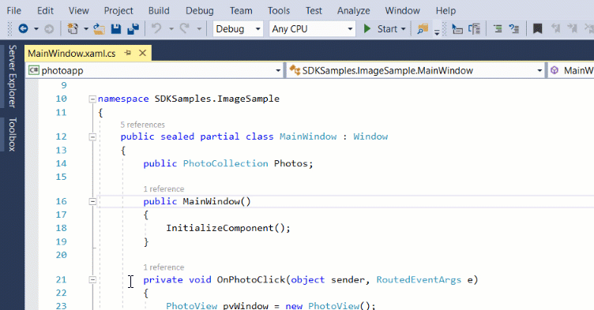
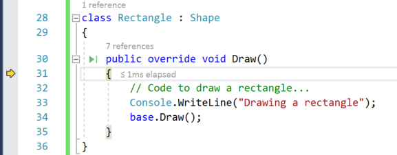
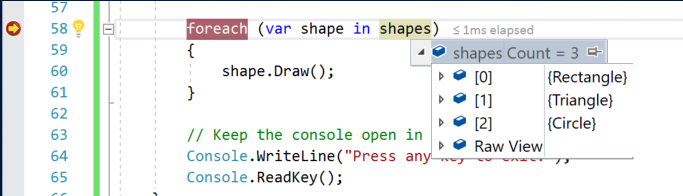
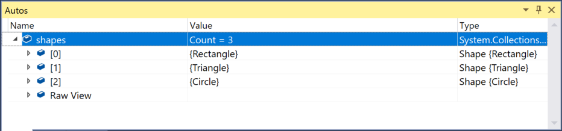
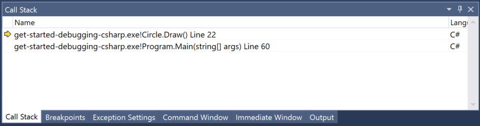

# Tutorial: Learn to debug using Visual Studio

This article introduces the features of the Visual Studio debugger in a step-by-step walkthrough. If you want a higher-level view of the debugger features, see [Debugger Feature Tour](../debugger/debugger-feature-tour.md). When you *debug your app*, it usually means that you are running your application with the debugger attached. When you do this, the debugger provides many ways to see what your code is doing while it runs. You can step through your code and look at the values stored in variables, you can set watches on variables to see when values change, you can examine the execution path of your code, see whether a branch of code is running, and so on. If this is the first time that you've tried to debug code, you may want to read [Debugging for absolute beginners](../debugger/debugging-absolute-beginners.md) before going through this article.

|         |         |
|---------|---------|
|    |    [Watch a video](https://mva.microsoft.com/en-US/training-courses-embed/getting-started-with-visual-studio-2017-17798/Debugger-Feature-tour-of-Visual-studio-2017-sqwiwLD6D_1111787171) on debugging that shows similar steps. |

Although the demo app is C# and C++, the features are applicable to Visual Basic, JavaScript, and other languages supported by Visual Studio (except where noted). The screenshots are in C#. To switch between the C# and C++ sample code, use the language filter in the upper right of this page.

In this tutorial, you will:

> [!div class="checklist"]
> * Start the debugger and hit breakpoints.
> * Learn commands to step through code in the debugger
> * Inspect variables in data tips and debugger windows
> * Examine the call stack

## Prerequisites

* You must have Visual Studio 2017 installed and the **.NET desktop development** or **Desktop development with C++** workload.

    If you haven't already installed Visual Studio, go to the [Visual Studio downloads](https://visualstudio.microsoft.com/downloads/?utm_medium=microsoft&utm_source=docs.microsoft.com&utm_campaign=button+cta&utm_content=download+vs2017) page to install it for free.

    If you need to install the workload but already have Visual Studio, click the **Open Visual Studio Installer** link in the left pane of the **New Project** dialog box (select **File** > **New** > **Project**). The Visual Studio Installer launches. Choose the .**NET desktop development** or **Desktop development with C++** workload, then choose **Modify**.

## Create a project

1. In Visual Studio, choose **File > New Project**.

2. Under **Visual C#** or **Visual C++**, choose **Windows Desktop**, and then in the middle pane choose **Console App** (**Windows Console Application** in C++).

    If you don't see the **Console Application** project template, click the **Open Visual Studio Installer** link in the left pane of the **New Project** dialog box. The Visual Studio Installer launches. Choose the *.NET desktop development** or **Desktop development with C++** workload, then choose **Modify**.

3. Type a name like **get-started-debugging** and click **OK**.

    Visual Studio creates the project.

4. In *Program.cs* (C#) or *get-started-debugging.cpp* (C++), replace the following code

    ```csharp
    using System;
    using System.Collections.Generic;
    using System.Linq;
    using System.Text;
    using System.Threading.Tasks;

    namespace get_started_debugging
    {
        class Program
        {
            static void Main(string[] args)
            {
            }
        }
    }
    ```

    ```c++
    int main()
    {
        return 0;
    }
    ```

    with this code:

    ```csharp
    using System;
    using System.Collections.Generic;

    public class Shape
    {
        // A few example members
        public int X { get; private set; }
        public int Y { get; private set; }
        public int Height { get; set; }
        public int Width { get; set; }
   
        // Virtual method
        public virtual void Draw()
        {
            Console.WriteLine("Performing base class drawing tasks");
        }
    }

    class Circle : Shape
    {
        public override void Draw()
        {
            // Code to draw a circle...
            Console.WriteLine("Drawing a circle");
            base.Draw();
        }
    }

    class Rectangle : Shape
    {
        public override void Draw()
        {
            // Code to draw a rectangle...
            Console.WriteLine("Drawing a rectangle");
            base.Draw();
        }
    }

    class Triangle : Shape
    {
        public override void Draw()
        {
            // Code to draw a triangle...
            Console.WriteLine("Drawing a trangle");
            base.Draw();
        }
    }

    class Program
    {
        static void Main(string[] args)
        {

            var shapes = new List<Shape>
            {
                new Rectangle(),
                new Triangle(),
                new Circle()
            };

            foreach (var shape in shapes)
            {
                shape.Draw();
            }

            // Keep the console open in debug mode.
            Console.WriteLine("Press any key to exit.");
            Console.ReadKey();
        }

    }

    /* Output:
        Drawing a rectangle
        Performing base class drawing tasks
        Drawing a triangle
        Performing base class drawing tasks
        Drawing a circle
        Performing base class drawing tasks
    */
    ```

    ```c++
    #include "pch.h"

    #include <string>
    #include <vector>
    #include <iostream>

    class Shape
    {
        int privateX = 0;
        int privateY = 0;
        int privateHeight = 0;
        int privateWidth = 0;

        int getX() const { return privateX; }
        void setX(int value) { privateX = value; }

        int getY() const { return privateY; }
        void setY(int value) { privateY = value; }

        int getHeight() const { return privateHeight; }
        void setHeight(int value) { privateHeight = value; }

        int getWidth() const { return privateWidth; }
        void setWidth(int value) { privateWidth = value; }

        public:
        // Virtual method
        virtual void Draw()
        {
            std::wcout << L"Performing base class drawing tasks" << std::endl;
        }
    };

    class Circle : public Shape
    {
        public:
        void Draw() override
        {
        // Code to draw a circle...
        std::wcout << L"Drawing a circle" << std::endl;
        Shape::Draw();
        }
    };

    class Rectangle : public Shape
    {
        public:
        void Draw() override
        {
        // Code to draw a rectangle...
        std::wcout << L"Drawing a rectangle" << std::endl;
        Shape::Draw();
        }
    };

    class Triangle : public Shape
    {
        public:
        void Draw() override
        {
        // Code to draw a triangle...
        std::wcout << L"Drawing a trangle" << std::endl;
        Shape::Draw();
        }
    };

    int main(std::vector<std::wstring> &args)
    {
        auto shapes = std::vector<Shape*>
        {
            new Rectangle(),
            new Triangle(),
            new Circle()
        };

        for (auto shape : shapes)
        {
            shape->Draw();
        }
    }

    /* Output:
    Drawing a rectangle
    Performing base class drawing tasks
    Drawing a triangle
    Performing base class drawing tasks
    Drawing a circle
    Performing base class drawing tasks
    */
    ```

## Start the debugger!

1. Press **F5** (**Debug > Start Debugging**) or the **Start Debugging** button  in the Debug Toolbar.

     **F5** starts the app with the debugger attached to the app process, but right now we haven't done anything special to examine the code. So the app just loads and you see the console output.

    ```
    Drawing a rectangle
    Performing base class drawing tasks
    Drawing a triangle
    Performing base class drawing tasks
    Drawing a circle
    Performing base class drawing tasks
    ```

     In this tutorial, we'll take a closer look at this app using the debugger and get a look at the debugger features.

2. Stop the debugger by pressing the red stop  button.

## Set a breakpoint and start the debugger

1. In the `foreach` loop of the `Main` function (`for` loop in C++ `main` function), set a breakpoint by clicking the left margin of the following line of code:

    `shape.Draw()` (or, `shape->Draw()` in C++)

    A red circle appears where you set the breakpoint.

    Breakpoints are the most basic and essential feature of reliable debugging. A breakpoint indicates where Visual Studio should suspend your running code so you can take a look at the values of variables, or the behavior of memory, or whether or not a branch of code is getting run. 

6. Press **F5** or the **Start Debugging** button, the app starts, and the debugger runs to the line of code where you set the breakpoint.

    

    The yellow arrow represents the statement on which the debugger paused, which also suspends app execution at the same point (this statement has not yet executed).

     If the app is not yet running, **F5** starts the debugger and stops at the first breakpoint. Otherwise, **F5** continues running the app to the next breakpoint.

    Breakpoints are a useful feature when you know the line of code or the section of code that you want to examine in detail.

## Navigate code in the debugger using step commands

Mostly, we use the keyboard shortcuts here, because it's a good way to get fast at executing your app in the debugger (equivalent commands such as menu commands are shown in parentheses).

1. While paused in the `shape.Draw` method call in the `Main` method (`shape->Draw` in C++), press **F11** to advance into code for the `Rectangle` class.

     

     F11 is the **Step Into** command and advances the app execution one statement at a time. F11 is a good way to examine the execution flow in the most detail. (To move faster through code, we show you some other options also.) By default, the debugger skips over non-user code (if you want more details, see [Just My Code](../debugger/just-my-code.md)).

2. Press **F10** (or choose **Debug > Step Over**) a few times until the debugger stops on the `base.Draw` method call (`Shape::Draw` in C++), and then press **F10** one more time.

     

     Notice this time that the debugger does not step into the `Draw` method of the base class (`Shape`). **F10** advances the debugger without stepping into functions or methods in your app code (the code still executes). By pressing F10 on the `base.Draw` (or `Shape::Draw`) method call (instead of **F11**), we skipped over the implementation code for `base.Draw` (which maybe we're not interested in right now).

## Navigate code using Run to Click

5. In the code editor, scroll down and hover over the `Console.WriteLine` method (`std::cout` in C++) in the `Triangle` class until the green **Run to Click** button  appears on the left.

     

    >  [!NOTE]
    > The **Run to Click** button is new in [!include[vs_dev15](../misc/includes/vs_dev15_md.md)]. If you don't see the green arrow button, use **F11** in this example instead to advance the debugger to the right place.

6. Click the **Run to Click** button .

    Using this button is similar to setting a temporary breakpoint. **Run to Click** is handy for getting around quickly within a visible region of app code (you can click in any open file).

    The debugger advances to the `Console.WriteLine` method implementation for the `Triangle` class (`std::cout` in C++).

    While paused, you notice a typo! The output "Drawing a trangle" is misspelled. We can fix it right here while running the app in the debugger.

## Edit code and continue debugging

1. Click into "Drawing a trangle" and type a correction, changing "trangle" to "triangle".

1. Press **F11** once and you see that the debugger advances again.

    > [!NOTE]
    > Depending on what type of code you edit in the debugger, you may see a warning message. In some scenarios, the code will need to recompile before you can continue.

## Step out

Let's say that you are done examining the `Draw` method in the `Triangle` class, and you want to get out of the function but stay in the debugger. You can do this using the **Step Out** command.

1. Press **Shift** + **F11** (or **Debug > Step Out**).

     This command resumes app execution (and advances the debugger) until the current function returns.

     You should be back in the `foreach` loop in the `Main` method (`for` loop in C++).

## Restart your app quickly

Click the **Restart**  button in the Debug Toolbar (**Ctrl** + **Shift** + **F5**).

When you press **Restart**, it saves time versus stopping the app and restarting the debugger. The debugger pauses at the first breakpoint that is hit by executing code.

The debugger stops again at the breakpoint you set, on the `shape.Draw()` method (`shape->Draw()` in C++).

## Inspect variables with data tips

Features that allow you to inspect variables are one of the most useful features of the debugger, and there are different ways to do it. Often, when you try to debug an issue, you are attempting to find out whether variables are storing the values that you expect them to have at a particular time.

1. While paused on the `shape.Draw()` method (`shape->Draw()` in C++), hover over the `shapes` object and you see its default property value, the `Count` property.

1. Expand the `shapes` object to see all its properties, such as the first index of the array `[0]`, which has a value of `Rectangle` (C#) or a memory address (C++).

     

    Often, when debugging, you want a quick way to check property values on objects, and the data tips are a good way to do it.

## Inspect variables with the Autos and Locals windows

1. Look at the **Autos** window at the bottom of the code editor.

     

    In the **Autos** window, you see variables and their current value. The **Autos** window shows all variables used on the current line or the preceding line (In C++, the window shows variables in the preceding three lines of code. Check documentation for language-specific behavior).

    > [!NOTE]
    > In JavaScript, the **Locals** window is supported but not the **Autos** window.

2. Next, look at the **Locals** window, in a tab next to the **Autos** window.

    The **Locals** window shows you the variables that are in the current [scope](https://www.wikipedia.org/wiki/Scope_(computer_science)).

## Set a watch

1. In the main code editor window, right-click the `shapes` object and choose **Add Watch**.

    The **Watch** window opens at the bottom of the code editor. You can use a **Watch** window to specify a variable (or an expression) that you want to keep an eye on.

    Now, you have a watch set on the `shapes` object, and you can see its value change as you move through the debugger. Unlike the other variable windows, the **Watch** window always shows the variables that you are watching (they're grayed out when out of scope).

## Examine the call stack

1. While paused in the `foreach` loop (`for` loop in C++), click the **Call Stack** window, which is by default open in the lower right pane.

1. Click **F11** a few times until you see the debugger pause in the `Circle.Draw` method in the code editor. Look at the **Call Stack** window.

    

    The **Call Stack** window shows the order in which methods and functions are getting called. The top line shows the current function (the `Circle.Draw` or `Circle::Draw` method in this app). The second line shows that `Circle.Draw` was called from the `Main` method (`main` in C++), and so on.

    >  [!NOTE]
    > The **Call Stack** window is similar to the Debug perspective in some IDEs like Eclipse.

    The call stack is a good way to examine and understand the execution flow of an app.

    You can double-click a line of code to go look at that source code and that also changes the current scope being inspected by the debugger. This action does not advance the debugger.

    You can also use right-click menus from the **Call Stack** window to do other things. For example, you can insert breakpoints into specified functions, advance the debugger using **Run to Cursor**, and go examine source code. For more information, see [How to: Examine the Call Stack](../debugger/how-to-use-the-call-stack-window.md).

## Change the execution flow

1. With the debugger paused in the `Circle.Draw` method call, press **F11** a few times until the debugger pauses on the `base.Draw` method call (`Shape::Draw` in C++).

1. Use the mouse to grab the yellow arrow (the execution pointer) on the left and move the yellow arrow up one line to the `Console.WriteLine` (`std::cout` in C++) method call.

1. Press **F11** one more time.

    The debugger reruns the `Console.WriteLine` method (`std::cout` in C++).

    By changing the execution flow, you can do things like test different code execution paths or rerun code without restarting the debugger.

    > [!WARNING]
    > Often you need to be careful with this feature, and you see a warning in the tooltip. You may see other warnings, too. Moving the pointer cannot revert your application to an earlier app state.

1. Press **F5** to continue running the app.

    Congratulations on completing this tutorial!

## Next steps

In this tutorial, you've learned how to start the debugger, step through code, and inspect variables. You may want to get a high-level look at debugger features along with links to more information.

> [!div class="nextstepaction"]
> [Debugger feature tour](../debugger/debugger-feature-tour.md)
