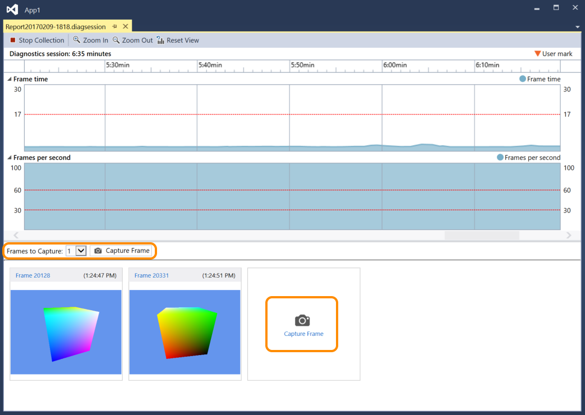

# Capturing Graphics Information
Capture graphics information from your Direct3D app so that you can use Visual Studio Graphics Analyzer to diagnose rendering problems and performance problems.

## Capturing graphics information
 Capturing graphics information is a two-step process. First, run your app under Graphics Diagnostics, and then specify one or more frames to capture detailed information from.

### To run your app under Graphics Diagnostics

- On the menu bar, choose **Debug**, **Graphics**, **Start Graphics Debugging**. (Keyboard: Press Alt+F5)

- On the **Graphics** toolbar, choose the **Start Graphics Debugging** button.

  While an app is running under Graphics Diagnostics, certain kinds of graphics information is captured all the time; this includes device set up, creation of the swap-chain, creation of graphics objects and resources, and other important events that affect more than one frame. At the same time, you can capture detailed information about specific frames; this includes draw calls and compute-shader dispatches, together with the Direct3D objects and resources that support them.

### To capture a frame

- In Visual Studio, on the **Graphics** toolbar, click the **Capture Frame** button .

- On the keyboard, press the Print Screen key.

  > [!NOTE]
  > While an app is running under **Graphics Diagnostics**, the Print Screen key can only be used to capture a frame of graphics information; it doesn't perform its regular function. This remains in effect until you have stopped capturing graphics information—usually by stopping debugging or exiting the app normally—even if another application is in focus.

- In the Visual Studio capture interface, chose the **Capture Frame** button located below the **Diagnostic session** timeline, or choose the large **Capture Frame** button located below the **Frames per second** swim-lane and to the right of any previously-captured frames. Both buttons are highlighted in the image below.

   

   When you're ready to examine the frames you've captured, start the **Visual Studio Graphics Analyzer** by following the **Frame ...** link above the image thumbnails, or by double-clicking the thumbnail.

  Only whole frames can be captured, so when you initiate a capture, it's really the graphics information from the next frame that's recorded. Recording begins immediately after the frame in which you initiated capture is presented and ends when the captured frame is presented. You can capture as many frames as you want while the app is running under Graphics Diagnostics. If you don't capture any frames, the graphics log is discarded.

  While capturing frames, Visual Studio displays the diagnostics session (.diagsession) window. If you close this window, stop debugging, or close the app, you can't capture any more frames to that log. To capture more graphics information, you have to run the app under Graphics Diagnostics again to start a new diagnostics session.

### Graphics Diagnostics Capture Options
 You can configure capture to collect call stacks for all graphics events or a limited subset, disable the capture HUD, and enable or disable capture compatibility mode.

#### To configure Graphics Diagnostics capture options

1. On the menu bar, choose Tools, Options. The Options dialog box appears.

2. In the options category list on the left, choose Graphics Diagnostics, then configure the Graphics Diagnostics options that you want.

     **Collect call stacks during capture (makes capture slower)**
     Check this box to collect call stacks. By default, call stacks are not collected. To capture call stacks, make sure that the **Collect call stacks during capture (makes capture slower** checkbox is set to enable collection and then set either the **for draw, dispatch, present, and perf markers** option (default) to collect only the most important call stacks, or the **for everything** option to collect all call stacks. To stop collecting call stacks later, clear the **Collect call stacks during capture (makes capture slower** checkbox.

     **Disable in-game HUD during capture**
     Check this box to disable the HUD overlay that an app running under graphics diagnostics usually displays. Uncheck it to display the HUD overlay.

     **Capture in compatibility mode**
     Check this box to capture graphics information in compatibility mode. Capturing in compatibility mode is the default. Under compatibility mode, Direct3D won't report that the GPU supports any additional features beyond those defined in the base feature level. This prevents the app being captured from using hardware-specific extensions of the GPU its captured on and ensures that the graphics log can be played back using any GPU that supports the same or higher feature level. Uncheck this box to disable compatibility mode; logs captured with compatibility mode disabled will fail to play back on any GPU that doesn't support the same additional features that were used by the app during capture.

     **Stop capture if any SDK layers errors are found**
     Check this box to halt capture immediately if errors are encountered.

## Capturing graphics information remotely
 Graphics information can be captured from an app that's running on the local machine, or on a remote machine or device. Remote capture is supported for [!INCLUDE[winblue_client_2](../includes/winblue_client_2_md.md)] machines and [!INCLUDE[winblue_winrt_2](../includes/winblue_winrt_2_md.md)] devices. To capture graphics information from an app that's running remotely, configure your project for remote debugging and then run your app under Graphics Diagnostics as described earlier. The app runs on the remote machine, and the captured graphics information is recorded on your development machine.

 How you configure your project for remote debugging depends on the kind of app you're developing and the programming language you're using. For information about how to configure remote debugging for a UWP app, see [Run UWP apps on a remote machine](../run-windows-store-apps-on-a-remote-machine.md). For information about how to configure remote debugging for a Windows desktop app, see [Remote Debugging](../remote-debugging.md).

 Later, you can use a remote machine or device to play back graphics information, regardless of where the information was captured from. For more information, see [How to: Change the Graphics Diagnostics Playback Machine](how-to-change-the-graphics-diagnostics-playback-machine.md).

## Capturing graphics information from the command line
 Graphics information can be captured from an app by using a command-line tool. This tool, DXCap.exe, can quickly capture and play back graphics information without using Visual Studio or programmatic capture. In particular, you can use DXCap.exe for automation, or in a test environment. For more information about DXCap.exe, see [Command-Line Capture Tool](command-line-capture-tool.md)

## See also
- [Walkthrough: Capturing Graphics Information](walkthrough-capturing-graphics-information.md)