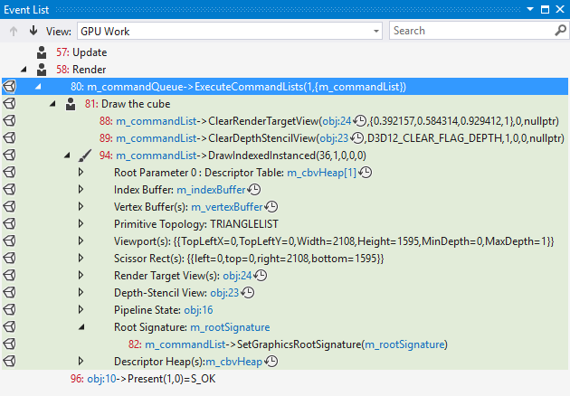
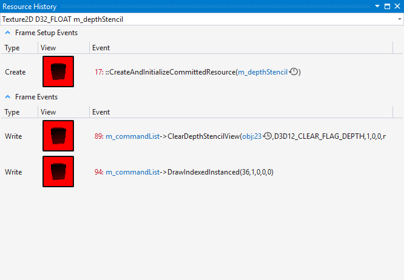

# Graphics Event List
Use the Graphics Event List in Visual Studio Graphics Analyzer to explore the Direct3D events that were recorded while rendering a frame of your game or app.

 This is the Event List:

 

## Using the event list
 When you select an event in the event list, it's reflected in the information that's displayed by other Graphics Analysis tools; by using the event list in concert with these other tools you can examine a rendering problem in detail to determine its cause. To learn more about how you can solve rendering problems by using the event list together with other Graphics Analysis tools, see [Examples](graphics-diagnostics-examples.md).

 Using the features of the event list effectively is important for getting around complex frames that might contain thousands of events. To use the event list effectively, choose the view works best for you, use search to filter the event list, follow links to learn more about the Direct3D objects that are associated with an event, and use the arrow buttons to move between draw calls quickly.

### Color-coded events in Direct3D 12
 Direct3D 12 exposes multiple queues that correspond to different hardware functionality. To help identify the queue that's associated with a particular graphics event in Direct3D 12, events are color-coded in the Event List according to their queue when you're working with a capture of a Direct3D 12 app.

|Direct3D 12 Queue|Color|
|-----------------------|-----------|
|Render queue|Green|
|Compute queue|Yellow|
|Copy queue|Orange|

 Direct3D 11 doesn't expose multiple queues, so events aren't color-coded in the Event List when you're working with a capture of a Direct3D 11 app.

### Event list views
 The event list supports two different views that organize graphics events in different ways to support your workflow and preferences. The first view is the *GPU work view* which organizes events and their associated state hierarchically. The second view is the *timeline view* which organizes events chronologically, in a flat list.

 The **GPU Work** view
 Displays captured events and their state in a hierarchy. The top level of the hierarchy is made up of events such as draw calls, clears, present, and those dealing with views. In the event list, you can expand draw calls to display the device state that was current at the time of the draw call; and you can further expand each kind of state to display the events that set their values. At this level, you can also see whether a particular state was set in a previous frame, or if it has been set more than once since the last draw call.

 The **Timeline** view
 Displays each captured event in chronological order. This way of organizing the event list is the same as in previous versions of Visual Studio.

##### To change the event list view mode

- In the **Graphics Event List** window, above the list of events, locate the **View** dropdown and chose either the **Timeline** view or the **GPU Work** view.

### Filtering events
 You can use the Search box—located in the upper-right corner of the **Graphics Event List** window—to filter the events list to include only events whose names contain specific keywords. You can specify single keywords like `Vertex`—as shown in the previous illustration—or multiple keywords by using a semicolon-delimited list like `Draw;Primitive`—which matches events that have either `Draw` or `Primitive` in their names. Searches are sensitive to whitespace—for example, `VSSet` and `VS Set` are different searches—so make sure to form searches carefully.

### Moving between draw calls
 Because examining `Draw` calls is especially important, you can use the **Go to the next draw call** and **Go to the previous draw call** buttons—located in the upper-left corner of the **Graphics Event List** window—to find and move between draw calls quickly.

### Links to graphics objects
 To understand certain graphics events, you might need additional information about the current state of Direct3D or about Direct3D objects that are referenced by the event. Many events provide links to this information that you can follow for more detail.

## Kinds of events and event markers
 The events that are displayed in the event list are organized into four categories: general events, draw events, user-defined event groups, and user-defined event markers. Except for general events, each event is displayed together with an icon that indicates the category that it belongs to.

|Icon|Event description|
|----------|-----------------------|
|(no icon)|General event  Any event which is not a user-defined event, user-defined event group, or draw event.|
||Draw event  Marks a draw event that occurred during the captured frame.|
||User-defined event group  Groups related events, as defined by the app.|
||User-defined event marker  Marks a specific location, as defined by the app.|

## Marking user-defined events in your app
 User-defined events are specific to your app. You can use them to correlate significant events that occur in your app with events in the Graphics Event List. For example, you can create user-defined event groups to organize related events—such as those that render your user interface—into groups or hierarchies so that you can browse the event list more easily, or you can create markers when a certain kinds of objects are drawn so that you can easily find their graphics events in the event list.

 To create groups and markers in your app, you use the same APIs that Direct3D provides for use by other Direct3D debugging tools. These APIs sometimes change between versions of Direct3D, but the basic functionality is the same.

### User-defined events in Direct3D 12
 To create groups and markers in Direct3D 12, use the APIs described in this section. The table below summarizes the APIs that you can use depending on whether you are marking events in a command queue or command list.

|API Description|[ID3D12CommandQueue](/windows/desktop/api/d3d12/nn-d3d12-id3d12commandqueue)|[ID3D12GraphicsCommandList](/windows/desktop/api/d3d12/nn-d3d12-id3d12graphicscommandlist)|
|---------------------| - | - |
|Check user-defined event availability|[PIXGetStatus](/previous-versions//dn788637(v=vs.85))|[PIXGetStatus](/previous-versions//dn788637(v=vs.85))|
|Begin an event group|[PIXBeginEvent](/windows/desktop/api/d3d12/nf-d3d12-id3d12commandqueue-beginevent)|[PIXBeginEvent](/windows/desktop/api/d3d12/nf-d3d12-id3d12graphicscommandlist-beginevent)|
|End   an event group|[PIXEndEvent](/windows/desktop/api/d3d12/nf-d3d12-id3d12commandqueue-endevent)|[PIXEndEvent](/windows/desktop/api/d3d12/nf-d3d12-id3d12graphicscommandlist-endevent)|
|Create an event marker|[PIXSetMarker](/windows/desktop/api/d3d12/nf-d3d12-id3d12commandqueue-setmarker)|[PIXSetMarker](/windows/desktop/api/d3d12/nf-d3d12-id3d12graphicscommandlist-setmarker)|

### User-defined events in Direct3D 11 and earlier
 To create groups and markers in Direct3D 11 or earlier, use the APIs described in this section. The table below summarizes the APIs that you can use for different versions of Direct3D 11 and earlier versions of Direct3D.

|API Description|[ID3D11DeviceContext2](/windows/desktop/api/d3d11_2/nn-d3d11_2-id3d11devicecontext2) (Direct3D 11.2)|[ID3DUserDefinedAnnotation](/windows/win32/api/d3d11_1/nn-d3d11_1-id3duserdefinedannotation) (Direct3D 11.1)|D3DPerf_ API family (Direct3D 11.0 and earlier)|
|---------------------| - | - | - |
|Begin an event group|`BeginEventInt`|`BeginEvent`|`D3DPerf_BeginEvent`|
|End an event group|`EndEventInt`|`EndEvent`|`D3DPerf_EndEvent`|
|Create an event marker|`SetMarkerInt`|`SetMarker`|`D3DPerf_SetMarker`|

 You can use any of these APIs that your version of Direct3D supports—for example, if you are targeting the Direct3D 11.1 API, you can use either `SetMarker` or `D3DPerf_SetMarker` to create an event marker, but not `SetMarkerInt` because its only available in Direct3D 11.2—and you can even mix those that support different versions of Direct3D together in the same app.

<!-- VERSIONLESS -->

## Resource History
Visual Studio 2017 and greater contain the **Resource History** window.  Selecting the watch icon  next to an entry in the **Event List** window will bring up the **Resource History** window shown below:

This window allows you to view the history of the selected item in the event list.  The dropdown at the top can be used to select other items to view the history of.  The top half of the window contains the **Frame Setup Events**.  These are the events which fall into the *Create* type category and are calls that typically initialize and create the resource.  The bottom half of the window contains the **Frame Events** section.  These are the normal read and write events that occur during the usage of the resource.

| Column | Description |
|-----------| - |
| **Type** | Shows the type of the entry, typically *Create*, *Read* and *Write*. |
| **View** | Shows a thumbnail of the resource at that moment in time.  Double-click the thumbnail to open a details view of the resource at that time. |
| **Event** | Shows the method call that occurred which generated the event.  Any additional history on individual items can be viewed by selecting the watch icon  on the appropriate line.  Also, any item which is drawn in blue text, such as `m_commandList` in the screenshot above, can be selected for more details. |

<!-- /VERSIONLESS -->

## See also
- [Walkthrough: Missing Objects Due to Device State](walkthrough-missing-objects-due-to-device-state.md)