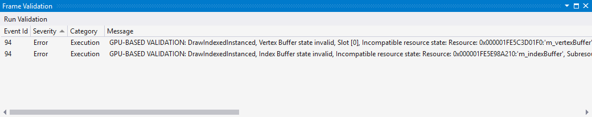

# Graphics Frame Validation
<!-- VERSIONLESS -->
Visual Studio 2017 and greater support the **Frame Validation** tool.  The Frame Validation window displays errors and warnings associated with the event list.  To view this window, select the **View > Frame Validation** menu.

Click the **Run Validation** button at the top left corner to initiate the analysis.  It may take several minutes to complete depending on the complexity of the frame.  The data which appears here is a combination from two sources: the messages that D3D itself emits when [SDK Layers](/windows/desktop/direct3d11/overviews-direct3d-11-devices-layers) is enabled, and data that is collected from the tool's own internal state tracking. Once complete, you will see several columns of data:

| **Column** | **Description** |
|------------| - |
| Event Id | ID which maps to an entry in the [Event List](graphics-event-list.md) window. |
| Severity | Corruption, Error, Warning, Info, or Message. |
| Category | Application Defined, Miscellaneous, Initialization, Cleanup, Compilation, State Creation, State Setting, State Getting, Execution, Resource Manipulation, Shader, Redundant, and Unused. |
| Message | The message associated with the event. |
| Event | The event associated with the error or warning. |

## See also
[Graphics Diagnostics (Debugging DirectX Graphics)](visual-studio-graphics-diagnostics.md)
<!-- /VERSIONLESS -->