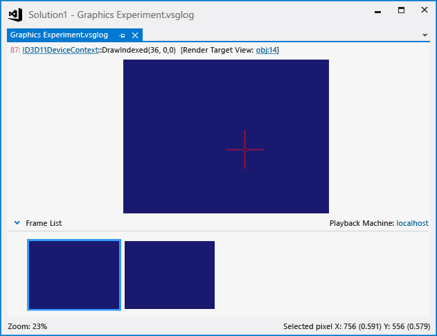

# Graphics Log Document
The Graphics Log document is the record of graphics events that occurred while your app was running under a graphics diagnostics session. After being recorded, you can examine the log in Visual Studio Graphics Analyzer to diagnose rendering and performance problems.

 This is what a graphics log document looks like in the Graphics Analyzer:

 

## Understanding graphics log documents
 By using Graphics Analyzer to examine a graphics log document, you can visualize the effects of Direct3D events on the render target that occurred during capture. You can pinpoint regions of the render target that contain unexpected output. When you select a pixel in the affected region, you can use Graphics Diagnostics to inspect it, its shaders, the Direct3D events that affected it, the application call stack that led to those events, and the DirectX objects that support those events. You can use this information to diagnose rendering problems in your game or app.

 The top part of the window (**Graphics Experiment.vsglog**) displays the current render target output of the selected frame, and the bottom part displays a **Frame List** that contains thumbnail images of the captured frames.

#### To inspect a frame

- In the **Frame List**, select the frame that you want to inspect. The render target output in the top part of the graphics log document is updated to display the selected frame.

#### To inspect a pixel

- In the top part of the graphics log document, select the pixel that you want from the render target output. When a pixel is selected, you can use the **Graphics Pixel History** window to view detailed information about the selected pixel. For more information, see [Pixel History](graphics-pixel-history.md).

## Playback machine
 Also displayed in the upper-right corner of the **Frame List** is the **Playback Machine**. The playback machine is a machine or device that is used to play back graphics events from a graphics log file during a later graphics diagnostics session. By using a different device instead of your development machine to play back captured events, you can more accurately reproduce the execution environment in which the problem occurs—for example, you can use a machine that has different graphics hardware or drivers than the ones that your development machine uses, or other kinds of devices, such as an ARM-based Windows RT tablet or Windows Phone device.

 For information about how to specify a playback machine, see [How to: Change the Graphics Diagnostics Playback Machine](how-to-change-the-graphics-diagnostics-playback-machine.md).

## Graphics log summary information
 When a graphics log file is the active document, the **Properties** window displays information about the environment that hosted the Graphics Diagnostics capture session. Several categories of information are displayed.

 **Direct3D Information**
 Lists information about the hardware and driver features of the display adapter that was used during the capture session.

|Property|Description|
|--------------|-----------------|
|**10-bit XR High Color Format**|**True** if 10-bit XR high-color format is supported; otherwise, **False**.|
|**DirectCompute CS 4.x**|**True** if Compute Shader 4.0 is supported; otherwise, **False**.|
|**Double Precision Shaders**|**True** if the display adapter supports double-precision (64-bit) floating-point values; otherwise, **False**.|
|**Driver Command Lists**|**True** if the driver supports command lists; otherwise, **False**.|
|**Driver Concurrent Creates**|**True** if the driver supports concurrent (asynchronous) creation; otherwise, **False**.|
|**Extended Formats (BGRA, etc.)**|**True** if extended formats like BGRA are supported; otherwise, **False**.|
|**Max HW Feature Level**|Displays the highest feature level that is supported by the display adapter.|

 **Display Information**
 Lists information about the display adapter that was used during the capture session.

|Property|Description|
|--------------|-----------------|
|**Description**|The display adapter description string.|
|**Display Memory**|The amount of memory that's installed on the graphics adapter.|
|**Driver Name**|The name of the graphics adapter driver.|
|**Driver Version**|The version of the graphics adapter driver.|
|**Name**|The name of the graphics adapter.|

 **Experiment File**
 Lists information about the experiment file that's associated with the capture session.

|Property|Description|
|--------------|-----------------|
|**Path**|The path of the .vsglog file. **Note:**  Under legacy capture, this property is unused.|

 **Module Information**
 Lists the name and version of the dynamic link libraries (DLLs) that were loaded by the app during the capture session.

 **System Information**
 Lists information about the hardware and operating system that hosted the app during the capture session.

|Property|Description|
|--------------|-----------------|
|**Memory**|The amount of memory that's installed in the computer.|
|**OS Architecture**|The target CPU architecture of the operating system.|
|**OS Version**|The operating system version.|
|**Processor**|The processor that's installed in the computer.|
|**Target Application Architecture**|The target CPU architecture of the app. This can be different than the **OS Architecture**.|

 **Target Application**
 Lists information about the app that's the subject of the capture session.

|Property|Description|
|--------------|-----------------|
|**Last-Modified Date/Time**|The date and time that the app was built.|
|**Path**|The path of the app.|
|**Process ID**|The process ID that was given to the app.|
|**Version**|The app version.|

 **VSG Log File**
 Lists information about the graphics log document.

| Property | Description |
|------------------------| - |
| **Created by** | The name of the app that created the graphics log document. For example, if the capture session was initiated from [!INCLUDE[vsprvs](../../code-quality/includes/vsprvs_md.md)] (manual capture) the value of this property is [!INCLUDE[vsprvs](../../code-quality/includes/vsprvs_md.md)]. |
| **Session Start Time** | The date and time that the capture session began. |
| **Size** | The size of the graphics log document. |

## See also
- [Walkthrough: Missing Objects Due to Vertex Shading](walkthrough-missing-objects-due-to-vertex-shading.md)
- [Walkthrough: Debugging Rendering Errors Due to Shading](walkthrough-debugging-rendering-errors-due-to-shading.md)