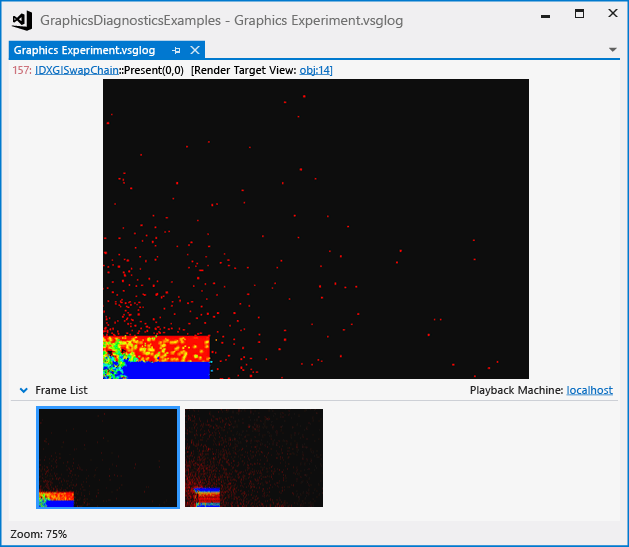
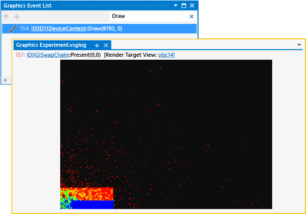
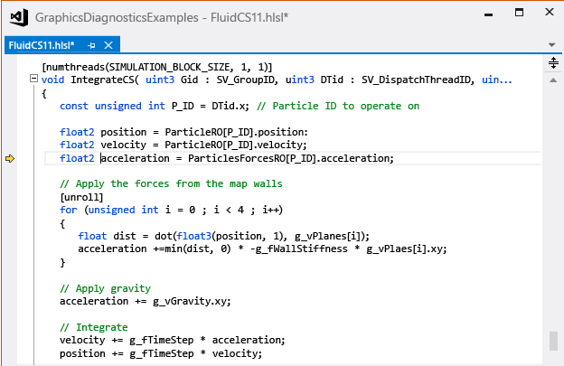
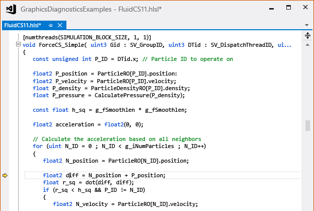
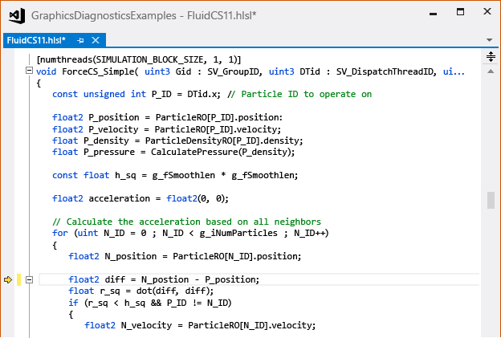

# Walkthrough: Using Graphics Diagnostics to Debug a Compute Shader
This walkthrough demonstrates how to use the Visual Studio Graphics Diagnostics tools to investigate a compute shader that generates incorrect results.

 This walkthrough illustrates these tasks:

- Using the **Graphics Event List** to locate potential sources of the problem.

- Using the **Graphics Event Call Stack** to determine which compute shader is executed by a DirectCompute `Dispatch` event.

- Using the **Graphics Pipeline Stages** window and HLSL debugger to examine the compute shader that's the source of the problem.

## Scenario
 In this scenario, you have written a fluid-dynamics simulation that uses DirectCompute to perform the most computation-intensive parts of the simulation update. When the app is run, the rendering of the dataset and UI look correct, but the simulation does not behave as expected. By using Graphics Diagnostics, you can capture the problem to a graphics log so that you can debug the app. The problem looks like this in the app:

 

 For information about how to capture graphics problems in a graphics log, see [Capturing Graphics Information](capturing-graphics-information.md).

## Investigation
 You can use the Graphics Diagnostics tools to load the graphics log file so that you can inspect the captured frames.

#### To examine a frame in a graphics log

1. In Visual Studio, load a graphics log that contains a frame that exhibits the incorrect simulation results. A new Graphics Diagnostics tab appears in Visual Studio. In the top part of this tab is the render target output of the selected frame. In the bottom part is the **Frame List**, which displays a thumbnail of each captured frame.

2. In the **Frame List**, select a frame that demonstrates the incorrect simulation behavior. Even though the error appears to be in the simulation code and not the rendering code, you still have to choose a frame because DirectCompute events are captured on a frame-by-frame basis, together with Direct3D events. In this scenario, the graphics log tab looks like this:

    

   After you select a frame that demonstrates the problem, you can use the **Graphics Event List** to diagnose it. The **Graphics Event List** contains an event for every DirectCompute call and Direct3D API call that was made during the active frame—for example, API calls to run a computation on the GPU, or to render the dataset or UI. In this case, we are interested in `Dispatch` events that represent parts of the simulation that run on the GPU.

#### To find the Dispatch event for the simulation update

1. On the **Graphics Diagnostics** toolbar, choose **Event List** to open the **Graphics Event List** window.

2. Inspect the **Graphics Event List** for the draw event that renders the dataset. To make this easier, enter `Draw` in the **Search** box in the upper-right corner of the **Graphics Event List** window. This filters the list so that it only contains events that have "Draw" in their titles. In this scenario, you discover that these draw events occurred:

    

3. Move through each draw event while you watch the render target in the graphics log document tab.

4. Stop when the render target first displays the rendered dataset. In this scenario, the dataset is rendered in the first draw event. The error in the simulation is shown:

    

5. Now inspect the **Graphics Event List** for the `Dispatch` event that updates the simulation. Because it's likely that the simulation is updated before it is rendered, you can concentrate first on `Dispatch` events that occur before the draw event that renders the results. To make this easier, modify the **Search** box to read `Draw;Dispatch;CSSetShader(`. This filters the list so that it also contains `Dispatch` and `CSSetShader` events in addition to draw events. In this scenario, you discover that several `Dispatch` events occurred before the draw event:

    

   Now that you know which few of potentially many `Dispatch` events could correspond to the problem, you can examine them in more detail.

#### To determine which compute shader a Dispatch call executes

1. On the **Graphics Diagnostics** toolbar, choose **Event Call Stack** to open the **Graphics Event Call Stack** window.

2. Starting from the draw event that renders the simulation results, move backwards through each previous `CSSetShader` event. Then, in the **Graphics Event Call Stack** window, choose the top-most function to navigate to the call site. At the call site, you can use the first parameter of the [CSSetShader](/windows/desktop/api/d3d11/nf-d3d11-id3d11devicecontext-cssetshader) function call to determine which compute shader is executed by the next `Dispatch` event.

   In this scenario, there are three pairs of `CSSetShader` and `Dispatch` events in each frame. Working backwards, the third pair represents the integration step (where the fluid particles are actually moved), the second pair represents the force-calculation step (where forces that affect each particle are calculated), and the first pair represents the density-calculation step.

#### To debug the compute shader

1. On the **Graphics Diagnostics** toolbar, choose **Pipeline Stages** to open the **Graphics Pipeline Stages** window.

2. Select the third `Dispatch` event (the one that immediately precedes the draw event) and then, in the **Graphics Pipeline Stages** window, under the **Compute Shader** stage, choose **Start Debugging**.

    

    The HLSL Debugger is started at the shader that performs the integration step.

3. Examine the compute-shader source code for the integration step to search for the source of the error. When you use Graphics Diagnostics to debug HLSL compute-shader code, you can step through code and use other familiar debugging tools such as watch windows. In this scenario, you determine that there does not appear to be an error in the compute shader that performs the integration step.

    

4. To stop debugging the compute shader, on the **Debug** toolbar, choose **Stop Debugging** (Keyboard: Shift+F5).

5. Next, select the second `Dispatch` event and start debugging the compute shader just like you did in the earlier step.

    

    The HLSL Debugger is started at the shader that calculates the forces that act on each fluid particle.

6. Examine the compute shader source code for the force-calculation step. In this scenario, you determine that the source of the error is here.

    

   After you have determined the location of the error, you can stop debugging and modify the compute-shader source code to correctly calculate the distance between the interacting particles. In this scenario, you just change the line `float2 diff = N_position + P_position;` to `float2 diff = N_position - P_position;`:

   

   In this scenario, because the compute shaders are compiled at run time, you can just restart the app after you make the changes to observe how they affect the simulation. You don't have to rebuild the app. When you run the app, you discover that the simulation now behaves correctly.

   