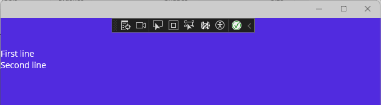
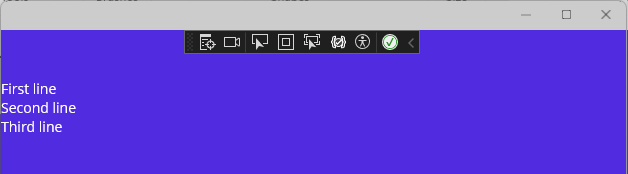

# Extend .NET Hot Reload using MetadataUpdateHandler (C#, Visual Basic)

You can programmatically extend .NET Hot Reload support for additional scenarios that aren't typically supported, such as code changes that require clearing a cache or refreshing the UI. For example, to support hot reload with a JSON serializer, you need to clear its cache when a type is modified. For .NET MAUI developers, you may need to extend hot reload for edits/updates that don't trigger hot reload under normal conditions, such as editing a constructor, or an event handler for a UI element. You can use the <xref:System.Reflection.Metadata.MetadataUpdateHandlerAttribute> to refresh the application state, trigger a UI re-render, or perform similar actions.

The type specified by this attribute should implement static methods matching the signature of one or more of the following:

```csharp
static void ClearCache(Type[]? updatedTypes)
static void UpdateApplication(Type[]? updatedTypes)
```

`ClearCache` gives update handlers an opportunity to clear any caches that are inferred based on the application's metadata. After all `ClearCache` methods have been invoked, `UpdateApplication` is invoked for every handler that specifies one. You might use `UpdateApplication` to refresh the UI.

## Example

The following example shows a scenario for a .NET MAUI project that initially does not support hot reload, but then supports the feature after implementing `MetadataUpdateHandler`.

### Test .NET Hot Reload

1. Create a new .NET MAUI project in Visual Studio. Choose the **.NET MAUI App** project template.

1. In *App.xaml.cs*, replace the code to create the MainPage with the following code:

   ```csharp
   //MainPage = new MainPage(); // Template default code
   MainPage = new NavigationPage(new MainPage());
   ```

   Next, you implement a Build method to simplify a UI update in C#. This method sets the `ContentPage.Content` and is called in the page's `OnNavigatedTo`. The `OnNavigatedTo` event must be hosted within Shell or a NavigationPage.

1. In *MainPage.xaml.cs*, replace the `MainPage` constructor code with the following code:

   ```csharp
   public MainPage()
   {
      InitializeComponent();
      Build();
   }

   void Build() => Content =
      new Label
      {
         Text = "First line\nSecond line"
      };

   protected override void OnNavigatedTo(NavigatedToEventArgs args)
   {
      base.OnNavigatedTo(args);
      Build();
   }
   ```

1. Press **F5** to start the app.

1. After the page loads, change the label text in the C# code to something like: "First line\nSecond line\nThird line"

1. Select the **Hot Reload**  button.

   The updated text does not display in the running app. There's no Hot Reload support for this scenario by default.

   

### Add the MetadataUpdateHandler

In a .NET MAUI app, you must do something to re-run C# UI code after you make a code change. If your UI code is written in C#, you could use the `UpdateApplication` method in `MetadataUpdateHandler` to reload the UI. To set this up, add *HotReloadService.cs* to your application using the following code.

```csharp
#if DEBUG
[assembly: System.Reflection.Metadata.MetadataUpdateHandlerAttribute(typeof(YourAppNamespace.HotReloadService))]
namespace YourAppNamespace { 
    public static class HotReloadService
    {
        #pragma warning disable CS8632 // The annotation for nullable reference types should only be used in code within a '#nullable' annotations context.
        public static event Action<Type[]?>? UpdateApplicationEvent;
        #pragma warning restore CS8632 // The annotation for nullable reference types should only be used in code within a '#nullable' annotations context.

        internal static void ClearCache(Type[]? types) { }
        internal static void UpdateApplication(Type[]? types) {
            UpdateApplicationEvent?.Invoke(types);
        }
    }
}
#endif
```

Make sure you replace `YourAppNamespace` with the namespace for the page you're targeting.

Now, with the preceding code added, when you edit live code in Visual Studio, a metadata change occurs and the app dispatches the `UpdateApplicationEvent`. So, you need to add code to register the event and perform the UI update.

> [!NOTE]
> For this scenario, XAML Hot Reload must be enabled.

In *MainPage.xaml.cs*, add code to register the `UpdateApplicationEvent` event handler in the `OnNavigatedTo` event.

```csharp
protected override void OnNavigatedTo(NavigatedToEventArgs args)
    {
        base.OnNavigatedTo(args);

        Build();

#if DEBUG
        HotReloadService.UpdateApplicationEvent += ReloadUI;
#endif
    }
```

Unsubscribe the event handler in `OnNavigatedFrom` and then add code to handle the event and re-execute the call to `Build`.

```csharp
protected override void OnNavigatedFrom(NavigatedFromEventArgs args)
   {
   base.OnNavigatedFrom(args);

#if DEBUG
   HotReloadService.UpdateApplicationEvent -= ReloadUI;
#endif
    }

private void ReloadUI(Type[] obj)
{
   MainThread.BeginInvokeOnMainThread(() =>
   {
      Build();
   });
}
```

Now, start the app. When you make a change to the label text in your C# code and hit the Hot Reload button, the UI gets refreshed!



## Related content

- [C# UI and .NET Hot Reload](https://dev.to/davidortinau/c-ui-and-net-hot-reload-a-match-made-in-net-maui-243f)
- [Supporting Hot Reload in your .NET application](https://www.meziantou.net/supporting-hot-reload-in-your-dotnet-application.htm)
