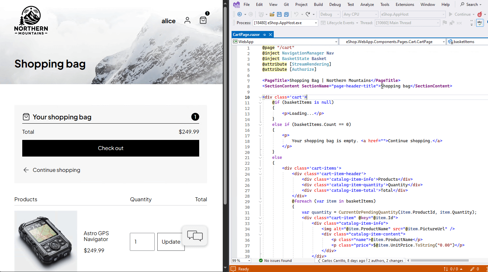
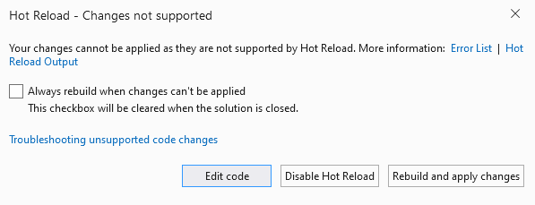

# Write and debug running code with Hot Reload in Visual Studio (C#, Visual Basic, C++)

Starting in Visual Studio 2022, the Hot Reload experience in Visual Studio works for both managed .NET and native C++ apps. Regardless of the type of app you’re working on, the intention of Hot Reload is to save you as many app restarts between edits as possible, making you more productive by reducing the time you spend waiting for apps to rebuild, restart, and re-navigate to the previous location where you were in the app itself.

We improve productivity by making it possible for you to edit your application's code files and apply the code changes immediately to the running application, also known as *Hot Reload*. Once your changes are applied, re-execute your code again by taking an action in the app itself (or through some sort of timer, etc.) and see the changes immediately; no pausing of the app through breakpoints is required!

## Update running code with Hot Reload

1. Open a project based on a supported application type. See [.NET](#support-for-net-applications) and [C++](#support-for-c-applications) supported applications.

1. Start the app with the debugger attached using either **F5** or, [if supported](#support-for-net-applications), **Ctrl+F5**.

1. Open a code file and change the code.

1. Apply the code changes using the **Hot Reload**  button, or press **ALT+F10**.

   

To see the changes in the user interface, the code needs to be re-executed. For example, code-behind for a button must re-execute, or code that is being triggered at an interval through a timer. As another example, ASP.NET Core supports automatic browser refreshing due to the [MetadataUpdateHandler](hot-reload-metadataupdatehandler.md) functionality.

## Support for .NET applications

* **When using Visual Studio 2022 and starting your app with the debugger**, the basic Hot Reload experience works with most types of .NET apps and framework versions. This support includes .NET Framework, .NET Core and .NET 5+ (for both C# and Visual Basic as applicable). The expectation in this scenario is that if you’re using the debugger, assume Hot Reload is available to you and give it a try!
* **When using Visual Studio 2022 but not using the debugger** (for example, using CTRL-F5 to start the app), Hot Reload is available when targeting most types of .NET 6 apps. In this scenario, apps not targeting .NET 6+ (that is, they target .NET 5 or below) don't support the "no debugger" scenario and must use the debugger to get Hot Reload support.
* **When using Visual Studio 2022 with a .NET 6+ app, most scenarios are supported**. This support isn't limited to the new "no debugger" feature mentioned previously. It also includes other new capabilities, such as support for hot reloading Blazor projects and, more generally, editing Razor files in any ASP.NET Core apps, and CSS Hot Reload. Using Visual Studio 2022 and apps that target .NET 6 together gives you the most powerful Hot Reload experience.

The following table shows the minimum .NET version required to support .NET Hot Reload with the debugger attached (F5) and without the debugger attached (Ctrl+F5), based on project type. Visual Studio 2022 version 17.8 or later is required.

|Application type|F5|Ctrl+F5|`MetadataUpdateHandler` support|
|-|-|-|-|
|Console|✅|.NET 6|.NET 6|
|Running on Linux/macOS (Docker and WSL)|.NET 8|.NET 6|.NET 8|
|Running on Arm64|.NET 7|.NET 7|.NET 7|
|WPF|✅|.NET 6|.NET 6|
|WinForms|✅|.NET 6|.NET 6|
|ASP.NET|✅|.NET 6|.NET 6|
|Blazor Server|.NET 6|.NET 6|.NET 6|
|Blazor WebAssembly|.NET 6|.NET 6|.NET 6|
|MAUI (WinUI/Android/iOS)|.NET 6|--|--|

The [types of edits you can make](../debugger/supported-code-changes-csharp.md) with Hot Reload are determined by the runtime and compiler version, not by the method you used to start the application (F5 or Ctrl+F5).

In the following sections, we provide additional details.

## Support for C++ applications

When using Visual Studio 2022 and starting your app with the debugger, you can hot reload a native C++ application when running under the debugger (F5) using the **Hot Reload** button. Hot Reload is also supported for apps built using CMake and OpenFolder projects.

For your project to support Hot Reload, you need the following options set:

* Project > Properties > C/C++ > General > **Debug Information Format** must be set to "Program Database for Edit and Continue `/ZI`"
* Project > Properties > Linker > General > **Enable Incremental Linking** must be set to "Yes `/INCREMENTAL`"

For supported edits, see [C++ Supported Code Changes](../debugger/supported-code-changes-cpp.md#BKMK_Requirements).

## Visual Studio 2022 with a .NET app, when using the debugger

When using Visual Studio 2022 and starting the app with the debugger, Hot Reload works with most app frameworks. 

Anywhere you have .NET and you’re using the Visual Studio managed debugger, you should get basic Hot Reload support. This fact means that even projects such as Azure Functions work great in this scenario.

> [!NOTE]
> By default, some projects use mixed mode debugging, which doesn't support Hot Reload. You can modify this setting in project settings, by setting **Project > Properties > Debug > Open debug launch profiles UI > Enable native code debugging** to false.

## Visual Studio 2022 with a .NET app, but not using the debugger

Hot Reload is available without the debugger when targeting most types of .NET 6+ apps.

This feature is exclusive to .NET 6+. Those apps not targeting .NET 6+ (that is, they target .NET 5 or below) don't support the "no debugger" scenario and must use the debugger to get access to Hot Reload functionality.

Also, not all project types currently support the "no debugger" scenario, see [Support for .NET applications](#support-for-net-applications).

## Visual Studio 2022 with a .NET 6+ app

If you use both Visual Studio 2022 and work on apps that target .NET 6+, you get the benefits of the most polished and capable Hot Reload experience.

Supported in this scenario:

* Blazor apps (Server and WebAssembly)
* Editing Razor files in both Blazor and regular ASP.NET Core websites
* CSS Hot Reload
* XAML Hot Reload
* Hot Reload support when running apps without the debugger (as described previously in more detail)

If you target .NET 6+, you continue to get improvements in upcoming Visual Studio 2022 updates and .NET feature band and major releases.

## Supported ASP.NET Core Scenarios

The basic Hot Reload experience is supported for many ASP.NET scenarios. The most widely available feature is the ability to change code-behind and other .NET class files for most types of web applications. This feature works while using the Visual Studio debugger and is present anywhere Hot Reload was previously available. For more specific guidance, see [.NET Hot Reload support for ASP.NET Core](/aspnet/core/test/hot-reload).

For ASP.NET Core developers who are targeting .NET 6+, there are additional capabilities not available for lower versions of .NET. These capabilities include:

* **CSHTML:** Editing a Razor CSHTML file supports many types of edits.
* **Browser Refresh:** Editing a razor file automatically refreshes the changes in your web browser when debugging. This feature was previously only available when starting the app without the debugger.
* **CSS Hot Reload:** You can change CSS files while the app is running, and changes are applied immediately to the running app as you type.
* **No Debugger:** You get Hot Reload support when using Visual Studio to start your web app without the debugger (CTRL-F5).

## Supported .NET changes

The .NET Hot Reload experience is powered by the [debugger](../debugger/edit-and-continue-visual-csharp.md) and C# compiler ([Roslyn](https://github.com/dotnet/roslyn)). [Roslyn supported edits](https://github.com/dotnet/roslyn/blob/main/docs/wiki/EnC-Supported-Edits.md) and [Supported code changes (C# and VB)](../debugger/supported-code-changes-csharp.md) list the types of edits currently supported and potential future enhancements.

## Unsupported .NET projects

Hot Reload isn't available in some project configurations:

* If you’re using Visual Studio without the debugger, Hot Reload only works for .NET apps targeting .NET 6+.
* If you’re using the Visual Studio debugger to run your app, but you’ve disabled `Enable Hot Reload and Edit and Continue when debugging` in settings, Hot Reload isn't supported.
* Release or custom build configurations aren't supported. Your project must use the `Debug` build configuration.
* If you're targeting an F# or .NET Native project.
* Some startup or compile optimizations aren't supported in .NET Hot Reload. For example, if your project's debug profile is configured in the following ways, .NET Hot Reload isn't supported:
  * [Trimming](/dotnet/core/deploying/trimming/trimming-options) is enabled for your project. For example, it's not supported if `PublishTrimmed` is set to True in your project file for the debug profile.
  * [ReadyToRun](/dotnet/core/deploying/ready-to-run) is enabled for your project. For example, it's not supported if `PublishReadyToRun` is set to True in your project file for the debug profile.

See [Unsupported scenarios](../debugger/supported-code-changes-csharp.md#unsupported-scenarios) for more details.

## Hot Reload Not Supported for F# #

Hot Reload, or Edit and Continue, is not supported when you debug F# code. Edits to F# code are possible during a debugging session but should be avoided. Code changes aren't applied during the debugging session. Therefore, any edits made to F# code while you debug will result in source code that doesn't match the code being debugged.

## Configure Hot Reload

To enable, disable, or configure Hot Reload, see [Configure Edit and Continue](../debugger/how-to-enable-and-disable-edit-and-continue.md).

## Warning message

If you see the following dialog box, Hot Reload is unable to apply the current edits without restarting. You can choose either to rebuild the app and apply changes (restart) or to continue editing. If you rebuild, all application state is lost. If you continue editing, it's possible that additional changes or corrections might cause Hot Reload to work again.

If you select the **Always rebuild when changes can't be applied** option in the dialog box, you won't see the dialog box again in the current Visual Studio session, and Visual Studio will automatically rebuild and reload instead of showing the dialog box.

## Troubleshooting

It's highly recommended to check for the **Hot Reload Output** window for detailed diagnostic information regarding the Hot Reload session.

If you're using response compression on .NET Core, see the information on [response compression](/dotnet/core/tools/dotnet-watch#response-compression).

## Related content

* [Edit and Continue (C#)](../debugger/edit-and-continue-visual-csharp.md)
* [Edit and Continue (C++)](../debugger/edit-and-continue-visual-cpp.md)
