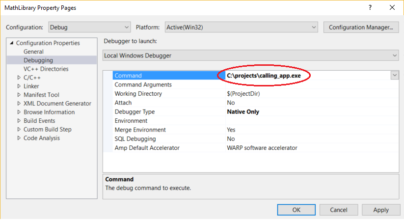
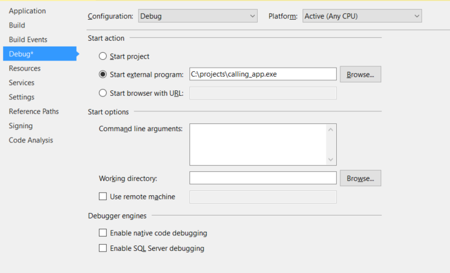

# How to: Debug from a DLL project in Visual Studio (C#, C++, Visual Basic, F#)

One way to debug a DLL project is to specify the calling app in the DLL project properties. Then you can start debugging from the DLL project itself. For this method to work, the app must call the same DLL in the same location as the one you configure. If the app finds and loads a different version of the DLL, that version won't contain your breakpoints. For other methods of debugging DLLs, see [Debugging DLL projects](../debugger/debugging-dll-projects.md).

If your managed app calls a native DLL, or your native app calls a managed DLL, you can debug both the DLL and the calling app. For more information, see [How to: Debug in mixed mode](../debugger/how-to-debug-in-mixed-mode.md).

Native and managed DLL projects have different settings to specify calling apps.

## Specify a calling app in a native DLL project

1. Select the C++ DLL project in **Solution Explorer**. Select the **Properties** icon, press **Alt**+**Enter**, or right-click and choose **Properties**.

1. In the **\<Project> Property Pages** dialog box, make sure the **Configuration** field at the top of the window is set to **Debug**.

1. Select **Configuration Properties** > **Debugging**.

1. In the **Debugger to launch** list, choose either **Local Windows Debugger** or **Remote Windows Debugger**.

1. In the **Command** or **Remote Command** box, add the fully qualified path and filename of the calling app, such as an *.exe* file.

   

1. Add any necessary program arguments to the **Command Arguments** box.

1. Select **OK**.

## Specify a calling app in a managed DLL project

1. Select the C# or Visual Basic DLL project in **Solution Explorer**. Select the **Properties** icon, press **Alt**+**Enter**, or right-click and choose **Properties**.

1. Make sure that the **Configuration** field at the top of the window is set to **Debug**.

1. Under **Start action**:

   - For .NET Framework DLLs, select **Start external program**, and add the fully qualified path and name of the calling app.

   - Or, select **Start browser with URL** and fill in the URL of a local ASP.NET app.

   - For .NET Core DLLs, the **Debug** Properties page is different. Select **Executable** from the **Launch** dropdown, and then add the fully qualified path and name of the calling app in the **Executable** field.

1. Add any necessary command-line arguments in the **Command line arguments** or **Application arguments** field.

   

1. Use **File** > **Save Selected Items** or **Ctrl**+**S** to save changes.

## Debug from the DLL project

1. Set breakpoints in the DLL project.

1. Right-click the DLL project and choose **Set as Startup Project**.

1. Make sure the **Solutions Configuration** field is set to **Debug**. Press **F5**, click the green **Start** arrow, or select **Debug** > **Start Debugging**.

If debugging does not hit your breakpoints, make sure that your DLL output (by default, the *\<project>\Debug* folder) is the location that the calling app is calling.

## See also
- [Debugging DLL projects](../debugger/debugging-dll-projects.md)
- [Project settings for  C# debug configurations](../debugger/project-settings-for-csharp-debug-configurations.md)
- [Project settings for a Visual Basic debug configuration](../debugger/project-settings-for-a-visual-basic-debug-configuration.md)
- [Project settings for a C++ debug configuration](../debugger/project-settings-for-a-cpp-debug-configuration.md)