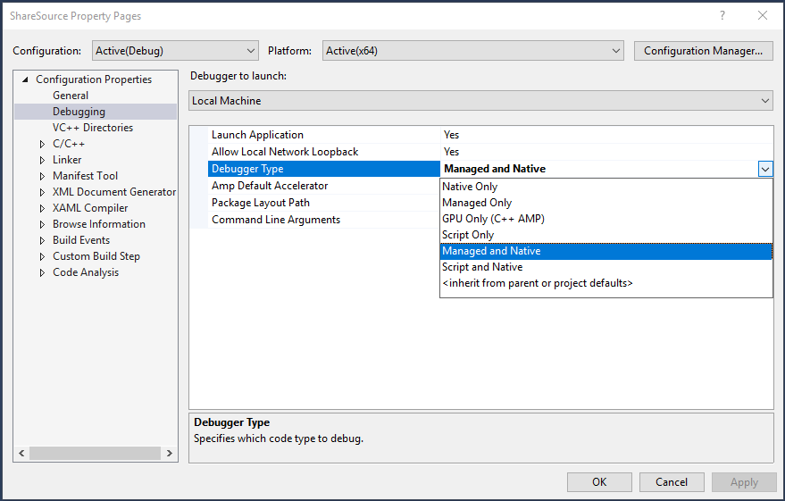
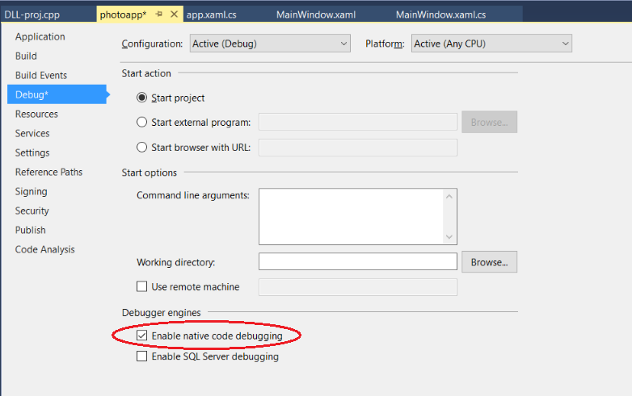

# How to: Debug in mixed mode (C#, C++, Visual Basic)

The following procedures describe how to enable debugging for managed and native code together, also known as mixed-mode debugging. There are two mixed-mode debugging scenarios:

- The app that calls a DLL is written in native code, and the DLL is managed.

- The app that calls a DLL is written in managed code, and the DLL is in native code. For a tutorial that walks you through this scenario in more detail, see [Debug managed and native code](../debugger/how-to-debug-managed-and-native-code.md).

You can enable both managed and native debuggers in the calling app project's **Property** pages. The settings differ between native and managed apps.

If you don't have access to a calling app's project, you can debug the DLL from the DLL project. You don't need mixed mode to debug just the DLL project. For more information, see [How to: Debug from a DLL project](../debugger/how-to-debug-from-a-dll-project.md).

> [!NOTE]
> The dialog boxes and commands you see might differ from the ones in this article, depending on your Visual Studio settings or edition. To change your settings, choose **Tools** > **Import and Export Settings**. For more information, see [Reset settings](../ide/environment-settings.md#reset-settings).

## Enable mixed-mode debugging for a native calling app

1. Select the C++ project in **Solution Explorer** and click the **Properties** icon, press **Alt**+**Enter**, or right-click and choose **Properties**.

1. In the **\<Project> Property Pages** dialog box, expand **Configuration Properties**, and then select **Debugging**.

1. Set **Debugger Type** to **Mixed** or **Auto**.

1. Select **OK**.

   

## Enable mixed-mode debugging for a managed calling app

1. Select the C# or Visual Basic project in **Solution Explorer** and select the **Properties** icon, press **Alt**+**Enter**, or right-click and choose **Properties**.

1. Select the **Debug** tab, and then select **Enable native code debugging**.

1. Close the properties page to save the changes.

   

> [!NOTE]
> In most versions of Visual Studio starting in Visual Studio 2017, you must use the *launchSettings.json* file instead of the project properties to enable mixed-mode debugging for native code in a .NET Core app. For details, see [Debug managed and native code](../debugger/how-to-debug-managed-and-native-code.md).

## See also

- [How to: Debug from a DLL project](../debugger/how-to-debug-from-a-dll-project.md)