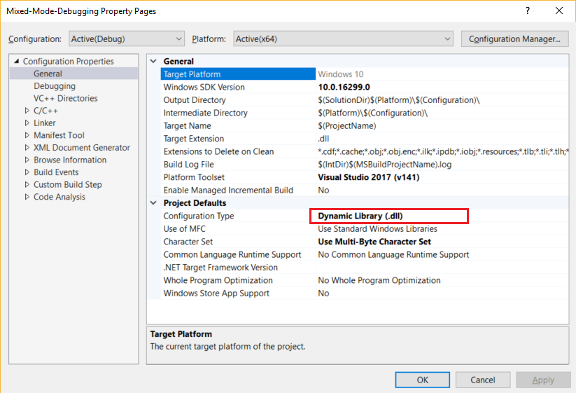
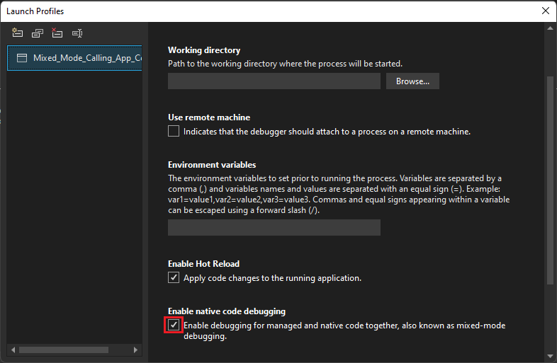
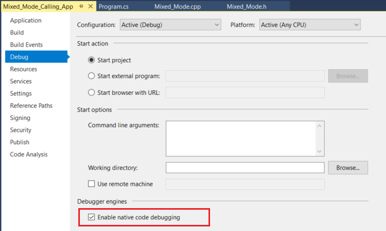
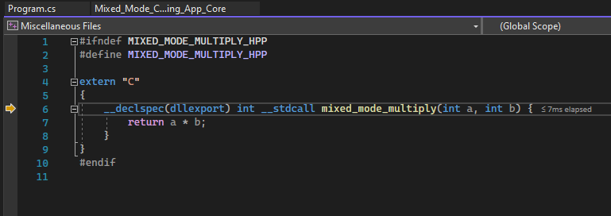
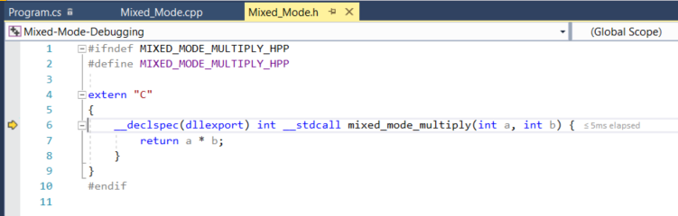

# Tutorial: Debug C# and C++ in the same debugging session

Visual Studio lets you enable more than one debugger type in a debugging session, which is called mixed-mode debugging. In this tutorial, you learn to debug both managed and native code in a single debugging session.

This tutorial shows how to debug native code from a managed app, but you can also [debug managed code from a native app](../debugger/how-to-debug-in-mixed-mode.md). The debugger also supports other types of mixed-mode debugging, such as debugging [Python and native code](../python/debugging-mixed-mode-c-cpp-python-in-visual-studio.md), and using the script debugger in app types such as ASP.NET.

In this tutorial, you will:

> [!div class="checklist"]
> * Create a simple native DLL
> * Create a simple .NET Core or .NET Framework app to call the DLL
> * Configure mixed-mode debugging
> * Start the debugger
> * Hit a breakpoint in the managed app
> * Step into the native code

## Prerequisites

::: moniker range=">=vs-2022"
You must have Visual Studio installed, with the following workloads:

* **Desktop development with C++**
* **.NET desktop development**
::: moniker-end
::: moniker range="<=vs-2019"
You must have Visual Studio installed, with the following workloads:

* **Desktop development with C++**
* **.NET desktop development** or **.NET Core cross platform development**, depending on the type of app that you want to create.
::: moniker-end

If you don't have Visual Studio, go to the [Visual Studio downloads](https://aka.ms/vs/download/?cid=learn-onpage-download-cta) page to install it for free.

If you have Visual Studio installed, but don't have the workloads you need, select **Open Visual Studio Installer** in the left pane of the Visual Studio **New Project** dialog box. In the Visual Studio Installer, select the workloads you need, and then select **Modify**.

## Create a simple native DLL

**To create the files for the DLL project:**

1. Open Visual Studio and create a project.

    ::: moniker range=">=vs-2022"
    Press **Esc** to close the start window. Type **Ctrl + Q** to open the search box, type **Empty Project**, and then select the **Empty Project** for C++. In the **Configure your new project** dialog box that appears, type a name like **Mixed_Mode_Debugging** and click **Create**.
    ::: moniker-end

    ::: moniker range="vs-2019"
    Press **Esc** to close the start window. Type **Ctrl + Q** to open the search box, type **Empty Project**, choose **Templates**, then choose **Empty Project** for C++. In the dialog box that appears, choose **Create**. Then, type a name like **Mixed_Mode_Debugging** and click **Create**.
    ::: moniker-end

    If you don't see the **Empty Project** project template, go to **Tools** > **Get Tools and Features...**, which opens the Visual Studio Installer. The Visual Studio Installer launches. Choose the **Desktop development with C++** workload, then choose **Modify**.

    Visual Studio creates the project.

1. In **Solution Explorer**, select **Source Files**, and then select **Project** > **Add New Item**. Or, right-click **Source Files** and select **Add** > **New Item**.

   If you don't see all the item templates, choose **Show All Templates**.

1. In the **New Item** dialog, select **C++ file (.cpp)**. Type **Mixed_Mode.cpp** in the **Name** field, and then select **Add**.

    Visual Studio adds the new C++ file to **Solution Explorer**.

1. Copy the following code into *Mixed_Mode.cpp*:

    ```cpp
    #include "Mixed_Mode.h"
    ```

1. In **Solution Explorer**, select **Header Files**, and then select **Project** > **Add New Item**. Or, right-click **Header Files** and select **Add** > **New Item**.

   If you don't see all the item templates, choose **Show All Templates**.

1. In the **New Item** dialog, select **Header file (.h)**. Type **Mixed_Mode.h** in the **Name** field, and then select **Add**.

   Visual Studio adds the new header file to **Solution Explorer**.

1. Copy the following code into *Mixed_Mode.h*:

    ```cpp
    #ifndef MIXED_MODE_MULTIPLY_HPP
    #define MIXED_MODE_MULTIPLY_HPP

    extern "C"
    {
      __declspec(dllexport) int __stdcall mixed_mode_multiply(int a, int b) {
        return a * b;
      }
    }
    #endif
    ```

1. Select **File** > **Save All** or press **Ctrl**+**Shift**+**S** to save the files.

**To configure and build the DLL project:**

1. In the Visual Studio toolbar, select **Debug** configuration and **x86** or **x64** platform. If your calling app will be .NET Core, which always runs in 64-bit mode, select **x64** as the platform.

1. In **Solution Explorer**, select the **Mixed_Mode_Debugging** project node and select the **Properties** icon, or right-click the project node and select **Properties**.

1. At the top of the **Properties** pane, make sure the **Configuration** is set to **Active(Debug)** and the **Platform** is the same as what you set in the toolbar: **x64**, or **Win32** for x86 platform.

   > [!IMPORTANT]
   > If you switch platform from **x86** to **x64** or vice versa, you must reconfigure the properties for the new platform.

1. Under **Configuration Properties** in the left pane, select **Linker** > **Advanced**, and in the dropdown next to **No Entry Point**, select **No**. If you had to change it to **No**, select **Apply**.

1. Under **Configuration Properties**, select **General**, and in the dropdown next to **Configuration Type**, select **Dynamic Library (.dll)**. Select **Apply**, and then select **OK**.

   

1. Select the project in **Solution Explorer** and then select **Build** > **Build Solution**, press **F7**, or right-click the project and select **Build**.

   The project should build with no errors.

## Create a simple managed app to call the DLL

1. Open Visual Studio and create a new project.

    ::: moniker range=">=vs-2022"
    Press **Esc** to close the start window. Type **Ctrl + Q** to open the search box, type **console**, and then select the C# **Console App** for .NET or .NET Framework.
    ::: moniker-end

    ::: moniker range="vs-2019"
    Press **Esc** to close the start window. Type **Ctrl + Q** to open the search box, type **console**, choose **Templates**, and then choose **Console App** for .NET Core or **Console App (.NET Framework)** for C#. In the dialog box that appears, choose **Next**.
    ::: moniker-end

    Then, type a name like **Mixed_Mode_Calling_App** and click **Next** or **Create**, whichever option is available.

    For .NET Core or .NET 5+, choose either the recommended target framework or .NET 8, and then choose **Create**.

    If you don't see the correct project template, go to **Tools** > **Get Tools and Features...**, which opens the Visual Studio Installer. Choose the correct .NET workload as described in the prerequisites, and then choose **Modify**.

    > [!NOTE]
    > You could also add the new managed project to your existing C++ solution. We are creating the project in a new solution to make the mixed-mode debugging task more difficult.

   Visual Studio creates the empty project and displays it in **Solution Explorer**.

1. Replace all the code in *Program.cs* with the following code:

    ```csharp
    using System;
    using System.Runtime.InteropServices;

    namespace Mixed_Mode_Calling_App
    {
        public class Program
        {
            // Replace the file path shown here with the
            // file path on your computer. For .NET Core, the typical (default) path
            // for a 64-bit DLL might look like this:
            // C:\Users\username\source\repos\Mixed_Mode_Debugging\x64\Debug\Mixed_Mode_Debugging.dll
            // Here, we show a typical path for a DLL targeting the **x86** option.
            [DllImport(@"C:\Users\username\source\repos\Mixed_Mode_Debugging\Debug\Mixed_Mode_Debugging.dll", EntryPoint =
            "mixed_mode_multiply", CallingConvention = CallingConvention.StdCall)]
            public static extern int Multiply(int x, int y);
            public static void Main(string[] args)
            {
                int result = Multiply(7, 7);
                Console.WriteLine("The answer is {0}", result);
                Console.ReadKey();
            }
        }
    }
    ```

1. In the new code, replace the file path in `[DllImport]` with your file path to the *Mixed_Mode_Debugging.dll* you just created. See the code comment for hints. Make sure to replace the *username* placeholder.

1. Select **File** > **Save Program.cs** or press **Ctrl**+**S** to save the file.

## Configure mixed-mode debugging

1. In **Solution Explorer**, select the **Mixed_Mode_Calling_App** project node and select the **Properties** icon, or right-click the project node and select **Properties**.

1. Enable native code debugging in the properties.

    ::: moniker range=">=vs-2022"
    **.NET code**

    Select **Debug** in the left pane, select **Open debug launch profiles UI**, then select the **Enable native code debugging** check box, and then close the properties page to save the changes.

    

    **.NET Framework code**

    On the left menu, select **Debug**. Then, in the **Debugger engines** section, select the **Enable native code debugging** property, and then close the properties page to save the changes.
    ::: moniker-end
    ::: moniker range="<=vs-2019"
    Select **Debug** in the left pane, select the **Enable native code debugging** check box, and then close the properties page to save the changes.

    
    ::: moniker-end

1. If you are targeting an x64 DLL from a .NET Framework app, change the platform target from **Any CPU** to x64. To do this, you may need to select **Configuration Manager** from the Debug toolbar's Solution Platform drop-down. Then, if you can't switch to x64 directly, create a **New** Configuration that targets x64.

## Set a breakpoint and start debugging

1. In the C# project, open *Program.cs*. Set a breakpoint on the following line of code by clicking in the far left margin, selecting the line and pressing **F9**, or right-clicking the line and selecting **Breakpoint** > **Insert Breakpoint**.

    ```csharp
    int result = Multiply(7, 7);
    ```

    A red circle appears in the left margin where you set the breakpoint.

1. Press **F5**, select the green arrow in the Visual Studio toolbar, or select **Debug** > **Start Debugging** to start debugging.

   The debugger pauses on the breakpoint that you set. A yellow arrow indicates where the debugger is currently paused.

## Step in and out of native code

1. While debugging is paused in the managed app, press **F11**, or select **Debug** > **Step Into**.

   The *Mixed_Mode.h* native header file opens, and you see the yellow arrow where the debugger is paused.

   ::: moniker range=">=vs-2022"
   
   ::: moniker-end
   ::: moniker range="<=vs-2019"
   
   ::: moniker-end

1. Now, you can set and hit breakpoints and inspect variables in the native or managed code.

   - Hover over variables in the source code to see their values.

   - Look at variable and their values in the **Autos** and **Locals** windows.

   - While paused in the debugger, you can also use the **Watch** windows and the **Call Stack** window.

1. Press **F11** again to advance the debugger one line.

1. Press **Shift**+**F11** or select **Debug** > **Step Out** to continue execution and pause again in the managed app.

1. Press **F5** or select the green arrow to continue debugging the app.

Congratulations! You have completed the tutorial on mixed-mode debugging.

## Next step

In this tutorial, you learned how to debug native code from a managed app by enabling mixed-mode debugging. For an overview of other debugger features, see:

> [!div class="nextstepaction"]
> [First look at the debugger](../debugger/debugger-feature-tour.md)
