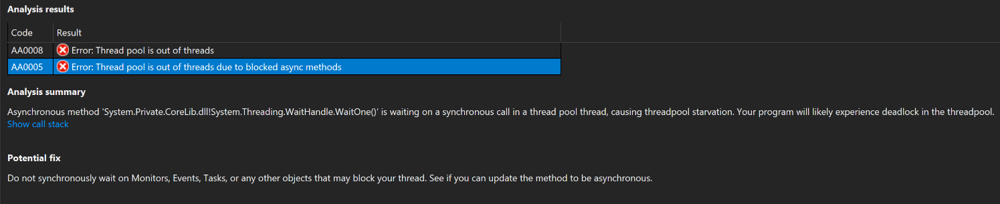

# How to debug a managed memory dump with .NET Diagnostic Analyzers

In this tutorial, you will:

> [!div class="checklist"]
> * Opening a memory dump
> * Select and execute analyzers against the dump
> * Review the results of the analyzers
> * Navigating to the problematic code

### Opening a memory dump in Visual Studio

First, let’s open the memory dump in Visual Studio by using the **File -> Open -> File** menu and select your memory dump.

Notice on the Memory Dump Summary page a new **Action** called **Run Diagnostics Analysis**.

Selecting this action will start the debugger and open the new **Diagnostic Analysis** page with a list of available analyzer options, organized by the underlying symptom.

### Select and execute analyzers against the dump

In this example the concern is "app not responding to requests in a timely manner". To investigate these symptoms, the best options are available under **Process Responsiveness** as it best matches my app's issue.

Clicking the **Analyze** button will start the investigation and present results based on the combination of process info and CLR data captured in the memory dump.
 
### Review the results of the analyzers

In the image below the analyzer has found two error results, and upon selecting the first result ("Thread pool is out of threads") I get to see the **Analysis Summary** which is proposing that the “CLR thread pool is experiencing starvation”. This information is really important to an investigation, it suggests that the CLR has currently used all available thread pool threads, which in turn means we cannot respond to any new requests until a thread is released.

The call out in this case is “Do not synchronously wait on Monitors, Events, Task, or any other objects that may block your thread. See if you can update the method to be asynchronous.”. My next job is to find that problematic code.

Selecting the second results “Thread pool is out of threads due to blocked async methods”, reveals the heart of the problem more specifically. By looking at the dump, the analyzer was able to find specific locations where we have inadvertently called blocking code from an asynchronous thread context, and this is leading directly to an exhaustion of thread pools.

### Navigating to the problematic code

By clicking on the **Show call stack** link Visual Studio will immediately switch to the threads that are exhibiting this behavior and the **Call Stack** window will show me all the methods that require further examination. I can quickly distinguish between my code (SyncOverAsyncExmple.*) from Framework code (System.*), and I can use this as the starting point of my investigation.

Each frame (or row) of a call stack corresponds to a method and by double-clicking on any of the stack frames I prompt Visual Studio to lead me to the code that led directly to this scenario on this thread. Unfortunately I do not have the symbols or the code associated with this application so on the Symbols not loaded page below I can select the Decompile Source code option.

In the decompiled source below it is clear to me that I have an asynchronous Task (ConsumeThreadPoolThread) calling a function (DoSomething) that contains a WaitHandle.WaitOne method, which is blocking the current thread pool thread until it receives a signal (exactly what I want to avoid!). So to improve the responsiveness of my app I have to find a way to remove this blocking code from all asynchronous contexts.

## See also

* [Use dump files in the debugger](../debugger/using-dump-files.md)
* [Generate source code from .NET assemblies while debugging](../debugger/decompilation.md)

