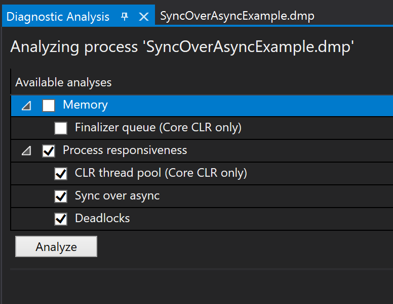
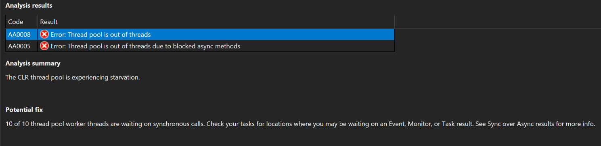
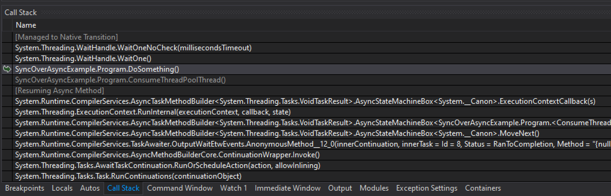
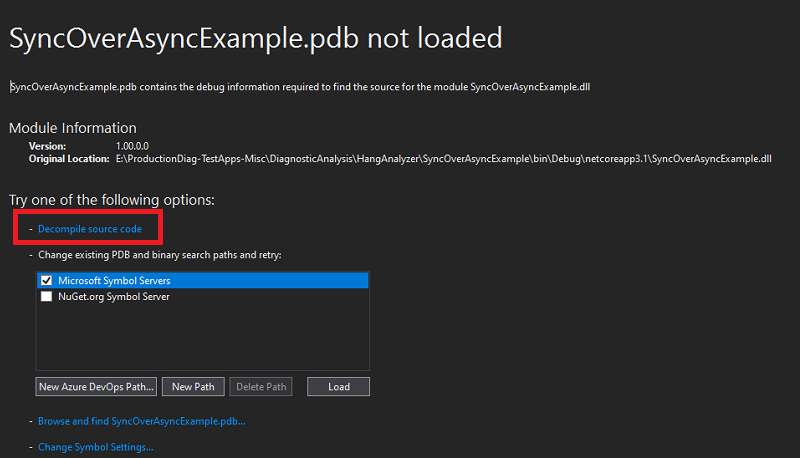
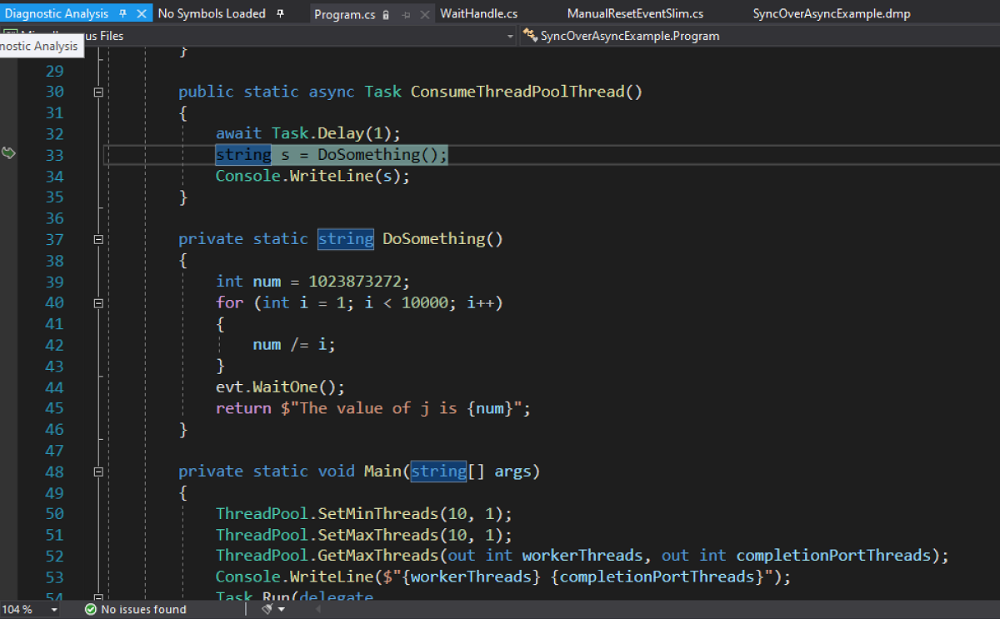

# Debug a managed memory dump with .NET Diagnostic Analyzers

In this tutorial, you will:

> [!div class="checklist"]
> * Opening a memory dump
> * Select and execute analyzers against the dump
> * Review the results of the analyzers
> * Navigating to the problematic code

In the example described in this article, the concern is that your app not responding to requests in a timely manner. 

## Opening a memory dump in Visual Studio

1. Open the memory dump in Visual Studio by using the **File > Open > File** menu command and select your memory dump.

1. Notice on the Memory Dump Summary page a new **Action** called **Run Diagnostics Analysis**.

   

1. Select this action to start the debugger and open the new **Diagnostic Analysis** page with a list of available analyzer options, organized by the underlying symptom.

## Select and execute analyzers against the dump

To investigate these symptoms, the best options are available under **Process Responsiveness** as it best matches the issue in this example.

   

1. Click the **Analyze** button to start the investigative process 

1. The analyzer will present results based on the combination of process info and CLR data captured in the memory dump.
 
## Review the results of the analyzers

1. In this case, the analyzer has found two errors. Select the analyzer result to see the **Analysis Summary** and suggested **Remediation**.

   

1. The **Analysis Summary** has stated that the “CLR thread pool is experiencing starvation”. This information suggests that the CLR has currently used all available thread pool threads, which means your service cannot respond to any new requests until a thread is released.

    > [!NOTE] 
    > The **Remediation** in this case is "Do not synchronously wait on Monitors, Events, Task, or any other objects that may block your thread. See if you can update the method to be asynchronous.".

## Navigating to the problematic code

My next job is to find that problematic code.

1. Clicking on the **Show call stack** link Visual Studio will immediately switch to the threads that are exhibiting this behavior.

1. The **Call Stack** window will show methods that might potentially quickly distinguish between my code (SyncOverAsyncExmple.*) from Framework code (System.*).

   

1. Each call stack frame corresponds to a method and by double-clicking on the stack frames Visual Studio will navigate to the code that led directly to this scenario on this thread.

1. In this example, there are no symbols or code, however, on the **Symbols not loaded** page you can select the **[Decompile Source code](../debugger/decompilation.md)** option.

   

1. In the decompiled source below it is evident that an asynchronous Task (ConsumeThreadPoolThread) is calling a synchronous blocking function.

    > [!NOTE]  
    > The "DoSomething()" method that contains a WaitHandle.WaitOne method, which is blocking the current thread pool thread until it receives a signal.

   To improve the apps responsiveness, it is important to remove blocking synchronous code from all asynchronous contexts.

   

## Related content

* [Use dump files in the debugger](../debugger/using-dump-files.md)
* [Generate source code from .NET assemblies while debugging](../debugger/decompilation.md)
* [Specify symbol (.pdb) and source files](../debugger/specify-symbol-dot-pdb-and-source-files-in-the-visual-studio-debugger.md)
