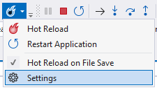
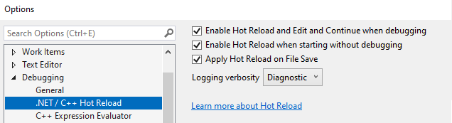

# Configure Edit and Continue (C#, VB, C++)

::: moniker range=">=vs-2022"
You can disable or enable Hot Reload, previously called Edit and Continue, in the Visual Studio **Options** dialog box at design time. **Hot Reload** works only in debug builds. For more information, see [Hot Reload](../debugger/hot-reload.md).
::: moniker-end

::: moniker range="vs-2019"
Edit and Continue is a time-saving feature that enables you to make changes to your source code while your program is in break mode. When you resume execution of the program by choosing an execution command like **Continue** or **Step**, Edit and Continue automatically applies the code changes with some limitations. This allows you to make changes to your code during a debugging session, instead of having to stop, recompile your entire program, and restart the debugging session.

You can disable or enable Edit and Continue in the Visual Studio **Options** dialog box at design time. **Edit and Continue** works only in debug builds. For more information, see [Edit and Continue](/visualstudio/debugger/how-to-enable-and-disable-edit-and-continue).
::: moniker-end

For native C++, **Edit and Continue** requires using the `/INCREMENTAL` option. For more information about feature requirements in C++, see this [blog post](https://devblogs.microsoft.com/cppblog/c-edit-and-continue-in-visual-studio-2015-update-3/) and [Edit and Continue (C++)](../debugger/edit-and-continue-visual-cpp.md).

::: moniker range=">=vs-2022"

## Enable and configure Hot Reload

You can configure Hot Reload by selecting **Settings** from the **Hot Reload** drop-down button.



Or, open **Tools** > **Options** > **Debugging** > **.NET/C++ Hot Reload**.

> [!NOTE]
> If IntelliTrace is enabled and you collect both IntelliTrace events and call information, Edit and Continue is disabled. For more information, see [IntelliTrace](../debugger/intellitrace.md).

The settings for Hot Reload include:

- **Enable Hot Reload**. Enables Hot Reload when starting with the debugger attached (F5).

- **Enable Hot Reload when starting without debugging**. Enables Hot Reload when starting without the debugger attached (Ctrl+F5).

- **Apply Hot Reload on File Save**. Applies code changes when you save the file.

- **Logging Verbosity**. Filters amount of information displayed in the Hot Reload Output window.



For .NET Hot Reload, you also can control whether Hot Reload is available at the project level by modifying your .NET 6+ project's *launchSetting.json* file and setting `hotReloadEnabled` to `false`.

Example:

```xaml
{
  "profiles": {
    "Console": {
      "commandName": "Project",
      "hotReloadEnabled": false
    }
  }
}
```

For C++, you can set additional options by opening **Tools** > **Options** > **Debugging** > **General**. Make sure **Enable Hot Reload** is selected, and set the other options:

- **Apply changes on continue (Native only)**

  If selected, Visual Studio automatically compiles and applies code changes when you continue debugging from a break state. Otherwise, you can choose to apply changes using **Debug** > **Apply Code Changes**.

- **Warn about stale code (Native only)**

  If selected, gives warnings about stale code.

::: moniker-end

::: moniker range="vs-2019"

## Enable or disable Edit and Continue

1. If you're in a debugging session, stop debugging (**Debug** > **Stop Debugging** or **Shift**+**F5**).

1. In **Tools** > **Options** > (or **Debug** > **Options**) > **Debugging** > **General**, select **Edit and Continue** in the right pane.

    > [!NOTE]
    > If IntelliTrace is enabled and you collect both IntelliTrace events and call information, Edit and Continue is disabled. For more information, see [IntelliTrace](../debugger/intellitrace.md).

1. For C++ code, make sure **Enable Native Edit and Continue** is selected, and set the other options:

   - **Apply changes on continue (Native only)**

     If selected, Visual Studio automatically compiles and applies code changes when you continue debugging from a break state. Otherwise, you can choose to apply changes using **Debug** > **Apply Code Changes**.

   - **Warn about stale code (Native only)**

     If selected, gives warnings about stale code.

1. Select **OK**.
::: moniker-end

::: moniker range=">=visualstudio"
## Configure Auto-restart

Hot Reload can automatically restart the app's process when an unsupported change (also called a rude edit) is made, instead of ending the entire debug session. To enable this, edit your project file to add the following property declaration.

```xml
<PropertyGroup>
  <HotReloadAutoRestart>true</HotReloadAutoRestart>
</PropertyGroup>
```

You can also set this property in a *Directory.Build.props* file. This streamlined auto-restart works for project types where a quick process restart is feasible (for example, some Aspire or web projects), so you can continue debugging with minimal interruption.

This is a process-based restart. For example, if you are debugging several projects, only the changed project(s), and any dependent project(s), are rebuilt and restarted.

## Configure Hot Reload for Razor
By co-hosting the Razor compiler inside the Roslyn process, editing a .razor file during Hot Reload is much faster and more efficient. Co-hosting also improves the overall reliability when using Hot Reload.

To enable co-hosting, select **Tools** > **Options**, and then search for `cohost`. Select or deselect the setting **Use Roslyn Cohost server for Razor (requires restart)**. If you enable this, it's recommended to restart Visual Studio. Co-hosting is enabled by default. 
::: moniker-end

## Stop code changes

::: moniker range=">=vs-2022"
While Hot Reload is in the process of applying code changes, you can stop the operation.
::: moniker-end

::: moniker range="vs-2019"
While Edit and Continue is in the process of applying code changes, you can stop the operation.
::: moniker-end

> [!CAUTION]
> Stopping code changes in managed code can produce unexpected results. Applying changes to managed code is normally a quick process, so there is seldom a need to stop code changes in managed code.

To stop applying code changes:

- Choose **Stop Applying Code Changes** from the **Debug** menu.

  This menu item is visible only when code changes are being applied.

  If you choose this option, none of the code changes are committed.
