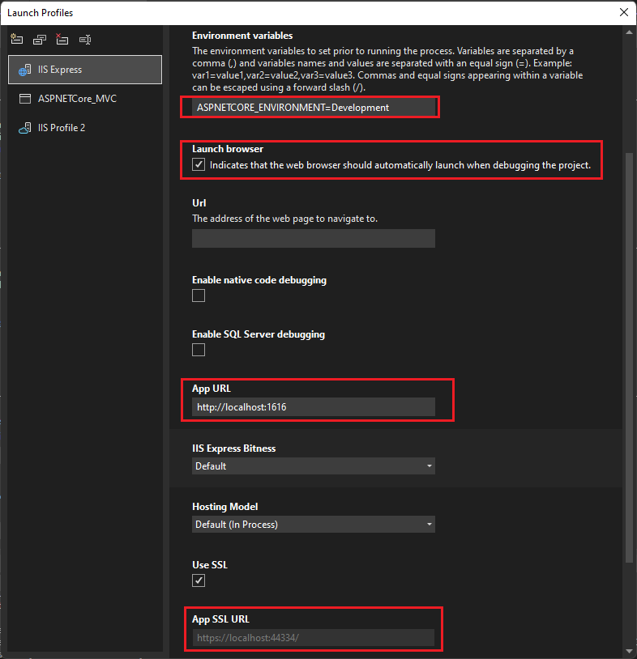
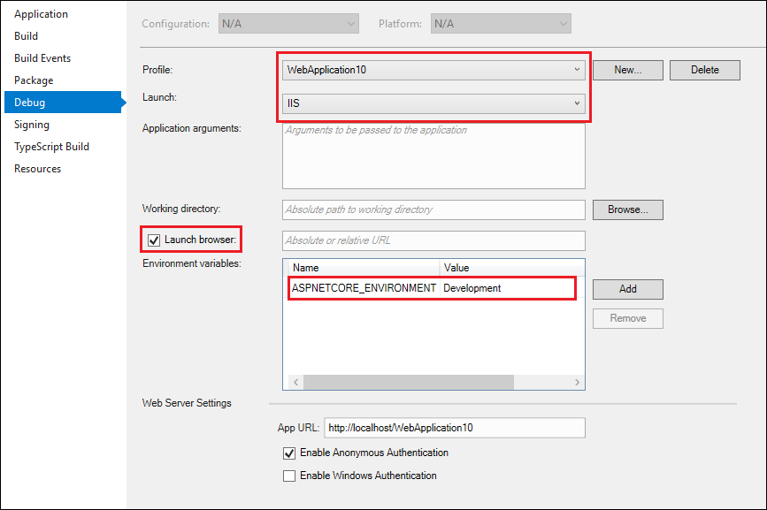
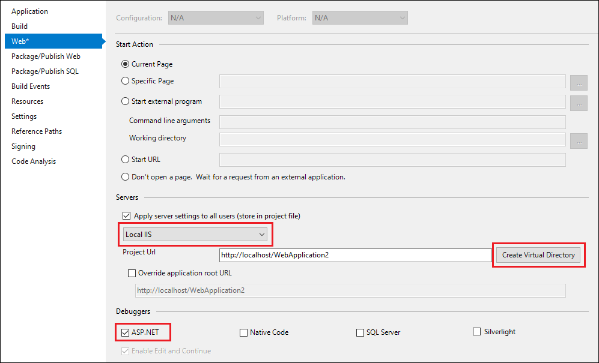

# Debug ASP.NET or ASP.NET Core apps in Visual Studio

You can debug ASP.NET and ASP.NET Core apps in Visual Studio. The process differs between ASP.NET and ASP.NET Core, and whether you run it on IIS Express or a local IIS server.

>[!NOTE]
>The following steps and settings apply only to debugging apps on a local server. Debugging apps on a remote IIS server uses **Attach to Process**, and ignores these settings. For more information and instructions for remote debugging ASP.NET apps on IIS, see [Remote debug ASP.NET on an IIS computer](../debugger/remote-debugging-aspnet-on-a-remote-iis-7-5-computer.md) or [Remote debug ASP.NET Core on a remote IIS computer](../debugger/remote-debugging-aspnet-on-a-remote-iis-computer.md).

::: moniker range=">=vs-2022"
The built-in Kestrel and IIS Express servers are included with Visual Studio. Kestrel is the default debug server for ASP.NET Core projects, and is preconfigured. IIS Express is the default debug server for ASP.NET.
::: moniker-end

::: moniker range="vs-2019"
The built-in IIS Express server is included with Visual Studio. IIS Express is the default debug server for ASP.NET and ASP.NET Core projects, and is preconfigured. It's the easiest way to debug, and ideal for initial debugging and testing.

For ASP.NET Core, you can also debug on the Kestrel web server.
::: moniker-end

## Prerequisites for local IIS server

You can also debug an ASP.NET or ASP.NET Core app on a local IIS server (version 8.0 or higher) that is configured to run the app. To debug on local IIS, you must meet the following requirements:

<a name="iis"></a>
- If it's not installed, install the **ASP.NET and web development workload**. (Rerun the Visual Studio Installer, select **Modify**, and add this workload.)

- Run Visual Studio as an administrator.
- Install and correctly configure IIS with the appropriate version(s) of ASP.NET and/or ASP.NET Core. For more information on using IIS with ASP.NET Core, see [Host ASP.NET Core on Windows with IIS](/aspnet/core/host-and-deploy/iis/index). For ASP.NET, see [Install IIS and ASP.NET Modules](/iis/application-frameworks/scenario-build-an-aspnet-website-on-iis/configuring-step-1-install-iis-and-asp-net-modules).
- Make sure the app runs on IIS without errors.

::: moniker range=">=vs-2022"
## Debug ASP.NET Core apps

A default profile named **https** or one based on the project name may be present, which are configured for the Kestrel web server. If you're debugging on local IIS instead, make sure you meet the [prerequisites for local IIS debugging](#prerequisites-for-local-iis-server).

1. Select the ASP.NET Core project in Visual Studio **Solution Explorer** and click the **Properties** icon, or press **Alt**+**Enter**, or right-click and choose **Properties**.

1. Select the **Debug** tab and click the link to open the **Open debug launch profiles UI**.

   The UI presented corresponds to the settings in the project's `launchSettings.json` file. For more information on this file, see the Development and `launchSettings.json` section in [Use multiple environments in ASP.NET Core](/aspnet/core/fundamentals/environments).

1. Select the profile to configure for debugging.

   - For Kestrel, select the **https** profile or the profile named after the project.
   - For IIS Express, select **IIS Express** from the dropdown.
   - For local IIS, select **New** and create a new IIS profile.

1. Make sure **Launch browser** is selected.

1. Make sure that **Url**, **App URL**, and **App SSL URL** are correct.

   **Url** specifies the location of host URL for .NET Core or .NET 5+. For a profile named after the project (that is, the commandName property in `launchSettings.json` is *Project*), the Kestrel server listens to the port specified. For an IIS profile, this is typically the same value as the **App URL**. For more information, see the IIS launch profile section under [Configure the project](/aspnet/core/host-and-deploy/iis/development-time-iis-support#configure-the-project).

   **App URL** and **App SSL URL** specify the application URL(s).

   - For an **https** profile, the **App URL** property is typically `https://localhost:7241;http://localhost:5175`.
   - For a profile named after the project, these properties are typically `http://localhost:5000` and `https://localhost:5001`.
   - For IIS Express, the **App SSL URL** is typically `https://localhost:44334`.

1. Under **Environment variables**, make sure that **ASPNETCORE_ENVIRONMENT** is present with a value of **Development**. If not, add the variable.

   

   For more information about environment variables, see [Environments](/aspnet/core/fundamentals/environments#environments-1).

1. To debug the app, in your project, set breakpoints on some code. In the Visual Studio toolbar, make sure the configuration is set to **Debug**.

1. To start debugging, select  the profile name in the toolbar, such as **https**, **IIS Express**, or **\<IIS profile name>** in the toolbar, select **Start Debugging** from the **Debug** menu, or press **F5**. The debugger pauses at the breakpoints. If the debugger can't hit the breakpoints, see [Troubleshoot debugging](#troubleshoot-debugging).
::: moniker-end

::: moniker range="<=vs-2019"
## Debug ASP.NET Core apps

IIS Express is the default, and is preconfigured. If you're debugging on Local IIS, make sure you meet the [requirements for local IIS debugging](#iis).

1. Select the ASP.NET Core project in Visual Studio **Solution Explorer** and click the **Properties** icon, or press **Alt**+**Enter**, or right-click and choose **Properties**.

1. Select the **Debug** tab.

1. In the **Properties** pane, next to **Profile**,
   - For IIS Express, select **IIS Express** from the dropdown.
   - For local IIS, select the app name from the dropdown, or select **New**, create a new profile name, and select **OK**.

1. Next to **Launch**, select either **IIS Express** or **IIS** from the dropdown.

1. Make sure **Launch browser** is selected.

1. Under **Environment variables**, make sure that **ASPNETCORE_ENVIRONMENT** is present with a value of **Development**. If not, select **Add** and add it.

   

1. Use **File** > **Save Selected Items** or **Ctrl**+**S** to save any changes.

1. To debug the app, in your project, set breakpoints on some code. In the Visual Studio toolbar, make sure the configuration is set to **Debug**, and either **IIS Express**, or the new IIS profile name, appears in the emulator field.

1. To start debugging, select **IIS Express** or **\<IIS profile name>** in the toolbar, select **Start Debugging** from the **Debug** menu, or press **F5**. The debugger pauses at the breakpoints. If the debugger can't hit the breakpoints, see [Troubleshoot debugging](#troubleshoot-debugging).
::: moniker-end

## Debug ASP.NET apps

IIS Express is the default, and is preconfigured. If you're debugging on Local IIS, make sure you meet the [requirements for local IIS debugging](#iis).

1. Select the ASP.NET project in Visual Studio **Solution Explorer** and click the **Properties** icon, or press **Alt**+**Enter**, or right-click and choose **Properties**.

1. Select the **Web** tab.

   If you don't see the **Web** tab, see [Debug ASP.NET Core apps](#debug-aspnet-core-apps). The Web tab only appears for ASP.NET Framework.

1. In the **Properties** pane, under **Servers**,
   - For Kestrel, select **https** from the dropdown.
   - For IIS Express, select **IIS Express** from the dropdown.
   - For local IIS,
     1. Select **Local IIS** from the dropdown.
     1. Next to the **Project URL** field, select **Create Virtual Directory**, if you haven't yet set up the app in IIS.

1. Under **Debuggers**, select **ASP.NET**.

   

1. Choose **File** > **Save Selected Items** (or press **Ctrl**+**S**) to save any changes.

1. To debug the app, in your project, set breakpoints on some code. In the Visual Studio toolbar, make sure the configuration is set to **Debug**, and the browser you want appears in **IIS Express (\<Browser name>)** or **Local IIS (\<Browser name>)** in the emulator field.

1. To start debugging, select **IIS Express (\<Browser name>)** or **Local IIS (\<Browser name>)** in the toolbar, select **Start Debugging** from the **Debug** menu, or press **F5**. The debugger pauses at the breakpoints. If the debugger can't hit the breakpoints, see [Troubleshoot debugging](#troubleshoot-debugging).

## Troubleshoot debugging

If local IIS debugging can't progress to the breakpoint, follow these steps to troubleshoot.

1. Start the web app from IIS, and make sure it runs correctly. Leave the web app running.

2. From Visual Studio, select **Debug > Attach to Process** or press **Ctrl**+**Alt**+**P**, and connect to the ASP.NET or ASP.NET Core process (typically **w3wp.exe** or **dotnet.exe**). For more information, see [Attach to Process](attach-to-running-processes-with-the-visual-studio-debugger.md) and [How to find the name of the ASP.NET process](how-to-find-the-name-of-the-aspnet-process.md).

If you can connect and hit the breakpoint by using **Attach to Process**, but not by using **Debug** > **Start Debugging** or **F5**, a setting is probably incorrect in the project properties. If you use a HOSTS file, make sure it's also configured correctly.

## Configure debugging in the web.config file

ASP.NET projects have `web.config` files by default, which contain both app configuration and launch information, including debug settings. The `web.config` files must be configured correctly for debugging. The **Properties** settings in previous sections update the `web.config` files, but you can also configure them manually.

> [!NOTE]
> ASP.NET Core projects do not initially have `web.config` files, but use `appsettings.json` and `launchSettings.json` files for app configuration and launch information. Deploying the app creates a `web.config` file or files in the project, but they do not typically contain debug information.

> [!TIP]
> Your deployment process may update the `web.config` settings, so before trying to debug, make sure the `web.config` is configured for debugging.

**To manually configure a `web.config` file for debugging:**

1. In Visual Studio, open the ASP.NET project's `web.config` file.

2. `Web.config` is an XML file, so contains nested sections marked by tags. Locate the `configuration/system.web/compilation` section. (If the `compilation` element doesn't exist, create it.)

3. Make sure that the `debug` attribute in the `compilation` element is set to `true`. (If the `compilation` element doesn't contain a `debug` attribute, add it and set it to `true`.)

   If you are using local IIS instead of the default IIS Express server, make sure that the `targetFramework` attribute value in the `compilation` element matches the framework on the IIS server.

   The `compilation` element of the `web.config` file should look like the following example:

   > [!NOTE]
   > This example is a partial `web.config` file. There are usually additional XML sections in the `configuration` and `system.web` elements, and the `compilation` element might also contain other attributes and elements.

   ```xml
   <configuration>
      ...
      <system.web>
          <compilation  debug="true"  targetFramework="4.6.1" ... >
             ...
          </compilation>
      </system.web>
   </configuration>
   ```

ASP.NET automatically detects any changes to `web.config` files and applies the new configuration settings. You don't have to restart the computer or the IIS server for changes to take effect.

A website can contain several virtual directories and subdirectories, with `web.config` files in each one. ASP.NET apps inherit configuration settings from `web.config` files at higher levels in the URL path. The hierarchical `web.config` file settings apply to all ASP.NET apps below them in the hierarchy. Setting a different configuration in a `web.config` file lower in the hierarchy overrides the settings in the higher file.

For example, if you specify `debug="true"` in <em>www.microsoft.com/aaa/web.config</em>, any app in the `aaa` folder or in any subfolder of `aaa` inherits that setting, except if one of those apps overrides the setting with its own `web.config` file.

> [!IMPORTANT]
> Debug mode greatly reduces the performance of your app. When you deploy a production app or conduct performance measurements, set `debug="false"` in the `web.config` and specify a Release build.

## Related content
- [ASP.NET debugging: system requirements](aspnet-debugging-system-requirements.md)
- [How to: Run the worker process under a user account](how-to-run-the-worker-process-under-a-user-account.md)
- [How to: Find the name of the ASP.NET process](how-to-find-the-name-of-the-aspnet-process.md)
- [Debug deployed web applications](debugging-deployed-web-applications.md)
- [How to: Debug ASP.NET exceptions](how-to-debug-aspnet-exceptions.md)
- [Debug web applications: Errors and troubleshooting](debugging-web-applications-errors-and-troubleshooting.md)
