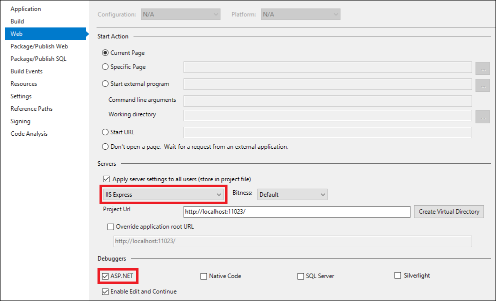
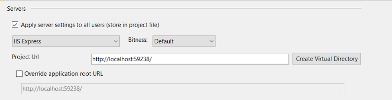
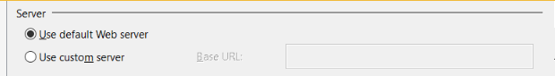

# Debug ASP.NET Applications in Visual Studio

You can debug ASP.NET applications from Visual Studio.

## Requirements

To follow the instructions in this topic, you need:

- IIS Express, which is included by default in Visual Studio 2012 and later

    -or-

- A local IIS web server (version 8.0 or higher) that is configured correctly and can run the ASP.NET application without errors.

If the server is remote, the remote debugger must be running on the remote computer. To debug on a remote IIS server, see [Remote Debug ASP.NET on an IIS Computer](../debugger/remote-debugging-aspnet-on-a-remote-iis-7-5-computer.md). 

## Configure debug settings

### Enable ASP.NET debugging in the project properties

1. Open your ASP.NET project in Visual Studio.

2. Right-click the project in **Solution Explorer**, choose **Properties**, and then click the **Web** tab.

    For some project types, select **Properties > Debug** instead. For a Web Forms ASP.NET project, right-click the project and select **Property Pages > Start Options**.
  
3.  Under **Debuggers**, select the **ASP.NET** check box.

    

> [!NOTE]
> If you create a new ASP.NET project (**File > New Project**), the debug settings are already configured correctly.

### Enable debugging in the web.config file  

To debug a web app, application's web.config file must be configured correctly. A web.config file is required if you host the app on IIS or IIS Express.

For ASP.NET Core, the web.config file is created automatically when the app is deployed (if it is not already present).

> [!TIP]
> Your deployment process may update the web.config settings. So before trying to debug, verify the web.config setting on the server.
  
1.  In Visual Studio, open the project's web.config file.  
  
    > [!NOTE]  
    > You cannot access the web.config file remotely by using a Web browser. For security reasons, [!INCLUDE[vstecasp](../code-quality/includes/vstecasp_md.md)] configures Microsoft IIS to help prevent direct browser access to Web.config files. If you try to access a configuration file by using a browser, you get an HTTP access error 403 (forbidden).  
  
2.  Locate the `configuration/system.web/compilation` element. If the compilation element does not exist, create it.

    Web.config is an XML file, and so contains nested sections marked by tags.
  
3.  If the `compilation` element does not contain a `debug` attribute, add the attribute to the element.  
  
4.  Make sure the `debug` attribute value is set to `true`.  
  
The web.config file should look like the following example:

> [!NOTE]
> This example is a partial web.config file. Additional XML sections are typically present between the configuration and system.web elements. The compilation element might also contain other attributes and elements.
  
#### Example  
  
```  
<configuration>  
    ...  
    <system.web>  
        <compilation  
            debug="true"  
            ...  
        >  
        ...  
        </compilation>  
    </system.web>  
</configuration>  
```

If you are using an external server instead of the default IIS Express server, you must also make sure that the `targetFramework` attribute value matches the configuration on the server.

> [!IMPORTANT]
> For best performance, set a production app to `debug=false` and specify a Release build when you build and publish the app.

## Configure project settings for the server

For debugging on a local web server, set project properties. For debugging on a remote server, follow the more comprehensive instructions described in [Remote Debugging ASP.NET on IIS](../debugger/remote-debugging-aspnet-on-a-remote-iis-7-5-computer.md) instead.

1. In the **Web** tab of the project properties, select either **IIS Express** or **External Server** under the **Server** settings. (For some project types, these settings appear under the **Debug** tab instead.)

    

    IIS Express is the default server for ASP.NET and does not typically require any special configuration. This is the easiest way to debug an ASP.NET application.

    For a Web Forms ASP.NET project, right-click the project, choose **Property Pages > Start Options**, and select either **Use default Web server** or **Use custom server** (instead of **External Server**).

    

2. If you choose an external (custom) server, enter the correct URL in the **Project URL** (or **Base URL**) field.

    If the external server is local IIS, IIS must be installed and configured correctly. For example, the correct version of ASP.NET must be configured in IIS. For more information, see [IIS 8.0 Using ASP.NET 3.5 and ASP.NET 4.5](/iis/get-started/whats-new-in-iis-8/iis-80-using-aspnet-35-and-aspnet-45). If you want to test deployment as well as debugging, see [Deploying to test](/aspnet/web-forms/overview/deployment/visual-studio-web-deployment/deploying-to-iis).

    If the external server is [remote](../debugger/remote-debugging-aspnet-on-a-remote-iis-7-5-computer.md), you attach to the process instead, and these project settings are not used for debugging.

## (Local IIS web server) Configure IIS

For IIS Express, you don't need to configure the web server (skip this section). IIS Express is recommended for initial testing.

If you are using local IIS web server, follow these steps.

1. Make sure that IIS is installed correctly. For more information, see [IIS 8.0 Using ASP.NET 3.5 and ASP.NET 4.5](/iis/get-started/whats-new-in-iis-8/iis-80-using-aspnet-35-and-aspnet-45).

    * Make sure that you install the correct version of ASP.NET on the server. Use the Web Platform Installer (WebPI) to install ASP.NET 4.5 (from the Server node in Windows Server 2012 R2, choose **Get New Web Platform Components** and then search for ASP.NET). To install ASP.NET Core, see [Publishing to IIS](https://docs.asp.net/en/latest/publishing/iis.html#iis-configuration).

    > [!NOTE]
    > If you are using Windows Server 2008 R2, install ASP.NET 4 instead using this command:

     **C:\Windows\Microsoft.NET\Framework64\v4.0.30319\aspnet_regiis.exe -ir**

2. Open the **Internet Information Services (IIS) Manager**. (In the left pane of Server Manager, select **IIS**. Right-click the server and select **Internet Information Services (IIS) Manager**.)

3. Under **Connections** in the left pane, go to **Sites**.

4. Right-click the **Default Web Site** node and select **Add Application**.

5. Set the **Alias** field to **MyASPApp**, accept the default Application Pool (**DefaultAppPool**), and set the **Physical path** to **C:\inetpub\myNewFolder** (create a new folder for the app).

6. Under **Connections**, select **Application Pools**. Open **DefaultAppPool** and set the Application pool field to the value that is correct for your application (use ASP.NET 4 for ASP.NET 4.5. Use **No Managed Code** for ASP.NET Core).

## (Local IIS web server) Deploy the app

For IIS Express, the web app is deployed automatically when you start debugging (skip this section).

If you are using local IIS web server, follow these steps. There are different ways to publish your app to IIS. In these steps, we show how to create and use a Publish profile so that you can deploy using the file system.

1. Restart Visual Studio as an Administrator.

    To deploy using this method, you need Administrator privileges.

2. In Visual Studio, right-click the project and choose **Publish** (for Web Forms, use **Publish Web App**).

3. Choose **IIS, FTP, etc.** and click **Publish**.

    

    For a Web Forms app, choose **Custom** in the Publish dialog box, enter a profile name, and choose **OK**.

4. In the **Publish method** field, choose **File system**.

5. For the **Target location**, click the **Browse** button.

6. (ASP.NET Core) Choose **File System** and select the folder where you previously created for the app.

6. (ASP.NET) Choose **Local IIS**, and select the web site you previously created, and then click **Open**.

    

    > [!TIP]
    > If you see a message that says the web server is not configured correctly, make sure that the correct version of ASP.NET is installed for IIS.

7. Click **Next** and choose a **Debug** configuration.

    > [!NOTE]
    > If you deploy with a Release configuration, this sets `debug=false` in the server's web.config file.

8. Click **Save** to save the publish settings, and then click **Publish**.

    > [!CAUTION]
    >  If you need to make changes to the code or rebuild, you must republish and repeat this step. The executable you copied to the remote machine must exactly match your local source and symbols.

## Set a breakpoint and start debugging

1. In your project in Visual Studio, set a breakpoint on some code that you know will run.

2. To start debugging, press **F5** (**Debug > Start Debugging**).

3. Take actions to run the code that contains the breakpoint.

    The debugger pauses where you set the breakpoint.

### (Local IIS) Troubleshooting: Cannot hit the breakpoint

1. Start the web app from IIS and make sure it runs correctly. Leave the web app running.

2. From Visual Studio, select **Debug > Attach to Process** and connect to the ASP.NET process (typically **w3wp.exe** or **dotnet.exe**). For more information, see [Attach to Process](../debugger/attach-to-running-processes-with-the-visual-studio-debugger.md).

    If you are able to connect using **Attach to Process** and can hit a breakpoint, but can't start debugging using **F5**, then it is likely that a setting is incorrect in the project properties. If you are using a HOSTS file, verify that it is configured correctly.

  
## Robust Programming  
[!INCLUDE[vstecasp](../code-quality/includes/vstecasp_md.md)] automatically detects any changes to Web.config files and applies the new configuration settings. You do not have to restart the computer or restart the IIS server for changes to take effect.  
  
A Web site can contain multiple virtual directories and subdirectories, and Web.config files may exist in each one. [!INCLUDE[vstecasp](../code-quality/includes/vstecasp_md.md)] applications inherit settings from Web.config files at higher levels in the URL path. Hierarchical configuration files allow you to change settings for several [!INCLUDE[vstecasp](../code-quality/includes/vstecasp_md.md)] applications at the same time, such as for all applications below it in the hierarchy. However, if `debug` is set in a file lower in the hierarchy, it overrides the higher value.  
  
For example, you could specify `debug="true"` in www.microsoft.com/aaa/Web.config, and any application in the aaa folder or in any subfolder of aaa inherits that setting. So if your [!INCLUDE[vstecasp](../code-quality/includes/vstecasp_md.md)] application is at www.microsoft.com/aaa/bbb, it inherits that setting, as will any [!INCLUDE[vstecasp](../code-quality/includes/vstecasp_md.md)] applications in www.microsoft.com/aaa/ccc, www.microsoft.com/aaa/ddd, and so on. The only exception is if one of those applications overrides the setting by means of its own lower Web.config file.  
  
> [!IMPORTANT]
> Enabling debug mode greatly affects the performance of your [!INCLUDE[vstecasp](../code-quality/includes/vstecasp_md.md)] application. Remember to disable debug mode before you deploy a release application or conduct performance measurements.  
  
## See Also  
[ASP.NET debugging: system requirements](aspnet-debugging-system-requirements.md)   
[How to: Run the worker process under a user account](how-to-run-the-worker-process-under-a-user-account.md)   
[How to: Find the name of the ASP.NET process](how-to-find-the-name-of-the-aspnet-process.md)   
[Debug deployed Web applications](debugging-deployed-web-applications.md)   
[Walkthrough: Debugging a Web Form](walkthrough-debugging-a-web-form.md)   
[How to: Debug ASP.NET exceptions](how-to-debug-aspnet-exceptions.md)   
[Debug Web applications: Errors and troubleshooting](debugging-web-applications-errors-and-troubleshooting.md)
  