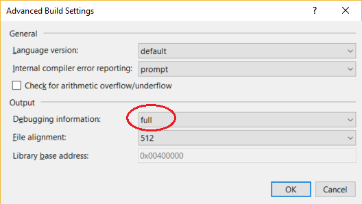
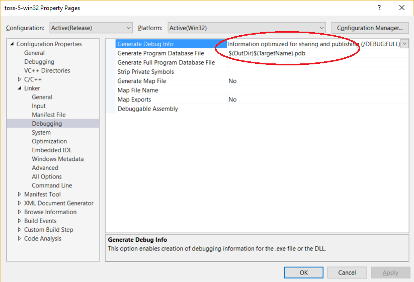

# Set debug and release configurations in Visual Studio

Visual Studio projects have separate release and debug configurations for your program. You build the debug version for debugging and the release version for the final release distribution.

In debug configuration, your program compiles with full symbolic debug information and no optimization. Optimization complicates debugging, because the relationship between source code and generated instructions is more complex.

The release configuration of your program has no symbolic debug information and is fully optimized. For managed code and C++ code, debug information can be generated in .pdb files, [depending on the compiler options](#BKMK_symbols_release) that are used. Creating .pdb files can be useful if you later have to debug your release version.

For more information about build configurations, see [Understand build configurations](../ide/understanding-build-configurations.md).

You can change the build configuration from the **Build** menu, from the toolbar, or in the project's property pages. Project property pages are language-specific. The procedure below shows how to change the build configuration from the menu and the toolbar. For more information about how to change the build configuration in projects in different languages, see the [See also](#see-also) section below.

## Change the build configuration

To change the build configuration, either:

* From the **Build** menu, select **Configuration Manager**, then select **Debug** or **Release**.

or

* On the toolbar, choose either **Debug** or **Release** from the **Solution Configurations** list.

  

## Generate symbol (.pdb) files for a build (C#, C++, Visual Basic, F#)

You can choose to generate symbol (.pdb) files and what debug information to include. For most project types, the compiler generates symbol files by default for debug and release builds, while other default settings differ by project type and Visual Studio version.

> [!IMPORTANT]
> The debugger will load only a .pdb file for an executable file that exactly matches the .pdb file that was created when the executable was built (that is, the .pdb must be the original or a copy of the original .pdb file). For more information, see [Why does Visual Studio require debugger symbol files to exactly match the binary files that they were built with?](/archive/blogs/jimgries/why-does-visual-studio-require-debugger-symbol-files-to-exactly-match-the-binary-files-that-they-were-built-with).

Each project type may have a different way of setting these options.

### Generate symbol files for a C#, ASP.NET, or Visual Basic project

For detailed information on project settings for debug configurations in C# or Visual Basic, see [Project settings for a C# debug configuration](../debugger/project-settings-for-csharp-debug-configurations.md) or [Project settings for a Visual Basic debug configuration](../debugger/project-settings-for-a-visual-basic-debug-configuration.md).

1. In Solution Explorer, select the project.

2. Select the **Properties** icon (or press **Alt+Enter**).

3. In the side pane, choose **Build** (or **Compile** in Visual Basic).

4. In the **Configuration** list, choose **Debug** or **Release**.

5. Select the **Advanced** button (or the **Advanced Compile Options** button in Visual Basic).

6. In the **Debugging information** list (or the **Generate debug info** list in Visual Basic), choose **Full**, **Pdb-only**, or **Portable**.

   The portable format is the most recent cross-platform format for .NET Core. For more information on options, see [Advanced Build Settings dialog box (C#)](../ide/reference/advanced-build-settings-dialog-box-csharp.md).

   

7. Build your project.

   The compiler creates the symbol file(s) in the same folder as the executable or the main output file.

### Generate symbol files for a C++ project

1. In Solution Explorer, select the project.

2. Select the **Properties** icon (or press **Alt+Enter**).

3. In the **Configuration** list, choose **Debug** or **Release**.

4. In the side pane, choose **Linker > Debugging**, then select options for **Generate Debug Info**.

   For detailed information on project settings for debug configurations in C++, see [Project settings for a C++ debug configuration](../debugger/project-settings-for-a-cpp-debug-configuration.md).

5. Configure options for **Generate Program Database Files**.

   In most C++ projects, the default value is `$(OutDir)$(TargetName).pdb`, which generates .pdb files in the output folder.

   

6. Build your project.

   The compiler creates the symbol file(s) in the same folder as the executable or the main output file.

## See also

- [Specify symbol (.pdb) files and source files in the Visual Studio debugger](../debugger/specify-symbol-dot-pdb-and-source-files-in-the-visual-studio-debugger.md) 
- [Debugger settings and preparation](../debugger/debugger-settings-and-preparation.md) 
- [Project settings for a C++ debug configuration](../debugger/project-settings-for-a-cpp-debug-configuration.md) 
- [Project settings for a C# debug configuration](../debugger/project-settings-for-csharp-debug-configurations.md) 
- [Project settings for a Visual Basic debug configuration](../debugger/project-settings-for-a-visual-basic-debug-configuration.md) 
- [How to: Create and edit configurations](../ide/how-to-create-and-edit-configurations.md)