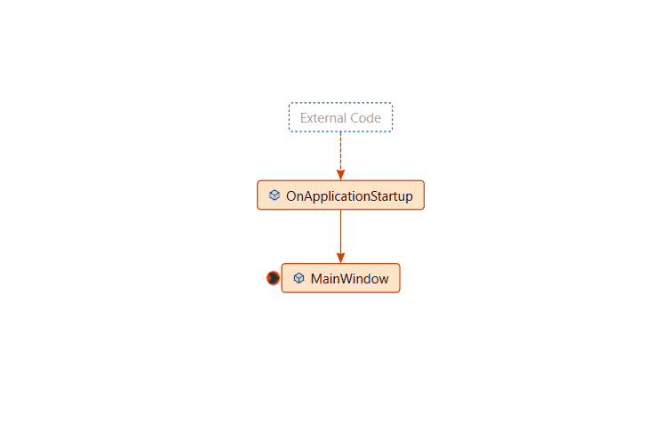

# View the call stack and use the Call Stack window in the debugger

By using the **Call Stack** window, you can view the function or procedure calls that are currently on the stack. The **Call Stack** window shows the order in which methods and functions are getting called. The call stack is a good way to examine and understand the execution flow of an app.

When [debugging symbols](#bkmk_symbols) are not available for part of a call stack, the **Call Stack** window might not be able to display correct information for that part of the call stack, displaying instead:

`[Frames below may be incorrect and/or missing, no symbols loaded for name.dll]`

> [!NOTE]
> The dialog boxes and menu commands you see might differ from those described here, depending on your active settings or edition. To change your settings, select **Import and Export Settings** on the **Tools** menu.  See [Reset all settings](../ide/personalizing-the-visual-studio-ide.md#reset-all-settings). The **Call Stack** window is similar to the Debug perspective in some IDEs like Eclipse.

## View the call stack while in the debugger

While debugging, in the **Debug** menu, select **Windows > Call Stack** or press `ctrl`+`alt`+`C`.

  ::: moniker range=">= vs-2022"
  :::image type="content" source="../debugger/media/vs-2022/dbg-basics-callstack-window.png" alt-text="Screenshot showing the Call Stack Window.":::
  A arrow identifies the stack frame where the execution pointer is currently located. By default, this stack frame's information appears in the source, **Locals**, **Autos**, **Watch**, and **Disassembly** windows. To change the debugger context to another frame on the stack, [switch to another stack frame](#bkmk_switch).

  ::: moniker-end

::: moniker range=">= vs-2022"
You can also view exception stack frames in the call stack while debugging. For more information, see [View the call stack in the Exception helper](../debugger/exception-helper.md#view-the-call-stack).
::: moniker-end

::: moniker range="visualstudio"

## Analyze call stack with Copilot

You can get AI-powered analysis of your current debug state in the context of the Call Stack window. This feature helps answer the question: *What is my thread or app doing right now?* With one click, the **Analyze with Copilot** button sends the current debug state to Copilot, opening the Chat window with an app state analysis—no need to manually describe your debug context.

To analyze the call stack:

1. When Copilot identifies a call stack issue, such as a frame that is waiting on an async task or execution fails during async operations, Copilot shows the **Analyze with Copilot** button by the relevant frame in the **Call Stack** window.
1. Select **Analyze with Copilot**.

:::image type="content" source="../debugger/media/visualstudio/debug-basics-analyze-call-stack.png" alt-text="Screenshot showing the Call Stack Window.":::

Copilot understands both synchronous and asynchronous call stacks and annotates relevant frames. You can analyze the frame to get a clear explanation of:

- Why execution is paused
- What the thread is waiting on
- How the execution got to the current point

This turns the call stack from a static list of frames into an interactive debugging experience. Instead of manually reconstructing async flows, Copilot helps you quickly understand runtime behavior and get back to fixing the real problem.

For more information on debugging with Copilot, see [Debug your app with GitHub Copilot](debug-with-copilot.md).

::: moniker-end

## Display non-user code in the Call Stack window

  ::: moniker range=">=vs-2022"

To display external or non-user code, toggle the **Show External Code** button from the call stack toolbar or  right-click on the **Call Stack** window and select **Show External Code**.

  ::: moniker-end

Non-user code is any code that is not shown when [Just My Code](../debugger/just-my-code.md) is enabled. In managed code, non-user code frames are hidden by default. The following notation appears in place of the non-user code frames:

`[<External Code>]`

##  Switch to another stack frame (change the debugger context)

1. In the **Call Stack** window, right-click the stack frame whose code and data that you want to view.

    Or, you can double-click a frame in the **Call Stack** window to switch to that frame.

2. Select **Switch to Frame**.

     A green arrow with a curly tail appears next to the stack frame you selected. The execution pointer remains in the original frame, which is still marked with the yellow arrow. If you select **Step** or **Continue** from the **Debug** menu, execution will continue in the original frame, not the frame you selected.

  ::: moniker range=">=vs-2022"

## View all related threads

Toggle the **View all threads** button to see all the related threads in the [Parallel Stack window](../debugger/using-the-parallel-stacks-window.md). The Parallel Stacks window provides visualizations of the call stacks for multithreaded apps.

## Call Stack Search

You can search for relevant call stack frames by typing relevant search terms in the search box located in the top left corner of the call stack window. The pertinent call stack frames will get highlighted. 

  ::: moniker-end

## View the source code for a function on the call stack

In the **Call Stack** window, right-click the function whose source code you want to see and select **Go To Source Code**.

## Run to a specific function from the Call Stack window

In the **Call Stack** window, select the function, right-click, and then choose **Run to Cursor**.

## Set a breakpoint on the exit point of a function call

See [Set a breakpoint at a call stack function](../debugger/get-started-with-breakpoints.md#BKMK_Set_a_breakpoint_from_debugger_windows).

## Display calls to or from another thread

Right-click the **Call Stack** window and select **Include Calls To/From Other Threads**.

## Visually trace the call stack

In Visual Studio Enterprise (only), you can view code maps for the call stack while debugging.

In the **Call Stack** window, open the shortcut menu. Choose **Show Call Stack on Code Map** (**Ctrl** + **Shift** + **`**).

  For more information, see [Map methods on the call stack while debugging](../debugger/map-methods-on-the-call-stack-while-debugging-in-visual-studio.md).

## View the disassembly code for a function on the call stack (C#, C++, Visual Basic, F#)

In the **Call Stack** window, right-click the function whose disassembly code you want to see and select **Go To Disassembly**.

## Change the optional information displayed

Right-click in the **Call Stack** window and set or clear **Show \<**_the information that you want_**>**.

::: moniker range=">=vs-2022"
## Autodecompile .NET external code

Starting in Visual Studio 2022 version 17.7, you can autodecompile .NET code by double-clicking external code in the Call Stack window. For more information, see [Generate source code from .NET assemblies while debugging](../debugger/decompilation.md).
::: moniker-end

##  Load symbols for a module (C#, C++, Visual Basic, F#)

In the **Call Stack** window, you can load debugging symbols for code that doesn't currently have symbols loaded. These symbols can be .NET or system symbols downloaded from the Microsoft public symbol servers, or symbols in a symbol path on the computer that you're debugging.

See [Specify symbol (.pdb) and source files](../debugger/specify-symbol-dot-pdb-and-source-files-in-the-visual-studio-debugger.md).

### To load symbols

1. In the **Call Stack** window, right-click the stack frame for which symbols are not loaded. The frame will be dimmed.

1. Point to **Load Symbols** and then select **Microsoft Symbol Servers** (if available), or browse to the symbol path.

### To set the symbol path

1. In the **Call Stack** window, choose **Symbol Settings** from the shortcut menu.

     The **Options** dialog box opens and the **Symbols** page is displayed.

1. Select **Symbol Settings**.

1. In the **Options** dialog box, click the Folder icon.

     In the **Symbol file (.pdb) locations** box, a cursor appears.

1. Enter a directory pathname to the symbol location on the computer that you're debugging. For local and remote debugging, this is a path on your local computer.

1. Select **OK** to close the **Options** dialog box.

## Related content

- [Mixed code and missing information in the Call Stack window](../debugger/mixed-code-and-missing-information-in-the-call-stack-window.md)
- [Viewing data in the debugger](../debugger/viewing-data-in-the-debugger.md)
- [Specify symbol (.pdb) and source files](../debugger/specify-symbol-dot-pdb-and-source-files-in-the-visual-studio-debugger.md)
- [Using breakpoints](../debugger/using-breakpoints.md)
