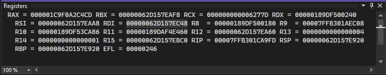

# View register values in the Registers window (C#, C++, Visual Basic, F#)

The **Registers** window displays register contents during Visual Studio debugging. For a high-level introduction to concepts behind registers and the **Registers** window, see [About the Registers Window](../debugger/debugging-basics-registers-window.md).

During debugging, register values change as code executes in your app. Values that have changed recently appear in red in the **Registers** window. For info on the flags you see in the **Registers** window, see [About the Registers window](../debugger/debugging-basics-registers-window.md).

> [!NOTE]
> Register information is not available for script or SQL apps.

In C++ code, you can also edit register values. For more information, see [Edit a register value](#edit-a-register-value-c).

>[!NOTE]
>Dialog boxes and menu commands might differ depending on your Visual Studio edition or settings. To change your settings, select **Import and Export Settings** on the Visual Studio **Tools** menu. For more information, see [Reset all settings](../ide/personalizing-the-visual-studio-ide.md#reset-all-settings).

## View register values

1. Enable address-level debugging, by selecting **Enable address-level debugging** in **Tools** (or **Debug**) > **Options** > **Debugging**.

1. While debugging or while paused at a breakpoint, select **Debug** > **Windows** > **Registers**, or press **Alt**+**5**.

   ::: moniker range=">=vs-2022"
   
   ::: moniker-end

## Display and hide Register Groups (C#, C++, Visual Basic, F#)

To reduce clutter, the **Registers** window organizes registers into groups. If you right-click the **Registers** window, you will see a shortcut menu containing these groups, which you can display or hide as you see fit following the procedure below.

> [!NOTE]
> The dialog boxes and menu commands you see might differ from those described in Help depending on your active settings or edition. To change your settings, choose **Import and Export Settings** on the **Tools** menu. For more information, see [Reset all settings](../ide/personalizing-the-visual-studio-ide.md#reset-all-settings).

To display or hide register groups:

1. Right-click the **Registers** window.

2. On the shortcut menu, select the register groups you want to show or hide.

     Register groups that are not supported by the hardware you are debugging on are disabled on the shortcut menu, so they cannot be selected.

## Edit a register value (C++)

For C++ code, you can edit a register value while paused in the debugger.

The Registers window is available only if address-level debugging is enabled in the **Options** dialog box, **Debugging** node.

To change the value of a register:

1. In the **Registers** window, use the TAB key or the mouse to move the insertion point to the value you want to change. When you start to type, the cursor must be located in front of the value you want to overwrite.

2. Type the new value.

    > [!CAUTION]
    > Changing register values (especially in the EIP and EBP registers) can affect program execution.

    > [!CAUTION]
    > Editing floating-point values can result in minor inaccuracies because of decimal-to-binary conversion of fractional components. Even a seemingly innocuous edit can result in changes to some of the least significant bits in a floating-point register.

## Related content

- [Debugging basics: Registers window](../debugger/debugging-basics-registers-window.md)
- [Viewing data in the debugger](../debugger/viewing-data-in-the-debugger.md)
