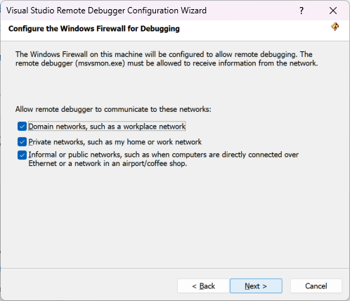

1. On the remote computer, find and start the **Remote Debugger** from the **Start** menu. 

   If you don't have administrative permissions on the remote computer, right-click the **Remote Debugger** app and select **Run as administrator**. Otherwise, just start it normally.

   If you are planning to attach to a process which is running as an administrator, or is running under a different user account (such as IIS), right-click the **Remote Debugger** app and select **Run as administrator**. For more information, see [Run the remote debugger as an administrator](../remote-debugging-errors-and-troubleshooting.md#run-the-remote-debugger-as-an-administrator).

1. The first time you start the remote debugger (or before you have configured it), the **Remote Debugging Configuration** wizard appears.  
  
    ::: moniker range=">= vs-2022"
    In most scenarios, choose **Next** until you get to the **Configure the Windows Firewall** page of the wizard.

      
    ::: moniker-end

  
1. Select at least one network type you want to use the remote tools on. If the computers are connected through a domain, you must choose the first item. If the computers are connected through a workgroup or homegroup, choose the second or third item as appropriate.  

   ::: moniker range=">= vs-2022"
   Next, select **Finish** to start the remote debugger.
   ::: moniker-end

  
1. When configuration is complete, the **Remote Debugger** window appears.
  
    ::: moniker range=">= vs-2022"
    
    ::: moniker-end
    ::: moniker range="<= vs-2019"
    
    ::: moniker-end
  
    The remote debugger is now waiting for a connection. Use the server name and port number shown to set the remote connection configuration in Visual Studio.  
  
To stop the remote debugger, select **File** > **Exit**. You can restart it from the **Start** menu, or from the command line:  
  
```cmd
<Remote debugger installation directory>\msvsmon.exe
```
