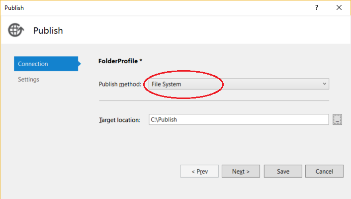

1. In the **Solution Explorer**,  right-click the project node and select **Publish** (for Web Forms, **Publish Web App**).

    If you have previously configured any publishing profiles, the **Publish** pane appears. Click **New profile**.

1. In the **Publish** dialog box, select **Folder**, click **Browse**, and create a new folder, **C:\Publish**.

    

    For a Web Forms app, choose **Custom** in the Publish dialog box, enter a profile name, and choose **OK**.

1. Click **Create profile** in the drop-down list (**Publish** is the default value).

1. In the **Publish** dialog box, click the **Settings** link, and then select the **Settings** tab.

1. Set the configuration to **Debug**, select **Delete all existing files prior to publish**, and then click **Save**.

    > [!NOTE]
    > If you use a Release build, you disable debugging in the web.config file when you publish.

1. Click **Publish**.

    

    The application publishes a **Debug** configuration of the project to the local folder. Progress shows in the Output window.

1. Copy the ASP.NET project directory from the Visual Studio computer to the local directory configured for the ASP.NET app (in this example, **C:\Publish**) on the Windows Server computer. In this tutorial, we assume you are copying manually, but you can use other tools like PowerShell, Xcopy, or Robocopy.

    > [!CAUTION]
    > If you need to make changes to the code or rebuild, you must republish and repeat this step. The executable you copied to the remote machine must exactly match your local source and symbols.    If you do not do this you will receive a `cannot find or open the PDB file` warning in Visual Studio when you attempt to debug the process.

1. On the Windows Server, verify that you can run the app correctly by opening the app in your browser.

    If the app doesn't run correctly, there may be a mismatch between the version of ASP.NET installed on your server and your Visual Studio machine, or you may have an issue with your IIS or Web site configuration. Recheck earlier steps.
