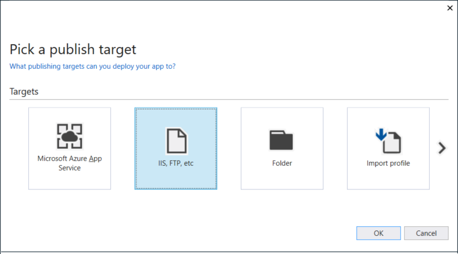

If you installed Web Deploy using the Web Platform Installer, you can deploy the app directly from Visual Studio.

1. Start Visual Studio with Administrator privileges, and reopen the project.

    Administrator privileges are required to deploy your app using Web Deploy.

2. In the **Solution Explorer**,  right-click the project node and select **Publish**.

3. For **Select a publish target**, select **IIS, FTP, etc.** and click **Publish**.

    

4. Enter the correction configuration parameters for your IIS setup.

    

    If a host name doesn't resolve when you try to validate in the next steps in the **Server** text box, try the IP address. Include `http://` as a prefix in the **Server** field.  Make sure you use port 80 in the **Server** text box, and make sure that port 80 is open in the firewall.

6. Click **Next**, choose a **Debug** configuration, and choose **Remove additional files at destination** under the **File Publish** options.

    > [!NOTE]
    > If you choose a Release configuration, you disable debugging in the web.config file when you publish.

5. Click **Prev**, and then choose **Validate**. If the connection setup validates, you can try to publish.

6. Click **Publish** to publish the app.

    The Output tab shows you if publishing is successful, and your browser then opens the app.

    If you get an error mentioning Web Deploy, recheck the Web Deploy installation steps and make sure the correct ports are open (Web Deploy also requires port 8172 to be open on the server).

    If the app deploys successfully but doesn't run correctly, there may be an issue with your IIS configuration, your ASP.NET installation, or your Web site configuration. On the Windows Server, open the Web site from IIS for more specific error messages, and then recheck earlier steps.