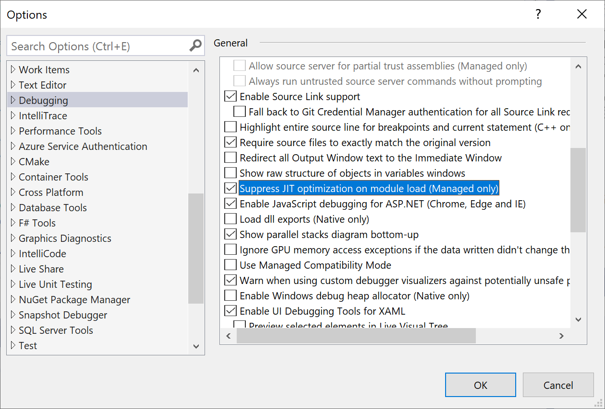

# JIT Optimization and Debugging

If you are trying to debug code, it is easier when that code is **NOT** optimized. When code is optimized, the compiler and runtime make changes to the emitted CPU code so that it runs faster, but has a less direct mapping to original source code. If the mapping is less direct, debuggers are frequently unable to tell you the value of local variables, and code stepping and breakpoints might not work as you expect.

> [!NOTE]
> For more info on JIT (Just In Time) debugging, read [this documentation](../debugger/debug-using-the-just-in-time-debugger.md).

## How optimizations work in .NET 
Normally the Release build configuration creates optimized code and the Debug build configuration does not. The `Optimize` MSBuild property controls whether the compiler is told to optimize code.

In the .NET ecosystem, code is turned from source to CPU instructions in a two-step process: first, the C# compiler converts the text you type to an intermediate binary form called MSIL and writes the MSIL out to .dll files. Later, the .NET Runtime converts this MSIL to CPU instructions. Both steps can optimize to some degree, but the second step performed by the .NET Runtime performs the more significant optimizations.

## The 'Suppress JIT optimization on module load (Managed only)' option
The debugger exposes an option that controls what happens when a DLL that is compiled with optimizations enabled loads inside of the target process. If this option is unchecked (the default state), then when the .NET Runtime compiles the MSIL code into CPU code, it leaves the optimizations enabled. If the option is checked, then the debugger requests that optimizations be disabled.

To find the **Suppress JIT optimization on module load (Managed only)** option, select **Tools** > **Options**, and then select the **General** page under the **Debugging** node.



## When should you check the 'Suppress JIT optimization' option?
Check this option when you downloaded the DLLs from another source, such as a nuget package, and you want to debug the code in this DLL. In order for suppression to work, you must also find the symbol (.pdb) file for this DLL.

If you are only interested in debugging the code you are building locally, it is best to leave this option unchecked, as, in some cases, enabling this option will significantly slow down debugging. There are two reasons for this slow down:

* Optimized code runs faster. If you are turning off optimizations for lots of code, the performance impact can add up.
* If you have Just My Code enabled, the debugger will not even try to load symbols for DLLs that are optimized. Finding symbols can take a long time.

## Limitations of the 'Suppress JIT optimization' option 
There are two situations where turning on this option will **NOT** work:

1. In situations where you are attaching the debugger to an already running process, this option will have no effect on modules that were already loaded at the time the debugger was attached.
2. This option has no effect on DLLs that have been pre-compiled (or *ngen'ed*) to native code. However, you can disable usage of pre-compiled code by starting the process with the environment variable **'COMPlus_ReadyToRun'** set to **'0'**. This will tell the .NET Core runtime to disable the use of pre-compiled images, forcing the runtime to JIT compile framework code. 

   If you are targeting the .NET Framework, add the environment variable **'COMPlus_ZapDisable'** and set it to **'1'**. 
   
Set `"COMPlus_ReadyToRun": "0"`  by adding it to each profile in the *Properties\launchSettings.json* file:

```json
{
  "iisSettings": {
    "windowsAuthentication": false,
    "anonymousAuthentication": true,
    "iisExpress": {
      "applicationUrl": "http://localhost:59694/",
      "sslPort": 44320
    }
  },
  "profiles": {
    "IIS Express": {
      "commandName": "IISExpress",
      "launchBrowser": true,
      "environmentVariables": {
        "ASPNETCORE_ENVIRONMENT": "Development",
        "COMPlus_ReadyToRun": "0"
      }
    },
    "HttpLoggingSample": {
      "commandName": "Project",
      "launchBrowser": true,
      "environmentVariables": {
        "ASPNETCORE_ENVIRONMENT": "Development",
        "COMPlus_ReadyToRun": "0"
      },
      "applicationUrl": "https://localhost:5001;http://localhost:5000"
    }
  }
}
```

## Related content
- [How To Debug Dotnet Framework Source](../debugger/how-to-debug-dotnet-framework-source.md)
- [Debugging Managed Code](/visualstudio/debugger/)
- [Navigating through Code with the Debugger](../debugger/navigating-through-code-with-the-debugger.md)
- [Attach to Running Processes](../debugger/attach-to-running-processes-with-the-visual-studio-debugger.md)
- [Managed Execution Process](/dotnet/standard/managed-execution-process)
