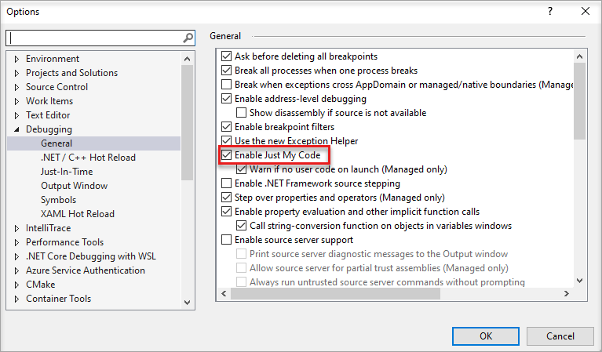
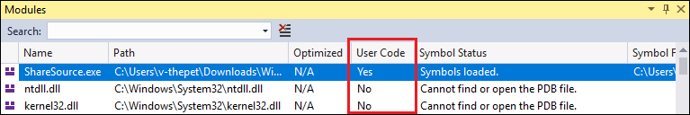
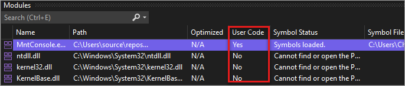
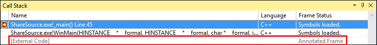
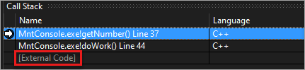
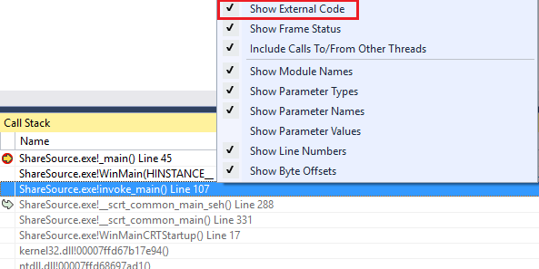
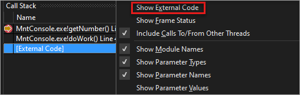

# Debug only user code with Just My Code

*Just My Code* is a Visual Studio debugging feature that automatically steps over calls to system, framework, and other non-user code. In the **Call Stack** window, Just My Code collapses these calls into **[External Code]** frames.

Just My Code works differently in .NET and C++ projects.

## <a name="BKMK_Enable_or_disable_Just_My_Code"></a> Enable or disable Just My Code

For most programming languages, Just My Code is enabled by default.

::: moniker range="visualstudio"

Open the **Tools** (or **Debug**) > **Options** pane, expand the **All Settings** > **Debugging** > **General** section, and select or clear the **Enable Just My Code** checkbox:

:::image type="content" source="../debugger/media/visualstudio/dbg-just-my-code-options.png" border="false" alt-text="Screenshot that shows how to select the Enable Just My Code option in Visual Studio.":::

::: moniker-end
::: moniker range="vs-2022"

Open the **Tools** (or **Debug**) > **Options** dialog, expand the **Debugging** > **General** section, and select or clear the **Enable Just My Code** checkbox:



::: moniker-end
::: moniker range="<=vs-2019"

Open the **Tools** (or **Debug**) > **Options** dialog, expand the **Debugging** > **General** section, and select or clear the **Enable Just My Code** checkbox:


::: moniker-end

> [!NOTE]
> **Enable Just My Code** is a global setting that applies to all Visual Studio projects in all languages.

## Just My Code debugging

During a debugging session, the **Modules** window shows which code modules the debugger is treating as My Code (user code), along with their symbol loading status. For more information, see [Get more familiar with how the debugger attaches to your app](../debugger/debugger-tips-and-tricks.md#modules_window).

::: moniker range="<=vs-2019"



::: moniker-end

::: moniker range=">=vs-2022"



::: moniker-end

In the **Call Stack** or **Tasks** window, Just My Code collapses non-user code into a grayed-out annotated code frame labeled `[External Code]`.

::: moniker range="<=vs-2019"



::: moniker-end

::: moniker range=">=vs-2022"



::: moniker-end

>[!TIP]
>To open the **Modules**, **Call Stack**, **Tasks**, or most other debugging windows, you must be in a debugging session. While debugging, under **Debug** > **Windows**, select the windows you want to open.

<a name="BKMK_Override_call_stack_filtering"></a>
To view the code in a collapsed **[External Code]** frame, right-click in the **Call Stack** or **Task** window, and select **Show External Code** from the context menu. The expanded external code lines replace the **[External Code**] frame.

::: moniker range="<=vs-2019"



::: moniker-end

::: moniker range=">=vs-2022"



::: moniker-end

> [!NOTE]
> **Show External Code** is a current user profiler setting that applies to all projects in all languages that are opened by the user.

Double-clicking an expanded external code line in the **Call Stack** window highlights the calling code line in green in the source code. For DLLs or other modules not found or loaded, a symbol or source not found page might open.

::: moniker range=">=vs-2022"
Starting in Visual Studio 2022 version 17.7, you can autodecompile .NET code by double-clicking external code in the Call Stack window. For more information, see [Generate source code from .NET assemblies while debugging](../debugger/decompilation.md).
::: moniker-end

## <a name="BKMK__NET_Framework_Just_My_Code"></a>.NET Just My Code

In .NET projects, Just My Code uses symbol (*.pdb*) files and program optimizations to classify user and non-user code. The .NET debugger considers optimized binaries and nonloaded *.pdb* files to be non-user code.

Three compiler attributes also affect what the .NET debugger considers to be user code:

- <xref:System.Diagnostics.DebuggerNonUserCodeAttribute> tells the debugger that the applied code isn't user code.
- <xref:System.Diagnostics.DebuggerHiddenAttribute> hides the code from the debugger, even if Just My Code is turned off.
- <xref:System.Diagnostics.DebuggerStepThroughAttribute> tells the debugger to step through the applied code, rather than step into the code.

The .NET debugger considers all other code to be user code.

During .NET debugging:

- **Debug** > **Step Into** (or **F11**) on non-user code steps over the code to the next line of user code.
- **Debug** > **Step Out** (or **Shift**+**F11**) on non-user code runs to the next line of user code.

If there's no more user code, debugging continues until it ends, hits another breakpoint, or throws an error.

<a name="BKMK_NET_Breakpoint_behavior"></a>
If the debugger breaks in non-user code (for example, you use **Debug** > **Break All** and pause in non-user code), the **No Source** window appears. You can then use a **Debug** > **Step** command to go to the next line of user code.

If an unhandled exception occurs in non-user code, the debugger breaks at the user code line where the exception was generated.

If first chance exceptions are enabled for the exception, the calling user-code line is highlighted in green in source code. The **Call Stack** window displays the annotated frame labeled **[External Code]**.

## <a name="BKMK_C___Just_My_Code"></a> C++ Just My Code

Starting in Visual Studio 2017 version 15.8, Just My Code for code stepping is also supported. This feature also requires use of the [/JMC (Just my code debugging)](/cpp/build/reference/jmc) compiler switch. The switch is enabled by default in C++ projects. For **Call Stack** window and call stack support in Just My Code, the /JMC switch isn't required.

<a name="BKMK_CPP_User_and_non_user_code"></a>
To be classified as user code, the PDB for the binary containing the user code must be loaded by the debugger (use the **Modules** window to check loading status).

For call stack behavior, such as in the **Call Stack** window, Just My Code in C++ considers only these functions to be *non-user code*:

- Functions with stripped source information in their symbols file.
- Functions where the symbol files indicate that there's no source file corresponding to the stack frame.
- Functions specified in *\*.natjmc* files in the *%VsInstallDirectory%\Common7\Packages\Debugger\Visualizers* folder.

For code stepping behavior, Just My Code in C++ considers only these functions to be *non-user code*:

- Functions for which the corresponding PDB file isn't loaded in the debugger.
- Functions specified in *\*.natjmc* files in the *%VsInstallDirectory%\Common7\Packages\Debugger\Visualizers* folder.

> [!NOTE]
> For code stepping support in Just My Code, C++ code must be compiled using the MSVC compilers in Visual Studio 15.8 Preview 3 or later, and the /JMC compiler switch must be enabled (it's enabled by default). For more details, see [Customize C++ call stack and code stepping behavior](#BKMK_CPP_Customize_call_stack_behavior) and this [blog post](https://devblogs.microsoft.com/cppblog/announcing-jmc-stepping-in-visual-studio/). For code compiled using an older compiler, *.natstepfilter* files are the only way to customize code stepping, which is independent of Just My Code. See [Customize C++ stepping behavior](#BKMK_CPP_Customize_stepping_behavior).

<a name="BKMK_CPP_Stepping_behavior"></a>
During C++ debugging, non-user code is skipped by default. During C++ debugging:

- **Debug** > **Step Into** (or **F11**) on non-user code steps over the code or runs to the next line of user code, if **Step Into** is called from non-user code.
- **Debug** > **Step Out** (or **Shift**+**F11**) on non-user code runs to the next line of user code (outside of the current stack frame).

If there's no more user code, debugging continues until it ends, hits another breakpoint, or throws an error.

If the debugger breaks in non-user code (for example, you use **Debug** > **Break All** and pause in non-user code), stepping continues in the non-user code.

If the debugger hits an exception, it stops on the exception, whether it is in user or non-user code. **User-unhandled** options in the **Exception Settings** dialog box are ignored.

### <a name="BKMK_CPP_Customize_call_stack_behavior"></a> Customize C++ call stack and code stepping behavior

For C++ projects, you can specify the modules, source files, and functions the **Call Stack** window treats as non-user code by specifying them in *\*.natjmc* files. This customization also applies to code stepping if you're using the latest compiler (see [C++ Just My Code](#BKMK_CPP_User_and_non_user_code)).

- To specify non-user code for all users of the Visual Studio machine, add the *.natjmc* file to the *%VsInstallDirectory%\Common7\Packages\Debugger\Visualizers* folder.
- To specify non-user code for an individual user, add the *.natjmc* file to the *%USERPROFILE%\My Documents\\<Visual Studio version\>\Visualizers* folder.

A *.natjmc* file is an XML file with this syntax:

```xml
<?xml version="1.0" encoding="utf-8"?>
<NonUserCode xmlns="http://schemas.microsoft.com/vstudio/debugger/jmc/2015">

  <!-- Modules -->
  <Module Name="ModuleSpec" />
  <Module Name="ModuleSpec" Company="CompanyName" />

  <!-- Files -->
  <File Name="FileSpec"/>

  <!-- Functions -->
  <Function Name="FunctionSpec" />
  <Function Name="FunctionSpec" Module ="ModuleSpec" />
  <Function Name="FunctionSpec" Module ="ModuleSpec" ExceptionImplementation="true" />

</NonUserCode>

```

 **Module element attributes**

|Attribute|Description|
|---------------|-----------------|
|`Name`|Required. The full path of the module or modules. You can use the Windows wildcard characters `?` (zero or one character) and `*` (zero or more characters). For example,<br /><br /> `<Module Name="?:\3rdParty\UtilLibs\*" />`<br /><br /> tells the debugger to treat all modules in *\3rdParty\UtilLibs* on any drive as external code.|
|`Company`|Optional. The name of the company that publishes the module that is embedded in the executable file. You can use this attribute to disambiguate the modules.|

 **File element attributes**

|Attribute|Description|
|---------------|-----------------|
|`Name`|Required. The full path of the source file or files to treat as external code. You can use the Windows wildcard characters `?` and `*` when specifying the path.|

 **Function element attributes**

|Attribute|Description|
|---------------|-----------------|
|`Name`|Required. The fully qualified name of the function to treat as external code. ou can use the Windows wildcard characters `?` and `*` when specifying the path.|
|`Module`|Optional. The name or full path to the module that contains the function. You can use this attribute to disambiguate functions with the same name.|
|`ExceptionImplementation`|When set to `true`, the call stack displays the function that threw the exception rather than this function.|

### <a name="BKMK_CPP_Customize_stepping_behavior"></a> Customize C++ stepping behavior independent of Just My Code settings

In C++ projects, you can specify functions to step over by listing them as *NoStepInto* functions in *\*.natstepfilter* files. Functions listed in *\*.natstepfilter* files aren't dependent on Just My Code settings. A NoStepInto function tells the debugger to step over the function, even if it calls some StepInto functions or other user code. Unlike functions listed in *.natjmc*, the debugger steps into the first line of user code inside the NoStepInto function.

- To specify non-user code for all local Visual Studio users, add the *.natstepfilter* file to the *%VsInstallDirectory%\Common7\Packages\Debugger\Visualizers* folder.
- To specify non-user code for an individual user, add the *.natstepfilter* file to the *%USERPROFILE%\My Documents\\<Visual Studio version\>\Visualizers* folder.

> [!NOTE]
> Some non-Microsoft extensions might disable *.natstepfilter* functionality.

A *.natstepfilter* file is an XML file with this syntax:

```xml
<?xml version="1.0" encoding="utf-8"?>
<StepFilter xmlns="http://schemas.microsoft.com/vstudio/debugger/natstepfilter/2010">
    <Function>
        <Name>FunctionSpec</Name>
        <Action>StepAction</Action>
    </Function>
    <Function>
        <Name>FunctionSpec</Name>
        <Module>ModuleSpec</Module>
        <Action>StepAction</Action>
    </Function>
</StepFilter>

```

|Element|Description|
|-------------|-----------------|
|`Function`|Required. Specifies one or more functions as non-user functions.|
|`Name`|Required. An ECMA-262 formatted regular expression specifying the full function name to match. For example:<br /><br /> `<Name>MyNS::MyClass::.*</Name>`<br /><br /> tells the debugger that all methods in `MyNS::MyClass` are to be considered non-user code. The match is case-sensitive.|
|`Module`|Optional. An ECMA-262 formatted regular expression specifying the full path to the module containing the function. The match is case-insensitive.|
|`Action`|Required. One of these case-sensitive values:<br /><br /> `NoStepInto`  - tells the debugger to step over the function.<br /> `StepInto`  - tells the debugger to step into the function, overriding any other `NoStepInto` for the matched function.|

### Additional information on *.natstepfilter* and *.natjmc* files

- Starting in Visual Studio 2022 version 17.6, you can add *.natjmc* and *.natstepfilter* files directly to the solution or project.

- Syntax errors in *.natstepfilter* and *.natjmc* files aren't reported in the debugger's Output window.

- Unlike *.natvis* files, *.natstepfilter* and *.natjmc* files aren't hot-reloaded. Instead, these files are reloaded near the beginning of the debug session.

- For template functions, the use of `&lt;.*&gt;` or `&lt;.*` in the name can be helpful.

## <a name="BKMK_JavaScript_Just_My_Code"></a> JavaScript Just My Code

<a name="BKMK_JS_User_and_non_user_code"></a>
For *.esproj* projects in Visual Studio 2022, Visual Studio Code uses a *launch.json* file to configure and customize the debugger. *launch.json* is a debugger configuration file.

Visual Studio attaches the debugger only to user code. For *.esproj* projects, you can configure user code (that is, *Just My Code* settings) in Visual Studio using the `skipFiles` setting in *launch.json*. This setting works the same as the *launch.json* settings in VS Code. For more information about *skipFiles*, see [Skipping Uninteresting Code](https://code.visualstudio.com/docs/nodejs/nodejs-debugging#_skipping-uninteresting-code).