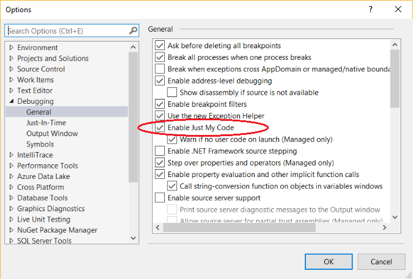
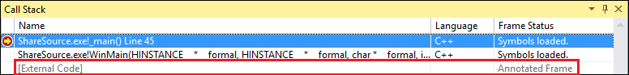
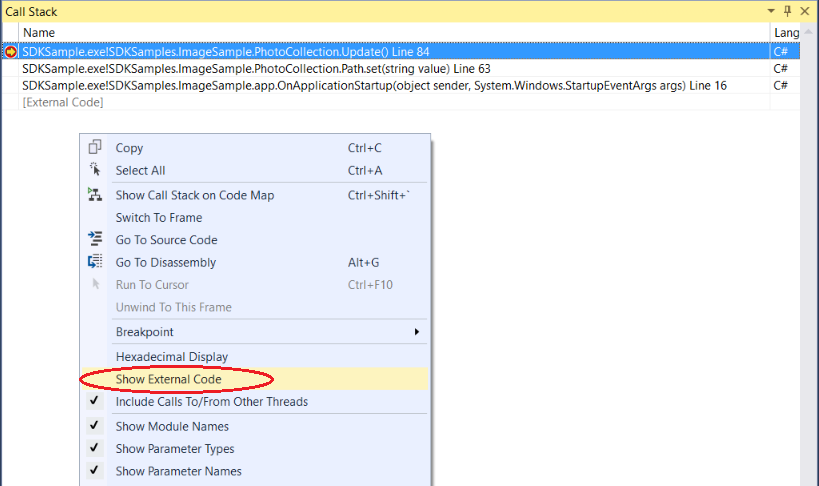

# Debug only user code with Just My Code

*Just My Code* is a Visual Studio debugging feature that automatically steps over calls to system, framework, and other non-user code. In the **Call Stack** window, Just My Code collapses these calls into **[External Code]** frames.

Just My Code works differently in .NET, C++, and JavaScript projects.

## <a name="BKMK_Enable_or_disable_Just_My_Code"></a> Enable or disable Just My Code

For most programming languages, Just My Code is enabled by default.

- To enable or disable Just My Code in Visual Studio, under **Tools** > **Options** (or **Debug** > **Options**) > **Debugging** > **General**, select or deselect **Enable Just My Code**.



> [!NOTE]
> **Enable Just My Code** is a global setting that applies to all Visual Studio projects in all languages.

## Just My Code debugging

During a debugging session, the **Modules** window shows which code modules the debugger is treating as My Code (user code), along with their symbol loading status. For more information, see [Get more familiar with how the debugger attaches to your app](../debugger/debugger-tips-and-tricks.md#modules_window).


In the **Call Stack** or **Tasks** window, Just My Code collapses non-user code into a grayed-out annotated code frame labeled `[External Code]`.



>[!TIP]
>To open the **Modules**, **Call Stack**, **Tasks**, or most other debugging windows, you must be in a debugging session. While debugging, under **Debug** > **Windows**, select the windows you want to open.

<a name="BKMK_Override_call_stack_filtering"></a>
To view the code in a collapsed **[External Code]** frame, right-click in the **Call Stack** or **Task** window, and select **Show External Code** from the context menu. The expanded external code lines replace the **[External Code**] frame.



> [!NOTE]
> **Show External Code** is a current user profiler setting that applies to all projects in all languages that are opened by the user.

Double-clicking an expanded external code line in the **Call Stack** window highlights the calling code line in green in the source code. For DLLs or other modules not found or loaded, a symbol or source not found page may open.

## <a name="BKMK__NET_Framework_Just_My_Code"></a>.NET Just My Code

In .NET projects, Just My Code uses symbol (*.pdb*) files and program optimizations to classify user and non-user code. The .NET debugger considers optimized binaries and non-loaded *.pdb* files to be non-user code.

Three compiler attributes also affect what the .NET debugger considers to be user code:

- <xref:System.Diagnostics.DebuggerNonUserCodeAttribute> tells the debugger that the code it's applied to isn't user code.
- <xref:System.Diagnostics.DebuggerHiddenAttribute> hides the code from the debugger, even if Just My Code is turned off.
- <xref:System.Diagnostics.DebuggerStepThroughAttribute> tells the debugger to step through the code it's applied to, rather than step into the code.

The .NET debugger considers all other code to be user code.

During .NET debugging:

- **Debug** > **Step Into** (or **F11**) on non-user code steps over the code to the next line of user code.
- **Debug** > **Step Out** (or **Shift**+**F11**) on non-user code runs to the next line of user code.

If there's no more user code, debugging continues until it ends, hits another breakpoint, or throws an error.

<a name="BKMK_NET_Breakpoint_behavior"></a>
If the debugger breaks in non-user code (for example, you use **Debug** > **Break All** and pause in non-user code), the **No Source** window appears. You can then use a **Debug** > **Step** command to go to the next line of user code.

If an unhandled exception occurs in non-user code, the debugger breaks at the user code line where the exception was generated.

If first chance exceptions are enabled for the exception, the calling user-code line is highlighted in green in source code. The **Call Stack** window displays the annotated frame labeled **[External Code]**.

## <a name="BKMK_C___Just_My_Code"></a> C++ Just My Code

Starting in Visual Studio 2017 version 15.8, Just My Code for code stepping is also supported. This feature also requires use of the [/JMC (Just my code debugging)](/cpp/build/reference/jmc) compiler switch. The switch is enabled by default in C++ projects. For **Call Stack** window and call stack support in Just My Code, the /JMC switch is not required.

<a name="BKMK_CPP_User_and_non_user_code"></a>
To be classified as user code, the PDB for the binary containing the user code must be loaded by the debugger (use the **Modules** window to check this).

For call stack behavior, such as in the **Call Stack** window, Just My Code in C++ considers only these functions to be *non-user code*:

- Functions with stripped source information in their symbols file.
- Functions where the symbol files indicate that there is no source file corresponding to the stack frame.
- Functions specified in *\*.natjmc* files in the *%VsInstallDirectory%\Common7\Packages\Debugger\Visualizers* folder.

For code stepping behavior, Just My Code in C++ considers only these functions to be *non-user code*:

- Functions for the which the corresponding PDB file has not been loaded in the debugger.
- Functions specified in *\*.natjmc* files in the *%VsInstallDirectory%\Common7\Packages\Debugger\Visualizers* folder.

> [!NOTE]
> For code stepping support in Just My Code, C++ code must be compiled using the MSVC compilers in Visual Studio 15.8 Preview 3 or later, and the /JMC compiler switch must be enabled (it is enabled by default). For additional details, see [Customize C++ call stack and code stepping behavior](#BKMK_CPP_Customize_call_stack_behavior)) and this [blog post](https://devblogs.microsoft.com/cppblog/announcing-jmc-stepping-in-visual-studio/). For code compiled using an older compiler, *.natstepfilter* files are the only way to customize code stepping, which is independent of Just My Code. See [Customize C++ stepping behavior](#BKMK_CPP_Customize_stepping_behavior).

<a name="BKMK_CPP_Stepping_behavior"></a>
During C++ debugging:

- **Debug** > **Step Into** (or **F11**) on non-user code steps over the code to the next line of user code.
- **Debug** > **Step Out** (or **Shift**+**F11**) on non-user code runs to the next line of user code.

If there's no more user code, debugging continues until it ends, hits another breakpoint, or throws an error.

If the debugger breaks in non-user code (for example, you use **Debug** > **Break All** and pause in non-user code), stepping continues in the non-user code.

If the debugger hits an exception, it stops on the exception, whether it is in user or non-user code. **User-unhandled** options in the **Exception Settings** dialog box are ignored.

### <a name="BKMK_CPP_Customize_call_stack_behavior"></a> Customize C++ call stack and code stepping behavior

For C++ projects, you can specify the modules, source files, and functions the **Call Stack** window treats as non-user code by specifying them in *\*.natjmc* files. This customization also applies to code stepping if you are using the latest compiler (see [C++ Just My Code](#BKMK_CPP_User_and_non_user_code)).

- To specify non-user code for all users of the Visual Studio machine, add the *.natjmc* file to the *%VsInstallDirectory%\Common7\Packages\Debugger\Visualizers* folder.
- To specify non-user code for an individual user, add the *.natjmc* file to the *%USERPROFILE%\My Documents\\<Visual Studio version\>\Visualizers* folder.

A *.natjmc* file is an XML file with this syntax:

```xml
<?xml version="1.0" encoding="utf-8"?>
<NonUserCode xmlns="http://schemas.microsoft.com/vstudio/debugger/jmc/2015">

  <!-- Modules -->
  <Module Name="ModuleSpec" />
  <Module Name="ModuleSpec" Company="CompanyName" />

  <!-- Files -->
  <File Name="FileSpec"/>

  <!-- Functions -->
  <Function Name="FunctionSpec" />
  <Function Name="FunctionSpec" Module ="ModuleSpec" />
  <Function Name="FunctionSpec" Module ="ModuleSpec" ExceptionImplementation="true" />

</NonUserCode>

```

 **Module element attributes**

|Attribute|Description|
|---------------|-----------------|
|`Name`|Required. The full path of the module or modules. You can use the Windows wildcard characters `?` (zero or one character) and `*` (zero or more characters). For example,<br /><br /> `<Module Name="?:\3rdParty\UtilLibs\*" />`<br /><br /> tells the debugger to treat all modules in *\3rdParty\UtilLibs* on any drive as external code.|
|`Company`|Optional. The name of the company that publishes the module that is embedded in the executable file. You can use this attribute to disambiguate the modules.|

 **File element attributes**

|Attribute|Description|
|---------------|-----------------|
|`Name`|Required. The full path of the source file or files to treat as external code. You can use the Windows wildcard characters `?` and `*` when specifying the path.|

 **Function element attributes**

|Attribute|Description|
|---------------|-----------------|
|`Name`|Required. The fully qualified name of the function to treat as external code.|
|`Module`|Optional. The name or full path to the module that contains the function. You can use this attribute to disambiguate functions with the same name.|
|`ExceptionImplementation`|When set to `true`, the call stack displays the function that threw the exception rather than this function.|

### <a name="BKMK_CPP_Customize_stepping_behavior"></a> Customize C++ stepping behavior independent of Just My Code settings

In C++ projects, you can specify functions to step over by listing them as non-user code in *\*.natstepfilter* files. Functions listed in *\*.natstepfilter* files are not dependent on Just My Code settings.

- To specify non-user code for all local Visual Studio users, add the *.natstepfilter* file to the *%VsInstallDirectory%\Common7\Packages\Debugger\Visualizers* folder.
- To specify non-user code for an individual user, add the *.natstepfilter* file to the *%USERPROFILE%\My Documents\\<Visual Studio version\>\Visualizers* folder.

A *.natstepfilter* file is an XML file with this syntax:

```xml
<?xml version="1.0" encoding="utf-8"?>
<StepFilter xmlns="http://schemas.microsoft.com/vstudio/debugger/natstepfilter/2010">
    <Function>
        <Name>FunctionSpec</Name>
        <Action>StepAction</Action>
    </Function>
    <Function>
        <Name>FunctionSpec</Name>
        <Module>ModuleSpec</Module>
        <Action>StepAction</Action>
    </Function>
</StepFilter>

```

|Element|Description|
|-------------|-----------------|
|`Function`|Required. Specifies one or more functions as non-user functions.|
|`Name`|Required. An ECMA-262 formatted regular expression specifying the full function name to match. For example:<br /><br /> `<Name>MyNS::MyClass.*</Name>`<br /><br /> tells the debugger that all methods in `MyNS::MyClass` are to be considered non-user code. The match is case-sensitive.|
|`Module`|Optional. An ECMA-262 formatted regular expression specifying the full path to the module containing the function. The match is case-insensitive.|
|`Action`|Required. One of these case-sensitive values:<br /><br /> `NoStepInto`  - tells the debugger to step over the function.<br /> `StepInto`  - tells the debugger to step into the function, overriding any other `NoStepInto` for the matched function.|

## <a name="BKMK_JavaScript_Just_My_Code"></a> JavaScript Just My Code

<a name="BKMK_JS_User_and_non_user_code"></a>
JavaScript Just My Code controls stepping and call stack display by categorizing code in one of these classifications:

|||
|-|-|
|**MyCode**|User code that you own and control.|
|**LibraryCode**|Non-user code from libraries that you use regularly and your app relies on to function correctly (for example WinJS or jQuery).|
|**UnrelatedCode**|Non-user code in your app that you don't own and your app doesn't rely on to function correctly. For example, an advertising SDK that displays ads could be UnrelatedCode. In UWP projects, any code that is loaded into your app from an HTTP or HTTPS URI is also considered UnrelatedCode.|

The JavaScript debugger classifies code as user or non-user in this order:

1. The default classifications.
   - Script executed by passing a string to the host-provided `eval` function is **MyCode**.
   - Script executed by passing a string to the `Function` constructor is **LibraryCode**.
   - Script in a framework reference, such as WinJS or the Azure SDK, is **LibraryCode**.
   - Script executed by passing a string to the `setTimeout`, `setImmediate`, or `setInterval` functions is **UnrelatedCode**.

2. Classifications specified for all Visual Studio JavaScript projects in the *%VSInstallDirectory%\JavaScript\JustMyCode\mycode.default.wwa.json* file.

3. Classifications in the *mycode.json* file of the current project.

Each classification step overrides the previous steps.

All other code is classified as **MyCode**.

You can modify the default classifications, and classify specific files and URLs as user or non-user code, by adding a *.json* file named *mycode.json* to the root folder of a JavaScript project. See [Customize JavaScript Just My Code](#BKMK_JS_Customize_Just_My_Code).

<a name="BKMK_JS_Stepping_behavior"></a>
During JavaScript debugging:

- If a function is non-user code, **Debug** > **Step Into** (or **F11**) behaves the same as **Debug** > **Step Over** (or **F10**).
- If a step begins in non-user (**LibraryCode** or **UnrelatedCode**) code, stepping temporarily behaves as if Just My Code isn't enabled. When you step back to user code, Just My Code stepping is re-enabled.
- When a user code step results in leaving the current execution context, the debugger stops at the next executed user code line. For example, if a callback executes in **LibraryCode** code, the debugger continues until the next line of user code executes.
- **Step Out** (or **Shift**+**F11**) stops on the next line of user code.

If there's no more user code, debugging continues until it ends, hits another breakpoint, or throws an error.

Breakpoints set in code are always hit, but the code is classified.

- If the `debugger` keyword occurs in **LibraryCode**, the debugger always breaks.
- If the `debugger` keyword occurs in **UnrelatedCode**, the debugger doesn't stop.

<a name="BKMK_JS_Exception_behavior"></a>
If an unhandled exception occurs in **MyCode** or **LibraryCode** code, the debugger always breaks.

If an unhandled exception occurs in **UnrelatedCode**, and **MyCode** or **LibraryCode** is on the call stack, the debugger breaks.

If first-chance exceptions are enabled for the exception, and the exception occurs in **LibraryCode** or **UnrelatedCode**:

- If the exception is handled, the debugger doesn't break.
- If the exception is not handled, the debugger breaks.

### <a name="BKMK_JS_Customize_Just_My_Code"></a> Customize JavaScript Just My Code

To categorize user and non-user code for a single JavaScript project, you can add a *.json* file named *mycode.json* to the root folder of the project.

Specifications in this file override the default classifications and the *mycode.default.wwa.json* file. The *mycode.json* file does not need to list all key value pairs. The **MyCode**, **Libraries**, and **Unrelated** values can be empty arrays.

*Mycode.json* files use this syntax:

```json
{
    "Eval" : "Classification",
    "Function" : "Classification",
    "ScriptBlock" : "Classification",
    "MyCode" : [
        "UrlOrFileSpec",
        . . .
        "UrlOrFileSpec"
    ],
    "Libraries" : [
        "UrlOrFileSpec",
        . .
        "UrlOrFileSpec"
    ],
    "Unrelated" : [
        "UrlOrFileSpec",
        . . .
        "UrlOrFileSpec"
    ]
}

```

**Eval, Function, and ScriptBlock**

The **Eval**, **Function**, and **ScriptBlock** key value pairs determine how dynamically generated code is classified:

|||
|-|-|
|**Eval**|Script that is executed by passing a string to the host-provided `eval` function. By default, Eval script is classified as **MyCode**.|
|**Function**|Script that is executed by passing a string to the `Function` constructor. By default, Function script is classified as **LibraryCode**.|
|**ScriptBlock**|Script that is executed by passing a string to the `setTimeout`, `setImmediate`, or `setInterval` functions. By default, ScriptBlock script is classified as **UnrelatedCode**.|

You can change the value to one of these keywords:

- `MyCode` classifies the script as **MyCode**.
- `Library` classifies the script as **LibraryCode**.
- `Unrelated` classifies the script as **UnrelatedCode**.

**MyCode, Libraries, and Unrelated**

The **MyCode**, **Libraries**, and **Unrelated** key value pairs specify the URLs or files that you want to include in a classification:

|||
|-|-|
|**MyCode**|An array of URLs or files that are classified as **MyCode**.|
|**Libraries**|An array of URLs or files that are classified as **LibraryCode**.|
|**Unrelated**|An array of URLs or files that are classified as **UnrelatedCode**.|

The URL or file string can have one or more `*` characters, which match zero or more characters. `*` is the same as the regular expression `.*`.
