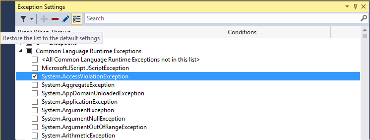

# Manage exceptions with the debugger in Visual Studio

An exception is an indication of an error state that occurs while a program is being executed. You can tell the debugger which exceptions or sets of exceptions to break on, and at which point you want the debugger to break. When the debugger breaks, it shows you where the exception was thrown. You can also add or delete exceptions. With a solution open in Visual Studio, use **Debug > Windows > Exception Settings** to open the **Exception Settings** window.

Provide handlers that respond to the most important exceptions. Also learn how to configure the debugger to always break execution for some exceptions.

When an exception occurs, the debugger writes an exception message to the Output window. It may break execution in the following cases when:

- An exception is thrown that isn't handled.

- The debugger is configured to break execution before any handler is invoked.

- You have set [Just My Code](../debugger/just-my-code.md), and the debugger is configured to break on any exception that isn't handled in user code.

> [!NOTE]
> ASP.NET has a top-level exception handler that shows error pages in a browser. It doesn't break execution unless **Just My Code** is turned on. For an example, see [Tell the debugger to continue on user-unhandled exceptions](#BKMK_UserUnhandled) below.

> [!NOTE]
> In a Visual Basic application, the debugger manages all errors as exceptions, even if you use On Error-style error handlers.

## Tell the debugger to break when an exception is thrown

The debugger can break execution at the point where an exception is thrown, so you may examine the exception before a handler is invoked.

In the **Exception Settings** window (**Debug > Windows > Exception Settings**), expand the node for a category of exceptions, such as **Common Language Runtime Exceptions**, which means .NET exceptions. Then select the check box for a specific exception within that category, such as **System.AccessViolationException**. You can also select an entire category of exceptions.


> [!TIP]
> You can find specific exceptions by using the **Search** window in the **Exception Settings** toolbar, or use search to filter for specific namespaces (for example **System.IO**).

If you select an exception in the **Exception Settings** window, debugger execution will break wherever the exception is thrown, no matter whether it's handled. Now the exception is called a first chance exception. For example, here are a couple of scenarios:

* In the following C# console application, the Main method throws an **AccessViolationException** inside a `try/catch` block:

  ```csharp
  static void Main(string[] args)
  {
      try
      {
          throw new AccessViolationException();
          Console.WriteLine("here");
      }
      catch (Exception e)
      {
          Console.WriteLine("caught exception");
      }
      Console.WriteLine("goodbye");
  }
  ```

  If you have **AccessViolationException** checked in **Exception Settings**, when you run this code in the debugger execution will break on the `throw` line. You can then continue execution. The console should display both lines:

  ```cmd
  caught exception
  goodbye
  ```

  but it doesn't display the `here` line.

* A C# console application references a class library with a class that has two methods, a method that throws an exception and handles it and a second method that throws the same exception and doesn't handle it:

  ```csharp
  public class Class1
  {
      public void ThrowHandledException()
      {
          try
          {
              throw new AccessViolationException();
          }
          catch (AccessViolationException ave)
          {
              Console.WriteLine("caught exception" + ave.Message);
          }
      }

      public void ThrowUnhandledException()
      {
          throw new AccessViolationException();
      }
  }
  ```

  Here's the Main() method of the console application:

  ```csharp
  static void Main(string[] args)
  {
      Class1 class1 = new Class1();
      class1.ThrowHandledException();
      class1.ThrowUnhandledException();
  }
  ```

  If you have **AccessViolationException** checked in **Exception Settings**, when you run this code in the debugger execution will break on the `throw` line in both **ThrowHandledException()** and **ThrowUnhandledException()**.

If you would like to restore the exception settings to the defaults, you can click the **Restore** button on the toolbar:



## <a name="BKMK_UserUnhandled"></a>Tell the debugger to continue on user-unhandled exceptions

If you are debugging .NET or JavaScript code with [Just My Code](../debugger/just-my-code.md), you can tell the debugger not to break on exceptions that aren't handled in user code but are handled elsewhere.

1. In the **Exception Settings** window, open the context menu by right-clicking in window and then selecting **Show Columns**. (If you have turned off **Just My Code**, you won't see this command.)

2. You should see a second column named **Additional Actions**. This column displays **Continue when unhandled by user code** on specific exceptions, meaning that the debugger continues if that exception isn't handled in user code but is handled externally.

3. You can change this setting for a particular exception by selecting the exception, right-clicking, and toggling **Continue when Unhandled in User Code**. You may also change the setting for an entire category of exceptions, such as the entire Common Language Runtime exceptions).

For example, ASP.NET web applications handle exceptions by converting them to an HTTP 500 status code ([Exception Handling in ASP.NET API](http://www.asp.net/web-api/overview/error-handling/exception-handling)), which may not help you to determine the source of the exception. In the example below, the user code makes a call to `String.Format()` that throws a <xref:System.FormatException>. Execution breaks as follows:


## Add and delete exceptions

You can add and delete exceptions. To delete an exception type from a category,  choose the exception and select the **Delete** button (the minus sign) on the **Exception Settings** toolbar. Or you may right-click the exception and select **Delete** from the context menu. Deleting an exception has the same effect as having the exception unchecked, which is that the debugger won't break when it's thrown.

To add an exception: in the **Exception Settings** window, select one of the exception categories (for example, **Common Language Runtime**) and click the **Add** button. Type the name of the exception (for example. **System.UriTemplateMatchException**). The exception is added to the list (in alphabetical order), and is automatically checked.

To add an exception to the GPU Memory Access Exceptions, JavaScript Runtime Exceptions, or Win32 Exceptions categories, include the error code and the description.

> [!TIP]
> Check your spelling! The **Exception Settings** window doesn't check for the existence of an added exception. So if you type **Sytem.UriTemplateMatchException**, you'll get an entry for that exception (and not for **System.UriTemplateMatchException**).

Exception settings are persisted in the solution's .suo file, so they apply to a particular solution. You can't reuse specific exception settings across solutions. Now only added exceptions are persisted; deleted exceptions aren't. You may add an exception, close and reopen the solution, and the exception will still be there. But if you delete an exception and close/reopen the solution, the exception will reappear.

The **Exception Settings** window supports generic exception types in C# but not in Visual Basic. To break on exceptions like `MyNamespace.GenericException<T>`, you must add the exception as **MyNamespace.GenericException`1**. That is, if you've created an exception like this code:

```csharp
public class GenericException<T> : Exception
{
    public GenericException() : base("This is a generic exception.")
    {
    }
}
```

You can add the exception to **Exception Settings** as follows:


## Add conditions to an exception

Use the **Exception Settings** dialog box to set conditions on exceptions. Currently supported conditions include the module name(s) to include or exclude for the exception. By setting module names as conditions, you can choose to break for the exception only on particular code modules, or you may avoid breaking on particular modules.

> [!NOTE]
> Adding conditions to an exception is new in [!include[vs_dev15](../misc/includes/vs_dev15_md.md)]

To add conditional exceptions, choose the **Edit condition** icon in the Exception Settings dialog box or right-click the exception and choose **Edit Conditions**.


## See Also

[Continue execution after an exception](../debugger/continuing-execution-after-an-exception.md)<br/>
[How to: Examine system code after an exception](../debugger/how-to-examine-system-code-after-an-exception.md)<br/>
[How to: Use native run-time checks](../debugger/how-to-use-native-run-time-checks.md)<br/>
[Use run-time checks without the C run-time library](../debugger/using-run-time-checks-without-the-c-run-time-library.md)<br/>
[Tutorial: Learn to debug using Visual Studio](../debugger/getting-started-with-the-debugger.md)
