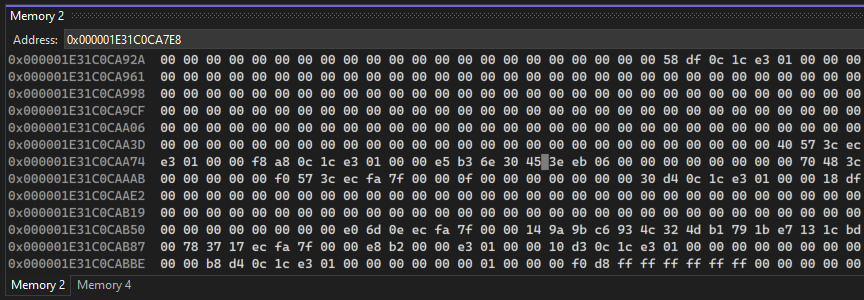

# Use the Memory windows in the Visual Studio debugger (C#, C++, Visual Basic, F#)

During debugging, the **Memory** window shows the memory space your app is using.

Debugger windows like **Watch**, **Autos**, **Locals**, and the **QuickWatch** dialog show you variables, which are stored at specific locations in memory. The **Memory** window shows you the overall picture. The memory view is convenient for examining large pieces of data (buffers or large strings, for example) that don't display well in the other windows.

The **Memory** window isn't limited to displaying data. It displays everything in the memory space, including data, code, and random bits of garbage in unassigned memory.

The **Memory** window isn't available for script or SQL debugging. Those languages don't recognize the concept of memory.

## Open a Memory window

Like other debugger windows, the **Memory** windows are available only during a debugging session.

>[!IMPORTANT]
>To enable the **Memory** windows, **Enable address-level debugging** must be selected in **Tools** > **Options** (or **Debug** > **Options**) > **Debugging** > **General**.

Open a Memory window:

1. Make sure **Enable address-level debugging** is selected in **Tools** > **Options** (or **Debug** > **Options**) > **Debugging** > **General**.

1. Start debugging by selecting the green arrow, pressing **F5**, or selecting **Debug** > **Start Debugging**.

2. Under **Debug** > **Windows** > **Memory**, select **Memory 1**, **Memory 2**, **Memory 3**, or **Memory 4**. (Some editions of Visual Studio offer only one **Memory** window.)

  Multiple windows allow you to maintain views for different areas in memory space at the same time.

## Move around in the Memory window

The address space of a computer is large, and you can easily lose your place by scrolling in the **Memory** window.

Higher memory addresses appear at the bottom of the window. To view a higher address, scroll down. To view a lower address, scroll up.

In most scenarios, you want to find a specific memory location.

## Find a memory location

You can instantly go to a specified address in the **Memory** window by using drag-and-drop, or by entering the address in the **Address** field. The **Address** field accepts alphanumeric addresses, and expressions that evaluate to addresses, such as `e.User.NonroamableId`.

To force immediate re-evaluation of an expression in the **Address** field, select the rounded-arrow **Reevaluate Automatically** icon.

By default, the **Memory** window treats **Address** expressions as live expressions, which are re-evaluated as the app runs. Live expressions can be useful, for example, to view the memory that is touched by a pointer variable.

Use drag and drop to move to a memory location:

1. In any debugger window, select a memory address, or a pointer variable that contains a memory address.

1. Drag and drop the address or pointer in the **Memory** window.

   That address appears in the **Address** field, and the **Memory** window adjusts to display that address at the top.

Entering a location in the Address field to move to a memory location:

- Type or paste the address or expression in the **Address** field and press **Enter**, or choose it from the dropdown in the **Address** field.

  That address appears in the **Address** field, and the **Memory** window adjusts to display that address at the top.

  

## Customize the Memory window

By default, memory contents appear as 1-byte integers in hexadecimal format, and the window width determines the number of columns shown. You can customize the way the **Memory** window shows memory contents.

Change the format of the memory contents:

- Right-click in the **Memory** window, and choose the formats that you want from the context menu.

Change the number of columns in the Memory window:

- Select the dropdown arrow next to the **Columns** field, and select the number of columns to display, or select **Auto** for automatic adjustment based on window width.

If you do not want the contents of the **Memory** window to change as your app runs, you can turn off live expression evaluation.

Toggle live evaluation:

- Right-click in the **Memory** window, and select **Reevaluate Automatically** in the context menu.

  >[!NOTE]
  >Live expression evaluation is a toggle, and is on by default, so selecting **Reevaluate Automatically** turns it off. Selecting **Reevaluate Automatically** again turns it back on.

You can hide or display the toolbar at the top of the **Memory** window. You will not have access to the **Address** field or other tools when the toolbar is hidden.

Toggle the toolbar display:

- Right-click in the **Memory** window, and select **Show Toolbar** in the context menu. The toolbar appears or disappears, depending on its previous state.

## Follow a pointer through memory (C/C++)

In native code apps, you can use register names as live expressions. For example, you can use the stack pointer to follow the stack.

Follow a pointer through memory:

1. In the **Memory** window **Address** field, enter a pointer expression that is in the current scope. Depending on the language, you might have to dereference it.

2. Press **Enter**.

   When you use a debug command such as **Step**, the memory address displayed in the **Address** field and at the top of the **Memory** window automatically changes as the pointer changes.

## View memory pointers (.NET)

If you want to view contents of a .NET object based on a memory pointer, such as an address obtained from a [heap snapshot](../debugger/using-dump-files.md), you can do that using `{CLR}@Address` notation. The address must be a pointer to memory, such as 0x1D102A581B0. Enter the memory pointer using `{CLR}@Address` notation in the Memory window **Address** field. Alternatively, you can use the same notation to add a watch using the [Watch window](../debugger/watch-and-quickwatch-windows.md).

To get the memory pointer address from a heap snapshot, open the heap dump, choose **Debug Managed Memory**, which opens the [Memory Usage](../profiling/memory-usage.md) tool. Right-click the object you're interested in, and choose **View instances**.

## Related content

- [View data in the debugger](../debugger/viewing-data-in-the-debugger.md)
