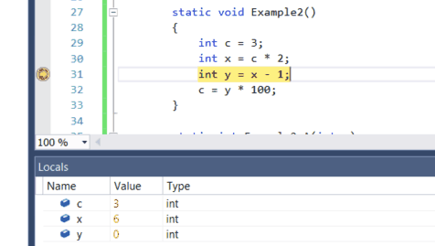
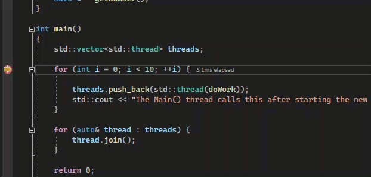

# Move the execution pointer to change the execution flow in the debugger

While debugging, you can manually move the execution pointer to change the next statement that will run next. Moving the pointer is useful for situations like skipping code that contains a known bug, and is a more advanced feature of the debugger.

## Change the execution flow

When the debugger is paused, a yellow arrow in the margin of the source code or **Disassembly** window marks the location of the statement that will run next. You can change the next statement that will run by moving this arrow. You can skip over code or return to a previous line.

 ::: moniker range="<=vs-2019"

 

 ::: moniker-end

 ::: moniker range=">=vs-2022"

 

 ::: moniker-end

If you want to change the next statement that will run, the debugger must be in break mode. In the source code or **Disassembly** window, drag the yellow arrow to a different line, or right-click the line you want to run next and select **Set Next Statement**.

The program counter jumps directly to the new location. Instructions between the old and new execution points aren't run. But if you move the execution point backwards, the intervening instructions aren't undone.

>[!CAUTION]
>- Moving the next statement to another function or scope usually causes call-stack corruption, which causes a runtime error or exception. If you try to move the next statement to another scope, the debugger gives you a warning and a chance to cancel the operation.
>- In Visual Basic, you can't move the next statement to another scope or function.
>- In native C++, if you have runtime checks enabled, setting the next statement can cause an exception when execution reaches the end of the method.
>- When **Edit and Continue** is enabled, **Set Next Statement** fails if you've made edits that **Edit and Continue** can't remap immediately. This situation can occur, for example, if you've edited code in a catch block. When this happens, an error message tells you that the operation isn't supported.
>- In managed code, you can't move the next statement if:
>   - The next statement is in a different method than the current statement.
>   - Debugging was started by Just-In-Time debugging.
>   - A call stack unwind is in progress.
>   - A System.StackOverflowException or System.Threading.ThreadAbortException exception has been thrown.

## Related content
- [What is debugging?](../debugger/what-is-debugging.md)
- [Navigate code in the debugger](../debugger/navigating-through-code-with-the-debugger.md)
- [Debugging techniques and tools](../debugger/write-better-code-with-visual-studio.md)
- [First look at debugging](../debugger/debugger-feature-tour.md)
