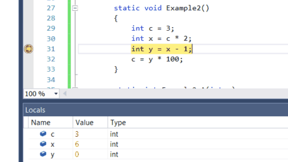

# Navigate through code with the Visual Studio debugger

The Visual Studio debugger can help you navigate through code to inspect the state of an app and show its execution flow. You can use keyboard shortcuts, debug commands, breakpoints, and other features to quickly get to the code you want to examine. Familiarity with debugger navigation commands and shortcuts makes it faster and easier to find and resolve app issues.  If this is the first time that you've tried to debug code, you may want to read [Debugging for absolute beginners](../debugger/debugging-absolute-beginners.md) and [Debugging techniques and tools](../debugger/write-better-code-with-visual-studio.md) before going through this article.

## Get into "break mode"

In *break mode*, app execution is suspended while functions, variables, and objects remain in memory. Once the debugger is in break mode, you can navigate through your code. The most common ways to get into break mode quickly is to either:

- Begin code stepping by pressing **F10** or **F11**. This allows you to quickly find the entry point of your app, then you can continue pressing step commands to navigate code.

- [Run to a specific location or function](#BKMK_Break_into_code_by_using_breakpoints_or_Break_All), for example, by [setting a breakpoint](using-breakpoints.md) and starting your app.

   For example, from the code editor in Visual Studio, you can use the **Run to Cursor** command to start the app, debugger attached, and get into break mode, then **F11** to navigate code.

   

Once in break mode, you can use a variety of commands to navigate through your code. While in break mode, you can examine the values of variables to look for violations or bugs. For some project types, you can also make adjustments to the app while in break mode.

Most debugger windows, like the **Modules** and **Watch** windows, are available only while the debugger is attached to your app. Some debugger features, such as viewing variable values in the **Locals** window or evaluating expressions in the **Watch** window, are available only while the debugger is paused (that is, in break mode).

> [!NOTE]
> If you break into code that doesn't have source or symbol (*.pdb*) files loaded, the debugger displays a **Source Files Not Found** or **Symbols Not Found** page that can help you find and load the files. See [Specify symbol (.pdb) and source files](../debugger/specify-symbol-dot-pdb-and-source-files-in-the-visual-studio-debugger.md). If you can't load the symbol or source files, you can still debug the assembly instructions in the **Disassembly** window.

## Step through code

The debugger step commands help you inspect your app state or find out more about its execution flow.

### <a name="BKMK_Step_into__over__or_out_of_the_code"></a> Step into code line by line

To stop on each statement while debugging, use **Debug** > **Step Into**, or press **F11**.

The debugger steps through code statements, not physical lines. For example, an `if` clause can be written on one line:

  ```csharp
  int x = 42;
  string s = "Not answered";
  if( int x == 42) s = "Answered!";
  ```

  ```vb
  Dim x As Integer = 42
  Dim s As String = "Not answered"
  If x = 42 Then s = "Answered!"
  ```

However, when you step into this line, the debugger treats the condition as one step, and the consequence as another. In the preceding example, the condition is true.

On a nested function call, **Step Into** steps into the most deeply nested function. For example, if you use **Step Into** on a call like `Func1(Func2())`, the debugger steps into the function `Func2`.

>[!TIP]
>As you execute each line of code, you can hover over variables to see their values, or use the [Locals](autos-and-locals-windows.md) and [Watch](watch-and-quickwatch-windows.md) windows to watch the values change. You can also visually trace the [call stack](how-to-use-the-call-stack-window.md) while stepping into functions. (For Visual Studio Enterprise only, see [Map methods on the call stack while debugging](../debugger/map-methods-on-the-call-stack-while-debugging-in-visual-studio.md)).

### <a name="BKMK_Step_over_Step_out"></a> Step through code and skip some functions

You may not care about a function while debugging, or you know it works, like well-tested library code. You can use the following commands to skip code while code stepping. The functions still execute, but the debugger skips over them.

|Keyboard command|Debug menu command|Description|
|----------------------|------------------|-----------------|
|**F10**|**Step Over**|If the current line contains a function call, **Step Over** runs the code, then suspends execution at the first line of code after the called function returns.|
|**Shift**+**F11**|**Step Out**|**Step Out** continues running code and suspends execution when the current function returns. The debugger skips through the current function.|

## <a name="BKMK_Break_into_code_by_using_breakpoints_or_Break_All"></a> Run to a specific location or function

You may prefer to run directly to a specific location or function when you know exactly what code you want to inspect, or you know where you want to start debugging.

### Run to a breakpoint in code

To set a simple breakpoint in your code, click the far left margin next to the line of code where you want to suspend execution. You can also select the line and press **F9**, select **Debug** > **Toggle Breakpoint**, or right-click and select **Breakpoint** > **Insert Breakpoint**. The breakpoint appears as a red dot in the left margin next to the code line. The debugger suspends execution just before the line executes.


Breakpoints in Visual Studio provide a rich set of additional functionality, such as conditional breakpoints and tracepoints. For details, see [Using breakpoints](../debugger/using-breakpoints.md).

### Run to a function breakpoint

You can tell the debugger to run until it reaches a specified function. You can specify the function by name, or you can choose it from the call stack.

**To specify a function breakpoint by name**

1. Select **Debug** > **New Breakpoint** > **Function Breakpoint**

1. In the **New Function Breakpoint** dialog, type the name of the function and select its language.

   

1. Select **OK**.

If the function is overloaded or in more than one namespace, you can choose the one you want in the **Breakpoints** window.


**To select a function breakpoint from the call stack**

1. While debugging, open the **Call Stack** window by selecting **Debug** > **Windows** > **Call Stack**.

1. In the **Call Stack** window, right-click a function and select **Run To Cursor**, or press **Ctrl**+**F10**.

To visually trace the call stack, see [Map methods on the call stack while debugging](../debugger/map-methods-on-the-call-stack-while-debugging-in-visual-studio.md).

### Run to a cursor location

To run to the cursor location, in source code or the **Call Stack** window, select the line you want to break at, right-click and select **Run To Cursor**, or press **Ctrl**+**F10**. Selecting **Run To Cursor** is like setting a temporary breakpoint.

### Run to Click

While paused in the debugger, you can hover over a statement in source code or the **Disassembly** window, and select the **Run execution to here** green arrow icon. Using **Run to Click** eliminates the need to set a temporary breakpoint.


> [!NOTE]
> **Run to Click** is available starting in [!include[vs_dev15](../misc/includes/vs_dev15_md.md)].

### Manually break into code

To break in the next available line of code in a running app, select **Debug** > **Break All**, or press **Ctrl**+**Alt**+**Break**.

## <a name="BKMK_Set_the_next_statement_to_execute"></a> Move the pointer to change the execution flow

While the debugger is paused, a yellow arrowhead in the margin of the source code or **Disassembly** window marks the location of the next statement to be executed. You can change the next statement to execute by moving this arrowhead. You can skip over a portion of code, or return to a previous line. Moving the pointer is useful for situations such as skipping a section of code that contains a known bug.

 

To change the next statement to execute, the debugger must be in break mode. In the source code or **Disassembly** window, drag the yellow arrowhead to a different line, or right-click the line you want to execute next and select **Set Next Statement**.

The program counter jumps directly to the new location, and instructions between the old and new execution points aren't executed. However, if you move the execution point backwards, the intervening instructions aren't undone.

>[!CAUTION]
>- Moving the next statement to another function or scope usually results in call-stack corruption, causing a run-time error or exception. If you try moving the next statement to another scope, the debugger opens a dialog box with a warning and gives you a chance to cancel the operation.
>- In Visual Basic, you cannot move the next statement to another scope or function.
>- In native C++, if you have run-time checks enabled, setting the next statement can cause an exception to be thrown when execution reaches the end of the method.
>- When Edit and Continue is enabled, **Set Next Statement** fails if you have made edits that Edit and Continue cannot remap immediately. This can occur, for example, if you have edited code inside a catch block. When this happens, an error message tells you that the operation is not supported.
>- In managed code, you cannot move the next statement if:
>   - The next statement is in a different method than the current statement.
>   - Debugging was started by Just-In-Time debugging.
>   - A call stack unwind is in progress.
>   - A System.StackOverflowException or System.Threading.ThreadAbortException exception has been thrown.

## <a name="BKMK_Restrict_stepping_to_Just_My_Code"></a>Debug non-user code

By default, the debugger tries to debug only your app code by enabling a setting called *Just My Code*. For more details about how this feature works for different project types and languages, and how you can customize it, see [Just My Code](../debugger/just-my-code.md).

To look at framework code, third-party library code, or system calls while debugging, you can disable Just My Code. In **Tools** (or **Debug**) > **Options** > **Debugging**, clear the **Enable Just My Code** check box. When Just My Code is disabled, non-user code appears in the debugger windows, and the debugger can step into the non-user code.

> [!NOTE]
> Just My Code is not supported for device projects.

### Debug system code

If you have loaded debugging symbols for Microsoft system code, and disabled Just My Code, you can step into a system call just as you can any other call.

To load Microsoft symbols, see [Configure symbol locations and loading options](specify-symbol-dot-pdb-and-source-files-in-the-visual-studio-debugger.md#configure-symbol-locations-and-loading-options).

**To load symbols for a specific system component:**

1. While you're debugging, open the **Modules** window by selecting **Debug** > **Windows** > **Modules**, or pressing **Ctrl**+**Alt**+**U**.

1. In the **Modules** window, you can tell which modules have symbols loaded in the **Symbol Status** column. Right-click the module that you want to load symbols for, and select **Load Symbols**.

## <a name="BKMK_Step_into_properties_and_operators_in_managed_code"></a> Step into properties and operators in managed code
 The debugger steps over properties and operators in managed code by default. In most cases, this provides a better debugging experience. To enable stepping into properties or operators, choose **Debug** > **Options**. On the **Debugging** > **General** page, clear the **Step over properties and operators (Managed only)** check box.

## See also
- [What is debugging?](../debugger/what-is-debugging.md)
- [Debugging techniques and tools](../debugger/write-better-code-with-visual-studio.md)
- [First look at debugging](../debugger/debugger-feature-tour.md)
