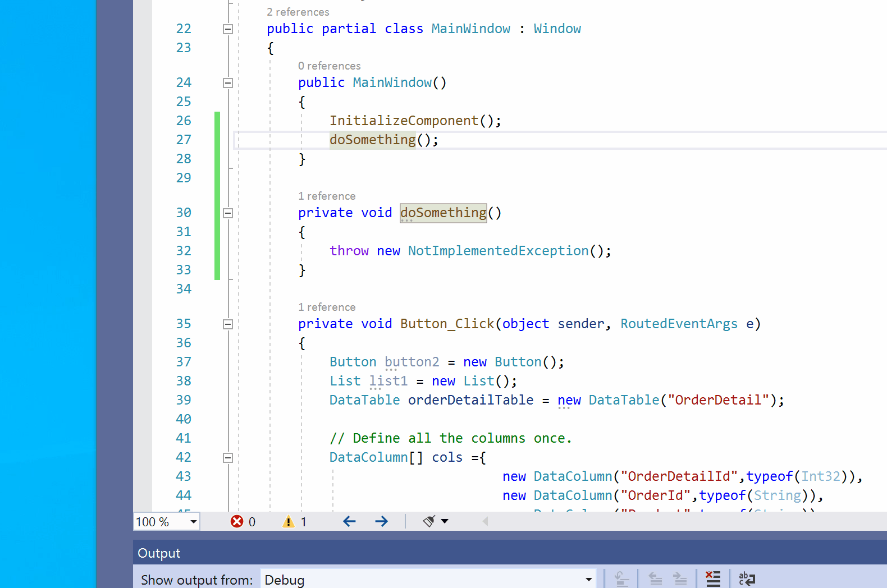
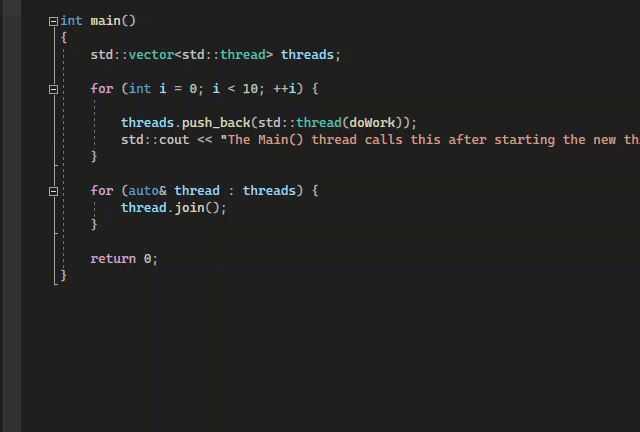
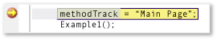
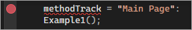
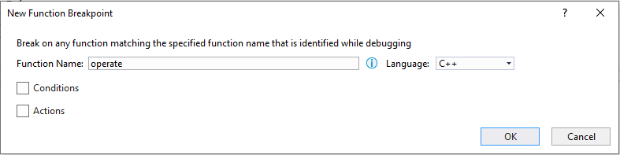
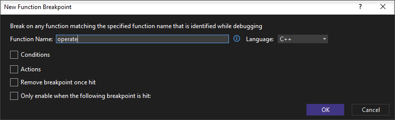
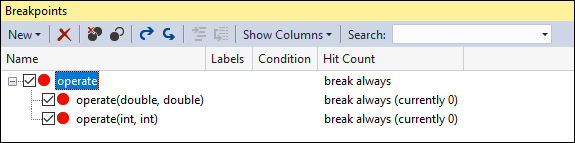
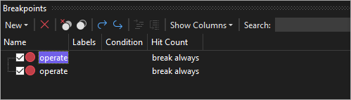
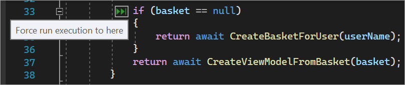

# Navigate through code by using the Visual Studio debugger

The Visual Studio debugger can help you navigate through code to inspect the state of an app and show its execution flow, which is also known as *code stepping*. You can use keyboard shortcuts, debug commands, breakpoints, and other features to quickly get to the code you want to examine. By getting more familiar with debugger navigation commands and shortcuts, you can find and resolve app problems faster and more easily. For a list of the most common keyboard shortcuts related to code navigation and debugging, see the [Debug](../ide/default-keyboard-shortcuts-in-visual-studio.md#bkmk_debug-popular-shortcuts) section in Keyboard shortcuts.

> [!NOTE]
> If you're new to debugging code, you might want to read [Debugging for absolute beginners](../debugger/debugging-absolute-beginners.md) and [Debugging techniques and tools](../debugger/write-better-code-with-visual-studio.md) before you read this article.

## Start debugging and enter break mode

Some navigation commands start your app and automatically attach the debugger. Your app pauses on a specific line of code based on the command you used to start navigation, and you enter *break mode* (that is, your app is paused in the debugger).

In break mode, app execution is suspended while functions, variables, and objects remain in memory. When the debugger is in break mode, you can navigate through your code. There are two common ways to quickly enter break mode:

- [Set a breakpoint](#run-to-a-breakpoint-in-code) and start your app.

- [Run to a specific location or function](#run-to-a-specific-location-or-function).

   For example, in the code editor in Visual Studio, you can use the **Run To Cursor** command to start the app, with the debugger attached, and enter break mode. Then you can use step commands to navigate the code.

   ::: moniker range="vs-2019"

   

   ::: moniker-end

   ::: moniker range=">=vs-2022"

   

   ::: moniker-end

[Code stepping](#code-stepping) commands can be used to start your app, but are more commonly used after you enter break mode.

## Navigate code while in break mode

Some navigation commands are mostly used while in break mode (that is, while you're paused in the debugger).

- [Code stepping](#code-stepping) commands are most commonly used in break mode.

- Some commands like [Run to click](#run-to-click) can only be used while in break mode.

## Debugging and break mode

When you're in break mode, you can use various commands to navigate through your code. You can examine the values of variables to look for violations or bugs. For some project types, you can also make adjustments to the app when you're in break mode.

Most debugger windows, like the **Modules** and **Watch** windows, are available only when the debugger is attached to your app. Some debugger features, like viewing variable values in the **Locals** window or evaluating expressions in the **Watch** window, are available only when the debugger is paused (that is, in break mode).

> [!NOTE]
> If you break into code that doesn't have source or symbol (.pdb) files loaded, the debugger displays a **Source Files Not Found** or **Symbols Not Found** page that can help you find and load the files. See [Specify symbol (.pdb) and source files](../debugger/specify-symbol-dot-pdb-and-source-files-in-the-visual-studio-debugger.md). If you can't load the symbol or source files, you can still debug the assembly instructions in the **Disassembly** window.

## Code stepping

*Code stepping* refers to executing your application code one statement at a time, with the debugger attached. The debugger step commands help you observe the effects of each statement and find out more about its execution flow.

### <a name="BKMK_Step_into__over__or_out_of_the_code"></a> Step into code

To stop on each statement when you're debugging, use **Debug** > **Step Into**, or select **F11**.

The debugger steps through code statements, not physical lines. For example, an `if` clause can be written on one line:

  ### [C#](#tab/csharp)
  ```csharp
  int x = 42;
  string s = "Not answered";
  if( int x == 42) s = "Answered!";
  ```

  ### [VB](#tab/vb)
  ```vb
  Dim x As Integer = 42
  Dim s As String = "Not answered"
  If x = 42 Then s = "Answered!"
  ```
  ---

But when you step into this line, the debugger treats the condition as one step and the consequence as another. In the preceding example, the condition is true.

On a nested function call, **Step Into** steps into the most deeply nested function. For example, if you use **Step Into** on a call like `Func1(Func2())`, the debugger steps into the function `Func2`.

>[!TIP]
>As you run each line of code, you can hover over variables to see their values, or use the [Locals](autos-and-locals-windows.md) and [Watch](watch-and-quickwatch-windows.md) windows to watch the values change. You can also visually trace the [call stack](how-to-use-the-call-stack-window.md) while you step into functions. (For Visual Studio Enterprise only, see [Map methods on the call stack while debugging](../debugger/map-methods-on-the-call-stack-while-debugging-in-visual-studio.md).)

### <a name="BKMK_Step_over_Step_out"></a> Step through code and skip some functions

You might not care about a function while you're debugging. Or you might know some code works, like well-tested library code. You can use the following commands to skip code while you're stepping through code. The functions still run, but the debugger skips over them.

|Keyboard command|Debug menu command|Description|
|----------------------|------------------|-----------------|
|**F10**|**Step Over**|If the current line contains a function call, **Step Over** runs the code, and then suspends execution at the first line of code after the called function returns.|
|**Shift**+**F11**|**Step Out**|**Step Out** continues running code and suspends execution when the current function returns. The debugger skips through the current function.|

## Run to a specific location or function

You might prefer to run directly to a specific location or function when you know exactly what code you want to inspect or if you know where you want to start debugging.

- Setting a breakpoint is best if you think you might want to re-use the breakpoint.
- Other methods are for convenience, and are similar to setting a temporary breakpoint.

### Run to a breakpoint in code

To set a simple breakpoint in your code, select the far-left margin next to the line of code where you want to suspend execution. You can also select the line and then select **F9**, select **Debug** > **Toggle Breakpoint**, or right-click and select **Breakpoint** > **Insert Breakpoint**. The breakpoint appears as a red dot in the left margin next to the line of code. The debugger suspends execution just before the line runs.

::: moniker range="<=vs-2019"



::: moniker-end

::: moniker range=">=vs-2022"



::: moniker-end

Breakpoints in Visual Studio provide a rich set of functionality, like conditional breakpoints and tracepoints. For details, see [Using breakpoints](../debugger/using-breakpoints.md).

### Run to a function breakpoint

You can set the debugger to run until it reaches a specified function. You can specify the function by name, or you can choose it from the call stack.

To specify a function breakpoint by name:

1. Select **Debug** > **New Breakpoint** > **Function Breakpoint**.

1. In the **New Function Breakpoint** dialog, enter the name of the function and select its language:

   ::: moniker range="<=vs-2019"

   

   ::: moniker-end

   ::: moniker range=">=vs-2022"

   

   ::: moniker-end

1. Select **OK**.

If the function is overloaded or in more than one namespace, you can choose the one you want in the **Breakpoints** window:

::: moniker range="<=vs-2019"



::: moniker-end

::: moniker range=">=vs-2022"



::: moniker-end

To select a function breakpoint from the call stack:

1. While debugging, open the **Call Stack** window by selecting **Debug** > **Windows** > **Call Stack**.

1. In the **Call Stack** window, right-click a function and select **Run To Cursor**, or select **Ctrl**+**F10**.

For information about visually tracing the call stack, see [Map methods on the call stack while debugging](../debugger/map-methods-on-the-call-stack-while-debugging-in-visual-studio.md).

### Run to a cursor location

To run to the cursor location, in source code or the **Call Stack** window, select the line you want to break at, and then right-click and select **Run To Cursor**, or select **Ctrl**+**F10**. Selecting **Run To Cursor** is similar to setting a [temporary breakpoint](../debugger/using-breakpoints.md#BKMK_set_a_temporary_breakpoint).

::: moniker range=">= vs-2022"
### Force run to a cursor location

To run to the cursor location, in source code or the **Call Stack** window, select the line you want to break at, and then right-click and select **Force Run To Cursor**. Selecting **Force Run To Cursor** will skip any breakpoints and first-chance exceptions  until the debugger reaches the line of code where the cursor is located.

::: moniker-end
### Run to click

While the debugger is paused, you can hover over a statement in source code or the **Disassembly** window and select the **Run execution to here** green arrow. Using **Run to Click** is similar to setting a [temporary breakpoint](../debugger/using-breakpoints.md#BKMK_set_a_temporary_breakpoint).


::: moniker range=">= vs-2022"
### Force run to click 

While the debugger is paused, you can hover over a statement in source code while pressing the **Shift** key and then select **Force run execution to here** (the double green arrow). When you choose this option, the application attaches the Visual Studio debugger and pauses at the cursor location. Any breakpoints and first-chance exceptions found during execution are temporarily disabled.



> [!NOTE]
> **Force Run to Click** is available starting in Visual Studio 2022.
::: moniker-end

### Manually break into code

To break into the next available line of code in a running app, select **Debug** > **Break All**, or select **Ctrl**+**Alt**+**Break**.

## <a name="BKMK_Restrict_stepping_to_Just_My_Code"></a>Debug non-user code

By default, the debugger tries to debug only your app code by enabling a setting called *Just My Code*. For details about how this feature works for various project types and languages, and how you can customize it, see [Just My Code](../debugger/just-my-code.md).

To look at framework code, non-Microsoft library code, or system calls while debugging, you can disable the Just My Code feature.

::: moniker range="visualstudio"

Open the **Tools** (or **Debug**) > **Options** pane, expand the **All Settings** > **Debugging** > **General** section, and clear the **Enable Just My Code** checkbox.

::: moniker-end
::: moniker range="<=vs-2022"

Open the **Tools** (or **Debug**) > **Options** dialog, expand the **Debugging** > **General** section, and clear the **Enable Just My Code** checkbox.

::: moniker-end

When Just My Code is disabled, non-user code appears in the debugger windows, and the debugger can step into the non-user code.

> [!NOTE]
> Just My Code isn't supported for device projects.

### Debug system code

If you've loaded debugging symbols for Microsoft system code and disabled Just My Code, you can step into a system call just as you can any other call.

::: moniker range=">=vs-2022"
Starting in Visual Studio 2022 version 17.7, you can autodecompile .NET code when stepping into external code without the need to manually load debugging symbols. For more information, see [Generate source code from .NET assemblies while debugging](../debugger/decompilation.md).
::: moniker-end

To learn about loading Microsoft symbols, see [Configure location of symbol files and loading options](specify-symbol-dot-pdb-and-source-files-in-the-visual-studio-debugger.md#configure-location-of-symbol-files-and-loading-options).

To load symbols for a specific system component:

1. While you're debugging, open the **Modules** window by selecting **Debug** > **Windows** > **Modules** or by pressing **Ctrl**+**Alt**+**U**.

1. In the **Modules** window, you can tell which modules have symbols loaded in the **Symbol Status** column. Right-click the module that you want to load symbols for and then select **Load Symbols**.

## <a name="BKMK_Step_into_properties_and_operators_in_managed_code"></a> Step into properties and operators in managed code

The debugger steps over properties and operators in managed code by default. In most cases, this behavior provides a better debugging experience. To enable stepping into properties or operators, select **Debug** > **Options**. On the **Debugging** > **General** page, clear the **Step over properties and operators (Managed only)** checkbox.

## <a name="BKMK_Set_the_next_statement_to_execute"></a> Move the pointer to change the execution flow

You can change the next statement that will run by moving the yellow execution pointer. You can use this feature while in break mode.

This is an advanced debugger feature. For more information, see [Move the execution pointer](../debugger/move-the-execution-pointer-with-the-debugger.md).

## Related content
- [What is debugging?](../debugger/what-is-debugging.md)
- [Debugging techniques and tools](../debugger/write-better-code-with-visual-studio.md)
- [First look at debugging](../debugger/debugger-feature-tour.md)
