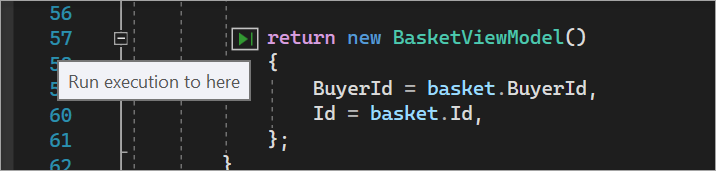

# Navigate through code by using the Visual Studio debugger

The Visual Studio debugger can help you navigate through code to inspect the state of an app and show its execution flow. You can use keyboard shortcuts, debug commands, breakpoints, and other features to quickly get to the code you want to examine. If you're familiar with debugger navigation commands and shortcuts, you can find and resolve app problems faster and more easily.

> [!NOTE]
> If you're new to debugging code, you might want to read [Debugging for absolute beginners](../debugger/debugging-absolute-beginners.md) and [Debugging techniques and tools](../debugger/write-better-code-with-visual-studio.md) before you read this article.

## Enter break mode

In *break mode*, app execution is suspended while functions, variables, and objects remain in memory. When the debugger is in break mode, you can navigate through your code. There are two common ways to quickly enter break mode:

- Begin code stepping by selecting **F10** or **F11**. Doing so allows you to quickly find the entry point of your app. You can then continue to press step commands to navigate through the code.

- [Run to a specific location or function](#run-to-a-specific-location-or-function), for example, by [setting a breakpoint](using-breakpoints.md) and starting your app.

   For example, in the code editor in Visual Studio, you can use the **Run To Cursor** command to start the app, debugger attached, and enter break mode, and then select **F11** to navigate through the code:

   

When you're in break mode, you can use various commands to navigate through your code. You can examine the values of variables to look for violations or bugs. For some project types, you can also make adjustments to the app when you're in break mode.

Most debugger windows, like the **Modules** and **Watch** windows, are available only when the debugger is attached to your app. Some debugger features, like viewing variable values in the **Locals** window or evaluating expressions in the **Watch** window, are available only when the debugger is paused (that is, in break mode).

> [!NOTE]
> If you break into code that doesn't have source or symbol (.pdb) files loaded, the debugger displays a **Source Files Not Found** or **Symbols Not Found** page that can help you find and load the files. See [Specify symbol (.pdb) and source files](../debugger/specify-symbol-dot-pdb-and-source-files-in-the-visual-studio-debugger.md). If you can't load the symbol or source files, you can still debug the assembly instructions in the **Disassembly** window.

## Step through code

The debugger step commands help you inspect your app state or find out more about its execution flow.

### <a name="BKMK_Step_into__over__or_out_of_the_code"></a> Step into code line by line

To stop on each statement when you're debugging, use **Debug** > **Step Into**, or select **F11**.

The debugger steps through code statements, not physical lines. For example, an `if` clause can be written on one line:

  ```csharp
  int x = 42;
  string s = "Not answered";
  if( int x == 42) s = "Answered!";
  ```

  ```vb
  Dim x As Integer = 42
  Dim s As String = "Not answered"
  If x = 42 Then s = "Answered!"
  ```

But when you step into this line, the debugger treats the condition as one step and the consequence as another. In the preceding example, the condition is true.

On a nested function call, **Step Into** steps into the most deeply nested function. For example, if you use **Step Into** on a call like `Func1(Func2())`, the debugger steps into the function `Func2`.

>[!TIP]
>As you run each line of code, you can hover over variables to see their values, or use the [Locals](autos-and-locals-windows.md) and [Watch](watch-and-quickwatch-windows.md) windows to watch the values change. You can also visually trace the [call stack](how-to-use-the-call-stack-window.md) while you step into functions. (For Visual Studio Enterprise only, see [Map methods on the call stack while debugging](../debugger/map-methods-on-the-call-stack-while-debugging-in-visual-studio.md).)

### <a name="BKMK_Step_over_Step_out"></a> Step through code and skip some functions

You might not care about a function when you're debugging. Or might you know some code works, like well-tested library code. You can use the following commands to skip code when you're code stepping. The functions still run, but the debugger skips over them.

|Keyboard command|Debug menu command|Description|
|----------------------|------------------|-----------------|
|**F10**|**Step Over**|If the current line contains a function call, **Step Over** runs the code and then suspends execution at the first line of code after the called function returns.|
|**Shift**+**F11**|**Step Out**|**Step Out** continues running code and suspends execution when the current function returns. The debugger skips through the current function.|

## Run to a specific location or function

You might prefer to run directly to a specific location or function when you know exactly what code you want to inspect or if you know where you want to start debugging.

### Run to a breakpoint in code

To set a simple breakpoint in your code, select the far-left margin next to the line of code where you want to suspend execution. You can also select the line and then select **F9**, select **Debug** > **Toggle Breakpoint**, or right-click and select **Breakpoint** > **Insert Breakpoint**. The breakpoint appears as a red dot in the left margin next to the line of code. The debugger suspends execution just before the line runs.


Breakpoints in Visual Studio provide a rich set of functionality, like conditional breakpoints and tracepoints. For details, see [Using breakpoints](../debugger/using-breakpoints.md).

### Run to a function breakpoint

You can set the debugger to run until it reaches a specified function. You can specify the function by name, or you can choose it from the call stack.

**To specify a function breakpoint by name**

1. Select **Debug** > **New Breakpoint** > **Function Breakpoint**.

1. In the **New Function Breakpoint** dialog, enter the name of the function and select its language:

   

1. Select **OK**.

If the function is overloaded or in more than one namespace, you can choose the one you want in the **Breakpoints** window:


**To select a function breakpoint from the call stack**

1. While debugging, open the **Call Stack** window by selecting **Debug** > **Windows** > **Call Stack**.

1. In the **Call Stack** window, right-click a function and select **Run To Cursor**, or select **Ctrl**+**F10**.

For information about visually tracing the call stack, see [Map methods on the call stack while debugging](../debugger/map-methods-on-the-call-stack-while-debugging-in-visual-studio.md).

### Run to a cursor location

To run to the cursor location, in source code or the **Call Stack** window, select the line you want to break at, and then right-click and select **Run To Cursor**, or select **Ctrl**+**F10**. Selecting **Run To Cursor** is like setting a temporary breakpoint.

::: moniker range=">= vs-2022"
### Force run to a cursor location

To run to the cursor location, in source code or the **Call Stack** window, select the line you want to break at, and then right-click and select **Force Run To Cursor**. Selecting **Force Run To Cursor** will skip any breakpoints and first-chance exceptions  until the debugger reaches the line of code where the cursor is located.
::: moniker-end
### Run to Click

While the debugger is paused, you can hover over a statement in source code or the **Disassembly** window and select the **Run execution to here** green arrow. If you use **Run to Click**, you don't need to set a temporary breakpoint.



> [!NOTE]
> **Run to Click** is available starting in [!include[vs_dev15](../misc/includes/vs_dev15_md.md)].

::: moniker range=">= vs-2022"
### Force Run to Click 

While the debugger is paused, you can hover over a statement in source code while pressing the **Shift** key and then select **Force run execution to here** (the double green arrow). When you choose this option, the application attaches the Visual Studio debugger and pauses at the cursor location. Any breakpoints and first-chance exceptions found during execution are temporarily disabled.


> [!NOTE]
> **Force Run to Click** is available starting in [!include[vs_dev17](../misc/includes/vs_dev17_md.md)].
::: moniker-end
### Manually break into code

To break into the next available line of code in a running app, select **Debug** > **Break All**, or select **Ctrl**+**Alt**+**Break**.

## <a name="BKMK_Set_the_next_statement_to_execute"></a> Move the pointer to change the execution flow

When the debugger is paused, a yellow arrow in the margin of the source code or **Disassembly** window marks the location of the statement that will run next. You can change the next statement that will run by moving this arrow. You can skip over code or return to a previous line. Moving the pointer is useful for situations like skipping code that contains a known bug.

 

If you want to change the next statement that will run, the debugger must be in break mode. In the source code or **Disassembly** window, drag the yellow arrow to a different line, or right-click the line you want to run next and select **Set Next Statement**.

The program counter jumps directly to the new location. Instructions between the old and new execution points aren't run. But if you move the execution point backwards, the intervening instructions aren't undone.

>[!CAUTION]
>- Moving the next statement to another function or scope usually causes call-stack corruption, which causes a runtime error or exception. If you try to move the next statement to another scope, the debugger gives you a warning and a chance to cancel the operation.
>- In Visual Basic, you can't move the next statement to another scope or function.
>- In native C++, if you have runtime checks enabled, setting the next statement can cause an exception when execution reaches the end of the method.
>- When **Edit and Continue** is enabled, **Set Next Statement** fails if you've made edits that **Edit and Continue** can't remap immediately. This situation can occur, for example, if you've edited code in a catch block. When this happens, an error message tells you that the operation isn't supported.
>- In managed code, you can't move the next statement if:
>   - The next statement is in a different method than the current statement.
>   - Debugging was started by Just-In-Time debugging.
>   - A call stack unwind is in progress.
>   - A System.StackOverflowException or System.Threading.ThreadAbortException exception has been thrown.

## <a name="BKMK_Restrict_stepping_to_Just_My_Code"></a>Debug non-user code

By default, the debugger tries to debug only your app code by enabling a setting called *Just My Code*. For details about how this feature works for various project types and languages, and how you can customize it, see [Just My Code](../debugger/just-my-code.md).

To look at framework code, third-party library code, or system calls while debugging, you can disable Just My Code. In **Tools** (or **Debug**) > **Options** > **Debugging**, clear the **Enable Just My Code** checkbox. When Just My Code is disabled, non-user code appears in the debugger windows, and the debugger can step into the non-user code.

> [!NOTE]
> Just My Code isn't supported for device projects.

### Debug system code

If you've loaded debugging symbols for Microsoft system code and disabled Just My Code, you can step into a system call just as you can any other call.

To learn about loading Microsoft symbols, see [Configure symbol locations and loading options](specify-symbol-dot-pdb-and-source-files-in-the-visual-studio-debugger.md#configure-symbol-locations-and-loading-options).

**To load symbols for a specific system component**

1. While you're debugging, open the **Modules** window by selecting **Debug** > **Windows** > **Modules** or by pressing **Ctrl**+**Alt**+**U**.

1. In the **Modules** window, you can tell which modules have symbols loaded in the **Symbol Status** column. Right-click the module that you want to load symbols for and then select **Load Symbols**.

## <a name="BKMK_Step_into_properties_and_operators_in_managed_code"></a> Step into properties and operators in managed code
 The debugger steps over properties and operators in managed code by default. In most cases, this behavior provides a better debugging experience. To disable stepping into properties or operators, select **Debug** > **Options**. On the **Debugging** > **General** page, clear the **Step over properties and operators (Managed only)** checkbox.

## See also
- [What is debugging?](../debugger/what-is-debugging.md)
- [Debugging techniques and tools](../debugger/write-better-code-with-visual-studio.md)
- [First look at debugging](../debugger/debugger-feature-tour.md)
