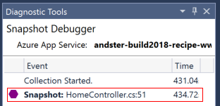
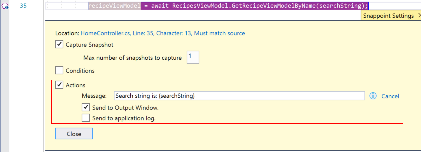
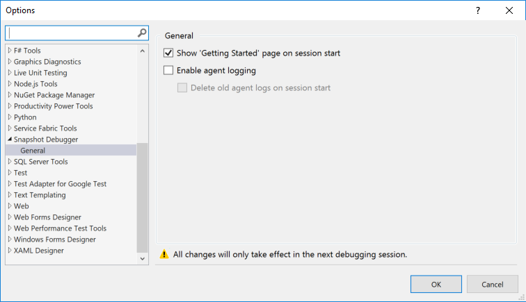

# Getting Started With The Snapshot Debugger

The Visual Studio Snapshot Debugger is now connected to your service and you can start collecting snapshots to help with debugging.

To use the Snapshot Debugger, set some snappoints in your code, click the button to begin collecting snapshots, and then run your scenario. When code runs in which you've set a snappoint, a snapshot of your application is taken. Then open the snapshot by clicking on it in Visual Studio in the Diagnostic Tools window. You can now debug the snapshot from your service just like it was local. For detailed instructions, keep reading.

## Collect and view snapshots

The Snapshot Debugger collects snapshots from your application. Snapshots are like pictures of your appication at a point in time. You tell Visual Studio when and where to collect a snapshot by setting a snappoint in code. In the snappoint, you set any conditions you need to make sure you get a snapshot of the problem you're investigating.

### Set a Snappoint

1. In the code editor, click the left gutter next to a line of code that you are interested in to set a snappoint. Make sure it is code that you know will run.

    

    A purple hexagon appears where you click on the left.

2. Click **Start Collection** to turn on the snappoint.

### Open a Snapshot

1. When the snappoint is hit, a snapshot appears in the Diagnostic Tools window on the right. If the window doesn't open, you can open it by choosing **Debug** > **Windows** > **Show Diagnostic Tools**.

    

2. Double-click the snapshot to open it.

### Inspect Snapshot data

From this view, you can hover over variables to view DataTips, use the Locals, Watches, and Call Stack windows, and also evaluate expressions.

The website itself is still live and end users aren't impacted. By default, only one snapshot is captured per snappoint. That is, after a snapshot is captured, the snappoint turns off. If you want to capture another snapshot at the snappoint, you can turn the snappoint back on by clicking **Update Collection**.

### Set a Logpoint

1. Right-click a snappoint icon (the purple hexagon) and choose **Settings**.

2. In the **Snappoint Settings** window, select **Actions**.

    

3. In the **Message** field, enter a log message that you want to log. You can also evaluate variables in your log message by placing them inside curly braces.

    If you choose **Send to Output Window**, the message appears in the Diagnostic Tools window when the logpoint is hit.

    If you choose **Send to application log**, the message appears anywhere that you can see messages from `System.Diagnostics.Trace` (or `ILogger` in .NET Core), such as App Insights, when the logpoint is hit.

## Learn More

You can find more information about the Snapshot Debugger on the [docs page](../debug-live-azure-applications.md). Learn more about setting conditions to make it easier to find bugs.

## Don't' Show Me This Again

To never show the Snapshot Debugger Start page again when you connect the Snapshot Debugger, change the **Show 'Getting Started' page on session start** option in **Tools** > **Options** > **Snapshot Debugger**.

